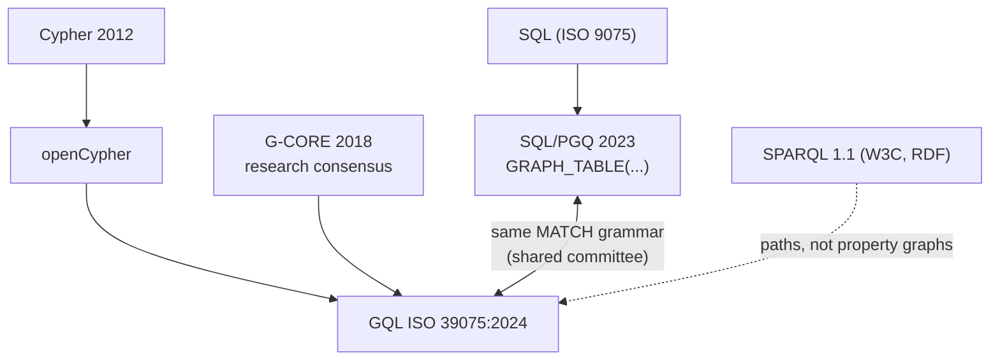

# Graph query languages: semantics, not syntax

Six languages query graphs, and the differences that matter are not
surface syntax but three fault lines: data model, matching semantics,
and composability. This chapter builds each fault line step by step —
ending with what each language lets a planner do — because the same
two-hop pattern returns three different counts depending on semantics
the language may not even let you spell. The route runs the family
tree from Cypher through GQL (the first new ISO database language
since SQL, 1987); keep kuzu's `src/antlr4/Cypher.g4` open as the
concrete grammar (a full Cypher in 690 lines).

## The problem in one sentence

Count the 2-paths in a triangle graph and Cypher, a
node-isomorphism engine, and an edge-trail engine give three different
numbers for the *same pattern* — matching semantics silently decides
the answer, and most languages don't let you say which one you meant.

## The concepts, step by step

### Step 1 — fault line one: what a graph even is (property graph vs RDF)

A **property graph** makes nodes AND edges first-class objects that
carry labels and key-value properties — `since: 2019` lives *on* the
KNOWS edge. **RDF** (Resource Description Framework — data as
subject-predicate-object **triples** like `:alice :knows :bob`) has no
place to put an edge property: a triple is atomic. The workarounds are
**reification** (create a statement-node representing the edge, then
hang properties off it — one edge becomes 4 triples and every edge
query becomes extra joins) or RDF-star's edge-triples
(`<< :a :knows :b >> :since 2019`). Why it matters: this single
modeling choice — the edge as a first-class citizen — is most of why
property graphs won the application market, and it decides query
*shape*: SPARQL plans tend toward many small self-joins ("SPARQL is
10 joins where Cypher is 2 expands").

### Step 2 — fault line two: matching semantics — the same pattern, three answers

**Matching semantics** is the rule for which subgraph assignments
count as matches — specifically, whether pattern variables may repeat
graph elements. Three standard choices: **homomorphism** (anything may
repeat — nodes and edges), **isomorphism** (no repeated nodes),
**trail** (no repeated *edges*). They give different answers on the
same data:

```
graph: a triangle  1 ──► 2 ──► 3 ──► 1

query: MATCH (a)-[]->(b)-[]->(c)   — count the 2-paths

homomorphism (nodes+edges may repeat): 1-2-3, 2-3-1, 3-1-2,
                                       and a=c ones like 1-2-1? no edge 2→1 — but
                                       add a back-edge and a=c matches appear
isomorphism  (no repeated nodes):      only node-distinct walks
trail        (no repeated edges):      Cypher's [*] var-length rule
```

This is the SIGMOD'22 paper's core: **matching semantics is a language
parameter, not folklore**. Cypher hard-coded a hybrid in 2012 —
homomorphism for nodes, trail for variable-length edge patterns — a
semantics decision disguised as a default, and every engine since has
had to reverse-engineer the corner cases. Why it matters: two engines
can both "support Cypher patterns" and return different counts; if you
build an engine (M13), you must *pick* and document.

### Step 3 — GQL makes the semantics syntax: restrictors and selectors

GQL (ISO 39075:2024) and SQL/PGQ turn Step 2's parameter into explicit
syntax: a **restrictor** names which matches are legal
(TRAIL / ACYCLIC / SIMPLE, or ALL for homomorphism) and a **selector**
names which of the legal matches to return (ANY SHORTEST, ALL
SHORTEST, ANY k) — `MATCH ALL TRAIL (a)-[]->{1,5}(b)` says both out
loud. The other first-class addition: **quantified path patterns** —
`(a) (-[:KNOWS]->){1,5} (b)` — regular-expression-style repetition
over a path segment, replacing Cypher's `[*1..5]` with a composable
form. Why it matters: restrictors aren't just documentation — they're
*prunable*: TRAIL/ACYCLIC bound the search on supernodes where
unrestricted expansion explodes; and M13's capstone rule (keep the AST
GQL-shaped: quantified path patterns + an explicit path-mode field)
exists so M10's parser survives GQL compatibility without a rewrite.

### Step 4 — the family tree: two standards, one MATCH grammar

The 2024 standards landscape collapses to one fact: SQL/PGQ (property
graphs *inside* SQL — a `GRAPH_TABLE(...)` clause whose MATCH returns
a table you join like any other; DuckDB ships it as duckpgq, Oracle
too) and GQL (a standalone graph language with graph DDL and
graph-to-graph queries) share the SAME pattern-matching grammar,
written by a shared committee:



So an engine that implements the shared MATCH grammar once (with
Step 3's restrictors as first-class AST nodes) speaks to both worlds.
Why it matters: for the first time since 1987 there is an ISO answer
to "what query language should a graph engine target" — and it is
close enough to openCypher that M13 can target openCypher now and
converge later.

### Step 5 — fault line three: composability, from Gremlin to Datalog

**Composability** is whether a query's output can feed another query
as a first-class input. The spectrum: **Gremlin** sits at the bottom —
a traversal like `g.V().out().out()` *is* an execution order
(pipelines compose, but every step names machine behavior). **Cypher**
composes weakly — `CALL {}` subqueries were bolted on. **SQL/PGQ**
inherits SQL's full composability (MATCH returns a table). **Datalog**
is the ceiling: every rule's output is a relation usable by any other
rule, and recursion is native — a fixpoint (iterate rules until
nothing new derives; semi-naive evaluation only re-derives from the
newest facts — topic 27's incremental cousin) rather than a special
path operator. Why it matters: composability decides what the
*optimizer* may reorganize — which is Step 6 — and what users can
build without engine changes.

### Step 6 — what each language lets the planner do

The fault lines land in one place: how much freedom the planner has.

| | model | matching | composable? | pushdown-friendly? |
|---|---|---|---|---|
| Cypher/openCypher | property graph | homomorphism, rel-trail for var-length | weak (`CALL {}` bolted on) | good |
| GQL (ISO 39075:2024) | property graph | configurable: ALL/TRAIL/ACYCLIC + quantified path patterns | graph tables | good |
| SQL/PGQ | property graph *inside* SQL | GQL's MATCH in `GRAPH_TABLE(...)` | full SQL | inherits SQL |
| SPARQL | RDF triples | homomorphism (BGP) | subqueries | union-heavy plans |
| Gremlin | property graph | imperative traversal | pipelines | almost none — you ARE the plan |
| Datalog | relations | homomorphism + fixpoint | **total** — rules feed rules | recursion-native |

Cypher/GQL/PGQ declare *what*; the planner picks join order,
direction, index — kuzu's WCOJ operator
([reading-wcoj.md](reading-wcoj.md)) is legal precisely because MATCH
is declarative. Gremlin's imperative order forbids most of that
(optimizers can only peephole it). SPARQL's triple-at-a-time model
plans as many small self-joins. Datalog exposes recursion itself to
the optimizer (magic sets, demand transformation) — no other family
can rewrite *through* a fixpoint. Why it matters: language choice is a
planner-capability choice; every optimization in topics 10–13 assumes
the query says what, not how.

## How to read the papers (with the concepts in hand)

1. **Deutsch et al., SIGMOD'22 (GQL and SQL/PGQ pattern matching)** —
   the core is Step 2's semantics-as-parameter argument and Step 3's
   restrictor/selector taxonomy; read those sections carefully, skim
   the formal grammar. Keep the triangle example in hand and re-derive
   the three counts as you read.
2. **G-CORE (SIGMOD'18)** — skim as history: the research consensus
   (paths as first-class values, graph-to-graph composability) that
   GQL absorbed — Step 4's middle arrow.
3. **kuzu's `Cypher.g4`** — not a paper, but read it like one: find
   where variable-length patterns (`[*1..5]`) live in the grammar,
   then ask where a GQL restrictor field would attach — that's
   question 6.

## Questions

1. Count the 2-paths in the triangle above under each of homomorphism /
   isomorphism / edge-trail. Then check FalkorDB's actual answer — which
   semantics does it implement, and where is that decided in the code?
2. Write `filtered 2-hop` (this topic's experiment query) in Cypher,
   GQL, SPARQL, and Gremlin. Which versions *force* a plan shape rather
   than describe a result?
3. RDF reification: model `(:alice)-[:KNOWS {since: 2019}]->(:bob)` as
   plain triples. How many triples? What does the `since > 2015` filter
   look like, and what index does it now need?
4. GQL's quantified path pattern `(a)(-[:R]->){2,4}(b)` with TRAIL — why
   does naive expansion explode on supernodes (hop_bench's high-degree
   tail), and what does the restrictor let the engine prune?
5. Datalog can express "friend-of-friend excluding direct friends" as
   two rules with negation. What ordering constraint does negation
   impose (stratification), and what's the Cypher equivalent's cost?
6. **M13 mapping**: the capstone keeps the AST GQL-shaped — quantified
   path patterns + explicit path-mode. Sketch the enum/struct for a
   path pattern that can represent Cypher's `[*1..5]` AND GQL's
   `ALL ACYCLIC (a)(-[:R]->){1,5}(b)` without a parser rewrite.

## References

**Papers**
- Deutsch et al. — "Graph Pattern Matching in GQL and SQL/PGQ"
  (SIGMOD 2022, [arXiv:2112.06217](https://arxiv.org/abs/2112.06217))
  — the matching-semantics-as-parameter argument
- Angles et al. — "G-CORE: A Core for Future Graph Query Languages"
  (SIGMOD 2018, [arXiv:1712.01550](https://arxiv.org/abs/1712.01550))
  — the research consensus GQL absorbed
- GQL overview at [gqlstandards.org](https://www.gqlstandards.org)

**Code**
- [kuzu](https://github.com/kuzudb/kuzu) `src/antlr4/Cypher.g4` — a
  full Cypher grammar in one 690-line file; keep it open while reading
