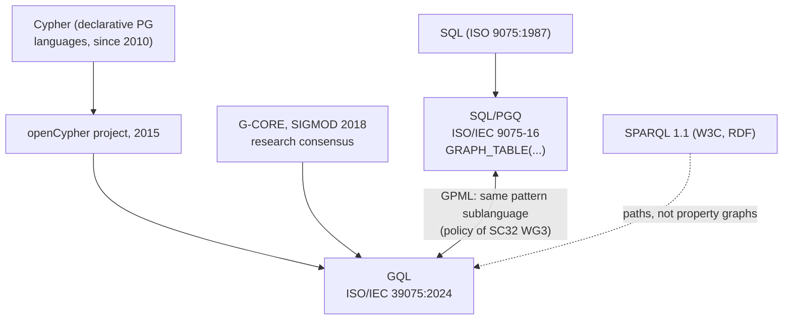

# Graph query languages: semantics, not syntax

Six languages query graphs, and the differences that matter are not
surface syntax but three fault lines: data model, matching semantics,
and composability. This chapter builds each fault line step by step —
ending with what each language lets a planner do — because the same
two-hop pattern returns three different counts depending on semantics
the language may not even let you spell. The route runs the family
tree from Cypher through GQL, the first new ISO database language
since SQL itself (ISO 9075:**1987**); keep kuzu's
`src/antlr4/Cypher.g4` open as the concrete grammar.

Every standards claim below is cited to Deutsch et al., *Graph Pattern
Matching in GQL and SQL/PGQ* (SIGMOD 2022,
[arXiv:2112.06217](https://arxiv.org/abs/2112.06217)) by section or
figure; every ISO designation was checked against iso.org; every
grammar anchor is **kuzu pinned at `89f0263`**
([`resources/codebases.md`](../../resources/codebases.md)). Four
numbers in the previous version of this chapter — the size of
`Cypher.g4`, the date on Cypher, the list of GQL restrictors, and the
year on the GQL standard — did not survive that check.

## The problem in one sentence

Count the 2-paths in a triangle graph and Cypher, a
node-isomorphism engine, and an edge-trail engine give three different
numbers for the *same pattern* — matching semantics silently decides
the answer, and most languages don't let you say which one you meant.

## The concepts, step by step

### Step 1 — fault line one: what a graph even is (property graph vs RDF)

> **In:** one fact with an attribute on the relationship —
> `alice KNOWS bob since 2019`.
> **Out:** its representation in each model, counted in storage units
> and in joins, which is where the two models diverge for good.

A **property graph** makes nodes AND edges first-class objects that
carry labels and key-value properties — `since: 2019` lives *on* the
KNOWS edge. **RDF** (Resource Description Framework — data as
subject-predicate-object **triples** like `:alice :knows :bob`) has no
place to put an edge property: a triple is atomic. The workarounds are
**reification** (create a statement-node representing the edge, then
hang properties off it) or RDF-star's edge-triples
(`<< :a :knows :b >> :since 2019`). Count the reification, since
question 3 asks for exactly this:

```
 property graph:  1 node record for alice, 1 for bob,
                  1 edge record carrying {since: 2019}

 RDF reification: :s rdf:type      rdf:Statement .
                  :s rdf:subject   :alice .
                  :s rdf:predicate :knows .
                  :s rdf:object    :bob .
                  :s :since        2019 .
                  = 5 triples for one edge, and the original
                    (:alice :knows :bob) triple is usually kept too → 6

 traversal cost:  property graph  1 edge dereference
                  reified RDF     4 self-joins on the statement node
                                  to recover (subject, object) + filter
```

The paper puts the split in institutional terms: "Unlike RDF with its
query language SPARQL, which is a W3C standard, property graph systems
possess disparate storage models and querying facilities" (§1, p.2) —
one model got a standard early and one got a decade of dialects. Why
it matters: this single modeling choice — the edge as a first-class
citizen — is most of why property graphs won the application market,
and it decides query *shape*: SPARQL plans tend toward many small
self-joins where Cypher does two expands.

### Step 2 — fault line two: matching semantics — the same pattern, three answers

> **In:** one graph, one pattern, and three rules about what may
> repeat.
> **Out:** three different integers, computed by hand — the
> demonstration that "matching semantics" is a number, not a
> philosophy.

**Matching semantics** is the rule for which subgraph assignments
count as matches — specifically, whether pattern variables may repeat
graph elements. Three standard choices: **homomorphism** (anything may
repeat — nodes and edges), **isomorphism** (no repeated nodes),
**trail** (no repeated *edges*).

The previous version of this chapter tried to demonstrate the split on
a 2-edge pattern. That does not work: on a simple graph, a 2-path with
distinct edges automatically has distinct endpoints, so trail and
node-isomorphism agree by construction. You need three edges. Take the
undirected triangle and count properly:

```
 graph:  K3 — nodes 1,2,3; undirected edges {1,2}, {2,3}, {3,1}
 query:  MATCH (a)-[e1]-(b)-[e2]-(c)-[e3]-(d)     — 3-edge walks

 homomorphism (anything may repeat):
   pick a: 3 ways; each node has degree 2, so each step has 2 choices
   3 × 2 × 2 × 2 = 24
   cross-check with the matrix spelling: the number of length-3 walks
   is 1ᵀA³1. A = J − I has eigenvalues 2, −1, −1, and 1 is the
   eigenvector for 2, so A³1 = 2³·1 = 8·1 and 1ᵀA³1 = 8 × 3 = 24 ✓

 trail (no repeated EDGE):
   three distinct edges in a 3-edge graph means using all of them,
   i.e. walking the triangle: 3 starting nodes × 2 directions = 6

 node-isomorphism (no repeated NODE):
   the pattern needs 4 distinct nodes; the graph has 3
   = 0

 24 / 6 / 0 — same graph, same pattern, three answers
```

Note what the matrix cross-check implies: `A³`'s grand sum *is* the
homomorphism count. Linear algebra is homomorphism-native, which is
why FalkorDB
([reading-graphblas-internals.md](reading-graphblas-internals.md))
gets that semantics for free and has to work for any other.

This is the SIGMOD'22 paper's core: **matching semantics is a language
parameter, not folklore**. Cypher hard-coded a hybrid — homomorphism
for nodes, no-repeated-relationship for edges — a semantics decision
disguised as a default, and every engine since has had to
reverse-engineer the corner cases.

**Correction.** The previous version dated that decision to "Cypher
2012". The paper does not support a year for Cypher specifically; what
it says is that declarative property graph languages appeared "since
2010" — "Cypher from Neo4j, GSQL from TigerGraph, and PGQL from
Oracle, as well as industry/academia prototypes such as G-CORE" — and
that "the **2015** openCypher project has led to a widening industrial
use of Cypher as a language for property graphs, but did not succeed
on its own in establishing a standard" (§1, p.2). Use 2010 for the
category and 2015 for openCypher; drop the 2012.

Why it matters: two engines can both "support Cypher patterns" and
return different counts; if you build an engine (M13), you must *pick*
and document.

### Step 3 — GQL makes some of the semantics syntax: restrictors and selectors

> **In:** an unbounded quantifier like `-[t:Transfer]->*` over a graph
> with a cycle — a query with infinitely many matches.
> **Out:** the two GPML devices that force finiteness, their exact
> keyword lists, and the asymmetry between them that decides which one
> can turn a non-empty answer into an empty one.

GQL and SQL/PGQ share a pattern sublanguage the paper calls **GPML**
(§1, p.2), and GPML turns part of Step 2's parameter into explicit
syntax. The motivation is not elegance, it is termination:

> "Written without any restrictions, GPML queries may not terminate as
> they will return infinitely many matches. … To prevent this
> behaviour, GPML queries must demonstrably terminate; in particular,
> the number of matches must be finite. To achieve this, GPML uses
> restrictors and selectors. **Every unbounded quantifier (such as *
> above) must be contained in the scope of either a restrictor or a
> selector or both.**"
> — §5, p.17

A **restrictor** is "a path predicate … such that the number of
matches cannot be infinite" (§5.1). **Correction:** the previous
version listed the restrictors as "TRAIL / ACYCLIC / SIMPLE, or ALL
for homomorphism". There is no `ALL` restrictor. Figure 7 lists
exactly three:

| Keyword | Description (Fig. 7, p.19) |
|---|---|
| `TRAIL` | No repeated edges. |
| `ACYCLIC` | No repeated nodes. |
| `SIMPLE` | No repeated nodes, except that the first and last nodes may be the same. |

A **selector** is "an algorithm that conceptually partitions the
solution space on the endpoints and selects a finite set of matches
from each partition" (§5.1). Figure 8 lists six:
`ANY SHORTEST`, `ALL SHORTEST`, `ANY`, `ANY k`, `SHORTEST k`, and
`SHORTEST k GROUP` — of which only `ALL SHORTEST` and
`SHORTEST k GROUP` are marked **deterministic**; the other four
explicitly are not.

The two compose in a fixed order — "restrictors can be seen as
operating *during* pattern matching while selectors operate afterwards
… if combined, selectors are always applied after restrictors" (§5.1)
— so `MATCH ALL SHORTEST TRAIL p = …` means "the shortest among the
trails", not "the trails among the shortest". And that ordering has a
consequence worth memorizing, because it is the one property that
distinguishes the two devices:

> "Consider a query Q with no selector or restrictor, and assume that
> Q has matches. Then, adding a **selector** to Q might reduce the
> number of matches, but the resulting query will **always have at
> least one match**. On the other hand, adding a **restrictor** to Q
> might yield a query with **no matches at all**."
> — §5.1, p.19

A selector is a projection; a restrictor is a filter. Get them
backwards in an optimizer and you will "optimize" a query into
returning nothing.

The other first-class addition is **quantified path patterns** —
`(a) (-[:KNOWS]->){1,5} (b)` — "quantifiers similar to those in Perl
and other common 'regex' tools … written as postfix operators on
either a single edge pattern or a parenthesized path pattern" (§4,
p.14), replacing Cypher's `[*1..5]` with a composable form.

**Correction — scope.** The previous version implied GQL makes
matching semantics fully configurable. It does not. Restrictors
constrain repetition *within a path pattern*; constraining repetition
*across* the whole graph pattern is listed as a **Language
Opportunity**, i.e. deferred out of the shipped standard:

> "…a sample of LOs pertaining to GPML: • Constraining a graph pattern
> through the introduction of **isomorphic match modes**: for example,
> an edge-isomorphic match requires all edges matched across all
> constituent path patterns in the graph pattern to differ from each
> other."
> — §7.1, p.28

So Step 2's isomorphism column is still not spellable in GPML as the
paper describes it. Why it matters: restrictors aren't just
documentation — they're *prunable*: TRAIL/ACYCLIC bound the search on
supernodes where unrestricted expansion explodes; and M13's capstone
rule (keep the AST GQL-shaped: quantified path patterns + an explicit
path-mode field) exists so M10's parser survives GQL compatibility
without a rewrite.

### Step 4 — the family tree: two standards, one MATCH grammar

> **In:** the two ISO projects and their dates.
> **Out:** the one structural fact that makes targeting both cheap —
> plus an honest note about what the source paper predicted and what
> actually shipped.

The standards landscape collapses to one fact: SQL/PGQ (property
graphs *inside* SQL — a `GRAPH_TABLE(...)` clause whose MATCH returns
a table you join like any other) and GQL (a standalone graph language
with graph DDL and graph-to-graph queries) share the SAME pattern
matching sublanguage, by policy:

> "In 2019 the Joint Technical Committee 1 of ISO/IEC … approved a
> project to create GQL, a standard property graph query language with
> full CRUD … and catalog capability. GQL builds on prior graph
> languages, as well as **a new part 16 of SQL, in development since
> 2017, called SQL/PGQ**."
> — §1, p.2

> "Both language projects have been assigned to the **ISO/IEC JTC1
> SC32 … Working Group for Database Languages (WG3)** which continues
> to be responsible for maintaining and enhancing SQL as a whole.
> **This structure serves a policy that GPML be kept identical in GQL
> and SQL/PGQ.**"
> — §1, p.3


```mermaid
graph TD
    SQL["SQL (ISO 9075:1987)"] --> PGQ["SQL/PGQ<br/>ISO/IEC 9075-16<br/>GRAPH_TABLE(...)"]
    C["Cypher (declarative PG<br/>languages, since 2010)"] --> OC["openCypher project, 2015"] --> GQL["GQL<br/>ISO/IEC 39075:2024"]
    G["G-CORE, SIGMOD 2018<br/>research consensus"] --> GQL
    PGQ <-->|"GPML: same pattern sublanguage<br/>(policy of SC32 WG3)"| GQL
    SPARQL["SPARQL 1.1 (W3C, RDF)"] -.->|"paths, not property graphs"| GQL
```

**Correction — the year.** The previous version dated SQL/PGQ to 2023.
The paper's Figure 10 (p.28) is a *projected* timeline, carrying
footnote 6: "The schedule depends on work that has not been completed
and so could change." It projected the SQL/PGQ IS for 2023-03-13 and
the GQL IS for 2023-09-10. What actually published is **ISO/IEC
39075:2024**, *Information technology — Database languages — GQL* —
GQL slipped past its own projection by roughly a year. SQL/PGQ is
**ISO/IEC 9075-16**, *Information technology — Database languages SQL
— Part 16: Property Graph Queries (SQL/PGQ)*; its publication year is
not stated in the paper and is not quoted here. Cite the part number,
not a year you cannot source.

The WG3 membership is worth knowing when you weigh how binding this
is: expert members represent the national standards bodies of China,
Denmark, Finland, Germany, Japan, Korea, the Netherlands, Sweden, the
UK and the USA, with a liaison relationship to LDBC — the same LDBC
whose benchmark is [reading-ldbc-snb.md](reading-ldbc-snb.md) (§1,
p.3). The benchmark council and the language committee are the same
room.

So an engine that implements the shared MATCH grammar once (with
Step 3's restrictors as first-class AST nodes) speaks to both worlds.
Why it matters: for the first time since ISO 9075:1987 there is an ISO
answer to "what query language should a graph engine target" — and it
is close enough to openCypher that M13 can target openCypher now and
converge later.

### Step 5 — fault line three: composability, from Gremlin to Datalog

> **In:** the question "can a query's output be another query's
> input?"
> **Out:** a ranking of the six languages, and the observation that
> the ranking predicts what an optimizer is allowed to touch.

**Composability** is whether a query's output can feed another query
as a first-class input. The spectrum: **Gremlin** sits at the bottom —
a traversal like `g.V().out().out()` *is* an execution order
(pipelines compose, but every step names machine behavior). **Cypher**
composes weakly — `CALL {}` subqueries were bolted on. **SQL/PGQ**
inherits SQL's full composability: the paper describes PGQ as
specifying "how to define graph views over an SQL tabular schema, and
to run **read-only** queries over such views, that can be projected by
an SQL SELECT statement" (§1, p.2) — note *read-only*, which is
precisely the capability gap GQL was chartered to fill ("full CRUD …
and catalog capability"). **Datalog** is the ceiling: every rule's
output is a relation usable by any other rule, and recursion is native
— a fixpoint (iterate rules until nothing new derives; semi-naive
evaluation only re-derives from the newest facts — topic 27's
incremental cousin) rather than a special path operator. Why it
matters: composability decides what the *optimizer* may reorganize —
which is Step 6 — and what users can build without engine changes.

### Step 6 — what each language lets the planner do

> **In:** the three fault lines.
> **Out:** one table, whose rightmost columns are the only thing that
> shows up in a flame graph.

The fault lines land in one place: how much freedom the planner has.

| | model | matching | composable? | pushdown-friendly? |
|---|---|---|---|---|
| Cypher/openCypher | property graph | homomorphism on nodes, no-repeated-relationship on edges | weak (`CALL {}` bolted on) | good |
| GQL (ISO/IEC 39075:2024) | property graph | per-path-pattern: TRAIL / ACYCLIC / SIMPLE + 6 selectors + quantified path patterns; cross-pattern isomorphism is still an LO | graph tables, full CRUD | good |
| SQL/PGQ (ISO/IEC 9075-16) | property graph *view over* an SQL schema | the same GPML in `GRAPH_TABLE(...)` | full SQL, but read-only over the graph view | inherits SQL |
| SPARQL 1.1 (W3C) | RDF triples | homomorphism (BGP) | subqueries | union-heavy plans |
| Gremlin | property graph | imperative traversal | pipelines | almost none — you ARE the plan |
| Datalog | relations | homomorphism + fixpoint | **total** — rules feed rules | recursion-native |

Cypher/GQL/PGQ declare *what*; the planner picks join order,
direction, index — kuzu's WCOJ operator
([reading-wcoj.md](reading-wcoj.md)) is legal precisely because MATCH
is declarative. Gremlin's imperative order forbids most of that
(optimizers can only peephole it). SPARQL's triple-at-a-time model
plans as many small self-joins. Datalog exposes recursion itself to
the optimizer (magic sets, demand transformation) — no other family
can rewrite *through* a fixpoint. Why it matters: language choice is a
planner-capability choice; every optimization in topics 10–13 assumes
the query says what, not how.

## How to read the papers (with the concepts in hand)

1. **Deutsch et al., SIGMOD'22 (GQL and SQL/PGQ pattern matching)** —
   §1 for the standards history and the WG3/GPML structure, §4 for
   quantifiers, **§5.1 for restrictors and selectors** (Figures 7 and
   8 are the two tables to memorize), §5.2 for prefilters versus
   postfilters, §7.1 for the Language Opportunities — i.e. what is
   *not* in the standard. Keep the K3 example from Step 2 in hand and
   re-derive 24 / 6 / 0 as you read.
2. **G-CORE (SIGMOD'18,
   [arXiv:1712.01550](https://arxiv.org/abs/1712.01550))** — skim as
   history: the research consensus (paths as first-class values,
   graph-to-graph composability) that GQL absorbed — Step 4's middle
   arrow.
3. **kuzu's `src/antlr4/Cypher.g4`** — not a paper, but read it like
   one. **Correction:** it is **917 lines**, not the 690 the previous
   version claimed. Go straight to the relationship rules, because
   kuzu has already done question 6's exercise:

```antlr
// src/antlr4/Cypher.g4  (kuzu @ 89f0263)
   413  oC_RelationshipDetail
   414      : '[' SP? ( oC_Variable SP? )? ( oC_RelationshipTypes SP? )? ( kU_RecursiveDetail SP? )? ( kU_Properties SP? )? ']' ;
  //  ... 415-427: elided — properties, rel types, node labels ...
   428  kU_RecursiveDetail
   429      : '*' ( SP? kU_RecursiveType)? ( SP? oC_RangeLiteral )? ( SP? kU_RecursiveComprehension )? ;
   430
   431  kU_RecursiveType
   432      : (ALL SP)? WSHORTEST SP? '(' SP? oC_PropertyKeyName SP? ')'
   433          | SHORTEST
   434          | ALL SP SHORTEST
   435          | TRAIL
   436          | ACYCLIC ;
   437
   438  oC_RangeLiteral
   439      :  oC_LowerBound? SP? DOTDOT SP? oC_UpperBound?
   440          | oC_IntegerLiteral ;
```

   Read `kU_RecursiveType` against Figures 7 and 8 and two facts fall
   out. kuzu implements two of the three restrictors (`TRAIL`,
   `ACYCLIC` — no `SIMPLE`) and three selector-shaped modes
   (`SHORTEST`, `ALL SHORTEST`, weighted `WSHORTEST`). And it puts
   them in **one alternation**, so exactly one may be chosen — whereas
   GPML's §5.1 explicitly allows `ALL SHORTEST TRAIL`, a selector
   applied after a restrictor. That single `|` is the gap between a
   Cypher-shaped AST and a GQL-shaped one, and it is what question 6
   is asking you to design away.

## Questions

1. Count the 2-paths in the triangle above under each of homomorphism /
   isomorphism / edge-trail. Then check FalkorDB's actual answer — which
   semantics does it implement, and where is that decided in the code?
2. Write `filtered 2-hop` (this topic's experiment query) in Cypher,
   GQL, SPARQL, and Gremlin. Which versions *force* a plan shape rather
   than describe a result?
3. RDF reification: model `(:alice)-[:KNOWS {since: 2019}]->(:bob)` as
   plain triples. How many triples? What does the `since > 2015` filter
   look like, and what index does it now need?
4. GQL's quantified path pattern `(a)(-[:R]->){2,4}(b)` with TRAIL — why
   does naive expansion explode on supernodes (hop_bench's high-degree
   tail), and what does the restrictor let the engine prune?
5. Datalog can express "friend-of-friend excluding direct friends" as
   two rules with negation. What ordering constraint does negation
   impose (stratification), and what's the Cypher equivalent's cost?
6. **M13 mapping**: the capstone keeps the AST GQL-shaped — quantified
   path patterns + explicit path-mode. Sketch the enum/struct for a
   path pattern that can represent Cypher's `[*1..5]` AND GQL's
   `ALL ACYCLIC (a)(-[:R]->){1,5}(b)` without a parser rewrite.

## Done when

Answer each before unfolding it.

- [ ] You can state the three matching semantics and count the matches of a 3-edge pattern on a triangle under each.

  <details><summary>Answer</summary>

  Homomorphism (anything repeats), node-isomorphism (no repeated
  node), trail (no repeated edge). On K3 with
  `(a)-[e1]-(b)-[e2]-(c)-[e3]-(d)`:

  - homomorphism 3 × 2 × 2 × 2 = **24**, cross-checked as 1ᵀA³1 with
    A = J − I whose leading eigenvalue is 2, so 2³ × 3 = 24
  - trail: three distinct edges in a 3-edge graph means all of them,
    i.e. walking the triangle — 3 starts × 2 directions = **6**
  - node-isomorphism: the pattern needs 4 distinct nodes and the graph
    has 3 → **0**

  Do not try this with a 2-edge pattern: on a simple graph, distinct
  edges force distinct endpoints, so trail and node-isomorphism agree
  and the demonstration collapses.
  </details>

- [ ] You can explain what GQL's restrictors and selectors make explicit that Cypher left implicit — and the asymmetry between them.

  <details><summary>Answer</summary>

  Cypher's semantics is a hard-coded hybrid (homomorphism on nodes,
  no-repeated-relationship on edges) with no syntax to change it.
  GPML makes it a keyword, because it has to: §5 requires every
  unbounded quantifier to sit inside a restrictor or a selector or
  both, otherwise the query need not terminate.

  Restrictors (Fig. 7): `TRAIL`, `ACYCLIC`, `SIMPLE` — three, and no
  `ALL`. Selectors (Fig. 8): `ANY SHORTEST`, `ALL SHORTEST`, `ANY`,
  `ANY k`, `SHORTEST k`, `SHORTEST k GROUP`. Restrictors act during
  matching, selectors after; combined, selectors apply last.

  The asymmetry (§5.1, p.19): adding a *selector* to a query that has
  matches always leaves at least one match; adding a *restrictor* can
  leave none. A selector projects, a restrictor filters.

  What is still not expressible: cross-pattern isomorphic match modes
  — §7.1 lists them as a Language Opportunity, deferred.
  </details>

- [ ] You can say what property graphs and RDF actually disagree about, beyond syntax.

  <details><summary>Answer</summary>

  Whether an edge is a first-class object that can carry properties. A
  triple is atomic, so `since: 2019` on `:alice :knows :bob` needs
  reification — an `rdf:Statement` node plus `rdf:subject`,
  `rdf:predicate`, `rdf:object` and the property, i.e. five extra
  triples and four self-joins to walk one edge — or RDF-star's
  edge-triples.

  The downstream effect is plan shape: SPARQL's basic graph patterns
  are triple-at-a-time so plans become many small self-joins, where a
  property-graph MATCH becomes a couple of expands. The paper frames
  the split institutionally too: RDF/SPARQL had a W3C standard while
  property graph systems had "disparate storage models and querying
  facilities" until GQL (§1, p.2).
  </details>

- [ ] You can name, for each language, one thing its semantics lets the planner do that another's forbids.

  <details><summary>Answer</summary>

  Cypher/GQL/PGQ are declarative, so the planner owns join order,
  expansion direction and index choice — which is what makes kuzu's
  WCOJ `Intersect` a legal substitution for a binary-join plan.
  Gremlin's traversal *is* the plan, so an optimizer can only
  peephole. SPARQL exposes triple patterns, so the planner reorders
  self-joins but cannot see an "expand" at all. Datalog exposes the
  fixpoint itself, so magic sets and demand transformation can rewrite
  *through* recursion — nothing else in the table can.

  SQL/PGQ inherits SQL's full composability but the graph view is
  read-only (§1, p.2), which is the gap GQL's full-CRUD charter fills.
  </details>

- [ ] You wrote answers to all questions in notes.md, including this topic's 2-hop query written in more than one language.

  <details><summary>Answer</summary>

  Question 6's shape falls out of reading `Cypher.g4:431-436` against
  Figures 7 and 8. kuzu makes path mode a single alternation —
  `SHORTEST | ALL SHORTEST | TRAIL | ACYCLIC | WSHORTEST(prop)` — so
  at most one may be given. GPML separates the two axes and allows
  `ALL SHORTEST TRAIL`. A GQL-shaped AST therefore needs *two*
  optional fields, not one enum:

  ```
  struct PathPattern {
      restrictor: Option<Restrictor>,   // Trail | Acyclic | Simple
      selector:   Option<Selector>,     // AnyShortest | AllShortest | Any
                                        // | AnyK(n) | ShortestK(n)
                                        // | ShortestKGroup(n)
      quantifier: Quantifier,           // {lo,hi} — covers Cypher's [*1..5]
      ...
  }
  ```

  and the evaluator must apply the restrictor during matching and the
  selector afterwards, in that order, or the "adding a selector never
  empties the result" property breaks.
  </details>

## References

**Papers**
- Deutsch et al. — "Graph Pattern Matching in GQL and SQL/PGQ"
  (SIGMOD 2022, [arXiv:2112.06217](https://arxiv.org/abs/2112.06217))
  — the authority for everything in Steps 3 and 4. §1 standards
  history and the WG3/GPML policy; §4 quantifiers; §5 termination;
  §5.1 restrictors (Fig. 7) and selectors (Fig. 8); §5.2 prefilters
  and postfilters; §7.1 Language Opportunities. Figure 10's timeline
  is a *projection* made in December 2021 — check it against what
  actually shipped
- Angles et al. — "G-CORE: A Core for Future Graph Query Languages"
  (SIGMOD 2018, [arXiv:1712.01550](https://arxiv.org/abs/1712.01550))
  — the research consensus GQL absorbed

**Standards** (designations checked at iso.org)
- ISO 9075:1987 — the first ISO edition of SQL; the baseline the "first
  new ISO database language since SQL" claim is measured from
- ISO/IEC 39075:2024 — *Information technology — Database languages —
  GQL*
- ISO/IEC 9075-16 — *Information technology — Database languages SQL —
  Part 16: Property Graph Queries (SQL/PGQ)*

**Code** (verified at kuzu `89f0263`)

| File | Lines | What |
|---|---|---|
| `src/antlr4/Cypher.g4` | 917 total | a full Cypher grammar in one file |
| `src/antlr4/Cypher.g4` | 413-414 | `oC_RelationshipDetail` — where `[...]` is parsed |
| `src/antlr4/Cypher.g4` | 428-429 | `kU_RecursiveDetail` — `*`, path mode, range |
| `src/antlr4/Cypher.g4` | 431-436 | `kU_RecursiveType` — TRAIL/ACYCLIC/SHORTEST as one alternation |
| `src/antlr4/Cypher.g4` | 438-440 | `oC_RangeLiteral` — Cypher's `[*1..5]` bounds |
