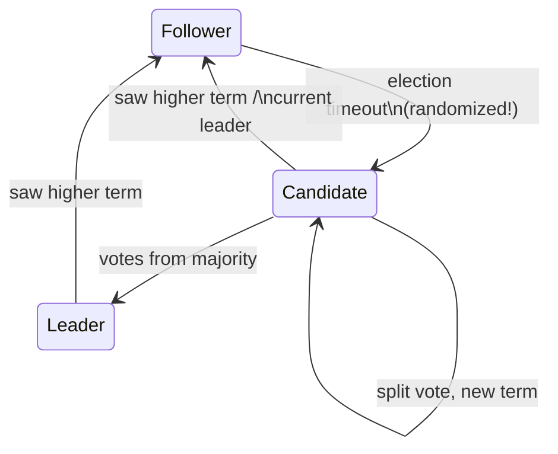

# Topic 15 — Replication, Consensus & Distribution

From single node to system. Raft is table stakes; the interesting
part is what each system does differently: valkey ships commands
asynchronously and calls it a day, qdrant wraps tikv's raft-rs around
cluster METADATA only, and everyone chooses a different point on the
consistency/latency line.

## 1. The topology menu

```
 leader/follower, async    valkey default: fast, loses acked writes on failover
 leader/follower, semi-sync WAIT n: ack after n replicas confirm — bounded loss
 consensus (Raft/VSR)      majority ack BEFORE commit: no acked-write loss,
                           pays a round trip
 leaderless / multi-master topic 31 (CRDTs) — merge instead of order
```

The axis is WHO can acknowledge: leader alone (async), leader+n
(semi-sync), majority (consensus). Everything else is bookkeeping to
survive the failure cases each choice creates.

## 2. Raft in one diagram



Three sub-problems, deliberately separable:

- **election**: terms are logical clocks; one vote per term per node
  (persisted!); randomized timeouts break symmetry. Vote-granting
  rule carries safety: only vote for candidates whose log is at
  least as up-to-date (last term, then length).
- **log replication**: leader appends, `AppendEntries` carries
  `(prev_index, prev_term)` — follower rejects on mismatch, leader
  decrements and retries → logs converge (Log Matching). Commit =
  replicated on majority AND from the current term (§5.4.2's subtle
  rule — the one every homegrown Raft gets wrong).
- **safety**: a committed entry survives any future election because
  the voters' logs contain it and voters only elect up-to-date
  candidates. Quorum intersection does all the work.

## 3. The write path, three ways

```
 valkey:  client → leader (ack NOW) → repl buffer → followers   RTT: 0
 WAIT 1:  client → leader → follower ack → client ack           RTT: 1 (opt-in)
 raft:    client → leader → majority fsync+ack → commit → apply → client
```

Replication lag is the async design's currency — the repl_lag
experiment measures how fsync policy (topic 5's ladder) sets its
floor.

## 4. Consistency models (the ladder, briefly)

linearizable → sequential → causal → eventual. Raft gives
linearizable writes; linearizable READS need care (leader leases or
ReadIndex — a heartbeat round to prove leadership before serving).
Async replicas serve stale reads by design; "read your writes"
requires session stickiness or tracking offsets (DDIA ch. 5).

## 5. Sharding

- **hash slots** (valkey cluster: 16384 slots, CRC16(key) mod
  16384): uniform spread, cheap rebalancing at slot granularity, no
  range scans
- **ranges** (tikv, FoundationDB): locality + range scans, but hot
  ranges need splitting (the graph analogue: hash by node id is easy;
  BUT traversals cross shards — M29's problem)

## Experiments (`experiments/`)

1. `sim.rs` — PROVIDED: deterministic in-process network — lockstep
   ticks, seeded delivery, partition/heal injection. No threads, no
   time: reproducible distributed failures (topic 16's DST preview).
2. `raft.rs` — YOU implement: election + log replication over the
   sim (tick/receive/propose state machine — the raft-rs shape
   without the Ready plumbing). Tests pin: single leader, one leader
   per term, replication, minority-partition commit freeze, stale
   leader overwrite.
3. `partition_test` — PROVIDED: 5-node cluster timeline under
   partition/heal, prints who leads, what commits when.
4. `repl_lag` — PROVIDED (runs without stubs): leader→follower log
   shipping over channels with REAL fsync per policy (every entry /
   8 / 64 / none) — measures throughput and ack latency; topic 5's
   fsync ladder becomes replication lag.

## Reading guides

| guide | chapter |
|---|---|
| [reading-raft-paper.md](reading-raft-paper.md) | Raft: logs converge by construction |
| [reading-valkey-replication.md](reading-valkey-replication.md) | Valkey replication: ack first, replicate later |
| [reading-raft-rs.md](reading-raft-rs.md) | raft-rs: consensus with the I/O left out |
| [reading-qdrant-consensus.md](reading-qdrant-consensus.md) | Qdrant's consensus: raft for metadata, replica sets for data |
| [reading-vsr.md](reading-vsr.md) | Viewstamped Replication: same invariants, opposite choices |
| [reading-ddia-repl.md](reading-ddia-repl.md) | Lag, lies, and linearizability |

## Capstone M15

Ship the WAL to a follower; then upgrade to Raft:

- [ ] stage 1: M5's WAL streamed to a follower over M7's RESP server
      (PSYNC-shaped: full snapshot + offset-tagged stream + partial
      resync from the backlog)
- [ ] `WAIT`-style ack levels; measure acked-write loss on kill -9
      failover (the crash harness from topic 5, now distributed)
- [ ] stage 2: experiments/raft.rs promoted to the WAL commit path —
      entries commit through majority ack
- [ ] measure: async vs WAIT 1 vs raft commit latency, same workload
- [ ] read path decision: stale follower reads allowed? Record for
      M22/M29
