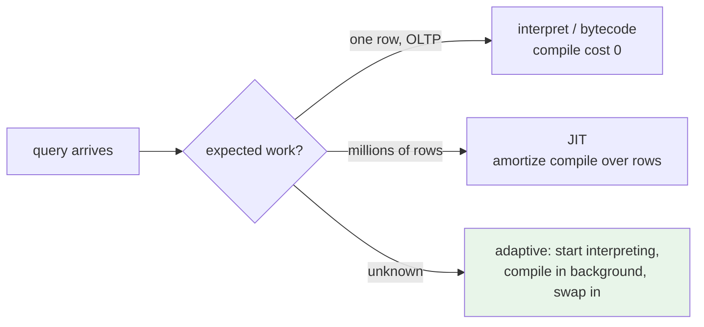

# Topic 19 — JIT & Query Compilation

The other answer to interpretation overhead. Topic 11 killed the
per-tuple interpreter with *batches* (vectorization); this topic
kills it with *compilation* — turn the query into machine code so
there is no interpreter left to amortize. HyPer made it famous,
Umbra made it fast to compile, SQLite has quietly shipped a bytecode
VM since 2000, and SuiteSparse:GraphBLAS JIT-compiles its semiring
kernels — which makes this FalkorDB home turf twice over (M19 JITs
Cypher expressions with cranelift).

## 1. The spectrum (and where each system sits)

```
 tree walker ──► bytecode VM ──► template/copy-patch ──► IR JIT ──► LLVM -O3
 (eval per      (SQLite VDBE,   (copy-and-patch,        (Umbra     (HyPer,
  AST node)      Postgres        OOPSLA'21)              Tidy       Postgres
                 ExprState)                              Tuples,    jit=on)
                                                         cranelift)
 compile: 0      ~0              ~µs                     ~100µs      ~10-100ms
 run:     1×     ~2-5×           ~10×                    ~10-30×     ~10-60×
```

Every step right buys execution speed with compilation latency.
The entire topic is that trade — and the reason Postgres's LLVM JIT
is *often a regression* (§5): it sits at the far right where compile
cost is milliseconds, gated by a planner cost heuristic that
routinely misfires.



Adaptive execution (ICDE'18) is the escape hatch Umbra ships:
never pay compile latency up front, never miss the JIT win on long
queries.

## 2. SQLite's VDBE — the bytecode VM that refuses to die

[`~/repos/sqlite/src/vdbe.c`](https://github.com/sqlite/sqlite) — one giant dispatch loop
(vdbe.c:1049 `switch( pOp->opcode )`), 199 `case OP_` opcodes, each
op a fixed struct (vdbeInt.h:55 `struct VdbeOp`: opcode + p1..p5
operands). `EXPLAIN SELECT ...` prints the program.

```
 SELECT a+1 FROM t WHERE b < 10;
   addr  opcode        p1  p2  p3
   0     Init          0   8
   1     OpenRead      0   2       ← cursor on table t
   2     Rewind        0   7
   3     Column        0   1   r1  ← b into register 1
   4     Ge            r1  6       ← if b >= 10 skip
   5     Column+Add    …           ← a+1 into result register
   6     ResultRow
   7     Next          0   3       ← loop
```

Why bytecode and not a tree walker? The flattened program is
*resumable* (a coroutine — OP_Yield at vdbe.c:1264 powers
`INSERT ... SELECT` without materializing), *inspectable*, and the
dispatch is one indirect branch per op instead of a virtual call
per AST node. Why not JIT? SQLite's queries touch a handful of rows
— column (a) of the flowchart above, compile cost can never
amortize. Guide: [reading-sqlite-vdbe.md](reading-sqlite-vdbe.md).

## 3. Produce/consume (Neumann VLDB'11) — compile the PIPELINE, not the operators

The paper's insight: iterator-model `next()` calls are the cost, so
don't compile operators that call each other — fuse each pipeline
into ONE tight loop where tuples stay in registers.

```
 σ → Γ → ⋈ plan          generated code (one pipeline):
                          for tuple in scan:          ← produce
 each operator gets         if pred(tuple):           ← σ consume
 produce()/consume();       ht.insert(tuple)          ← Γ consume
 codegen walks the        (pipeline breaker: hash table materializes;
 tree ONCE, emits          next pipeline starts a new loop)
 nested control flow
```

Data flows *upward through registers*, control flow is inverted
(push, not pull) — exactly topic 11's push-vs-pull, but the pushing
is done by generated code with zero interpretation. Guide:
[reading-neumann-vldb11.md](reading-neumann-vldb11.md).

## 4. Umbra's Tidy Tuples & copy-and-patch — attacking compile LATENCY

HyPer used LLVM and ate 10-100 ms compiles. Umbra's answer
(VLDBJ'21): a custom low-level IR designed for *single-pass*
lowering — the query translates to IR to machine code in one linear
sweep, ~100× faster compiles at ~70-80% of LLVM -O3 speed, with
LLVM kept as the top adaptive tier. Copy-and-patch (OOPSLA'21) goes
further: precompile a library of binary "stencils" (one per
operator/type combo, holes for constants), then "compilation" is
memcpy + patching holes — microseconds. Guide:
[reading-umbra-tidy-tuples.md](reading-umbra-tidy-tuples.md).

## 5. Postgres's LLVM JIT — a cautionary tale

[`~/repos/postgres/src/backend/jit/llvm/`](https://github.com/postgres/postgres) — expression + tuple-deform
JIT only (NOT whole-pipeline: the executor stays interpreted;
llvmjit_expr.c:80 `llvm_compile_expr` compiles `ExprState` step
arrays, emitting one basic block per step, llvmjit_expr.c:302-307).
Two LLJIT instances at opt0/opt3 (llvmjit.c:100-101). Gated by
`jit_above_cost` (planner.c:699-700) — a *planner cost estimate*
threshold. Failure mode: estimate says expensive, query is short,
you pay 50 ms of LLVM for a 5 ms query. That's why every Postgres
ops guide says "try jit=off". Guide:
[reading-postgres-jit.md](reading-postgres-jit.md).

## 6. GraphBLAS's JIT — compile the KERNEL, cache it forever

SuiteSparse takes a third road: the JIT unit is not a query but a
*kernel specialization* (semiring × types × sparsity formats).
`Source/jitifyer/GB_jitifyer.c` — encode the problem to a hash
(GB_encodify_mxm.c:55-59), look up an in-memory hash table
(GB_jitifyer.c:2119), fall back to an on-disk cache of compiled
`.so` files, fall back to invoking THE C COMPILER at runtime and
`dlopen`ing the result (GB_jitifyer.c:1565,1937). Compile once per
type-combo ever, not per query — amortization across the process
lifetime, not across rows. FalkorDB inherits this whole machinery.
Guide: [reading-graphblas-jit.md](reading-graphblas-jit.md).

## 7. And DuckDB has NO JIT — on purpose

The counter-argument, worth stating precisely: vectorization already
amortizes interpretation to ~nothing (topic 11's measured ~10-40×),
a JIT adds a compiler dependency + compile latency + a security
surface, and VLDB'18 ("Everything You Always Wanted to Know…")
measured compiled vs vectorized within ~2× of each other on most of
TPC-H — vectorized even *wins* on hash-join-heavy queries (better
memory parallelism from batched probes). JIT's clear wins: complex
*expressions* (compute-heavy scalar code) and data-centric loops
LLVM can keep in registers. Hence M19 JITs *expressions only* —
the eval.rs interpreter is the FalkorDB analogue of ExprState.

## 8. cranelift — the build tool

[`~/repos/cranelift-jit-demo/src/jit.rs`](https://github.com/bytecodealliance/cranelift-jit-demo) is the whole recipe (461
lines): JITBuilder/JITModule (:39-41), FunctionBuilder translates
AST→CLIF IR (:135, :189), then declare→define→finalize→pointer
(:69-90). Cranelift sits at Umbra's design point: fast single-pass
compiles (~10-100× faster than LLVM), decent code, pure Rust.
Guide: [reading-cranelift-jit-demo.md](reading-cranelift-jit-demo.md).

## Experiments (`experiments/`)

Three-way expression executor over f64 columns — the PLAN §19 bench:

| file | role |
|---|---|
| src/expr.rs | PROVIDED — `Expr` tree (Col/Const/Add/Mul/Lt/And) + seeded random generator |
| src/interp.rs | PROVIDED — AST-walking `eval(expr, row)` (the strawman) |
| src/vectorized.rs | PROVIDED — column-at-a-time batch eval (topic 11's answer) |
| src/jit.rs | **STUB** — cranelift: compile `Expr` → `fn(*const f64) -> f64` |
| src/bin/jit_bench.rs | PROVIDED — interpreter vs vectorized vs JIT, rows/s + compile µs, depth × rows sweep |

```bash
cd topics/19-jit/experiments
cargo test              # provided tests green; jit tests panic until implemented
cargo run --release --bin jit_bench
```

Predict before you run (notes.md): at which (depth, rows) does JIT
beat vectorized? Where does compile time drown it?

## M19 (capstone)

- [ ] cranelift JIT for Cypher expressions vs eval.rs interpreter
- [ ] fallback path (unsupported expr node → interpreter, never fail)
- [ ] compile-time budget heuristic — measured, not estimated
      (postgres's lesson: gate on *actual rows seen*, adaptive-style,
      not on a planner estimate)

## Reading order

1. reading-neumann-vldb11.md — the model
2. reading-sqlite-vdbe.md — the bytecode floor
3. reading-umbra-tidy-tuples.md — compile-latency war (+ copy-and-patch)
4. reading-postgres-jit.md — how it goes wrong in production
5. reading-graphblas-jit.md — kernel-grain JIT (FalkorDB's inheritance)
6. reading-cranelift-jit-demo.md — then implement the stub
