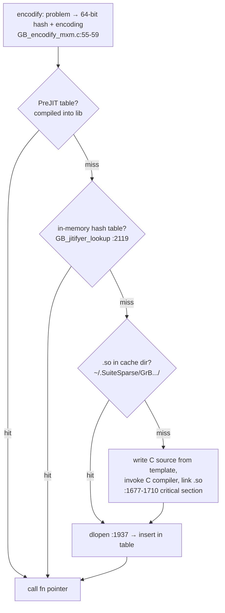

# GraphBLAS JIT: compile once per semiring, cache forever

The third grain of JIT. Postgres compiles per query; Umbra per
pipeline; GraphBLAS compiles per *kernel specialization* — a
(operation × semiring × types × sparsity formats) combination —
and caches it for the lifetime of the machine. FalkorDB runs on
this. Home turf. This chapter builds the design one decision at a
time — why the kernel space explodes, what the generic fallback
costs, the four-level cache ladder, and the cache key that makes it
all sound — then maps each decision into GB_jitifyer.c.

## The problem in one sentence

GraphBLAS lets users define their own types and operators, so the
space of possible kernels is *infinite* — thousands of precompiled
"factory" kernels still can't cover it — and the fallback
(function-pointer calls per matrix entry) is a per-element
interpreter ~10× slower than a specialized kernel.

## The concepts, step by step

### Step 1 — semirings make the kernel space combinatorial

GraphBLAS expresses graph algorithms as sparse linear algebra over a
**semiring** — a user-chosen pair of operations (an "add" monoid and
a "multiply" op) standing in for the usual +/× of matrix multiply:
BFS uses (min, first), shortest paths (min, +), plain reachability
(or, and). `GrB_mxm` (masked sparse matrix multiply, the workhorse)
must therefore run for *any* semiring over *any* types, in any
storage format:

```
 GrB_mxm(C, M, accum, semiring, A, B, desc)
 semiring = (add monoid × multiply op) over any types
 × A/B/C/M sparsity ∈ {sparse, hypersparse, bitmap, full}
 × masked/complemented, accum present/absent, ...

 ⇒ pre-compiling every combination: thousands of kernels ALREADY
   shipped (the "factory" kernels) and still nowhere near coverage
   — user-defined types/operators make it infinite.
```

Why it matters: no finite build can enumerate this space, so the
choice is between a slow generic path and generating code on demand.

### Step 2 — the generic fallback is this topic's villain at scalar grain

Without JIT, any non-factory combination falls back to a *generic*
kernel that calls the add and multiply ops through **function
pointers per entry** — every `z += a*b` in the inner loop becomes an
indirect call (~20 cycles) wrapping ~1 cycle of arithmetic. That is
a per-ELEMENT interpreter — the exact overhead this whole topic is
about, at the finest possible grain, and over a matrix with 10⁸
nonzeros it runs 10⁸ times. Question 1 quantifies the gap.

### Step 3 — the JIT grain: compile the specialization, not the query

GraphBLAS's move: when an uncovered combination arrives, write a
small C file that instantiates a kernel *template*
(Source/jit_kernels/) with `#define`s pinning the semiring, types,
and formats — then compile it into a real kernel, indistinguishable
from a factory one. The unit of compilation is the *kernel shape*,
not the user's query: two different graph queries using the same
semiring on the same formats share one kernel. That choice is what
makes an enormous one-time compile cost rational — Step 4's ladder
amortizes it across the lifetime of the machine, because the key
space is *small and stable* (type combos, not query texts).

### Step 4 — the load ladder: four caches, each with a longer lifetime

A kernel request walks down four levels, each slower and
longer-lived than the last — and every level's hit means the levels
below never run:



```rust
// the load ladder: four caches, each with a longer lifetime
fn get_kernel(problem: &Mxm) -> KernelFn {
    let (hash, enc) = encodify(problem);       // SHAPE only — no data values
    if let Some(f) = PREJIT.get(hash, &enc)   { return f; }  // in the binary
    if let Some(f) = TABLE.lookup(hash, &enc) { return f; }  // this process
    if let Some(so) = cache_dir_probe(hash)   { return dlopen_insert(so); }
    critical_section(|| {                      // first time EVER: pay the compiler
        write_c_from_template(&enc);           // #defines into jit_kernels/
        invoke_cc_and_link();                  // ~100 ms - 1 s, once per combo
        dlopen_insert(so_path(hash))
    })
}
```

Amortization horizon: the first `mxm` with a new semiring pays a
C-compiler invocation (~100 ms - 1 s); every later call in ANY
process pays a hash probe. Compare: postgres re-pays per query,
Umbra per query (µs), copy-and-patch per query (ns). GraphBLAS can
afford a huge one-time cost because the key space is small and
stable.

### Step 5 — the cache key: shape in, values out

A cache of compiled code is only sound if the key captures
*everything the generated code depends on* and nothing else. The
key (`GB_jit_encoding`, GB_encodify_mxm.c) is a packed bit-field:
kernel code, then `GB_enumify_mxm` packs semiring ops, types,
sparsity formats, mask/accum flags into `encoding->code` (:55-59).
User-defined ops add a name *suffix* (:16-18) since their semantics
aren't enumerable; hash = the lookup key, suffix disambiguates.
Crucially the key is the SHAPE with all data-dependent values
excluded — matrix contents, dimensions, sparsity *counts* don't
enter. This answers postgres-guide Q5, and getting it wrong in
either direction costs: include a value → cache miss per literal →
compile storm; omit a semantic input → wrong code served.

### Step 6 — the compiler is literally `cc`, and the cache feeds back into the build

No LLVM, no cranelift: write a `.c` file, shell out to the same
compiler that built the library (GB_jitifyer.c:59-71 stores
compiler+flags), `dlopen` the resulting `.so` (:1937 —
`dlopen`/`dlsym` being the OS's standard load-a-shared-library
mechanism). Crude and perfect for the amortization horizon: the C
optimizer gives factory-equal code, and the cache makes latency
irrelevant. The endgame is **PreJIT**: kernels harvested from a
JIT cache get compiled *into* the next binary release
(GB_jitifyer.c:299) — the JIT doubling as a build-time kernel
harvester, closing the loop between Step 4's slowest level and its
fastest.

### Step 7 — what transfers to M19/FalkorDB

- FalkorDB's Delta matrices + custom semirings ride exactly this
  machinery — a cold start on a new semiring stalls the first
  query; consider warming the JIT cache at startup.
- M19's Cypher-expression JIT should copy the *two-level cache*
  (in-memory hash + persist compiled artifacts keyed by expression
  shape) rather than postgres's compile-every-time.
- The generic-kernel fallback is M19's interpreter fallback: same
  contract — never fail, only be slower.

## Where each step lives in the code

| anchor | what it is | step |
|---|---|---|
| Source/generic/ | the function-pointer-per-entry fallback | 2 |
| Source/jit_kernels/ | the kernel templates the JIT instantiates | 3 |
| GB_jitifyer.c:1565-1576 | `GB_jitifyer_load` — the full ladder | 4 |
| Source/jitifyer/GB_jitifyer.c:21-40 | the static hash table of loaded kernels | 4 |
| GB_jitifyer.c:2119 | `GB_jitifyer_lookup` — hash-table probe | 4 |
| GB_jitifyer.c:1677-1710 | load2_worker — compile path under a critical section | 4 |
| GB_jitifyer.c:1937, 2050 | `GB_file_dlopen` — load the compiled .so | 4, 6 |
| Source/jitifyer/GB_encodify_mxm.c:16-59 | problem → `GB_jit_encoding` + hash | 5 |
| GB_jitifyer.c:48 | direct compile/link vs cmake toggle | 6 |
| GB_control.h + "PreJIT" | ahead-of-time compiled kernel table | 6 |

Reading order: `GB_jitifyer_load` (:1565) top to bottom — it IS the
Step 4 ladder — then `GB_encodify_mxm.c` for the key (Step 5), then
one template under `Source/jit_kernels/` next to its generic
counterpart under `Source/generic/` to see Steps 2–3 as a diff.

## Questions for notes.md

1. Find the generic mxm path (function-pointer per multiply-add,
   Source/generic/). Estimate its per-entry cost vs a JITed
   `z += a*b` on f64 (call + load fn ptr vs 1 FMA) — does the
   ratio match this topic's interpreter/compiled gaps (~10×)?
2. Why is the critical section (:1677-1710) around compile+insert
   only, with lookup lock-free-ish before it — and what duplicate
   work can two threads still do (both compile; one insert wins —
   benign, same as Gunrock's lost CAS)?
3. The hash table is process-global and never evicts
   (GB_jitifyer.c:24-40). Why is unbounded growth fine here but
   would not be for a query-text-keyed cache (bounded key space —
   count it for FalkorDB's actual semiring usage)?
4. PreJIT (:299): kernels harvested from the JIT cache get compiled
   into the library. What's the copy-and-patch analogy (stencils =
   AOT-compiled parametrized kernels), and where do the two differ
   (holes patched at runtime vs full specialization)?
5. For M19: design the Cypher expression cache key. Which parts of
   `WHERE n.age > $p AND n.name = 'x'` are shape vs parameter, and
   what does getting this wrong cost (constant folded in → cache
   miss per literal value → compile storm)?

## References

**Code**
- [GraphBLAS](https://github.com/DrTimothyAldenDavis/GraphBLAS) —
  `Source/jitifyer/` (GB_jitifyer.c is the machine,
  GB_encodify_mxm.c the cache key) and `Source/jit_kernels/` (the
  templates the JIT instantiates); `GB_control.h` for the PreJIT
  table
