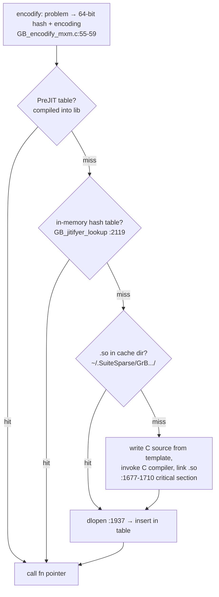

# Reading guide — SuiteSparse:GraphBLAS JIT (`~/repos/GraphBLAS/Source/jitifyer/`)

The third grain of JIT. Postgres compiles per query; Umbra per
pipeline; GraphBLAS compiles per *kernel specialization* — a
(operation × semiring × types × sparsity formats) combination —
and caches it for the lifetime of the machine. FalkorDB runs on
this. Home turf.

## Anchor map

| anchor | what it is |
|---|---|
| Source/jitifyer/GB_jitifyer.c:21-40 | the static hash table of loaded kernels |
| GB_jitifyer.c:2119 | `GB_jitifyer_lookup` — hash-table probe |
| GB_jitifyer.c:1565-1576 | `GB_jitifyer_load` — the full ladder |
| GB_jitifyer.c:1677-1710 | load2_worker — compile path under a critical section |
| GB_jitifyer.c:1937, 2050 | `GB_file_dlopen` — load the compiled .so |
| Source/jitifyer/GB_encodify_mxm.c:16-59 | problem → `GB_jit_encoding` + hash |
| GB_jitifyer.c:48 | direct compile/link vs cmake toggle |
| Source/jit_kernels/ | the kernel templates the JIT instantiates |
| GB_control.h + "PreJIT" | ahead-of-time compiled kernel table |

## 1. Why a kernel JIT at all (the combinatorial explosion)

```
 GrB_mxm(C, M, accum, semiring, A, B, desc)
 semiring = (add monoid × multiply op) over any types
 × A/B/C/M sparsity ∈ {sparse, hypersparse, bitmap, full}
 × masked/complemented, accum present/absent, ...

 ⇒ pre-compiling every combination: thousands of kernels ALREADY
   shipped (the "factory" kernels) and still nowhere near coverage
   — user-defined types/operators make it infinite.
```

Without JIT, any non-factory combination falls back to a *generic*
kernel calling function pointers per entry — a per-ELEMENT
interpreter, the exact overhead this whole topic is about, at the
scalar grain. Question 1 quantifies the gap.

## 2. The load ladder (GB_jitifyer_load, :1565)



Amortization horizon: the first `mxm` with a new semiring pays a
C-compiler invocation (~100 ms - 1 s); every later call in ANY
process pays a hash probe. Compare: postgres re-pays per query,
Umbra per query (µs), copy-and-patch per query (ns). GraphBLAS can
afford a huge one-time cost because the key space is *small and
stable* — type combos, not query texts.

## 3. The encoding (GB_encodify_mxm.c)

The cache key: a packed bit-field struct (`GB_jit_encoding`) —
kernel code, then `GB_enumify_mxm` packs semiring ops, types,
sparsity formats, mask/accum flags into `encoding->code`
(:55-59). User-defined ops add a name *suffix* (:16-18) since
their semantics aren't enumerable. Hash = the lookup key; the
suffix disambiguates. This answers postgres-guide Q5: the cache
key is the SHAPE with all data-dependent values excluded.

## 4. Compilation is literally `cc` (+ dlopen)

No LLVM, no cranelift: write a `.c` file instantiating a template
from Source/jit_kernels/ with `#define`s, shell out to the same
compiler that built the library (GB_jitifyer.c:59-71 stores
compiler+flags), `dlopen` the result (:1937). Crude and perfect
for the amortization horizon: the C optimizer gives factory-equal
code, and the cache makes latency irrelevant. There's also PreJIT:
ship the accumulated cache *compiled into* the next binary release
(GB_jitifyer.c:299) — JIT as a build-time kernel harvester.

## 5. What transfers to M19/FalkorDB

- FalkorDB's Delta matrices + custom semirings ride exactly this
  machinery — a cold start on a new semiring stalls the first
  query; consider warming the JIT cache at startup.
- M19's Cypher-expression JIT should copy the *two-level cache*
  (in-memory hash + persist compiled artifacts keyed by expression
  shape) rather than postgres's compile-every-time.
- The generic-kernel fallback is M19's interpreter fallback: same
  contract — never fail, only be slower.

## Questions for notes.md

1. Find the generic mxm path (function-pointer per multiply-add,
   Source/generic/). Estimate its per-entry cost vs a JITed
   `z += a*b` on f64 (call + load fn ptr vs 1 FMA) — does the
   ratio match this topic's interpreter/compiled gaps (~10×)?
2. Why is the critical section (:1677-1710) around compile+insert
   only, with lookup lock-free-ish before it — and what duplicate
   work can two threads still do (both compile; one insert wins —
   benign, same as Gunrock's lost CAS)?
3. The hash table is process-global and never evicts
   (GB_jitifyer.c:24-40). Why is unbounded growth fine here but
   would not be for a query-text-keyed cache (bounded key space —
   count it for FalkorDB's actual semiring usage)?
4. PreJIT (:299): kernels harvested from the JIT cache get compiled
   into the library. What's the copy-and-patch analogy (stencils =
   AOT-compiled parametrized kernels), and where do the two differ
   (holes patched at runtime vs full specialization)?
5. For M19: design the Cypher expression cache key. Which parts of
   `WHERE n.age > $p AND n.name = 'x'` are shape vs parameter, and
   what does getting this wrong cost (constant folded in → cache
   miss per literal value → compile storm)?
