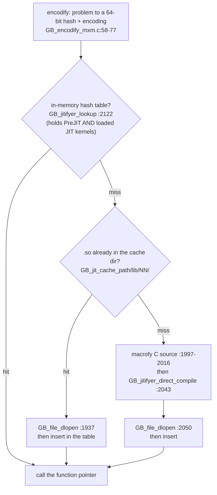

# GraphBLAS JIT: compile once per semiring, cache forever

The third grain of JIT. Postgres compiles per query; Umbra per
pipeline; GraphBLAS compiles per *kernel specialization* — an
(operation × semiring × types × sparsity formats) combination — and
caches it for the lifetime of the machine. FalkorDB runs on this.
Home turf. This chapter builds the design one decision at a time —
why the kernel space explodes, what the generic fallback actually
costs, the cache ladder, the cache key that makes it sound, and the
locking that makes it thread-safe — then maps each decision into
GB_jitifyer.c.

**Version.** All anchors are `DrTimothyAldenDavis/GraphBLAS` at the
pin in `resources/codebases.md`, **`1fd5475`** (a v10-era tree, with
the 32/64-bit integer-width flags of Step 5 and a
`Source/jitifyer/GB_jitifyer.c` of 2,780 lines). The JIT is recent
and the tree moves; four anchors in the previous version of this
guide were off, and Step 7's table records each correction. Fetch
any of them with
`python3 tools/pinned-source.py show GraphBLAS Source/jitifyer/GB_jitifyer.c -r 1626:1674`.

## The problem in one sentence

GraphBLAS lets users define their own types and operators, so the
space of possible kernels is *unbounded* — thousands of precompiled
"factory" kernels still cannot cover it — and the fallback calls
the user's add and multiply through function pointers **once per
matrix entry**, which is a per-element interpreter sitting in the
innermost loop of every graph algorithm.

## The concepts, step by step

### Step 1 — semirings make the kernel space combinatorial

> **In:** a `GrB_mxm` call — the masked sparse matrix multiply that
> is GraphBLAS's workhorse. **Out:** the size of the space that
> would have to be precompiled, and hence the reason a JIT is
> structurally necessary here rather than merely fast.

A **semiring** is a user-chosen pair of operations — an "add"
monoid and a "multiply" op — standing in for the usual `+`/`×` of
matrix multiply. BFS uses (min, first); shortest paths (min, +);
plain reachability (or, and). A **monoid** is an associative
operator with an identity, which is what lets the "add" side be
reassociated across threads. `GrB_mxm` must run for *any* semiring
over *any* types, in any storage format:

```
 GrB_mxm(C, M, accum, semiring, A, B, desc)

   semiring   = (add monoid × multiply op) over any operand types
   × C,M,A,B sparsity ∈ {sparse, hypersparse, bitmap, full}
   × mask structural/valued, complemented or not
   × operand types iso or not
   × integer index widths 32 or 64 bit, independently for
     C->p, C->h, C->i        ← new in the v10-era tree; see Step 5

 Count just the format axis for four matrices:
   4 sparsity formats ^ 4 matrices = 256 combinations
 …before a single semiring or type is chosen. GraphBLAS ships
 thousands of precompiled "factory" kernels and that is still
 nowhere near coverage — and user-defined types and operators make
 the space unbounded, because a user can define a type the library
 has never seen.
```

No finite build can enumerate this space. So the choice is between
a slow generic path (Step 2) and generating code on demand
(Step 3). That is the whole topic, arriving from a completely
different direction than a query compiler does.

### Step 2 — the generic fallback is this topic's villain at scalar grain

> **In:** Step 1's uncovered combination. **Out:** the measured
> shape of the penalty — an indirect call *plus* an untyped memory
> round-trip per matrix entry — which is the number the JIT has to
> beat.

Without a JIT, a non-factory combination falls back to a **generic**
kernel. The previous version of this guide pointed at
`Source/generic/` for it; at this pin **`Source/generic/` contains
only `GB_generic.h`**. The real generic mxm path is a set of 23-line
shims in `Source/mxm/GB_AxB_saxpy3_generic_*.c` over one 285-line
body:

```c
// GraphBLAS/Source/mxm/factory/GB_AxB_saxpy_generic_method.c — the
// function pointers pulled out of the semiring once, 95-110
  95	    GrB_BinaryOp mult = semiring->multiply ;
  96	    GrB_Monoid add = semiring->add ;
// ... 97-99: asserts that the ztypes agree ...
 100	    GxB_binary_function fmult = mult->binop_function ;    // NULL if positional
 101	    GxB_index_binary_function fmult_idx = mult->idxbinop_function ;
 102	    GxB_binary_function fadd  = add->op->binop_function ;
 103	    GB_Opcode opcode = mult->opcode ;
 104
 105	    size_t csize = C->type->size ;
 106	    size_t asize = A_is_pattern ? 0 : A->type->size ;
 107	    size_t bsize = B_is_pattern ? 0 : B->type->size ;
 108
 109	    size_t xsize = mult->xtype->size ;
 110	    size_t ysize = mult->ytype->size ;
```

Lines 100 and 102 are the villain: `fmult` and `fadd` are function
*pointers*, resolved from the semiring at run time. Lines 105-110
are the second half of the villain — the sizes are runtime values
too, so operands move as untyped bytes. Then the inner loop is
built out of macros that call through those pointers:

```c
// GraphBLAS/Source/mxm/factory/GB_AxB_saxpy_generic_method.c — the
// per-entry operations, as macros over function pointers, 207-217 and 250
 207	    // Cx [p] += Hx [i]
// ... 208: #undef ...
 209	    #define GB_CIJ_GATHER_UPDATE(p,i) fadd (GB_CX (p), GB_CX (p), GB_HX (i))
 210
 211	    // Cx [p] += t
// ... 212: #undef ...
 213	    #define GB_CIJ_UPDATE(p,t) fadd (GB_CX (p), GB_CX (p), t)
 214
 215	    // Hx [i] += t
// ... 216: #undef ...
 217	    #define GB_HX_UPDATE(i,t) fadd (GB_HX (i), GB_HX (i), t)
// ... 219-249: generic C/Z type macros, then the flipxy variants ...
 250	        #define GB_MULT(t, aik, bkj, i, k, j) fmult (t, bkj, aik)
```

**Correction of the cost model.** The previous version said the
fallback is "an indirect call (~20 cycles) wrapping ~1 cycle of
arithmetic". Look at line 209 again: `fadd` takes three `void *`
arguments — destination, and two sources — because the types are
not known at compile time. So each multiply-add is:

```
 Per entry, GENERIC path (lines 209 / 250):
   1  indirect call through fmult          (unpredictable target,
                                             no inlining possible)
   +  operands passed BY ADDRESS as void*  → the value must be in
                                             memory, not a register
   1  indirect call through fadd
   +  another void* round-trip
   +  a typecast step if xtype != A->type  (lines 109-110 exist
                                             precisely for this)

 Per entry, JIT/factory path:
   the semiring is #define'd, so `fadd`/`fmult` become the literal
   operators, the accumulator stays in a register across the loop,
   and the whole thing is one FMA the compiler can vectorize.

 The gap is therefore NOT "call overhead vs one FLOP". It is
 "call + forced memory round-trip + no vectorization" vs "one
 register-resident FMA in an unrolled loop". Question 1 asks you
 to measure it rather than accept either estimate.
```

Over a matrix with 10⁸ nonzeros that runs 10⁸ times. This is the
exact overhead the whole topic is about, at the finest possible
grain — and note the parallel with topic 19's own measured lanes:
`interp` walks a tree and dispatches per node
(`experiments/src/interp.rs:8-16`), the generic kernel dispatches
per matrix entry. Same shape, different unit.

### Step 3 — the JIT grain: compile the specialization, not the query

> **In:** Step 2's per-entry dispatch. **Out:** the *unit of
> compilation* — a decision that determines how much caching can
> buy, and the reason a whole C-compiler invocation is affordable
> here and nowhere else in this topic.

GraphBLAS's move: when an uncovered combination arrives, write a
small C file that instantiates a kernel *template* with `#define`s
pinning the semiring, types and formats, then compile it into a
real kernel, indistinguishable from a factory one. You can read the
source generator doing exactly that:

```c
// GraphBLAS/Source/jitifyer/GB_jitifyer.c — writing the kernel's
// C source into the cache directory, 1997-2016
1997	        snprintf (GB_jit_temp, GB_jit_temp_allocated, "%s/c/%02x/%s.%s",
1998	            GB_jit_cache_path, bucket, kernel_name, kernel_filetype) ;
1999	        FILE *fp = fopen (GB_jit_temp, "w") ;
// ... 2000-2002: if the open succeeded ...
2003	            GB_macrofy_preface (fp, kernel_name,
2004	                GB_jit_C_preface, GB_jit_CUDA_preface, kcode,
2005	                encoding->major, encoding->minor) ;
2006	            // macrofy the kernel operators, types, and matrix formats
2007	            GB_macrofy_family (fp, family, encoding->code, encoding->kcode,
2008	                semiring, monoid, op, type1, type2, type3) ;
2009	            // #include the kernel, renaming it for the PreJIT
2010	            fprintf (fp, "#ifndef GB_JIT_RUNTIME\n"
2011	                         "#define GB_jit_kernel %s\n"
2012	                         "#define GB_jit_query  %s_query\n"
2013	                         "#endif\n"
2014	                         "#include \"template/GB_jit_kernel_%s.%s\"\n",
2015	                         kernel_name, kernel_name, kname,
2016	                         kernel_filetype) ;
```

Line 2007 is the whole idea — "macrofy the kernel operators, types,
and matrix formats" writes the `#define`s — and line 2014
`#include`s the template that consumes them. The templates live in
**`Source/jit_kernels/template/`** (about sixty
`GB_jit_kernel_*.c` files; `Source/jit_kernels/include/` holds two
headers). The previous version of this guide cited
`Source/jit_kernels/` without the `template/`.

The unit of compilation is the *kernel shape*, not the user's
query: two completely different graph algorithms using the same
semiring on the same formats share one kernel. That choice is what
makes an enormous one-time compile cost rational — Step 4's ladder
amortizes it across the lifetime of the machine, because the key
space is small and stable (type combinations, not query texts).

### Step 4 — the load ladder: three runtime levels, each longer-lived

> **In:** Step 3's "generate on demand". **Out:** the lookup path a
> kernel request actually walks, with the cost and lifetime of each
> level named — the thing you must know to reason about a cold
> start.

**Structural correction.** The previous version described "four
levels: PreJIT table, in-memory hash table, on-disk `.so`, C
compiler". At this pin there are **three** levels at run time,
because **PreJIT kernels are inserted into the same in-memory hash
table at initialization**, not probed separately:

```c
// GraphBLAS/Source/jitifyer/GB_jitifyer.c — PreJIT harvest at init:
// the AOT kernels go into the SAME table, 413 and 596-617
 413	    GB_prejit (&nkernels, &Kernels, &Queries, &Names) ;
 414
 415	    for (int k = 0 ; k < nkernels ; k++)
// ... 416-595: recover each kernel's name, encoding, hash and suffix ...
 597	        //------------------------------------------------------------------
 598	        // make sure this kernel is not a duplicate
 599	        //------------------------------------------------------------------
 600
 601	        int64_t k1 = -1, kk = -1 ;
 602	        if (GB_jitifyer_lookup (hash, encoding, suffix, &k1, &kk) != NULL)
// ... 603-606: duplicate: ignore it ...
 609	        // insert the PreJIT kernel in the hash table
// ... 610-611 ...
 612	        if (!GB_jitifyer_insert (hash, encoding, suffix, NULL, dl_function, k))
```

Line 612 is decisive: a PreJIT kernel is `GB_jitifyer_insert`ed
into `GB_jit_table` exactly like a JIT-compiled one, distinguished
only by a non-negative `prejit_index`. So one hash probe covers
both. The real ladder:


```mermaid
flowchart TD
    E["encodify: problem to a 64-bit hash + encoding<br/>GB_encodify_mxm.c:58-77"] --> H{"in-memory hash table?<br/>GB_jitifyer_lookup :2122<br/>(holds PreJIT AND loaded JIT kernels)"}
    H -->|hit| RUN[call the function pointer]
    H -->|miss| D{".so already in the cache dir?<br/>GB_jit_cache_path/lib/NN/"}
    D -->|hit| DL["GB_file_dlopen :1937<br/>then insert in the table"] --> RUN
    D -->|miss| CC["macrofy C source :1997-2016<br/>then GB_jitifyer_direct_compile :2043"] --> DL2["GB_file_dlopen :2050<br/>then insert"] --> RUN
```

The probe itself is open addressing with linear probing, and it is
worth reading because it shows exactly what the key compares:

```c
// GraphBLAS/Source/jitifyer/GB_jitifyer.c — GB_jitifyer_lookup's probe
// loop; the function is 2122-2171, this is its body, 2146-2167
2146	    for (uint64_t k = hash ; ; k++)
2147	    {
2148	        k = k & GB_jit_table_bits ;
2149	        GB_jit_entry *e = &(GB_jit_table [k]) ;
2150	        if (e->dl_function == NULL)
2151	        {
2152	            // found an empty entry, so the entry is not in the table
2153	            return (NULL) ;
2154	        }
2155	        else if (e->hash == hash &&
2156	            e->encoding.code == encoding->code &&
2157	            e->encoding.kcode == encoding->kcode &&
2158	            e->encoding.suffix_len == suffix_len &&
2159	            (builtin || (memcmp (e->suffix, suffix, suffix_len) == 0)))
2160	        {
// ... 2161-2166: read prejit_index atomically, hand back k ...
2167	            return (e->dl_function) ;
2168	        }
```

Lines 2155-2159 are the correctness condition of the entire cache:
a hash match is not enough — `code`, `kcode`, `suffix_len` and (for
user-defined semirings) the actual name bytes must all agree. The
hash narrows; the encoding decides. Note there is no eviction
anywhere in this loop or this file: line 2150's empty slot is the
only miss condition, so the table only grows.

The table itself:

```c
// GraphBLAS/Source/jitifyer/GB_jitifyer.c — the process-global table, 24-42
  24	// The hash table is static and shared by all threads of the user application.
  25	// It is only visible inside this file.  It starts out empty (NULL).  Its size
  26	// is either zero (at the beginning), or a power of two (of size
  27	// GB_JITIFIER_INITIAL_SIZE or more).
// ... 29-34: the strings build filenames and compile commands; a smaller
// ...        table under GBCOVER ...
  35	#define GB_JITIFIER_INITIAL_SIZE (32*1024)
// ... 36-37 ...
  38	static GB_jit_entry *GB_jit_table = NULL ;
  39	static int64_t  GB_jit_table_size = 0 ;  // always a power of 2
  40	static uint64_t GB_jit_table_bits = 0 ;  // hash mask (0xFFFF if size is 2^16)
  41	static int64_t  GB_jit_table_populated = 0 ;
  42	static size_t   GB_jit_table_allocated = 0 ;
```

Line 35's 32×1024 = 32,768 initial slots, and line 40's power-of-two
mask is what makes line 2148's `k & GB_jit_table_bits` a single AND
instead of a modulo. Question 3 is about why never evicting is fine
here.

Now the amortization, with the levels priced:

```
 Cost per level, order of magnitude:
   hash probe (2146-2167)          ~10-100 ns   — a few cache lines
   dlopen an existing .so (:1937)  ~100 µs-1 ms — an OS operation
   write C + fork a compiler + link (:1997-2050)
                                   ~100 ms - 1 s — a PROCESS

 Ratio between the extremes: 1 s / 50 ns = 2 × 10^7.
 A twenty-million-fold cost difference is only survivable if the
 expensive level is hit essentially never. Suppose an application
 uses 20 distinct semiring/format combinations and makes 10^6 mxm
 calls:
   compiles           = 20   × 0.5 s   = 10 s   (once, ever —
                                                 the .so persists
                                                 across processes)
   probes             = 10^6 × 50 ns   = 0.05 s
   amortized compile per call = 10 s / 10^6 = 10 µs
 …and on the SECOND run of the program the compile term is zero,
 because level 2 (the on-disk .so) survives process exit.

 Compare the other systems in this topic:
   PostgreSQL   re-pays LLVM per query          (ms, every time)
   Umbra        re-pays Flying Start per query  (0.21 ms geomean)
   copy-and-patch re-pays a memcpy per query    (178 µs for TPC-H Q5)
   GraphBLAS    pays a C compiler once per SHAPE, forever
 GraphBLAS can afford the most expensive compiler in the topic
 precisely because its denominator is the largest.
```

### Step 5 — the cache key: shape in, values out

> **In:** Step 4's ladder, which is only as sound as its key.
> **Out:** the exact contents of that key, and the two ways of
> getting it wrong — the reusable rule for any code cache,
> including M19's.

A cache of compiled code is sound only if the key captures
*everything the generated code depends on* and nothing else. Here
is the whole key construction:

```c
// GraphBLAS/Source/jitifyer/GB_encodify_mxm.c — problem to (encoding, hash);
// the file is 79 lines, this is its body, 46-77
  46	    if (semiring->hash == UINT64_MAX)
  47	    {
  48	        // cannot JIT this semiring
  49	        memset (encoding, 0, sizeof (GB_jit_encoding)) ;
  50	        (*suffix) = NULL ;
  51	        return (UINT64_MAX) ;
  52	    }
// ... 54-57: banner — "primary encoding of the problem" ...
  58	    GB_encodify_kcode (encoding, kcode) ;
  59	    GB_enumify_mxm (&encoding->code, C_iso, C_in_iso, C_sparsity, ctype,
  60	        Cp_is_32, Cj_is_32, Ci_is_32, M, Mask_struct, Mask_comp, semiring,
  61	        flipxy, A, B) ;
// ... 63-66: banner — "determine the suffix and its length" ...
  67	    // if hash is zero, it denotes a builtin semiring
  68	    uint64_t hash = semiring->hash ;
  69	    encoding->suffix_len = (hash == 0) ? 0 : semiring->name_len ;
  70	    (*suffix) = (hash == 0) ? NULL : semiring->name ;
// ... 72-75: banner — "compute the hash of the entire problem" ...
  76	    hash = hash ^ GB_jitifyer_hash_encoding (encoding) ;
  77	    return ((hash == 0 || hash == UINT64_MAX) ? GB_MAGIC : hash) ;
```

**Corrections.** The previous version anchored this at `:55-59` and
`:16-18`; the real encoding call is **`:58-61`**, the suffix logic
is **`:69-70`**, and the final hash is **`:76-77`** (`:16-18` is a
parameter declaration in the signature). It also listed `accum`
among the enumified inputs — **there is no `accum` in this key**.
Read the argument list at lines 59-61 and take it literally:

```
 What GB_enumify_mxm actually packs into encoding->code (59-61):
   C_iso, C_in_iso     — is C a single repeated value?
   C_sparsity, ctype   — output format and type
   Cp_is_32, Cj_is_32, Ci_is_32
                       — the INTEGER WIDTH of C's pointer, hyperlist
                         and index arrays, independently 32 or 64 bit
   M, Mask_struct, Mask_comp
                       — mask presence, structural-vs-valued,
                         complemented
   semiring, flipxy    — the operators, and whether x/y are swapped
   A, B                — operand formats and types

 Plus, separately: kcode (which kernel family) at :58, and for
 user-defined semirings a NAME SUFFIX at :69-70.

 Why the three integer-width flags belong in the key: a kernel
 compiled for 32-bit C->i indexes a different array type than one
 compiled for 64-bit. Omit them and you serve a kernel that
 misreads memory. This is a v10-era addition and a perfect example
 of the rule below — a NEW code-generation input had to become a
 NEW key component in the same commit.
```

Two more mechanisms in those 30 lines:

- **Line 46**: `semiring->hash == UINT64_MAX` marks a semiring that
  *cannot* be JIT'd (e.g. a user operator with no stringified
  definition), and the function returns `UINT64_MAX` — a sentinel
  the loader checks before doing anything else, sending the call
  straight to Step 2's generic path. The JIT's failure mode is
  slowness, never wrongness.
- **Lines 68-70**: built-in semirings have `hash == 0` and need no
  suffix; user-defined ones carry their name, because their
  *semantics* are not enumerable in a bit-field. The hash locates a
  bucket; the suffix disambiguates within it — which is why line
  2159 `memcmp`s the name.

The rule, stated so it transfers: **the key is the SHAPE, with all
data-dependent values excluded.** Matrix contents, dimensions and
nonzero counts do not enter. Getting it wrong costs in both
directions:

```
 include a VALUE in the key    → a distinct key per literal
                               → a cache miss per literal
                               → a COMPILE STORM (100 ms each)
 omit a SEMANTIC input         → a kernel compiled for one shape
                               → served for another
                               → WRONG ANSWERS, silently

 The asymmetry matters: the first failure is a performance
 disaster you will notice in a profile; the second is a
 correctness disaster you may not notice at all. When unsure,
 over-include — a spurious key component costs recompiles, a
 missing one costs correctness.
```

This is also the answer to the postgres guide's question about what
a query-compilation cache should be keyed on.

### Step 6 — the compiler is literally `cc`, and the locking is coarse

> **In:** Step 4's slowest level. **Out:** how the compile actually
> happens, and — correcting the previous version — what
> concurrency guarantee surrounds it.

No LLVM, no cranelift: write a `.c` file (Step 3's `:1997-2016`),
shell out to the same compiler that built the library, `dlopen` the
resulting `.so`. The compiler and its flags are held as strings:

```c
// GraphBLAS/Source/jitifyer/GB_jitifyer.c — the toolchain, as strings, 59-72
  59	// name of the C compiler:
  60	static char    *GB_jit_C_compiler = NULL ;
// ... 61-62 ...
  63	// flags for the C compiler:
  64	static char    *GB_jit_C_flags = NULL ;
// ... 65-66 ...
  67	// link flags for the C compiler:
  68	static char    *GB_jit_C_link_flags = NULL ;
// ... 69-70 ...
  71	// libraries to link against when using the direct compile/link:
  72	static char    *GB_jit_C_libraries = NULL ;
```

and there are three ways to invoke it, selected at `:2029-2044`:
`GB_jitifyer_nvcc_compile` for CUDA kernels (`:2032`),
`GB_jitifyer_cmake_compile` if `GB_jit_use_cmake` (`:2038`), else
`GB_jitifyer_direct_compile` (`:2043`). The cmake toggle is at
`:44-49`, and line 48's comment reads "otherwise, default is to
skip cmake and compile directly" — MSVC is the only platform that
requires cmake (`:45-46`). Then `GB_file_dlopen` at `:2050` loads
the result, mirroring the fast-path `dlopen` at `:1937`.

Crude, and perfect for the amortization horizon: the C optimizer
gives factory-equal code, and Step 4's arithmetic makes the latency
irrelevant.

**Concurrency correction.** The previous version claimed the
critical section wraps "compile+insert only, with lookup
lock-free-ish before it", and asked in question 2 about two threads
both compiling with one insert winning benignly. **That is false at
this pin.** Read the entry point:

```c
// GraphBLAS/Source/jitifyer/GB_jitifyer.c — GB_jitifyer_load's locking
// discipline; the function is 1576-1674, this is its tail, 1630-1673
1630	    if ((GB_jit_control == GxB_JIT_RUN) &&
1631	        (family != GB_jit_user_op_family) &&
1632	        (family != GB_jit_user_type_family))
1633	    {
// ... 1635-1638: banner ...
1639	        int64_t k1 = -1, kk = -1 ;
1640	        (*dl_function) = GB_jitifyer_lookup (hash, encoding, suffix, &k1, &kk) ;
// ... 1641-1644: k1 >= 0 means an unchecked PreJIT kernel — fall through
// ...            to the critical section to validate it ...
1645	        else if ((*dl_function) != NULL)
1646	        {
1647	            // found the kernel in the hash table
1648	            return (GrB_SUCCESS) ;
1649	        }
// ... 1650-1659: JIT is set to 'run', so nothing may be compiled or
// ...            loaded: fall back to the generic kernel ...
1660	    }
// ... 1662-1665: banner — "do the rest inside a critical section" ...
1666	    GB_OPENMP_LOCK_SET (1)
1667	    {
1668	        info = GB_jitifyer_load2_worker (dl_function, family, kname, hash,
1669	            encoding, suffix, semiring, monoid, op, type1, type2, type3) ;
1670	    }
1671	    GB_OPENMP_LOCK_UNSET (1)
```

The lock-free probe at line 1640 happens **only** when
`GB_jit_control == GxB_JIT_RUN` (line 1630) — a mode in which
nothing may be compiled or loaded at all, so the fast path is
"already-loaded kernels only, everything else goes generic"
(lines 1650-1659). In the **default** `GxB_JIT_ON` mode, control
falls straight past line 1660 and *the entire load — hash lookup
included — runs inside the OpenMP lock at 1666-1671*. So two
threads cannot both compile: the second blocks, then finds the
kernel already in the table when `GB_jitifyer_load2_worker` probes
at `:1710`. Coarse, serialized, and correct — the opposite of the
benign-race story.

One more failure-handling detail worth carrying away: if the
compile fails, `:2060` sets `GB_jit_control = GxB_JIT_LOAD`, i.e.
the JIT **disables its own compile level** rather than retrying a
broken toolchain on every subsequent call. A cache whose expensive
level can fail needs exactly this.

Finally, the endgame is **PreJIT**: kernels harvested from a JIT
cache get compiled *into* the next build of the library, and at
startup `GB_prejit` (`:413`) inserts them into the same hash table
(Step 4). The JIT doubles as a build-time kernel harvester, closing
the loop between the ladder's slowest level and its fastest. The
old anchor for this, `:299`, is a comment inside an `#else /*
NJIT */` block.

### Step 7 — what transfers to M19/FalkorDB

> **In:** Steps 2-6. **Out:** three design decisions for our own
> JIT, each with the GraphBLAS mechanism it is copied from.

- **Warm the cache at startup.** FalkorDB's Delta matrices and
  custom semirings ride exactly this machinery, so a cold start on
  a new semiring stalls the *first* query by a full compiler
  invocation (Step 4's ~100 ms-1 s). Since the key space is small
  and enumerable (Step 1), you can issue tiny dummy `mxm` calls at
  startup for the combinations you know you use, and pay it before
  anyone is watching.
- **Copy the two-level cache, not postgres's compile-every-time.**
  In-memory hash keyed by expression *shape*, plus persisted
  compiled artifacts so a restart does not re-pay. GraphBLAS's
  on-disk `.so` level (`:1935-1937`) is what makes the second run
  of a program free; postgres has no equivalent, which is Step 4's
  cost table in one sentence.
- **The generic kernel is M19's interpreter fallback.** Same
  contract: never fail, only be slower. GraphBLAS enforces it
  structurally — `GB_encodify_mxm.c:46-52` returns `UINT64_MAX` for
  anything un-JIT-able and the loader sends it generic, and
  `GB_jitifyer.c:2060` self-disables the compiler after a failure.
  Our `Expr` JIT needs the same: any node it cannot compile routes
  the whole expression to `interp`, and a cranelift error is a
  fallback, not a query error.

## Where each step lives in the code

All anchors verified at GraphBLAS `1fd5475`.

| anchor | what it is | step |
|---|---|---|
| `Source/mxm/GB_AxB_saxpy3_generic_*.c` | the generic mxm shims (23 lines each) | 2 |
| `Source/mxm/factory/GB_AxB_saxpy_generic_method.c:100-102` | `fmult`/`fmult_idx`/`fadd` — the function pointers | 2 |
| `…GB_AxB_saxpy_generic_method.c:105-110` | the runtime type sizes that force the `void*` round-trip | 2 |
| `…GB_AxB_saxpy_generic_method.c:209,213,217,250` | the per-entry macros that call through them | 2 |
| `Source/jit_kernels/template/` | ~60 `GB_jit_kernel_*.c` templates the JIT instantiates | 3 |
| `Source/jitifyer/GB_jitifyer.c:1997-2016` | macrofy the `#define`s and `#include` the template | 3 |
| `Source/jitifyer/GB_jitifyer.c:24-42` | the process-global hash table; 32K initial slots at `:35` | 4 |
| `Source/jitifyer/GB_jitifyer.c:413,596-617` | PreJIT harvest — inserted into the *same* table | 4, 6 |
| `Source/jitifyer/GB_jitifyer.c:1576-1674` | `GB_jitifyer_load` — the ladder's entry point | 4 |
| `Source/jitifyer/GB_jitifyer.c:2122-2171` | `GB_jitifyer_lookup` — open-addressed probe; the key comparison is `:2155-2159` | 4, 5 |
| `Source/jitifyer/GB_jitifyer.c:1935-1937` | on-disk `.so` probe + `GB_file_dlopen` | 4 |
| `Source/jitifyer/GB_jitifyer.c:2029-2050` | nvcc / cmake / direct compile, then `dlopen` | 6 |
| `Source/jitifyer/GB_jitifyer.c:1630-1671` | the locking discipline — lock-free probe only under `GxB_JIT_RUN` | 6 |
| `Source/jitifyer/GB_jitifyer.c:1680-1897` | `GB_jitifyer_load2_worker` — lookup `:1710`, PreJIT validation `:1715-1786` | 4, 6 |
| `Source/jitifyer/GB_jitifyer.c:44-49` | `GB_jit_use_cmake` — MSVC needs cmake, everyone else compiles directly | 6 |
| `Source/jitifyer/GB_jitifyer.c:59-72` | compiler / flags / link flags / libraries, as strings | 6 |
| `Source/jitifyer/GB_jitifyer.c:2060` | on compile failure, set `GB_jit_control = GxB_JIT_LOAD` — self-disable | 6 |
| `Source/jitifyer/GB_encodify_mxm.c:46-52` | the un-JIT-able early-out returning `UINT64_MAX` | 5 |
| `Source/jitifyer/GB_encodify_mxm.c:58-61` | `GB_encodify_kcode` + `GB_enumify_mxm` — the key's contents | 5 |
| `Source/jitifyer/GB_encodify_mxm.c:69-70` | the user-defined-semiring name suffix | 5 |
| `Source/jitifyer/GB_encodify_mxm.c:76-77` | the final XORed hash | 5 |

**Anchor corrections against the previous version of this guide:**
`Source/generic/` → `Source/mxm/factory/GB_AxB_saxpy_generic_method.c`
(at this pin `Source/generic/` holds only `GB_generic.h`);
`Source/jit_kernels/` → `Source/jit_kernels/template/`;
`GB_encodify_mxm.c:55-59` → `:58-61` (and `:16-18` → `:69-70`);
`GB_jitifyer.c:2119` → `:2122` (2119 is the banner comment);
`GB_jitifyer.c:1565` → `:1576` (same reason);
`GB_jitifyer.c:21-40` → `:24-42`;
`GB_jitifyer.c:1677-1710` → the critical section is `:1666-1671`
around `GB_jitifyer_load2_worker`, whose own lookup is `:1710`;
`GB_jitifyer.c:299` → PreJIT harvest is `:413` and `:612`.

Reading order: `GB_jitifyer_load` (`:1576-1674`) top to bottom — it
IS the Step 4 ladder, including the locking of Step 6 — then
`GB_encodify_mxm.c` end to end for the key (Step 5, only 79 lines),
then one template under `Source/jit_kernels/template/` next to
`Source/mxm/factory/GB_AxB_saxpy_generic_method.c` to see
Steps 2-3 as a diff.

## Questions for notes.md

1. Read the generic mxm path
   (`Source/mxm/factory/GB_AxB_saxpy_generic_method.c:100-102`
   for the function pointers, `:209`/`:250` for the per-entry
   macros). Estimate its per-entry cost against a JIT'd `z += a*b`
   on f64, and be careful to count *both* penalties: the indirect
   call and the `void*` operand round-trip forced by lines 105-110.
   Does the ratio match this topic's own measured interpreter gaps
   (`notes.md`: 6× at 7 nodes, 12× at 511)?
2. In the default `GxB_JIT_ON` mode the whole load runs inside
   `GB_OPENMP_LOCK_SET(1)` (`:1666-1671`); the lock-free probe at
   `:1640` applies only under `GxB_JIT_RUN` (`:1630`). Why is
   serializing the *lookup* acceptable here, when it obviously
   would not be for a per-query cache? (Hint: multiply Step 4's
   probe cost by the number of `mxm` calls, then by the number of
   *distinct shapes* — the lock is contended only on the second
   number.) What would you have to change to make the fast path
   lock-free in `GxB_JIT_ON` mode too?
3. The hash table is process-global and never evicts — the only
   miss condition in the probe loop is an empty slot
   (`:2150-2154`), and the table starts at 32,768 entries
   (`:35`). Why is unbounded growth fine here but not for a
   query-text-keyed cache? Count it: how many distinct
   (semiring × format × type) combinations does FalkorDB actually
   use? Multiply by `sizeof(GB_jit_entry)` and compare to a
   query-text cache in a system with unique literals per query.
4. PreJIT (`:413`, `:612`): kernels harvested from a JIT cache get
   compiled into the library and inserted into the same table at
   startup. What is the copy-and-patch analogy (stencils =
   AOT-compiled parametrized fragments —
   `reading-umbra-tidy-tuples.md` Step 6), and where do the two
   differ? Be precise about the axis: copy-and-patch patches
   *holes* (literals, jump addresses, stack offsets) at runtime;
   PreJIT ships a *fully specialized* kernel with nothing left to
   patch. Which one can cover a shape it never saw at build time?
5. For M19: design the Cypher expression cache key. Which parts of
   `WHERE n.age > $p AND n.name = 'x'` are shape and which are
   parameter? Apply Step 5's rule in both directions and price both
   errors. Then ask the harder version: is the literal `'x'` shape
   or value — and does your answer change if the JIT constant-folds
   it into the emitted code?

## Done when

Answer each before unfolding it.

- [ ] You can explain why semirings make the kernel space combinatorial, and why that makes a JIT structurally necessary rather than merely fast.

  <details><summary>Answer</summary>

  `GrB_mxm` is parameterized by a semiring (any add monoid × any
  multiply op), the operand and output types, four sparsity formats
  for each of four matrices, mask presence/structural/complemented,
  iso flags, `flipxy`, and — at this pin — independent 32-vs-64-bit
  index widths for `C->p`, `C->h` and `C->i`. The format axis alone
  is 4⁴ = 256 combinations. GraphBLAS already ships thousands of
  precompiled factory kernels and still cannot cover it, and
  user-defined types and operators make the space genuinely
  unbounded: a user can define a type the library has never seen.
  "Structurally necessary" rather than "fast" because the
  alternative is not a slower compiled kernel — it is Step 2's
  per-entry function-pointer path, which is a different asymptotic
  class of overhead.
  </details>

- [ ] You can describe the generic fallback's per-entry cost precisely, including the part that is not the call.

  <details><summary>Answer</summary>

  `Source/mxm/factory/GB_AxB_saxpy_generic_method.c:100-102`
  extracts `fmult` and `fadd` as function pointers from the
  semiring at run time; `:209`, `:213`, `:217` and `:250` define
  the per-entry macros that call through them. The call is only
  half the cost: because the types are runtime values (`:105-110`
  reads `csize`, `asize`, `bsize`, `xsize`, `ysize` from the type
  descriptors), the operands are passed **by address as `void *`** —
  so every multiply-add forces the accumulator out to memory and
  back, and nothing can be inlined, kept in a register across
  iterations, or vectorized. The JIT'd kernel `#define`s the
  operators and types, so the same loop becomes a register-resident
  FMA the C compiler can unroll and vectorize. Estimating this as
  "a ~20-cycle call around ~1 cycle of arithmetic" undercounts it.
  </details>

- [ ] You can state the JIT grain — the specialization, not the query — and say why that grain makes caching effective.

  <details><summary>Answer</summary>

  The unit of compilation is the kernel *shape*: one
  (kernel family × semiring × types × sparsity formats × index
  widths) combination, which is exactly what
  `GB_enumify_mxm` packs at `GB_encodify_mxm.c:59-61`. Two
  unrelated graph algorithms using the same semiring on the same
  formats share one compiled kernel. That makes the key space
  small, stable, and *enumerable in advance* — which is why a
  ~100 ms-1 s C-compiler invocation is affordable here when the
  same cost would be absurd in postgres. The denominator is every
  `mxm` call ever made with that shape, in every process, forever;
  postgres's denominator is one query.
  </details>

- [ ] You can describe the load ladder and the lifetime of each level — and say how many levels there actually are.

  <details><summary>Answer</summary>

  **Three** at run time, not four. (1) The in-memory hash table
  (`:24-42`, probed at `:2146-2167`), which holds *both* PreJIT
  kernels — inserted at init by the loop at `:413-617`, via
  `GB_jitifyer_insert` at `:612` — and previously loaded JIT
  kernels; lifetime: the process; cost: tens of nanoseconds. (2)
  The on-disk `.so` under `GB_jit_cache_path/lib/NN/`
  (`:1935-1937`), loaded with `GB_file_dlopen`; lifetime: the
  machine, across process restarts; cost: hundreds of microseconds
  to milliseconds. (3) Writing C source (`:1997-2016`) and forking
  a compiler (`:2043`), then `dlopen` (`:2050`); lifetime: forever,
  because it populates level 2; cost: 100 ms-1 s. The PreJIT table
  is not a separate probe — that is the correction.
  </details>

- [ ] You can state the cache-key rule — shape in, values out — say what is in this key, and price both ways of getting it wrong.

  <details><summary>Answer</summary>

  The key is `(kcode, encoding->code, suffix)` hashed at
  `GB_encodify_mxm.c:76-77`, where `encoding->code` packs, from the
  argument list at `:59-61`: `C_iso`, `C_in_iso`, `C_sparsity`,
  `ctype`, `Cp_is_32`, `Cj_is_32`, `Ci_is_32`, mask
  presence/`Mask_struct`/`Mask_comp`, the semiring, `flipxy`, and
  A's and B's formats and types. **No `accum`** — that was wrong in
  the previous version. User-defined semirings add a name suffix
  (`:69-70`) because their semantics are not enumerable, and the
  probe `memcmp`s it (`:2159`). Excluded: matrix contents,
  dimensions, nonzero counts — every data-dependent value.
  Including a value gives a distinct key per literal, hence a cache
  miss per literal, hence a compile storm at ~100 ms each; omitting
  a semantic input serves a kernel compiled for a different shape,
  which is silent wrong answers. The three index-width flags are
  the cautionary tale: a new codegen input had to become a new key
  component.
  </details>

- [ ] You can explain what PreJIT does, why harvesting from the cache feeds back into the build, and where the JIT self-disables.

  <details><summary>Answer</summary>

  PreJIT compiles kernels harvested from a JIT cache directly into
  the next build of the library; at startup `GB_prejit` (`:413`)
  hands them to a loop that computes each one's hash and encoding
  and `GB_jitifyer_insert`s it into the ordinary hash table
  (`:612`), skipping duplicates found by `GB_jitifyer_lookup`
  (`:602`). So yesterday's slowest level becomes today's fastest,
  with no code path difference at the call site — only a
  non-negative `prejit_index` (`:2164`) marking kernels that still
  need validation. The self-disable is `:2060`: if a compile fails,
  `GB_jit_control` drops to `GxB_JIT_LOAD`, so the library stops
  trying to compile rather than forking a broken toolchain on every
  subsequent call, and everything falls back to the generic kernel.
  Together with the `UINT64_MAX` early-out at
  `GB_encodify_mxm.c:46-52`, that is the "never fail, only be
  slower" contract enforced structurally.
  </details>

- [ ] You wrote answers to all five questions in notes.md, including your Cypher expression cache key design.

  <details><summary>Answer</summary>

  The question-5 trap worth having noticed: `$p` is obviously a
  parameter and `n.age` obviously shape, but the inline literal
  `'x'` is ambiguous *until you decide whether the JIT folds it
  into the emitted code*. If it does, the literal is part of the
  generated machine code and therefore part of the shape — and a
  workload with unique literals per query becomes a compile storm.
  If it does not (the literal is loaded from a side table at run
  time, as `$p` is), the key stays small and the generated code is
  marginally worse. GraphBLAS makes the same choice explicitly:
  matrix *contents* never enter the key, only formats and
  operators. Write down which you chose and what it costs.
  </details>

## References

**Code** — all anchors verified at GraphBLAS `1fd5475`

| file | what to read |
|---|---|
| `Source/jitifyer/GB_jitifyer.c` | 2,780 lines; read `GB_jitifyer_load` `:1576-1674` first — it is the whole ladder plus the locking — then `GB_jitifyer_load2_worker` `:1680-1897`, `GB_jitifyer_load_worker` `:1905+` for the compile path, `GB_jitifyer_lookup` `:2122-2171` for the probe |
| `Source/jitifyer/GB_encodify_mxm.c` | 79 lines, read all of it — the cache key in one function |
| `Source/mxm/factory/GB_AxB_saxpy_generic_method.c` | 285 lines — the generic fallback; `:100-110` and `:209-250` are the cost |
| `Source/jit_kernels/template/` | ~60 `GB_jit_kernel_*.c` — the templates instantiated at `GB_jitifyer.c:2014` |
| `Source/mxm/GB_AxB_saxpy3_generic_*.c` | 23-line shims that select a variant of the generic method |

Fetch without a clone:
`python3 tools/pinned-source.py show GraphBLAS Source/jitifyer/GB_encodify_mxm.c`.

**Elsewhere in this repo**
- `reading-postgres-jit.md` — compile-per-query with no cache at
  all, and the estimate-based gate this design has no need for
- `reading-umbra-tidy-tuples.md` — Step 6's copy-and-patch
  comparison (stencils, holes, supernodes) for question 4
- `reading-neumann-vldb11.md` — why a specialized kernel beats a
  dispatching one, argued for query pipelines rather than matrix
  entries
- `experiments/src/interp.rs:8-16` — our own per-node dispatcher,
  the same villain as Step 2 at a different grain
- `notes.md` — the measured interpreter/vectorized gaps question 1
  compares against
