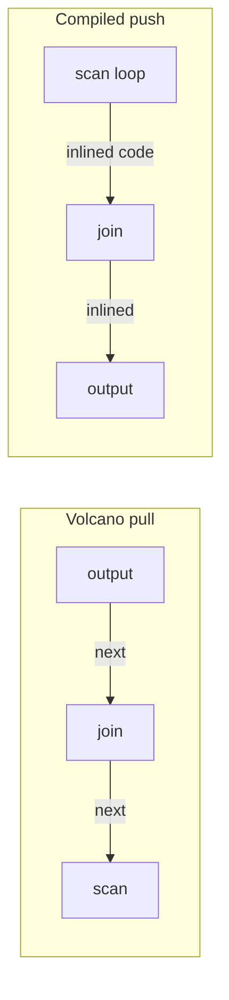

# Reading guide — "Efficiently Compiling Efficient Query Plans for Modern Hardware" (Neumann, VLDB '11)

THE query-compilation paper. One claim: the iterator model's
`next()`-per-tuple is dead weight on modern CPUs (virtual calls,
cache-hostile hopping between operators), and the fix is to compile
each *pipeline* into one loop where the tuple never leaves
registers.

## 1. Why iterators lose (the paper's §2, topic 11 recap)

```
 Volcano: each next() =  virtual call + branch mispredicts
                         + tuple pointer chased through memory
 per-tuple cost: ~dozens of instructions of pure bookkeeping
 vectorized fix: amortize over 1024-row batches  (topic 11)
 compiled  fix:  eliminate — there is no interpreter at runtime
```

The paper's Figure 1 point: operator boundaries in Volcano are also
*data* boundaries (tuple goes to memory between operators). Compiled
pipelines keep the current tuple in CPU registers across all
operators of the pipeline.

## 2. Pipelines and pipeline breakers (the core vocabulary)

```
        ⋈ (hash)
       / \                 P1: scan S → filter → build ht   (breaker!)
      Γ   scan R           P2: scan R → probe ht → Γ build  (breaker!)
      |                    P3: read Γ table → output
      scan S
```

A *pipeline breaker* is any operator that must materialize (hash
build, sort, group-by table). Everything between breakers becomes
one generated loop. Question 1 below asks you to do this for a
Cypher plan.

## 3. Produce/consume — codegen by tree walk

```
 produce(op):  "generate code that produces op's rows"
 consume(op, source): "generate code receiving one row from source"

 scan.produce()      → emit: for row in table {  filter.consume() }
 filter.consume()    → emit:   if p(row) {  join.consume()  }
 join.consume(build) → emit:     ht.insert(row)
```

The generator recurses; the *generated code* is a flat nested loop.
Control flow is inverted vs Volcano: the scan is on the OUTSIDE
(push), consumers are inlined inside. Mermaid of the inversion:



## 4. What they compile WITH — and the latency seed

HyPer emits LLVM IR (not C — they measure C compiler latency as
seconds), mixing generated IR with precompiled C++ for complex
operators ("cocktail"). Even so, LLVM -O3 on big queries costs
10-100 ms — the number that spawns Umbra's Tidy Tuples
(reading-umbra-tidy-tuples.md). Key engineering rule from the
paper: generated code should be *branch-predictable* and keep
attributes in registers; complex logic goes in precompiled C++
called from IR.

## 5. Numbers (2011 hardware, directionally durable)

- TPC-H vs Volcano-style: ~2-10× faster per query
- vs vectorized (VectorWise): usually faster but same ballpark —
  the honest comparison arrives in VLDB '18 (README §7)
- compile time: tens of ms with LLVM even then

## Questions for notes.md

1. Draw the pipelines for a FalkorDB-ish plan:
   `MATCH (a)-[:R]->(b) WHERE a.x < 10 RETURN b.y, count(*)`.
   Which operators break the pipeline, and what does M19's
   *expression-only* JIT compile vs what produce/consume would?
2. Why does push-based codegen produce ONE loop where pull-based
   codegen can't — what forces materialization of control state in
   pull (the resumability the VDBE gets from bytecode, coroutines)?
3. The "cocktail" rule: which parts of our jit_bench expression
   executor belong in precompiled Rust vs generated CLIF, and why
   is the boundary a function call in both HyPer and our stub?
4. Registers vs L1: the paper claims tuple-in-registers across a
   pipeline. With 16 GP + 32 vector registers, how wide can a tuple
   get before this claim quietly dies (spills)?
5. VLDB '18's result — vectorized wins hash-probe-heavy queries via
   memory parallelism. Explain with topic 13's MLP argument: why
   does one-tuple-at-a-time compiled code serialize cache misses,
   and what did HyPer add to fix it (group prefetching / SIMD probe
   batching)?
