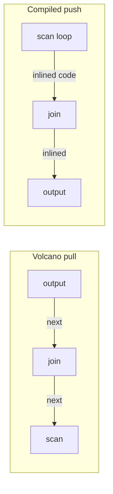

# Produce/consume: compile the pipeline, not the operators

THE query-compilation paper (Neumann, VLDB '11). One claim: the
iterator model's `next()`-per-tuple is dead weight on modern CPUs
(virtual calls, cache-hostile hopping between operators), and the
fix is to compile each *pipeline* into one loop where the tuple
never leaves registers. Everything else in this topic is a reaction
to what this paper made possible — and to what it cost. This chapter
builds the paper's five concepts one at a time — where iterator
overhead actually comes from, what a pipeline is, how a tree walk
generates a flat loop — then hands you the reading route.

## The problem in one sentence

In the iterator model, producing ONE tuple costs a virtual call plus
branch mispredictions plus a memory round-trip *per operator* —
dozens of instructions of pure bookkeeping around ~1 instruction of
useful work — and this paper deletes the bookkeeping entirely by
generating a fresh loop of machine code per query.

## The concepts, step by step

### Step 1 — why iterators lose (the paper's §2, topic 11 recap)

The Volcano/iterator model runs a query plan as a tree of operators,
each exposing `next()` — "give me your next tuple" — so the plan
executes by the root repeatedly pulling one tuple up through every
operator. Elegant, composable, and priced per tuple:

```
 Volcano: each next() =  virtual call + branch mispredicts
                         + tuple pointer chased through memory
 per-tuple cost: ~dozens of instructions of pure bookkeeping
 vectorized fix: amortize over 1024-row batches  (topic 11)
 compiled  fix:  eliminate — there is no interpreter at runtime
```

A **virtual call** (an indirect function call through a pointer,
because which operator is downstream is only known at runtime) costs
~20+ cycles when mispredicted, and it recurs per tuple per operator.
Topic 11's vectorization divides that constant by 1024; this paper's
move is to make it zero.

### Step 2 — the deeper cost: operator boundaries are DATA boundaries

The paper's Figure 1 point: in Volcano, a tuple physically travels —
each operator reads it from memory, works, and hands a pointer up,
so the tuple visits memory between every pair of operators. The
alternative: if the code for scan, filter, and join is fused into
one loop, the current tuple's fields live in **CPU registers** (the
~16 general-purpose + 32 vector slots that cost 0 cycles to access)
from the moment the scan loads them to the moment the pipeline ends.
No loads, no stores, no cache traffic for intermediate hops. That is
the performance prize the whole paper is engineered around — and its
limit is register count (question 4).

### Step 3 — pipelines and pipeline breakers (the core vocabulary)

A **pipeline** is a maximal stretch of a query plan through which a
tuple can flow without being parked in a data structure. A
**pipeline breaker** is any operator that must *materialize* — see
all its input before emitting anything: a hash-join build, a sort, a
group-by table. Breakers cut the plan into pipelines, and each
pipeline becomes exactly one generated loop:

```
        ⋈ (hash)
       / \                 P1: scan S → filter → build ht   (breaker!)
      Γ   scan R           P2: scan R → probe ht → Γ build  (breaker!)
      |                    P3: read Γ table → output
      scan S
```

Why it matters: the breaker is where tuples must leave registers for
memory anyway — so it is the natural boundary of compilation, and
(later, in Umbra) the natural boundary for swapping code versions
mid-query. Question 1 below asks you to do this for a Cypher plan.

### Step 4 — produce/consume: a tree walk that emits a flat loop

The code generator gives every operator two methods: `produce()` —
"emit code that produces your rows" — and `consume()` — "emit the
code that receives one row from your child". The generator recurses
through the plan tree *once at compile time*; what it emits has no
tree left in it, just nested control flow:

```
 produce(op):  "generate code that produces op's rows"
 consume(op, source): "generate code receiving one row from source"

 scan.produce()      → emit: for row in table {  filter.consume() }
 filter.consume()    → emit:   if p(row) {  join.consume()  }
 join.consume(build) → emit:     ht.insert(row)
```

```rust
// the codegen walk: each operator knows how to PRODUCE rows and how to
// CONSUME one row from its child — the emitted code is one flat loop
fn produce(op: &Op, g: &mut Codegen) {
    match op {
        Scan(t)         => { g.emit("for row in {t} {"); consume(parent(op), g); g.emit("}"); }
        Filter(_, c)    => produce(c, g),          // filters produce via their child
        HashJoin(b, p)  => { produce(b, g); produce(p, g); }   // two pipelines
    }
}
fn consume(op: &Op, g: &mut Codegen) {
    match op {
        Filter(pred, _) => { g.emit("if {pred} {"); consume(parent(op), g); g.emit("}"); }
        HashJoinBuild(_) => g.emit("ht.insert(row);"),  // breaker: the loop ends here
        Output           => g.emit("emit(row);"),
    }
}
```

Notice the inversion: control flow is **push**, not pull. The scan
is on the OUTSIDE and drives; consumers are inlined inside its loop.
Volcano's root-pulls-from-leaves becomes leaves-push-to-root —
exactly topic 11's push-vs-pull, but the pushing is done by
generated code with zero interpretation:



### Step 5 — what they compile WITH: the LLVM cocktail, and the latency seed

HyPer emits **LLVM IR** (the intermediate representation of the LLVM
compiler toolkit — typed, portable assembly that LLVM optimizes and
lowers to machine code) rather than C source — they measure C
compiler latency as *seconds* per query. Not everything is
generated: complex operator logic lives in precompiled C++, and the
generated IR calls into it — the "cocktail". The engineering rule:
generated code should be branch-predictable and keep attributes in
registers; complex logic goes in precompiled C++ called from IR.

Even so, LLVM -O3 on big queries costs **10–100 ms** — the number
that spawns Umbra's Tidy Tuples (reading-umbra-tidy-tuples.md) and
the entire compile-latency arms race this topic tracks.

### Step 6 — the numbers (2011 hardware, directionally durable)

- TPC-H vs Volcano-style: ~2-10× faster per query
- vs vectorized (VectorWise): usually faster but same ballpark —
  the honest comparison arrives in VLDB '18 (README §7)
- compile time: tens of ms with LLVM even then

The durable reading: compilation beats *tuple-at-a-time
interpretation* by a lot, beats *vectorization* by a little or not
at all — so the argument for a JIT must be made against topic 11,
not against a strawman tree-walker.

## How to read the paper (with the concepts in hand)

Read the whole thing — it's short.

- **§2 — the argument.** Steps 1–2: the per-tuple cost accounting
  and Figure 1's data-boundary point. You already have the
  vocabulary; verify the claims against topic 11's measurements.
- **§3 — produce/consume.** Steps 3–4 in the authors' words. Trace
  their worked example until you can predict, for each operator,
  what its produce/consume emit — then do question 1's Cypher plan
  from memory.
- **§4 — the LLVM "cocktail".** Step 5. Note which parts of the
  engine stay precompiled and why the boundary is a function call —
  the same boundary M19's stub draws between generated CLIF and
  precompiled Rust.
- Then skim Kersten et al. VLDB '18 (References) for the
  compiled-vs-vectorized rematch question 5 leans on.

## Questions for notes.md

1. Draw the pipelines for a FalkorDB-ish plan:
   `MATCH (a)-[:R]->(b) WHERE a.x < 10 RETURN b.y, count(*)`.
   Which operators break the pipeline, and what does M19's
   *expression-only* JIT compile vs what produce/consume would?
2. Why does push-based codegen produce ONE loop where pull-based
   codegen can't — what forces materialization of control state in
   pull (the resumability the VDBE gets from bytecode, coroutines)?
3. The "cocktail" rule: which parts of our jit_bench expression
   executor belong in precompiled Rust vs generated CLIF, and why
   is the boundary a function call in both HyPer and our stub?
4. Registers vs L1: the paper claims tuple-in-registers across a
   pipeline. With 16 GP + 32 vector registers, how wide can a tuple
   get before this claim quietly dies (spills)?
5. VLDB '18's result — vectorized wins hash-probe-heavy queries via
   memory parallelism. Explain with topic 13's MLP argument: why
   does one-tuple-at-a-time compiled code serialize cache misses,
   and what did HyPer add to fix it (group prefetching / SIMD probe
   batching)?

## References

**Papers**
- Neumann — "Efficiently Compiling Efficient Query Plans for Modern
  Hardware" (VLDB 2011) — read whole; §2 the argument, §3
  produce/consume, §4 the LLVM "cocktail"
- Kersten et al. — "Everything You Always Wanted to Know About
  Compiled and Vectorized Queries But Were Afraid to Ask"
  (VLDB 2018) — the honest compiled-vs-vectorized comparison Q5
  leans on (also cited in README §7)
