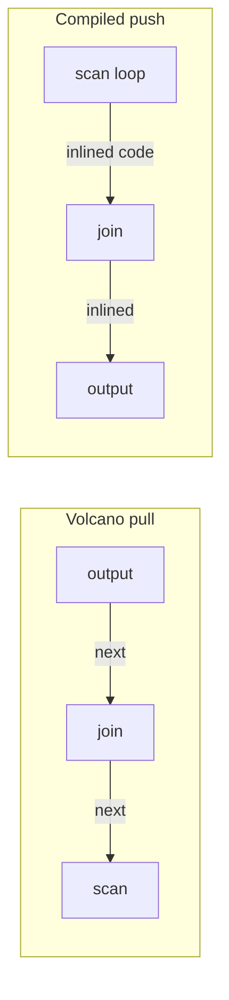

# Produce/consume: compile the pipeline, not the operators

THE query-compilation paper (Neumann, VLDB '11). One claim: the
iterator model's `next()`-per-tuple is dead weight on modern CPUs
(virtual calls, cache-hostile hopping between operators), and the
fix is to compile each *pipeline* into one loop where the tuple
never leaves registers. Everything else in this topic is a reaction
to what this paper made possible — and to what it cost. This chapter
builds the paper's five concepts one at a time — where iterator
overhead actually comes from, what a pipeline is, how a tree walk
generates a flat loop — then hands you the reading route.

**Which paper, which numbers.** Thomas Neumann, "Efficiently
Compiling Efficient Query Plans for Modern Hardware", PVLDB 4(9),
pp. 539–550, 2011. Every figure quoted below carries the table it
came from. The hardware is a **dual Intel X5570 quad-core, 64 GB,
RHEL 5.4, gcc 4.5.2, LLVM 2.8, single-threaded** (§6, first
paragraph) — 2011 silicon and a *fifteen-year-old LLVM*. Ratios
survive; absolute milliseconds do not.

## The problem in one sentence

In the iterator model, producing ONE tuple costs a virtual call plus
branch mispredictions plus a memory round-trip *per operator* —
dozens of instructions of pure bookkeeping around ~1 instruction of
useful work — and this paper deletes the bookkeeping entirely by
generating a fresh loop of machine code per query.

## The concepts, step by step

### Step 1 — why iterators lose (the paper's §1, topic 11 recap)

> **In:** a query plan as a tree of operators, each exposing
> `next()`. **Out:** an instruction budget per tuple per operator,
> and the name for the thing that eats it — the indirect call.
> Nothing is generated yet; this step is the accounting that
> motivates everything after it.

The Volcano/iterator model runs a query plan as a tree of operators,
each exposing `next()` — "give me your next tuple" — so the plan
executes by the root repeatedly pulling one tuple up through every
operator. Elegant, composable, and priced per tuple:

```
 Volcano: each next() =  virtual call + branch mispredicts
                         + tuple pointer chased through memory
 per-tuple cost: ~dozens of instructions of pure bookkeeping
 vectorized fix: amortize over 1024-row batches  (topic 11)
 compiled  fix:  eliminate — there is no interpreter at runtime
```

A **virtual call** (an indirect function call through a pointer,
because which operator is downstream is only known at runtime) costs
~20+ cycles when mispredicted, and it recurs per tuple per operator.
Topic 11's vectorization divides that constant by 1024; this paper's
move is to make it zero.

The paper's own accounting is in §1, and it is worth quoting the
structure because two of its three charges are *not* about the call
instruction:

1. `next()` "will be called several million times" for a query.
2. The call is virtual or through a function pointer, so it "is
   even more expensive than a regular call **and degrades the branch
   prediction**".
3. Each operator keeps enough bookkeeping to *resume* mid-scan —
   the paper's example is a compressed table scan that must
   remember where it stopped — which is "bad code locality and
   complex book-keeping".

Charge 3 is the one this topic keeps circling back to. SQLite's VDBE
pays it explicitly and cheerfully (`reading-sqlite-vdbe.md`: one
integer in a register *is* a coroutine's whole resumption state,
`src/vdbe.c:1269-1272`). Compiled code does not pay it because a
generated loop does not have to be resumable — it runs to
completion.

**Corrected pointer.** This material is in **§1 (Introduction)**,
not §2. §2 of the paper is RELATED WORK. The old version of this
guide sent you to the wrong section for its own headline argument.

### Step 2 — the deeper cost: operator boundaries are DATA boundaries

> **In:** Step 1's per-operator dispatch cost. **Out:** the reason
> dispatch is the *smaller* half of the bill — a tuple's physical
> trip through memory at every operator boundary — and the register
> budget that caps the fix.

In Volcano, a tuple physically travels — each operator reads it from
memory, works, and hands a pointer up, so the tuple visits memory
between every pair of operators. The alternative: if the code for
scan, filter, and join is fused into one loop, the current tuple's
fields live in **CPU registers** (the ~16 general-purpose + 32
vector slots that cost 0 cycles to access) from the moment the scan
loads them to the moment the pipeline ends. No loads, no stores, no
cache traffic for intermediate hops. That is the performance prize
the whole paper is engineered around — and its limit is register
count (question 4).

**Figure 1, attributed honestly.** The paper opens with a figure
comparing hand-written C++ against execution engines on TPC-H Q1.
It is **reproduced from reference [16]** (Boncz/Zukowski/Nes,
MonetDB/X100, CIDR'05) — Neumann did not measure it. Cite it as
motivation, never as this paper's evidence.

The evidence for the register claim that *is* this paper's own
measurement arrives in §6.2, Table 3 (callgrind 3.6.0, TPC-CH Q1,
HyPer+LLVM vs MonetDB):

| counter, Q1 | HyPer + LLVM | MonetDB | ratio |
|---|---|---|---|
| instructions executed | 132 million | 1,184 million | **9.0×** |
| branches | 19,765,048 | 144,557,672 | 7.3× |
| L1 instruction-cache misses | 2,793 | 187,471 | **67×** |
| L1 data-cache misses | 1,764,937 | 7,545,432 | 4.3× |

Nine times fewer instructions retired for the same answer is the
whole thesis in one number. The instruction-cache figure is the
"small code fragments working on large amounts of data in tight
loops" claim of §3.1 made visible.

**Report the counter-example too.** Table 3's Q2 row has HyPer+LLVM
*losing* on branch mispredictions: **6,581,223 vs MonetDB's
3,891,827**. The paper prints it without comment. A guide that only
quotes the 67× is quoting a sales deck.

### Step 3 — pipelines and pipeline breakers (the core vocabulary)

> **In:** Step 2's "keep the tuple in registers" goal. **Out:** the
> two words that turn that goal into a plan-cutting rule, and the
> boundary Umbra later reuses for swapping code versions
> mid-query.

A **pipeline** is a maximal stretch of a query plan through which a
tuple can flow without being parked in a data structure.

The paper defines the cut point twice, and the difference matters
(§3.1, first paragraph — the authors flag it themselves as "more
restrictive than in standard database systems"):

- A **pipeline breaker** for a given input side is an operator that
  "takes an incoming tuple **out of the CPU registers**."
- A **full pipeline breaker** is one that "**materializes all**
  incoming tuples from this side before continuing processing."

Standard database usage — and the previous version of this guide —
uses "pipeline breaker" to mean the *full* one: a hash-join build, a
sort, a group-by table. Neumann's weaker definition deliberately
also catches spilling a tuple to memory at all. That is why the
paper can say, in the same section, that "the block-oriented
execution models have fewer passes across function boundaries, but
they clearly also break the pipeline as they produce batches of
tuples beyond register capacity." **Vectorized execution is a
pipeline breaker under this definition.** Topic 11's whole model is
on the wrong side of the line — which is precisely the fight VLDB'18
re-litigates (Step 6).

Breakers cut the plan into pipelines:

```
        ⋈ (hash)
       / \                 P1: scan S → filter → build ht   (breaker!)
      Γ   scan R           P2: scan R → probe ht → Γ build  (breaker!)
      |                    P3: read Γ table → output
      scan S
```

Why it matters: the breaker is where tuples must leave registers for
memory anyway — so it is the natural boundary of compilation, and
(later, in Umbra) the natural boundary for swapping code versions
mid-query. Question 1 below asks you to do this for a Cypher plan.

**One pipeline is not one function.** §4.2 states the limit
explicitly: "it is not possible or even desirable to compile a
complex query into a single function." Two reasons, both worth
carrying: (a) LLVM code calls back into C++ that takes over control
flow — an external sort produces runs in LLVM but drives the merge
from C++; (b) inlining everything is exponential — "outer joins
will call their consumers in two different situations", so a
cascade of outer joins doubles the emitted code per level. HyPer
therefore defines *functions within LLVM* and calls them, with one
rule: "the hot path does not cross a function boundary."

### Step 4 — produce/consume: a tree walk that emits a flat loop

> **In:** Step 3's pipelines. **Out:** the two-method interface that
> converts a plan tree into flat control flow, and the crucial
> caveat that neither method exists at runtime.

The code generator gives every operator two methods: `produce()` —
"emit code that produces your rows" — and
`consume(attributes, source)` — "emit the code that receives one row
from `source`". The generator recurses through the plan tree *once
at compile time*; what it emits has no tree left in it, just nested
control flow:

```
 produce(op):  "generate code that produces op's rows"
 consume(op, attributes, source): "generate code receiving one row"

 scan.produce()      → emit: for row in table {  filter.consume() }
 filter.consume()    → emit:   if p(row) {  join.consume()  }
 join.consume(build) → emit:     ht.insert(row)
```

The paper is emphatic on a point every reimplementation gets wrong
at least once (§3.2, final paragraph): "**this produce/consume
interface is only a mental model. These functions do not exist
explicitly, they are only used by the code generation.**" There is
no `produce` in the generated program and no vtable at runtime. The
recursion happens once, in the compiler, and its only output is
text/IR.

```rust
// ILLUSTRATION — not quoted from any pinned source. This is the mental
// model of §3.2 / Figure 5 written as Rust. The real tree walk you can
// read and run is the tree-walking interpreter at
// experiments/src/interp.rs:8-16, which is what this replaces: interp.rs
// dispatches once per node PER ROW; a produce/consume walk dispatches
// once per node, total, at compile time.
fn produce(op: &Op, g: &mut Codegen) {
    match op {
        Scan(t)         => { g.emit("for row in {t} {"); consume(parent(op), g); g.emit("}"); }
        Filter(_, c)    => produce(c, g),          // filters produce via their child
        HashJoin(b, p)  => { produce(b, g); produce(p, g); }   // two pipelines
    }
}
fn consume(op: &Op, g: &mut Codegen) {
    match op {
        Filter(pred, _) => { g.emit("if {pred} {"); consume(parent(op), g); g.emit("}"); }
        HashJoinBuild(_) => g.emit("ht.insert(row);"),  // breaker: the loop ends here
        Output           => g.emit("emit(row);"),
    }
}
```

Notice the inversion: control flow is **push**, not pull. The scan
is on the OUTSIDE and drives; consumers are inlined inside its loop.
Volcano's root-pulls-from-leaves becomes leaves-push-to-root —
exactly topic 11's push-vs-pull, but the pushing is done by
generated code with zero interpretation:


```mermaid
flowchart LR
    subgraph VP["Volcano pull"]
      out1[output] -->|next| j1[join] -->|next| s1[scan]
    end
    subgraph CP["Compiled push"]
      s2[scan loop] -->|inlined code| j2[join] -->|inlined| out2[output]
    end
```

Figure 4 of the paper is the output of applying Figure 5's rules to
Figure 3's plan, and it is four flat loop nests with no operator
structure left — worth reading side by side until the mapping is
mechanical.

### Step 5 — what they compile WITH: the LLVM cocktail, and the latency seed

> **In:** Step 4's emitted control flow, still abstract. **Out:** a
> concrete target language (LLVM IR), the rule for what is *not*
> generated, and the compile-time number that starts this topic's
> arms race.

HyPer emits **LLVM IR** (the intermediate representation of the LLVM
compiler toolkit — typed, portable assembly that LLVM optimizes and
lowers to machine code) rather than C source. §4.1 gives three
reasons, in the authors' order: an optimizing C++ compiler is "really
slow, compiling a complex query could take multiple seconds"; C++
"does not offer total control over the generated code — in
particular, overflow flags etc. are unavailable"; and LLVM IR is
strongly typed, which "caught many bugs that were hidden in our
original textual C++ code generation."

Not everything is generated. §4.1's metaphor (Figure 6): the
precompiled C++ is the **cogwheels**, the generated LLVM is the
**chain** linking them. Complex data-structure management, spilling,
index traversal — C++. Tuple access, filtering, materialization into
a hash table — generated IR. The rule, stated as a rule: "**the hot
path, i.e., the code that is executed for 99% of the tuples, is pure
LLVM.**" Calling C++ occasionally (a new page, an allocation) is
fine; the cost is spilling registers to a cache-hot stack, negligible
once but "if this is done millions of times it becomes noticeable."

**The compile-latency number, corrected.** §4.1 says LLVM "usually
requires only a few milliseconds for query compilation, while C or
C++ compilers would need seconds." The measurement backing that is
Table 2, and it is stronger than the prose: for TPC-CH Q1–Q5,
**LLVM compile time is 16, 41, 30, 16, and 34 ms**, against C++
compile times of **1556, 2367, 1976, 2214, and 2592 ms** — 1.6 to
2.6 *seconds* per query.

The previous version of this guide said "LLVM -O3 on big queries
costs 10–100 ms". Two things are wrong with it: the paper never runs
LLVM at `-O3` (HyPer used LLVM 2.8's JIT), and 10–100 ms is not a
figure in the paper. The honest sentence is: **on 2011 hardware with
LLVM 2.8, HyPer's LLVM compile times on TPC-CH Q1–Q5 were 16–41 ms
(Table 2), and C++ was 40–140× slower to compile.** The number that
grows into a crisis is not this one — it is what happens to LLVM
when queries get big, which `reading-umbra-tidy-tuples.md` measures
at 2000 joins (LLVM: 150 s).

### Step 6 — the numbers (2011 hardware, directionally durable)

> **In:** Steps 1–5's mechanism. **Out:** the actual measured
> speedups with their baselines named, including the two places
> compilation does *not* win — which is the honest case for the
> rest of this topic.

**Table 1, OLTP (TPC-C, 12 warehouses, single-threaded):**

| | transactions/s | total compile time |
|---|---|---|
| HyPer + C++ | 161,794 | 16.53 s |
| HyPer + LLVM | 169,491 | **0.81 s** |

Read that row carefully. On OLTP the generated *code* is only 4.8%
faster (169,491 / 161,794 = 1.048) — the paper explains why: most
TPC-C transactions touch fewer than 30 tuples, so there is no
per-tuple overhead to amortize. What LLVM buys on OLTP is not
throughput, it is **20× less compile time** (16.53 / 0.81 = 20.4).
Compilation strategy is a *latency* decision here, not a throughput
one. That is the whole seed of topics 19's second half.

**Table 2, OLAP (TPC-CH Q1–Q5, milliseconds, warm prepared queries):**

| | Q1 | Q2 | Q3 | Q4 | Q5 |
|---|---|---|---|---|---|
| HyPer + LLVM (exec) | **35** | **125** | **80** | **117** | **1105** |
| HyPer + LLVM (compile) | 16 | 41 | 30 | 16 | 34 |
| HyPer + C++ (exec) | 142 | 374 | 141 | 203 | 1416 |
| VectorWise 1.0 | 98 | – | 257 | 436 | 1107 |
| MonetDB 1.36.5 | 72 | 218 | 112 | 8168 | 12028 |
| "DB X" (commercial, disk-based) | 4221 | 6555 | 16410 | 3830 | 15212 |

**Corrected headline.** The previous version of this guide said
"~2-10× faster per query" against "Volcano-style". There is no
Volcano-style baseline in this paper, and the range is wrong in both
directions. Do the division yourself:

```
 vs VectorWise (vectorized, the real rival):
   Q1  98 / 35   = 2.8×
   Q3 257 / 80   = 3.2×
   Q4 436 / 117  = 3.7×
   Q5 1107/1105  = 1.002×      ← a dead tie
 vs MonetDB (column-at-a-time, full materialization):
   Q1 2.1×   Q2 1.7×   Q3 1.4×   Q4 69.8×   Q5 10.9×
 vs "DB X" (disk-based commercial):
   Q3 16410 / 80 = 205×        ← a different storage architecture,
                                 not a code-generation result
```

The paper's own summary is "frequently another factor **2–4**
faster" than the fast in-memory systems. So the honest three-line
version:

- **2–4× against a well-engineered vectorized engine** on scan- and
  aggregation-heavy queries;
- **1.00× on Q5**, the join-dominated one — the win vanishes exactly
  where the work becomes memory-bound rather than compute-bound;
- **~200× against a disk-based system**, which measures storage, not
  compilation, and should never be quoted as a JIT number.

Q5's tie is the single most useful number in the paper for this
topic, because it is the seven-years-early preview of VLDB'18 and of
why DuckDB ships no JIT (README §7). It also matches this topic's
own measurement from the other direction: the vectorized lane in
`notes.md` beats the interpreter by 6× at 7 nodes and 12× at 511, so
the interpretation overhead a JIT would remove is *already gone*
before the JIT arrives.

The durable reading: compilation beats *tuple-at-a-time
interpretation* by a lot, beats *vectorization* by a little or not
at all — so the argument for a JIT must be made against topic 11,
not against a strawman tree-walker.

### Step 7 — the arithmetic: when is compiling worth it?

> **In:** Table 1's and Table 2's compile times, plus this topic's
> own measured per-row rates from `notes.md`. **Out:** a break-even
> row count you compute, and the reason the answer is different for
> OLTP and OLAP.

Compilation buys a lower per-row cost and charges a fixed fee up
front. The break-even is one division:

```
 rows_breakeven = compile_time / (per_row_slow − per_row_fast)

 Case A — Table 1's OLTP transaction (HyPer, LLVM 2.8, 2011):
   compile_time     = 0.81 s / (number of prepared statements)
   The paper does not need this division at all: TPC-C statements
   are PREPARED once and run millions of times, so compile time is
   divided by ~10^6 and vanishes. This is why 20× less compile time
   showed up as +4.8% throughput and nothing else.

 Case B — this topic's own bench (notes.md, Apple M3 Pro, depth 8,
   511 nodes, N_COLS=4):
   interpreter     = 0.95 M rows/s  →  1 / 0.95e6  = 1.053 µs/row
   vectorized      = 11.8 M rows/s  →  1 / 11.8e6  = 0.0847 µs/row
   saving          = 1.053 − 0.0847 = 0.968 µs/row

   If a cranelift compile of that 511-node tree costs 500 µs, then
   against the INTERPRETER:
     rows = 500 / 0.968 = 516 rows.
   Against the VECTORIZED lane it is a different subtraction — you
   need the JIT's own per-row rate, which is exactly what M19 asks
   you to measure. Predict it in notes.md before you run it.
```

Case A and Case B differ by six orders of magnitude in break-even
rows, from the *same* mechanism, because of one variable the formula
hides: **how many times the compiled artifact is reused.** Prepared
statements reuse forever; ad-hoc analytics reuse once. Every system
in this topic is an answer to that variable — Postgres gates on a
cost estimate (`reading-postgres-jit.md`), Umbra makes the fee
almost zero (`reading-umbra-tidy-tuples.md`), GraphBLAS caches the
artifact on disk across process lifetimes
(`reading-graphblas-jit.md`).

## How to read the paper (with the concepts in hand)

Read the whole thing — it's twelve pages.

- **§1 (Introduction) — the argument.** Steps 1–2: the per-tuple
  cost accounting, the three charges against `next()`, and Figure
  1's data-boundary point. Remember Figure 1 is reproduced from
  [16], not measured here. Verify the claims against topic 11's
  measurements. (**Not §2** — that is Related Work.)
- **§3 (The Query Compiler) — produce/consume.** Steps 3–4 in the
  authors' words. §3.1 is the pipeline-breaker definition; §3.2 is
  the interface. Read Figures 2 → 3 → 5 → 4 in that order: query,
  plan, translation rules, emitted code. Apply Figure 5's rules to
  Figure 3 by hand until you reproduce Figure 4, then do question
  1's Cypher plan from memory.
- **§4 (Code Generation) — the LLVM "cocktail".** Step 5. §4.1 is
  Figure 6's cogwheels-and-chain and the 99%-hot-path rule; §4.2 is
  the "not one function" limit and the outer-join code-explosion
  argument. Note which parts of the engine stay precompiled and why
  the boundary is a function call — the same boundary M19's stub
  draws between generated CLIF and precompiled Rust
  (`experiments/src/jit.rs:20-21` makes the ownership half of that
  boundary explicit).
- **§5 (Advanced Parallelization)** — skim, but notice that the
  paper already anticipates SIMD *inside* the compiled pipeline
  ("as long as we can keep the whole block in registers", using
  LLVM's vector types). The compiled-vs-vectorized dichotomy was
  never as clean as the slogan.
- **§6 (Evaluation)** — Tables 1, 2, 3 with Step 6 open beside you.
  Do the divisions. Find Q5. Find Table 3's Q2 mispredict row.
- Then skim Kersten et al. VLDB '18 (References) for the
  compiled-vs-vectorized rematch question 5 leans on.

## Questions for notes.md

1. Draw the pipelines for a FalkorDB-ish plan:
   `MATCH (a)-[:R]->(b) WHERE a.x < 10 RETURN b.y, count(*)`.
   Which operators break the pipeline, and what does M19's
   *expression-only* JIT compile vs what produce/consume would?
   Answer it twice — once with the standard "full pipeline breaker"
   definition and once with §3.1's stricter register-eviction one.
   Do the two answers differ?
2. Why does push-based codegen produce ONE loop where pull-based
   codegen can't — what forces materialization of control state in
   pull (the resumability the VDBE gets from bytecode, coroutines)?
   Ground it: `src/vdbe.c:1264-1274` is 11 lines of resumption state
   that a compiled loop does not need at all.
3. The "cocktail" rule: which parts of our jit_bench expression
   executor belong in precompiled Rust vs generated CLIF, and why
   is the boundary a function call in both HyPer and our stub? Use
   §4.1's 99% test as the criterion, not taste.
4. Registers vs L1: the paper claims tuple-in-registers across a
   pipeline. With 16 GP + 32 vector registers, how wide can a tuple
   get before this claim quietly dies (spills)? §3.1 admits the
   problem ("a single tuple might already be too large to fit into
   the available CPU registers") and defers it to §4 — check
   whether §4 actually answers it.
5. VLDB '18's result — vectorized wins hash-probe-heavy queries via
   memory parallelism. Explain with topic 13's MLP argument: why
   does one-tuple-at-a-time compiled code serialize cache misses,
   and what did HyPer add to fix it (group prefetching / SIMD probe
   batching)? Then connect it to Table 2's Q5 tie: was the 2018
   result already visible in 2011?

## Done when

Answer each before unfolding it.

- [ ] You can explain why operator boundaries are data boundaries, and why that is the deeper cost than dispatch.

  <details><summary>Answer</summary>

  Dispatch costs an indirect call (~20+ cycles mispredicted) per
  tuple per operator. The boundary costs a *store plus a load* of
  every live attribute, because the calling convention cannot keep
  a tuple in registers across an unknown callee — so the tuple is
  spilled and refetched at each hop. Dispatch is a fixed constant
  you can amortize (vectorization divides it by 1024). The memory
  round-trip scales with tuple width and cannot be amortized by
  batching — batching only moves the spill from L1 to a larger
  buffer. Neumann's measurement of the combined effect is Table 3:
  **132 million instructions vs MonetDB's 1,184 million on Q1
  (9.0×)**, with L1-I misses at 2,793 vs 187,471 (67×).

  </details>

- [ ] You can define pipelines and pipeline breakers and identify both in a plan you draw yourself.

  <details><summary>Answer</summary>

  A pipeline is a maximal run of the plan a tuple crosses without
  being parked. §3.1 gives *two* breaker definitions: a **pipeline
  breaker** takes a tuple out of the CPU registers; a **full
  pipeline breaker** materializes all its input from that side
  first. Standard usage means the second. Under the first,
  vectorized execution is itself a breaker — the paper says so
  directly about "block-oriented execution models". In the hash-join
  plan above, the build side and the group-by table are full
  breakers; a filter is not a breaker at all; a sort is.

  </details>

- [ ] You can explain how produce/consume turns a tree walk into one flat loop, and why push-based codegen produces one loop where pull-based produces several.

  <details><summary>Answer</summary>

  `produce()` recurses *down* asking each child to emit its own row
  source; `consume(attributes, source)` emits the code that runs on
  one row and then calls its own parent's `consume`. The recursion
  is entirely at compile time, so the emitted program has the scan
  loop outermost and every downstream operator inlined in its body
  — no tree, no calls. Pull cannot do this because a `next()` must
  be able to *return* and later resume, which forces the operator's
  loop counters and cursor state into memory; push runs each tuple
  to the end of the pipeline before touching the next, so no
  resumption state exists. Caveat from §4.2: one *pipeline* is not
  necessarily one *function* — outer joins would blow up
  exponentially if fully inlined, so HyPer emits LLVM functions and
  only guarantees that the 99% hot path stays inside one.

  </details>

- [ ] You can state the LLVM cocktail rule and say which parts of an expression should stay interpreted.

  <details><summary>Answer</summary>

  §4.1: precompiled C++ is the cogwheels, generated LLVM is the
  chain; "the hot path, i.e., the code that is executed for 99% of
  the tuples, is pure LLVM". So: anything executed once per page,
  once per allocation, once per operator setup, or that needs
  complex data-structure logic stays precompiled and is *called*.
  Anything on the per-tuple path is generated. Applied to a JIT'd
  expression: arithmetic, comparisons and column loads are
  generated; string collation, regex, `NULL`-heavy generic
  fallbacks, and anything requiring an allocator stay as calls into
  precompiled code. Postgres draws exactly this line —
  `llvmjit_expr.c` generates the common opcodes and falls back to
  calling the interpreter's C function otherwise.

  </details>

- [ ] You can compute the break-even row count for a compiled expression from a compile time and two per-row rates, and explain why the answer differs by six orders of magnitude between OLTP and OLAP.

  <details><summary>Answer</summary>

  `rows = compile_time / (per_row_slow − per_row_fast)`. With
  `notes.md`'s depth-8 numbers, interpreter 0.95 M rows/s = 1.053
  µs/row and vectorized 11.8 M rows/s = 0.0847 µs/row, the saving is
  0.968 µs/row, so a 500 µs compile pays for itself at 500 / 0.968 =
  **516 rows**. The formula hides the reuse count. In Table 1's
  OLTP workload the statement is *prepared* and executed millions of
  times, so the effective compile cost per execution is 0.81 s /
  10⁶ ≈ 0.8 µs — which is why 20× less compile time (16.53 s → 0.81
  s) bought only +4.8% throughput (161,794 → 169,491 tps): there was
  never any per-tuple overhead to remove, because TPC-C transactions
  touch under 30 tuples each.

  </details>

- [ ] You can state the paper's measured speedups with their baselines named, including the query where compilation wins nothing.

  <details><summary>Answer</summary>

  Table 2, TPC-CH, 2011 hardware, LLVM 2.8: HyPer+LLVM vs
  **VectorWise 1.0** is 2.8× (Q1), 3.2× (Q3), 3.7× (Q4) and
  **1.002× (Q5)** — a tie on the join-dominated query. vs
  **MonetDB 1.36.5**: 1.4×–2.1× on Q1–Q3, 69.8× on Q4, 10.9× on Q5.
  vs the disk-based commercial "DB X": up to 205× on Q3, which
  measures storage architecture and is not a code-generation
  result. The paper's own phrasing is "frequently another factor
  2–4 faster". Q5's tie is the honest headline: where the query is
  memory-bound rather than instruction-bound, removing
  interpretation removes nothing.

  </details>

- [ ] You wrote answers to all five questions in notes.md, including the VLDB '18 counter-result on hash-probe-heavy queries.

  <details><summary>Answer</summary>

  The VLDB'18 result to reconcile: Kersten et al. built *both*
  engines (Typer, compiling; Tectorwise, vectorized) and measured
  §4.1 "the relative performance ranges from Typer being faster by
  74% (Q1) to Tectorwise being faster by 32% (Q9)" — i.e. the two
  models are within 2× on all of TPC-H. Tectorwise wins Q3 and Q9
  because "vectorization is better at hiding cache miss latency":
  its probe loop contains nothing but probes, so the out-of-order
  window holds many outstanding loads, while Typer's fused loop
  (scan + selection + probe + aggregate) fills the reorder buffer
  and issues fewer concurrent misses. That is topic 13's MLP
  argument applied to codegen — and Neumann's own Table 2 Q5 tie
  already showed it in 2011.

  </details>

## References

**Papers**
- Neumann — "Efficiently Compiling Efficient Query Plans for Modern
  Hardware" (PVLDB 4(9):539–550, 2011). Read whole. **§1** the
  argument and the three charges against `next()`; **§3.1**
  pipeline-breaker definitions; **§3.2** produce/consume + "only a
  mental model"; **§4.1** the LLVM cocktail and the 99% rule;
  **§4.2** why a pipeline is not one function; **§6.1** Tables 1–2;
  **§6.2** Table 3.
- Boncz, Zukowski, Nes — "MonetDB/X100: Hyper-Pipelining Query
  Execution" (CIDR 2005) — reference [16], the actual source of
  Neumann's Figure 1.
- Kersten et al. — "Everything You Always Wanted to Know About
  Compiled and Vectorized Queries But Were Afraid to Ask"
  (PVLDB 11(13), 2018) — the honest compiled-vs-vectorized
  comparison Q5 leans on (also cited in README §7). §4.1 has the
  ±74%/−32% range and the memory-stall explanation.

**Numbers quoted here, and where they come from**

| number | source |
|---|---|
| 132 M vs 1,184 M instructions (Q1) | Table 3 |
| 2,793 vs 187,471 L1-I misses (Q1) | Table 3 |
| 6,581,223 vs 3,891,827 mispredicts (Q2) | Table 3 |
| 161,794 vs 169,491 tps; 16.53 s vs 0.81 s | Table 1 |
| exec 35/125/80/117/1105 ms | Table 2 |
| LLVM compile 16/41/30/16/34 ms | Table 2 |
| C++ compile 1556–2592 ms | Table 2 |
| VectorWise 98/–/257/436/1107 ms | Table 2 |
| dual X5570, LLVM 2.8, single-threaded | §6, setup |

**Code in this repo**

| anchor | what |
|---|---|
| `experiments/src/interp.rs:8-16` | the tree-walk this paper deletes |
| `experiments/src/jit.rs:20-21` | the codegen/precompiled ownership boundary |
| `~/repos/sqlite/src/vdbe.c:1264-1274` | resumption state a compiled loop never needs |
