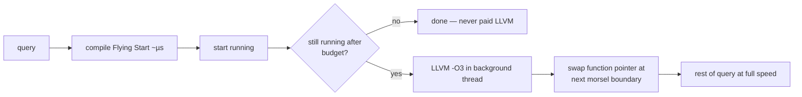

# Umbra & copy-and-patch: the war on compile latency

Two attacks on the same enemy: compile LATENCY. HyPer proved
compiled queries run fast; production taught that 100 ms of LLVM
before a 10 ms query is a loss. Umbra's answer is a bespoke IR and
a tiered backend; copy-and-patch's answer is to do the compiling
at BUILD time and only memcpy at runtime. This chapter builds the
ideas in order — why LLVM is structurally slow, what an IR designed
for single-pass lowering looks like, how adaptive execution makes
the interpret-vs-compile choice unnecessary, and how far the
stencil trick pushes the floor — then routes you through both
papers.

## The problem in one sentence

A short OLTP query executes in under a millisecond but LLVM -O3
needs tens of milliseconds to compile it — a compile-to-run ratio
that can exceed **100:1** — so the fastest generated code in the
world loses to an interpreter unless compilation itself gets ~100×
cheaper.

## The concepts, step by step

### Step 1 — the latency budget: name the enemy in numbers

Query compilation (topic recap: generate machine code per query
instead of interpreting the plan) has one price tag that HyPer's
LLVM backend made visible:

```
 HyPer, TPC-H Q1 scale:   LLVM -O3 compile ≈ tens of ms
 short OLTP query:        execution ≈ sub-ms
 ⇒ compile:run ratio can exceed 100:1

 Umbra target: compile in ~100 µs — "Flying Start"
```

Why it matters: compile latency is paid *before the first row*, on
every query, hit or miss — so it sets the minimum query size for
which a JIT is rational at all. Everything in this chapter is a way
to shrink that minimum.

### Step 2 — why LLVM is slow: the cost is structural, not a flag

LLVM is a general-purpose optimizing compiler: it builds **SSA**
form (static single assignment — every value defined exactly once,
which makes optimization clean but construction expensive), runs
~100 IR passes, then does instruction selection and register
allocation — each a multi-pass traversal over pointer-linked graph
structures. No `-O0` flag removes the graph-building and
multi-pass skeleton. Umbra's observation: *query* code is
generated, regular, and short-lived — short straight-line blocks,
few live values, no human weirdness — so it doesn't need a general
optimizer. A compiler specialized to that shape can be linear.

### Step 3 — Tidy Tuples: the codegen layer that never loses track

The name is the *data-centric value tracking* in the code
generator: as it walks the plan (produce/consume, Neumann's model),
it tracks every attribute with its type and current location —
register or memory — so the generator emits loads lazily, exactly
once, and never re-materializes a value it already has. That
bookkeeping is what keeps the generated code register-clean without
an optimizer cleaning up after the fact — the optimization happened
*during* generation. The layer stack:

```
 relational algebra
   └─ Tidy Tuples codegen  (produce/consume, tracks values)
        └─ Umbra IR         (SSA-ish, fixed-width ops, ONE pass
                             per lowering — designed so every
                             lowering step is linear scan)
             ├─ Flying Start: direct x86 emit  (~µs, ~LLVM -O0+)
             └─ LLVM -O3     (background, hot queries only)
```

### Step 4 — Umbra IR + Flying Start: everything single-pass

The IR (intermediate representation — the in-between language
compilers lower through) is designed backwards from the constraint
"every lowering step must be one linear scan": IR ops are
fixed-size in one contiguous array (no pointer graphs to chase);
types are simple scalars; control flow is basic blocks with
fall-through bias. Flying Start then walks that array once,
emitting x86 directly with a linear-scan register allocator.
Compare the VDBE's fixed 24-byte ops: same instinct — flat arrays
of fixed-width instructions — different target (interpretation vs
fast native lowering). The result: ~100× faster compiles than LLVM
at ~70–80% of LLVM -O3's execution speed, with LLVM kept as the top
tier for queries that earn it. What it gives up: the global
optimizations a multi-pass compiler could do — acceptable precisely
because generated query code has so little to globally optimize
(question 2).

### Step 5 — adaptive execution: never choose wrong

With a ~µs tier and a ~ms tier, Umbra refuses to *predict* which a
query needs — it measures:



The swap granularity is topic 11's morsel: execution is already
chunked, so "replace the function between morsels" is natural.
This kills the postgres failure mode (reading-postgres-jit.md) —
the decision uses *measured* runtime, not a planner estimate. Short
queries never pay LLVM; long queries pay it off the critical path.

### Step 6 — copy-and-patch: compile time ≈ memcpy

The OOPSLA '21 paper pushes the floor further: move compilation to
*build* time. Precompile a library of **stencils** — machine-code
fragments, one per (operator × type) combination, with **holes**
(unresolved relocations — the linker concept: addresses/constants
left blank in object code) for constants, offsets, and branch
targets. At runtime, "compilation" is copying stencils and filling
holes:

```
 build time:  compile a library of STENCILS with clang —
              object code for each (operator × type) with HOLES
              (relocations) for constants/offsets/branch targets
 run time:    for each IR op: memcpy stencil, patch holes
              → machine code in ~100s of ns per op
```

The runtime "compiler" is barely a loop:

```rust
fn compile(ops: &[IrOp], stencils: &Stencils, out: &mut Code) {
    for op in ops {
        let s = &stencils[op.kind()];        // object code built at BUILD time
        let base = out.append(&s.bytes);     // "compilation" is a memcpy
        for hole in &s.holes {               // relocations left unresolved
            out.patch(base + hole.offset, op.operand(hole.which));
        }
    }                                        // no IR, no passes, no regalloc
}
```

The trick making stencils composable: continuation-passing style +
tail calls (`musttail`) so each stencil ends by jumping to the next
— no prologue/epilogue, registers stay live across stencils
(GHC-ish calling convention). Result: compiles ~2 orders faster
than LLVM -O0 with *better* code than -O0. This is the natural
floor of the spectrum between bytecode and real JIT — and
PostgreSQL people have prototyped it for ExprState.

### Step 7 — what transfers to M19

M19's budget heuristic should be Umbra-shaped, not postgres-shaped:
interpret first, count rows/time actually spent, JIT when the
measured cost clears the (measured) cranelift compile cost from
jit_bench. Cranelift itself sits near Flying Start on the ladder:
single-tier, fast compile, decent code — a sane single choice when
you don't want two backends.

## How to read the papers (with the concepts in hand)

- **Tidy Tuples / Flying Start (VLDBJ '21)** — read the IR-design
  section against Step 4's checklist (fixed-width ops, contiguous
  arrays, restricted types/CFG) and the value-tracking section
  against Step 3; the adaptive-execution material (with the
  ICDE '18 companion) is Step 5 — note the morsel-boundary swap and
  what state both code versions must agree on (question 4). The
  evaluation's compile-time vs run-time scatter plots are the
  chapter's thesis in one figure.
- **Copy-and-Patch (OOPSLA '21)** — §on stencils and holes is
  Step 6; the musttail/continuation-passing mechanics deserve a
  slow read (question 3). Read their comparison against LLVM -O0
  skeptically and note which benchmark shapes favor stencils
  (short, cold code) vs a real JIT (hot loops).

## Questions for notes.md

1. Umbra IR vs LLVM IR: name three concrete representation choices
   that make single-pass lowering possible (fixed-width ops,
   contiguous arrays, restricted types/CFG) and what each gives up.
2. Flying Start does register allocation in one linear pass — what
   property of *generated query code* (short straight-line blocks,
   few live values — the Tidy Tuples tracking) makes that
   acceptable where a C compiler couldn't?
3. Copy-and-patch: why does continuation-passing + musttail let
   stencils compose without spilling registers at boundaries, and
   what does that share with WGSL/wgpu's "pipeline fixed at
   creation" specialization from topic 18?
4. The adaptive swap happens at morsel boundaries. What state must
   the compiled and interpreted versions AGREE on for the swap to
   be sound (hash tables, cursors, partial aggregates — the
   pipeline-breaker state, exactly)?
5. For M19: cranelift compile of a depth-8 expression costs X µs
   (measure in jit_bench). Using the measured interp rows/s, write
   the break-even row count formula and compute it. Does a
   FalkorDB `WHERE` clause over a 1M-node scan clear it?

## References

**Papers**
- Kersten, Leis, Neumann — "Tidy Tuples and Flying Start: Fast
  Compilation and Fast Execution of Relational Queries in Umbra"
  (VLDB Journal 2021)
- Xu & Kjolstad — "Copy-and-Patch Compilation" (OOPSLA 2021,
  [arXiv:2011.13127](https://arxiv.org/abs/2011.13127))
