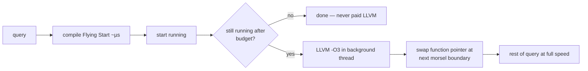

# Umbra & copy-and-patch: the war on compile latency

Two attacks on the same enemy: compile LATENCY. HyPer proved
compiled queries run fast; production taught that 100 ms of LLVM
before a 10 ms query is a loss. Umbra's answer is a bespoke IR and
a tiered backend; copy-and-patch's answer is to do the compiling
at BUILD time and only memcpy at runtime.

## 1. The latency budget (why LLVM had to go)

```
 HyPer, TPC-H Q1 scale:   LLVM -O3 compile ≈ tens of ms
 short OLTP query:        execution ≈ sub-ms
 ⇒ compile:run ratio can exceed 100:1

 Umbra target: compile in ~100 µs — "Flying Start"
```

LLVM's cost is structural, not a flag: SSA construction, many IR
passes, ISel/RegAlloc are all multi-pass over graphs. Umbra's
observation: *query* code is generated, regular, and short-lived —
it doesn't need a general optimizer.

## 2. Tidy Tuples — the codegen layer

The name is the *data-centric value tracking* in the code
generator: attributes are tracked through codegen with their types
and locations (register/memory), so the generator emits loads
lazily and never re-materializes. The layer stack:

```
 relational algebra
   └─ Tidy Tuples codegen  (produce/consume, tracks values)
        └─ Umbra IR         (SSA-ish, fixed-width ops, ONE pass
                             per lowering — designed so every
                             lowering step is linear scan)
             ├─ Flying Start: direct x86 emit  (~µs, ~LLVM -O0+)
             └─ LLVM -O3     (background, hot queries only)
```

Design rules that make it fast (compare vdbe's fixed 24-byte ops):
IR ops fixed-size in one contiguous array; no pointer graphs;
types are simple scalars; control flow is basic blocks with
fall-through bias. Everything single-pass.

## 3. Adaptive execution — never choose wrong



The swap granularity is topic 11's morsel: execution is already
chunked, so "replace the function between morsels" is natural.
This kills the postgres failure mode (reading-postgres-jit.md) —
the decision uses *measured* runtime, not a planner estimate.

## 4. Copy-and-patch (OOPSLA '21) — compile time ≈ memcpy

```
 build time:  compile a library of STENCILS with clang —
              object code for each (operator × type) with HOLES
              (relocations) for constants/offsets/branch targets
 run time:    for each IR op: memcpy stencil, patch holes
              → machine code in ~100s of ns per op
```

The runtime "compiler" is barely a loop:

```rust
fn compile(ops: &[IrOp], stencils: &Stencils, out: &mut Code) {
    for op in ops {
        let s = &stencils[op.kind()];        // object code built at BUILD time
        let base = out.append(&s.bytes);     // "compilation" is a memcpy
        for hole in &s.holes {               // relocations left unresolved
            out.patch(base + hole.offset, op.operand(hole.which));
        }
    }                                        // no IR, no passes, no regalloc
}
```

The trick making stencils composable: continuation-passing style +
tail calls (`musttail`) so each stencil ends by jumping to the next
— no prologue/epilogue, registers stay live across stencils
(GHC-ish calling convention). Result: compiles ~2 orders faster
than LLVM -O0 with *better* code than -O0. This is the natural
floor of the spectrum between bytecode and real JIT — and
PostgreSQL people have prototyped it for ExprState.

## 5. What transfers to M19

M19's budget heuristic should be Umbra-shaped, not postgres-shaped:
interpret first, count rows/time actually spent, JIT when the
measured cost clears the (measured) cranelift compile cost from
jit_bench. Cranelift itself sits near Flying Start on the ladder:
single-tier, fast compile, decent code — a sane single choice when
you don't want two backends.

## Questions for notes.md

1. Umbra IR vs LLVM IR: name three concrete representation choices
   that make single-pass lowering possible (fixed-width ops,
   contiguous arrays, restricted types/CFG) and what each gives up.
2. Flying Start does register allocation in one linear pass — what
   property of *generated query code* (short straight-line blocks,
   few live values — the Tidy Tuples tracking) makes that
   acceptable where a C compiler couldn't?
3. Copy-and-patch: why does continuation-passing + musttail let
   stencils compose without spilling registers at boundaries, and
   what does that share with WGSL/wgpu's "pipeline fixed at
   creation" specialization from topic 18?
4. The adaptive swap happens at morsel boundaries. What state must
   the compiled and interpreted versions AGREE on for the swap to
   be sound (hash tables, cursors, partial aggregates — the
   pipeline-breaker state, exactly)?
5. For M19: cranelift compile of a depth-8 expression costs X µs
   (measure in jit_bench). Using the measured interp rows/s, write
   the break-even row count formula and compute it. Does a
   FalkorDB `WHERE` clause over a 1M-node scan clear it?

## References

**Papers**
- Kersten, Leis, Neumann — "Tidy Tuples and Flying Start: Fast
  Compilation and Fast Execution of Relational Queries in Umbra"
  (VLDB Journal 2021)
- Xu & Kjolstad — "Copy-and-Patch Compilation" (OOPSLA 2021,
  [arXiv:2011.13127](https://arxiv.org/abs/2011.13127))
