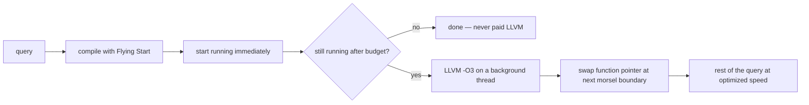

# Umbra & copy-and-patch: the war on compile latency

Two attacks on the same enemy: compile LATENCY. HyPer proved
compiled queries run fast; production taught that tens of
milliseconds of LLVM before a one-millisecond query is a loss.
Umbra's answer is a bespoke IR and a tiered backend;
copy-and-patch's answer is to do the compiling at BUILD time and
only memcpy at runtime. This chapter builds the ideas in order —
why LLVM is structurally slow, what an IR designed for single-pass
lowering looks like, how adaptive execution makes the
interpret-vs-compile choice unnecessary, and how far the stencil
trick pushes the floor — then routes you through both papers.

**Sources.** Every number below is quoted with the table or figure
it came from, because the previous version of this guide carried
three that turned out to be wrong (Steps 4, 5 and 7 flag each).
The two papers:

- Kersten, Leis, Neumann, *"Tidy Tuples and Flying Start: Fast
  Compilation and Fast Execution of Relational Queries in Umbra"*,
  **VLDB Journal 2021**.
- Xu, Kjolstad, *"Copy-and-Patch Compilation"*, **OOPSLA 2021**
  ([arXiv:2011.13127](https://arxiv.org/abs/2011.13127)).

Umbra's setup (§5.1): a 10-core Intel Skylake X i9-7900X at 3.4 GHz
(4.5 GHz turbo). TPC-H at SF=0.01 for the latency tables, SF=1 for
the throughput ones. Note the scale factors — they are the whole
argument, and quoting an Umbra number without its SF is how these
claims go wrong.

## The problem in one sentence

A short OLAP query at SF=0.01 executes in **0.50 ms** (Umbra,
Table 2 geometric mean) but generating fully optimized LLVM code
for a large query can take **150 seconds** (Fig. 13, 2000 joins) —
so the fastest generated code in the world loses to an interpreter
unless compilation itself gets two orders of magnitude cheaper.

## The concepts, step by step

### Step 1 — the latency budget: name the enemy in numbers

> **In:** topic 11's compiled-vs-interpreted spectrum and topic
> 19's own measured interpreter penalty. **Out:** the compile:run
> ratio, stated with real numbers and a named scale factor — the
> quantity every later step is trying to shrink.

**Compile latency** is time spent generating code before the first
row is produced. It is paid on every query, hit or miss, and it
does not amortize across queries the way an index build does. Two
measured pairs, both from the Umbra paper:

```
 Umbra, TPC-H SF=0.01, 1 thread, geometric mean over 22 queries
 (Table 2, "Σ" = plan + code generation + x86 + execution):

   Umbra:      plan 0.25 + cdg. 0.20 + x86 0.21 + exec 0.50  = 1.24 ms
   HyPer:      plan 0.26 + cdg. 0.60 + bc.  0.47 + exec 3.33  = 5.06 ms
   DuckDB:     plan 0.47 +                        exec 5.72   = 6.40 ms
   MonetDB:    plan 0.53 +                        exec 0.84   = 1.46 ms
   PostgreSQL: plan 1.53 +                        exec 8.50   = 10.82 ms

 Preparation time (everything before exec), §5.3's own arithmetic:
   Umbra    0.25 + 0.20 + 0.21 = 0.66 ms
   HyPer                        = 1.33 ms   ("Umbra starts faster")
   DuckDB   0.47                            (an INTERPRETER)
   MonetDB  0.53                            (an INTERPRETER)

 So: Umbra pays 0.66 ms to prepare and 0.50 ms to execute.
     compile:run = 0.66 / 0.50 = 1.32 : 1
 The compile side is BIGGER than the run side, and Umbra is the
 fastest system in the table. That is the enemy.
```

Note what Table 2 does *not* include, and say it out loud whenever
you quote these numbers: the paper excludes LLVM compilation from
the Umbra and HyPer rows "as its compile times are too long for a
data set this small". If LLVM were in that table it would not be a
1.32:1 ratio; it would be off the page. Fig. 13 shows how far off:

```
 Fig. 13 — self-join of TPC-H `nation`, 2000 joins, SF=1, 1 thread.
 That query generates 108,000 Umbra IR instructions, "the vast
 majority ... in a single function".

   LLVM (default pipeline)   150      seconds
   LLVM Fast ISel              4      seconds
   Flying Start             <  0.04   seconds

 Ratios (do the division; the paper gives only the three times):
   LLVM      / Flying Start  > 150   / 0.04 = 3,750×
   Fast ISel / Flying Start  >   4   / 0.04 =   100×
```

Everything in this chapter is a way to shrink that ratio.

### Step 2 — why LLVM is slow: the cost is structural, not a flag

> **In:** Step 1's 150-second data point. **Out:** the *mechanism*
> behind it — and the reason `-O0` does not rescue you, which is
> what licenses building a whole new backend rather than tuning
> flags.

LLVM is a general-purpose optimizing compiler. It builds **SSA**
form (static single assignment — every value defined exactly once,
which makes dataflow analysis clean but construction expensive),
runs a long pass pipeline, then does instruction selection and
register allocation, each a multi-pass traversal over pointer-linked
graph structures. No `-O0` flag removes the graph building or the
multi-pass skeleton — Fig. 13's middle panel is precisely that
experiment, and LLVM Fast ISel with optimizations off still takes
**4 seconds** where Flying Start takes 0.04. Copy-and-Patch §7.4
diagnoses the same thing from outside: "the performance of LLVM
`-O0` bogs down in instruction selection."

Umbra's observation is about the *input*, not the compiler:
generated query code is regular and short-lived — short
straight-line blocks, few live values, no human weirdness — so it
does not need a general optimizer. A compiler specialized to that
shape can be linear. Copy-and-Patch §7.4 states the linearity
claim explicitly for its own algorithm: it "runs in linear time,
requiring only two traversals of the AST and one traversal of the
CPS call graph," and Fig. 26 measures it — normalizing the time to
compile 10k statements to 1, perfect scaling at 800k statements
would be 80, and C&P ends at **98**, while every LLVM level is
worse.

### Step 3 — Tidy Tuples: the codegen layer that never loses track

> **In:** Step 2's "specialize to the shape of generated code."
> **Out:** the five-layer code generator that produces Umbra IR —
> the thing whose *output* Step 4's backend consumes.

The name refers to **data-centric value tracking** in the code
generator: as it walks the plan (produce/consume — Neumann's model,
`reading-neumann-vldb11.md`, and the paper cites it as [25]), it
tracks every attribute with its type and current location, so the
generator emits loads lazily, exactly once, and never
re-materializes a value it already has. That bookkeeping is what
keeps the generated code register-clean *without* an optimizer
cleaning up afterwards — the optimization happened *during*
generation.

The five layers, quoted from §2.2 (Fig. 4), coarse-grained at the
top and fine-grained at the bottom, each emitting fewer
instructions per operation than the one above:

```
 relational algebra (query plan)
   1. Operator Translators   — produce/consume style [25]
   2. Data Structures        — components that GENERATE CODE to
                               act on hash tables, etc.
   3. Tuples                 — pack/unpack/hash over several values
   4. SQL Values             — per-SQL-type ops with
                               standard-conform NULL semantics
   5. Codegen API            — Int8/UInt64/Double/Ptr<Int8>, a
                               STATICALLY TYPED interface: the
                               result of a:Int8 + b:Int8 is Int8
        │
        ▼
   Umbra IR  ──┬── Flying Start: direct x86 emit  (Step 4)
               └── LLVM optimizing compiler       (Step 5 picks)
```

The static typing at layer 5 is the load-bearing detail: §2.2 says
the Codegen layer "ensures that, e.g., the result of `a:Int8 +
b:Int8` is again of type `Int8`," so type errors in the *generator*
are caught by the host C++ compiler at build time rather than
surfacing as miscompiled queries. This is the same instinct as
Neumann's §4.1 preference for LLVM IR's strong typing over C++,
pushed one level higher — into the code that writes the code.

Table 4 sizes the layers, and the shape of it is the argument for
the whole design:

```
 Table 4 — lines of code (h / C++ / tests)
   Operator translators   2,360 / 8,347  / 3,225
   Data structures          187 /   399  /   113
   Tuples                   172 / 1,019  / 2,205
   SQL values               772 / 6,834  / 2,283
   Codegen                  975 / 1,049  /   690
   Σ Tidy Tuples          4,466 / 17,648 / 8,516
   Umbra IR                 812 /  2,348 /   476
   Flying Start             399 /  3,790 / 1,072
   Σ All                  5,677 / 23,786 / 10,064

 Flying Start — a complete x86 backend — is 3,790 lines of C++,
 about 16% of the total, and less than half the size of the
 operator translators alone (8,347). Do that division:
   3,790 / 23,786 = 16%
 Replacing LLVM was NOT the expensive part of this project.
```

### Step 4 — Umbra IR + Flying Start: everything single-pass

> **In:** Step 3's Codegen API calls. **Out:** x86 machine code,
> in one pass, with the four optimizations that make it fast enough
> to be worth using unoptimized.

**Correction — the IR is variable-length, not fixed-size.** The
previous version of this guide said Umbra IR ops are "fixed-size in
one contiguous array." §3.2 says the opposite: "The first ingredient
to Umbra IR's compact program representation is a **variable length
instruction format**. All instructions begin with an opcode which
identifies the instruction — and determines its length — followed
by a type identifier that specifies the result type." What is
contiguous is the *storage*, not the instruction width:

```
 §3.2 — three properties of code generation that the layout exploits:
   1. codegen mostly APPENDS at the end of blocks; instructions
      are never moved
   2. codegen has high LOCALITY — one block/function is completed
      before moving to the next
   3. all instructions have the SAME LIFETIME as the program

 Therefore:
   instructions → one dynamic array; appending needs no allocation
                  (most of the time); references are 4-BYTE OFFSETS
                  into that array
   basic blocks → a dynamic array of instruction offsets
   functions    → the offset of their FIRST block; the rest are
                  discoverable through the terminating branches

 §3.2's own verdict: "The shown representation is less flexible
 than intermediate representations used in optimizing compilers,
 e.g., LLVM. However, we find that it yields good cache efficiency
 and accelerates the generation of programs and executables."
```

Contrast the VDBE's genuinely fixed **24-byte** `VdbeOp`
(`reading-sqlite-vdbe.md`, `src/vdbe.h:55-95`): same instinct —
flat arrays, cheap addressing — but SQLite pays fixed width to make
*interpretation* branch-predictable, while Umbra pays variable
width to make the array *smaller*, because nothing ever interprets
it twice.

Two more IR choices, both from §3.3–3.4, both aimed at doing work
once instead of in a pass:
- **Constant folding at append time**, plus constant
  deduplication, plus one dead-code-elimination pass. §3.3 explains
  why DCE earns its keep even in a latency-obsessed compiler: without
  it, every layer above Codegen would have to prove in advance that
  a value it is about to generate has a user, "which makes the
  generator simpler."
- **DBMS-specific instructions.** Checked arithmetic is an
  instruction, not a pattern: `%c = checkedsadd i32 %a, %b
  %continue %overflow` branches on overflow, so the backend gets the
  *intent* instead of having to re-derive it. Address calculation is
  inlined into loads and stores; `isNull` needs no second operand.
  This is Neumann §4.1's complaint about C++ ("no way to get at the
  overflow flag") answered by owning the IR.

Flying Start then walks that array once. §4.2's Algorithm 1 is the
minimal version — everything on the stack:

```
 Algorithm 1 (§4.2), translating `add`:
   scratch  ← allocScratchRegister()
   result   ← allocStackSlotFor(i)
   emit "copy firstArgSlot into scratch"
   emit "add secondArgSlot onto scratch"
   emit "copy scratch to result"
   free(scratch)

 i.e.  mov eax, [rsp+a]
       add eax, [rsp+b]
       mov [rsp+r], eax
```

Then four optimizations, §4.3–4.6, layered onto that skeleton
without adding a pass: **stack space reuse** (4.3), **machine
register allocation** (4.4), **lazy address calculation** (4.5),
and **fuse comparison and branch** (4.6). §4.7 shows how they fit:
the register decision lives in `resultReg()`, called at the moment
of translation; the fusion lives in `argumentReg()`, which
translates an operand on demand and can pass a *placement hint*
("put your result in the flags register") down to it; and resources
are freed in `~Reg()`. The emitter itself is the `asmJIT` library,
assembling x86 directly into a buffer.

**Correction — Flying Start does not use linear scan.** The
previous version of this guide said "a linear-scan register
allocator," and question 2 was built on that premise. §4.4 uses a
**best-effort heuristic** instead: of the 16 x86 registers, 4 are
scratch and 1 is the stack pointer, leaving **11** to hold values
across instruction translations; a value is prioritized if it lives
only within its defining block or was created in the most deeply
nested loop (the `onlyLiveInCurrentBlock(v) || loopIsDeepestNest()`
test in Fig. 10, line 4-5). Linear scan was *measured and
rejected*:

```
 §5.5 / Fig. 16 — adding Linear Scan to Flying Start:
   execution:   1% faster
   compilation: 14% MORE time
 "in the interest of low compile time for now we chose not to add
 Linear Scan to the Flying Start default optimizations."

 A rare published negative result about a technique that WORKS.
 The trade is 14 units of compile time for 1 unit of runtime;
 at Step 1's 1.32:1 compile:run ratio that is a clear loss.
```

Register allocation is nevertheless the optimization that matters
most — §5.5: "On average it provides a **32% reduction of execution
time**," the largest of the four (Fig. 15), and the same is true
inside Umbra's own LLVM backend (Fig. 17). The quality of the
result, Fig. 18, relative to fully optimized LLVM on TPC-H at SF=1:

```
 Fig. 18, medians, Flying Start relative to LLVM-optimized code:
   cycles        1.6× higher
   instructions  2.3× higher
   IPC           1.4× higher

 Sanity-check the three against each other:
   cycles = instructions / IPC
   2.3 / 1.4 = 1.64  ✓ matches the 1.6× cycles figure.
 So Flying Start emits ~2.3× the instructions but the
 out-of-order engine retires them 1.4× more densely, and the
 damage lands at 1.6× rather than 2.3×. Straight-line generated
 code is exactly the shape that lets ILP absorb slop —
 topic 12's point, arriving here as a compiler design licence.
```

### Step 5 — adaptive execution: never choose wrong

> **In:** Step 4's fast-compile/slower-code tier and an LLVM
> slow-compile/faster-code tier. **Out:** a policy that needs no
> cost estimate — the direct answer to postgres's failure mode.

**Adaptive execution** is Kohn et al.'s method (ICDE 2018,
reference [18] in the Umbra paper), built for HyPer: switch between
execution backends at runtime, "even half-way through a query," to
profit from fast compilation on short queries and fast execution on
long ones. §4.1 says Umbra "also applies the adaptive execution
approach," with two backends — Flying Start and LLVM — where HyPer
had three (bytecode interpreter, LLVM with optimizations off, LLVM
optimized).


```mermaid
flowchart LR
    Q[query] --> B[compile with Flying Start]
    B --> R[start running immediately]
    R --> H{still running after budget?}
    H -->|no| DONE[done — never paid LLVM]
    H -->|yes| L[LLVM -O3 on a background thread]
    L --> S[swap function pointer at next morsel boundary]
    S --> DONE2[rest of the query at optimized speed]
```

The swap granularity is topic 11's **morsel** — execution is
already chunked into fixed-size row batches, so "replace the
function between morsels" is natural, and the state that survives
the swap is exactly the pipeline-breaker state (hash tables,
cursors, partial aggregates) that Neumann's §3.1 already forces you
to materialize. That is question 4.

This kills the postgres failure mode
(`reading-postgres-jit.md`): postgres decides with a planner *cost
estimate* compared against `jit_above_cost` (`jit.c:40`,
`planner.c:699-700`), before a single row is read, and if the
estimate is wrong the query eats the compile fee for nothing.
Umbra decides with *measured elapsed time*, after the fact, off the
critical path. Short queries never pay LLVM; long queries pay it
while already running.

What the tiers cost, measured — and here is the third correction:

```
 Table 3 — TPC-H SF=1, 20 threads, geometric mean over all queries,
 each row: compilation speed and execution speed vs LLVM O3.

   Umbra: Flying Start vs LLVM O3   108× faster compile, 1.2× slower exec
   HyPer: Interpreter  vs LLVM O3    91× faster compile, 4.1× slower exec
   HyPer: LLVM O0      vs LLVM O3     6× faster compile, 1.3× slower exec

 CORRECTION: the previous version of this guide said Flying Start
 runs at "~70-80% of LLVM -O3's execution speed." Table 3 says
 1.2× slower, and  1 / 1.2 = 0.833  →  83%. Quote the paper's
 own form ("1.2× slower") rather than a derived percentage.

 CORRECTION: "compile in ~100 µs" was also not a paper number.
 The closest measured figure is Table 2's x86 column: 0.21 ms
 geometric mean at SF=0.01 — i.e. ~210 µs, and that is machine-code
 generation only, on the smallest data set in the paper.

 The interesting row is HyPer's interpreter: 91× faster to compile
 buys 4.1× slower execution, while Flying Start's 108× buys only
 1.2×. Flying Start is strictly better than an interpreter on BOTH
 axes. That is the whole result of the paper in one comparison.
```

The abstract's summary is worth holding onto because it names both
ends: Umbra "on small data sets is even faster than interpreter
engines like DuckDB and PostgreSQL; on large data sets throughput
is on par with HyPer."

### Step 6 — copy-and-patch: compile time ≈ memcpy

> **In:** Step 4's "single pass over the IR" as the apparent floor.
> **Out:** a lower floor — precompiled machine-code fragments with
> holes — and the calling-convention trick that makes them
> composable.

The OOPSLA '21 paper moves compilation to *build* time. §3's
definition, verbatim, because every word is load-bearing:

> "A **binary stencil** is a binary code function that implements a
> computation logic fragment, where **literals, jump addresses, and
> stack offsets are missing**."

Those three missing things are the **holes** — the linker's
relocation concept, reused. Each stencil implements one AST node or
bytecode, "or a commonly-used shape of an AST subtree or bytecode
sequence (we call such stencils **supernodes**)". Supernodes are
where the code quality comes from: they "allow optimizations across
node boundaries," because Clang got to optimize the whole shape at
build time. Library sizes (§5, footnote 1):

```
 WebAssembly compiler:      1,666 stencils,  35 kB
 high-level language:      98,831 stencils,  17.5 MB   (supernodes)

 The high-level library is 59× more stencils for 500× the memory,
 and §5 says the difference is supernodes: they generated "close
 to 100,000" of them because memory was cheap in that setting,
 and note you "can simply remove the supernode stencils" to get
 back to 35 kB. Code quality is a DIAL here, priced in bytes.
```

The runtime "compiler" is barely a loop:

```rust
// ILLUSTRATION — not quoted from any source; this is the §4 algorithm
// in Rust shape. The measured version generates code for TPC-H Q5 in
// 178 µs (Copy-and-Patch §7.3), against 326 µs to build the AST.
// Compare the real single-pass emitter at umbra §4.2 Algorithm 1, and
// the interpreter this replaces at experiments/src/interp.rs:8-16.
fn compile(ops: &[IrOp], stencils: &Stencils, out: &mut Code) {
    for op in ops {
        let s = &stencils[op.kind()];        // object code built at BUILD time
        let base = out.append(&s.bytes);     // "compilation" is a memcpy
        for hole in &s.holes {               // literals / jump targets / stack offsets
            out.patch(base + hole.offset, op.operand(hole.which));
        }
    }                                        // no IR passes, no regalloc pass
}
```

**Correction of emphasis.** The trick making stencils composable is
continuation-passing style *plus a calling convention*, not
`musttail` by itself. §3: control passes directly to the next
operation instead of returning to the parent; those calls are tail
calls, so "the Clang C++ compiler that the MetaVar system uses to
compile stencils lowers them to jump instructions." Then:

> "Combined with the **GHC calling convention**, in which all
> registers are saved by the caller and all parameters are passed
> in registers, continuation-passing removes most of the calling
> overhead between stencils."

And the sharpest sentence in the paper: "we **repurpose the
function prototype and the calling convention as a register
allocation protocol**, where each function parameter implicitly
corresponds to some physical register determined by the calling
convention." Different stencil variants exist for different
register configurations, and the generator picks one at runtime.
Register allocation without a register allocator.

The measured result, Fig. 24 and §7.2–7.3:

```
 Fig. 24 caption (TPC-H, in their metaprogramming system):
   compile   up to  276× faster than LLVM -O0
             up to 1435× faster than -O1/-O2/-O3 (range 1083-1435×)
   execute   14% FASTER than -O0
             22% slower than -O1, 25% slower than -O2, 24% than -O3

 Fig. 25: C&P's startup overhead is 2-3× the interpreter's, but
 both are negligible — "in most cases it takes longer to construct
 the AST." Concretely, TPC-H Q5: 178 µs to generate code,
 326 µs to build the AST from the query plan, and 1.17 s for the
 interpreter to execute it.
```

Note that C&P beats `-O0` on *both* axes — same shape of result as
Flying Start beating HyPer's interpreter on both axes in Step 5.
When a specialized compiler dominates a general one on both
compile time and code quality, the general one has no remaining
argument at that tier.

### Step 7 — the arithmetic: when does optimizing ever pay?

> **In:** Steps 5 and 6's paired (compile-cost, run-quality)
> numbers. **Out:** the break-even runtime, computed — and the
> reason "always compile with -O3" stopped being defensible.

§7.3 does the arithmetic on itself, and it is the cleanest worked
example in either paper:

```
 Copy-and-Patch §7.3, TPC-H Q5, in their system:

   LLVM -O3 compile time      = 0.25 s
   ratio vs C&P               = 1435×
   ⇒ C&P compile time         = 0.25 / 1435 = 174 µs   (they report
                                                        178 µs in §7.3)
   -O3's code is              = 1.2% faster than C&P's

   Let R = the query's execution time under C&P.
   Optimizing pays when   compile_saving < execution_saving
                          0.25 s - 0.000174 s  <  0.012 × R
                          0.2498  <  0.012 R
                          R  >  20.8 s          ← the paper says 21 s

   Measured reality: "the query finished execution in less than
   0.1 s." So -O3 would have to run 210× longer than it does
   before it broke even.
```

And the historical framing, same section, which is why this is a
*change* rather than a curiosity:

```
 Then:  38% average speedup over -O0  had to amortize  9.2× more compile
        break-even runtime multiple ≈ 9.2 / 0.38  ≈  24×   compile time
 Now:   24% average speedup over C&P has to amortize 1286× more compile
        break-even runtime multiple ≈ 1286 / 0.24 ≈ 5,358× compile time

 The break-even bar rose by  5358 / 24 ≈ 223×.
 Optimizing did not get worse. The baseline got 100× cheaper, and
 that alone moved the decision.
```

Now run the same formula on *our* topic, with our own measured
numbers so the shape is familiar:

```
 M19, from notes.md (Apple M3 Pro, 2026-07-10, N_COLS=4,
 depth 8 = 511 nodes, best-of-3):
   interp lane   0.95 M rows/s  →  1/0.95e6  = 1.053  µs/row
   vector lane  11.8  M rows/s  →  1/11.8e6  = 0.0847 µs/row

 rows_breakeven = compile_µs / (µs_per_row_slow − µs_per_row_fast)
                = compile_µs / (1.053 − 0.0847)
                = compile_µs / 0.9683

   compile in  100 µs →    103 rows
   compile in  500 µs →    516 rows
   compile in 5000 µs →  5,164 rows

 Same formula, three systems, three answers:
   Umbra      : denominator measured per morsel, decision deferred
                → break-even discovered, never predicted (Step 5)
   PostgreSQL : denominator ESTIMATED by the planner before row 1
                → wrong estimate = pure loss (reading-postgres-jit.md)
   C&P        : numerator driven to ~0 at build time
                → break-even collapses to almost any row count
```

### Step 8 — what transfers to M19

> **In:** Steps 5, 6 and 7. **Out:** the design decision for our
> own JIT lane, stated as a policy rather than a preference.

M19's budget heuristic should be Umbra-shaped, not postgres-shaped:
interpret first, count rows and time actually spent, JIT when the
*measured* cost clears the *measured* cranelift compile cost from
`jit_bench`. Both inputs are things you will have measured by then
— that is the entire difference from postgres, which has neither.

Cranelift sits near Flying Start on the ladder: single-tier, fast
compile, decent code, no LLVM dependency — a sane single choice
when you don't want two backends and cannot afford Umbra's 3,790
lines of hand-written x86 emission (Table 4). What you give up
relative to Umbra is the second tier: no query in our system will
ever get `-O3`-quality code. Step 4's Fig. 18 numbers say what that
costs — about 1.6× the cycles at the median — and Step 7's
arithmetic says how rarely that matters at the row counts we
actually run.

## How to read the papers (with the concepts in hand)

- **Tidy Tuples / Flying Start (VLDBJ '21)** — read §2.2 (Fig. 4,
  the five layers) against Step 3 and §2.3 for how one operator
  becomes instructions. Then §3.1–3.4 against Step 4's checklist,
  and read §3.2 carefully enough to notice "variable length
  instruction format" — that sentence is why this guide has a
  correction in it. §4.1 is Step 5's adaptive execution; §4.2's
  Algorithm 1 and §4.7's Fig. 9/10 are the emitter, and Fig. 10
  lines 4-5 are the register heuristic that is *not* linear scan.
  In the evaluation, read Table 2 (§5.3) for where the milliseconds
  go, Fig. 13 for the 150 s vs 0.04 s, Table 3 (§5.4) for the
  compile/execute trade, and Fig. 16 (§5.5) for the measured
  rejection of linear scan. Fig. 14's compile-vs-execute scatter on
  Q3 is the chapter's thesis in one picture.
- **Copy-and-Patch (OOPSLA '21)** — §3 defines stencils, holes and
  supernodes; read it against Step 6 and note the two paragraphs on
  CPS and the GHC calling convention (question 3). §4 is the
  algorithm; §5 is the stencil library and where 98,831 comes from.
  In the evaluation, read Fig. 24 with its caption, §7.3's 21-second
  break-even (Step 7 rebuilds it), Fig. 25 for interpreter
  comparison, and Fig. 26 for scalability. Read the -O0 comparison
  skeptically and note which benchmark shapes favor stencils (short,
  cold code) versus a real JIT (hot loops) — the paper's own
  concession is that in "an industry-strength database, compilation
  would take several times longer, but execution would likely be
  faster."

## Questions for notes.md

1. Umbra IR vs LLVM IR: name three concrete representation choices
   that make single-pass lowering possible and say what each gives
   up. Get them from §3.2–3.4, not from memory — the answer
   includes *variable*-length instructions, which is the opposite
   of what you might guess.
2. Flying Start's register allocation is a heuristic over 11
   available registers (§4.4), not linear scan; §5.5 measured
   linear scan at +14% compile time for −1% execution time and
   rejected it. What property of *generated query code* (short
   straight-line blocks, few live values — the Tidy Tuples
   tracking) makes a heuristic that cheap acceptable, where a C
   compiler could not get away with it? Then: at what compile:run
   ratio would the linear-scan trade flip? Compute it from Step 1's
   0.66 ms / 0.50 ms.
3. Copy-and-patch: why does continuation-passing plus the GHC
   calling convention let stencils compose without spilling
   registers at boundaries — and what exactly does "we repurpose
   the function prototype and the calling convention as a register
   allocation protocol" (§3) mean operationally? What does that
   share with WGSL/wgpu's "pipeline fixed at creation"
   specialization from topic 18?
4. The adaptive swap happens at morsel boundaries. What state must
   the compiled and interpreted versions AGREE on for the swap to
   be sound? (Hash tables, cursors, partial aggregates — i.e.
   exactly the pipeline-breaker state from Neumann §3.1. Say why
   the register-resident values *between* breakers are precisely
   the ones that need not be transferred.)
5. For M19: measure cranelift's compile time for a depth-8
   expression in `jit_bench`. Using `notes.md`'s measured interp
   rate, write the break-even row count formula and compute it —
   Step 7 gives the shape. Does a FalkorDB `WHERE` clause over a
   1M-node scan clear it? By what margin? And at what node count
   would it stop clearing it?

## Done when

Answer each before unfolding it.

- [ ] You can state the compile-latency budget in numbers, with the scale factor attached, and explain why LLVM's cost is structural rather than a flag away.

  <details><summary>Answer</summary>

  At TPC-H **SF=0.01**, 1 thread, geometric mean over 22 queries
  (Table 2), Umbra spends 0.66 ms preparing (plan 0.25 + codegen
  0.20 + x86 0.21) and 0.50 ms executing — a **1.32:1**
  compile:run ratio in the *fastest* system in the table, and that
  is with LLVM compilation excluded because it is "too long for a
  data set this small." The structural claim is measured in
  Fig. 13: on a 2000-join query producing 108,000 Umbra IR
  instructions, LLVM takes **150 s**, LLVM with Fast ISel and no
  optimizations still takes **4 s**, and Flying Start takes
  **<0.04 s**. Turning optimization off bought one order of
  magnitude; it did not remove the SSA construction, the
  pointer-linked graphs, or the multi-pass instruction selection —
  Copy-and-Patch §7.4 independently observes that `-O0` "bogs down
  in instruction selection."
  </details>

- [ ] You can name three concrete ways Umbra IR differs from LLVM IR, and correct the claim that its instructions are fixed-size.

  <details><summary>Answer</summary>

  From §3.2–3.4: (1) a **variable length** instruction format —
  opcode first, and the opcode determines the instruction's length
  — stored in one dynamic array, with instructions referenced by
  **4-byte offsets** rather than pointers; blocks are arrays of
  those offsets and a function stores only its first block's
  offset. (2) **Constant folding and deduplication at append
  time**, plus a single dead-code-elimination pass — no general
  optimization pipeline. (3) **DBMS-specific instructions**:
  `checkedsadd` with an overflow branch target built in, address
  calculation inlined into loads/stores, a one-operand `isNull`.
  What it gives up, in the paper's own words: the representation
  "is less flexible than intermediate representations used in
  optimizing compilers," and it is "not well suited for complex
  restructuring passes" — fine, because nothing restructures it.
  The layout is justified by three properties of the generator:
  it only appends, it has high locality, and every instruction has
  the program's lifetime.
  </details>

- [ ] You can say what register allocation scheme Flying Start actually uses and what the paper measured when it tried a better one.

  <details><summary>Answer</summary>

  A **best-effort heuristic**, §4.4: of x86's 16 registers, 4 are
  scratch and 1 is the stack pointer, so **11** can hold values
  across instruction translations; a value gets one if registers
  are available AND it either lives only within its defining block
  or was created in the most deeply nested loop (Fig. 10, lines
  3-5). Not linear scan. §5.5 added **linear scan** as an
  experiment and measured it (Fig. 16): **1% faster execution for
  14% more compile time**, and the authors declined it "in the
  interest of low compile time." Register allocation is still the
  single most valuable of the four optimizations — a **32%
  reduction in execution time** on average (§5.5, Fig. 15) — which
  is why the heuristic exists at all rather than everything living
  on the stack as in §4.2's Algorithm 1.
  </details>

- [ ] You can explain why continuation-passing plus the GHC calling convention is what makes copy-and-patch work.

  <details><summary>Answer</summary>

  A stencil is machine code with holes for literals, jump
  addresses and stack offsets (§3). If stencils called each other
  normally, every boundary would cost a prologue/epilogue and
  force temporaries to memory. Instead each stencil ends by passing
  control *forward* to the next (CPS), and because those are tail
  calls Clang lowers them to plain jumps. The **GHC calling
  convention** then does the rest: all parameters are passed in
  registers and all registers are caller-saved, so a value handed
  to the continuation *is* a value left in a register. §3 states
  the consequence directly: "we repurpose the function prototype
  and the calling convention as a register allocation protocol,
  where each function parameter implicitly corresponds to some
  physical register." Variants of each stencil exist for different
  register configurations, and the generator picks the matching one
  — which is also why the high-level library reaches 98,831
  stencils / 17.5 MB while the WebAssembly one is 1,666 / 35 kB.
  </details>

- [ ] You can say what state must be transferable for an adaptive swap at a morsel boundary, and why the swap is safe there and nowhere else.

  <details><summary>Answer</summary>

  Everything materialized at a **pipeline breaker** — hash tables,
  sort runs, cursors/scan positions, partial aggregates — must have
  an identical layout in both versions, because both must be able
  to read and continue it. Everything *between* breakers need not
  transfer at all, and that is the point: Neumann §3.1 defines a
  pipeline as the span over which tuples stay in CPU registers, so
  at a morsel boundary there are by construction no live
  register-resident intermediates to hand over — only the
  materialized state. That is why the swap is sound at a morsel
  boundary and would be a nightmare mid-pipeline. Kohn et al.
  (ICDE 2018, [18] in the Umbra paper) go further and switch "even
  half-way through a query"; Umbra's two-tier version is the same
  idea with Flying Start replacing the bytecode interpreter.
  </details>

- [ ] You can compute the break-even runtime that makes an optimizing compile worth it, and explain why that bar moved by two orders of magnitude.

  <details><summary>Answer</summary>

  §7.3, TPC-H Q5: `-O3` compiles in 0.25 s and its code is 1.2%
  faster than copy-and-patch's. Break-even needs
  `0.25 s ≈ 0.012 × R`, so `R ≈ 20.8 s` — the paper rounds to
  **21 s** — against a query that actually finishes in under
  0.1 s. Historically a 38% speedup over `-O0` had to amortize a
  9.2× compile increase (break-even ≈ 24× the compile time); now a
  24% speedup must amortize an average **1286×** increase
  (break-even ≈ 5,358×), a bar roughly **223× higher**. Nothing
  about optimization got worse — the *baseline* got two orders of
  magnitude cheaper, and that alone flipped the decision. The same
  formula with M19's numbers: `rows = compile_µs / (1.053 −
  0.0847)`, so 500 µs of cranelift compile pays back after 516
  rows.
  </details>

- [ ] You wrote answers to all five questions in notes.md, including your measured cranelift compile time for a depth-8 expression.

  <details><summary>Answer</summary>

  The point of measuring it yourself is that every number in this
  chapter is someone else's machine. `notes.md`'s baseline is
  measured on an Apple M3 Pro; Umbra's is a 10-core Skylake X at
  3.4 GHz (§5.1). Ratios travel between machines much better than
  absolute times, which is why Step 7 works in ratios and why the
  break-even formula takes *your* compile time as its numerator.
  Record the measured `compile_µs`, the division, and the resulting
  row count — and if the JIT lane does not beat the vectorized lane
  per row, record that too: a negative denominator is a finding
  about autovectorization, not a failed experiment.
  </details>

## References

**Papers**

| paper | what to read | which numbers |
|---|---|---|
| Kersten, Leis, Neumann — "Tidy Tuples and Flying Start: Fast Compilation and Fast Execution of Relational Queries in Umbra" (VLDB Journal 2021) | §2.2 layers; §3.1-3.4 the IR; §4.1-4.7 the backend; §5.1-5.5 evaluation | Table 2 (SF=0.01 breakdown, Σ 1.24 ms), Fig. 13 (150 s / 4 s / 0.04 s), Table 3 (108× compile, 1.2× exec), Fig. 15-16 (32% from regalloc; linear scan +14%/−1%), Fig. 18 (1.6× cycles, 2.3× instructions, 1.4× IPC), Table 4 (LoC) |
| Xu, Kjolstad — "Copy-and-Patch Compilation" (OOPSLA 2021, [arXiv:2011.13127](https://arxiv.org/abs/2011.13127)) | §3 stencils/holes/supernodes; §4 the algorithm; §5 the library; §7.2-7.5 evaluation | Fig. 24 (276× vs -O0, 1435× vs -O1..-O3; +14% vs -O0, −24% vs -O3), §7.3 (0.25 s, 21 s break-even, 178 µs vs 326 µs AST, 1.17 s interpreter), Fig. 26 (98 vs perfect 80) |
| Kohn, Leis, Neumann — adaptive execution (ICDE 2018; reference [18] in the Umbra paper) | the tier-switching method Step 5 rests on | switches backends mid-query |

**Elsewhere in this repo**
- `reading-neumann-vldb11.md` — produce/consume (the paper's [25]),
  pipeline breakers, and the compile-time tension this chapter
  resolves
- `reading-postgres-jit.md` — the estimate-based policy Step 5
  contrasts against, with `jit.c:40-42` and `planner.c:698-721`
- `reading-sqlite-vdbe.md` — the fixed-24-byte-op counterpoint to
  Umbra IR's variable-length encoding (`src/vdbe.h:55-95`)
- `reading-cranelift-jit-demo.md` — the single-tier fast backend
  M19 actually ships; Step 8's design choice
- `notes.md` — the measured interp/vector rates every arithmetic
  block here divides by
