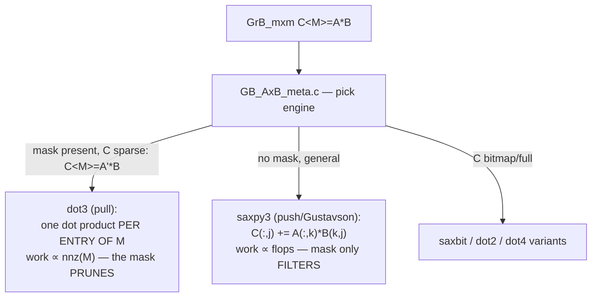

# Topic 20 — Sparse Linear Algebra & GraphBLAS Internals

Deep home turf. FalkorDB calls the GraphBLAS API daily; this topic
owns what's *underneath*: the formats SuiteSparse switches between,
the four SpGEMM engines behind one `GrB_mxm`, masks as the
execution model, and why push-vs-pull BFS is just SpMSpV-vs-SpMV.
M20 is the capstone's heart: our own kernels + delta matrices
replace the M13 adjacency core.

## 1. The format lattice (what one GrB_Matrix really is)

```
 density →
 hypersparse ──► sparse (CSR/CSC) ──► bitmap ──► full
 (rows list     (rowptr[n+1] +        (byte per  (no structure,
  only nonempty  colidx per edge)      cell +     just values)
  rows: h[] +                          values)
  their ptrs)

 nvals ≪ nrows   nvals ~ O(nrows)     nvals >    every cell
 (10M×10M with   the graph default    ~4-8% of   present
  100K edges)                         n×m
```

Switch heuristics are *numbers in the code*, not magic:
sparse→bitmap when `nnz > bitmap_switch * nrows*ncols`
(GB_convert_sparse_to_bitmap_test.c:32-38, default per-op table);
hyper↔sparse via `hyper_switch` on the count of non-empty vectors
(GB_conform_hyper.c:52); all applied by `GB_conform`
(GB_conform.c:33-89) after every operation. Why hypersparse matters
to FalkorDB: node IDs are a namespace, most rows of a relation
matrix are empty — CSR's rowptr alone for 10M nodes = 80 MB *per
relation type* without it.

## 2. One mxm, four engines (Source/mxm/)



`GB_AxB_saxpy3.c:22-60` is the scheduling essay: B split into
coarse tasks (own whole vectors) and fine tasks (teams share one
vector); each task independently picks **Gustavson** (dense
workspace of size m — the SPA) or **hash** (table sized 2×next-pow2
of estimated flops) — hash wins when the workspace would be cold,
Gustavson when the hash would exceed m/16 (:57). A *flopcount* pass
(GB_AxB_saxpy3_flopcount.c) sizes everything first — cudf's
size/retrieve two-phase (topic 18), five years earlier.

`GB_AxB_dot3.c` computes `C<M>=A'*B` *only where M has entries* — the
reason FalkorDB masks are free performance, and the exact semantics
our stub reproduces.

## 3. Push vs pull = vxm vs mxv (the Beamer SC'12 story)

LAGraph's production BFS (template/LG_BreadthFirstSearch_SSGrB
_template.c) is direction-optimizing BFS written in linear algebra:

```
 push (frontier small):  q'<!visited> = q' * A     (GrB_vxm :307)
   work ∝ edges OUT of frontier — SpMSpV, saxpy engine
 pull (frontier huge):   q<!visited>  = AT * q     (GrB_mxv :313)
   work ∝ rows still unvisited × early-exit — SpMV dot engine,
   each unvisited vertex scans ITS in-edges, stops at first hit

 switch push→pull: frontier growing AND (nq > n/β1  OR
   pushwork > unexplored/α)          α=8, β1=8   (:184-187, :261)
 switch pull→push: frontier shrinking below n/β2, β2=512
```

The semiring is `ANY_SECONDI` (:140-143): ANY = "any parent will do"
(Gunrock's benign-race, done algebraically — topic 18), SECONDI =
"the value is the edge's source index" — the parent vector computed
with zero comparisons. Guide: [reading-lagraph.md](reading-lagraph.md)
+ [reading-beamer-sc12.md](reading-beamer-sc12.md).

## 4. Masks, semirings, ANY — the execution model

The GraphBLAS trinity, as an *executor* design:

- **semiring (⊕,⊗)**: the inner loop's two ops. Swapping (+,×) for
  (min,+) turns SpMV into SSSP relaxation; (ANY,PAIR) turns it into
  reachability with early exit.
- **mask `C<M>=...`**: not post-filtering — dot3 *iterates the mask*,
  so structural masks change complexity class (triangle counting:
  compute (L*U')∘L touches only wedges that close — LAGr_
  TriangleCount.c:31-46 lists all six masked formulations).
- **accum + non-blocking mode**: GrB_wait boundaries let SuiteSparse
  defer/fuse — the API-level hook FalkorDB's delta matrices exploit.

## 5. Delta matrices — FalkorDB's own layer (fresh eyes)

`~/repos/FalkorDB/src/graph/delta_matrix/` — the answer to "GrB
matrices are fast to read, slow to mutate one edge at a time":

```
 Delta_Matrix = M (settled GrB_Matrix, hypersparse CSR)
              + delta-plus  DP (pending additions)
              + delta-minus DM (pending deletions)
              + the same trio TRANSPOSED        (delta_matrix.h:110-113)

 read:   A ≡ (M + DP) minus DM
 write:  O(1)-ish into DP/DM (bitmap/hash-friendly, tiny)
 sync:   Delta_Matrix_wait — M ←(M ∪ DP) \ DM, clear deltas
         (delta_wait.c:13-46: deletions via GrB_transpose-as-copy
          with GrB_DESC_RSCT0 mask trick, additions via assign)
 mxm:    (A*(M+DP))<!A*DM> — delta_mxm.c:44-86 folds pending state
         into ONE masked multiply instead of forcing a sync
```

This is topic 3's LSM memtable+tombstones, rebuilt over matrices —
same read-merge, same deferred compaction, same "don't block the
writer" motive. Guide:
[reading-falkordb-delta-matrix.md](reading-falkordb-delta-matrix.md).

## 6. Where the other topics plug in

- SpGEMM hash-vs-Gustavson = topic 8's hash-vs-sort aggregation
  choice, per task.
- dot3's mask-driven iteration = topic 10's semi-join pushdown.
- saxpy3 flopcount pre-pass = topic 18's cudf size/retrieve.
- JIT'd semiring kernels = topic 19's jitifyer ladder — every
  measured number here runs through it.
- GPU GraphBLAS (GraphBLAST/Gunrock) = topic 18's regime question:
  frontiers ship, matrices stay resident.

## Experiments (`experiments/`)

| file | role |
|---|---|
| src/csr.rs | PROVIDED — CSR type, COO→CSR build, transpose, RMAT + uniform generators |
| src/spmv.rs | PROVIDED — row-parallel SpMV (f64) + (ANY,PAIR) bool variant |
| src/spgemm.rs | PROVIDED hash-Gustavson (HashMap SPA, slow-but-obvious); **STUB** dense-SPA Gustavson (scatter/gather workspace, the saxpy3 coarse task) |
| src/bfs.rs | PROVIDED scalar queue BFS oracle; **STUB** push (SpMSpV), pull (masked SpMV w/ early exit), and direction-optimizing switch |
| src/hyper.rs | PROVIDED — hypersparse row index; bench shows when 80 MB of rowptr disappears |
| src/bin/gb_bench.rs | PROVIDED — RMAT scale sweep: SpMV GB/s, SpGEMM variants, BFS push/pull/adaptive with per-level frontier trace |

```bash
cd topics/20-graphblas/experiments
cargo test         # oracle + provided green; stubs panic
cargo run --release --bin gb_bench
```

## M20 (capstone)

- [ ] sparse kernel core: CSR + hypersparse, SpMV/SpMSpV, masked
      dot-SpGEMM subset, (ANY,PAIR)/(PLUS,TIMES)/(MIN,PLUS) semirings
- [ ] delta-matrix layer over it (DP/DM + transposed pair, wait, the
      delta_mxm fold) replacing the M13 adjacency core
- [ ] LDBC bench vs reference `graph/src/graph/graphblas` layer;
      direction-optimizing BFS parity with LAGraph's α/β thresholds

## Reading order

1. reading-davis-toms19.md — the system paper (+ v2 update)
2. reading-suitesparse-internals.md — formats, conform, saxpy3/dot3
3. reading-gustavson-spgemm.md — the '78 paper + Buluç-Gilbert survey
4. reading-beamer-sc12.md — direction-optimizing BFS
5. reading-lagraph.md — the algorithms as executable linear algebra
6. reading-falkordb-delta-matrix.md — then implement the stubs
