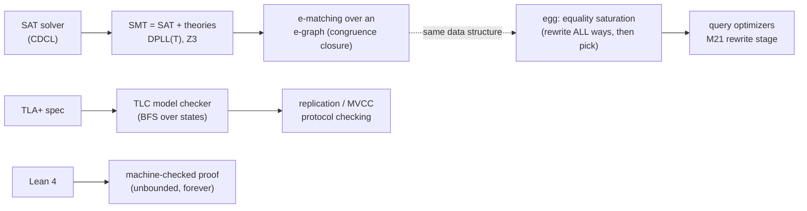
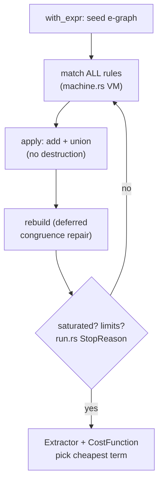

# Topic 21 — Formal Methods & Verification

Testing (topic 16) finds bugs you imagined; formal methods find the
ones you didn't. This topic covers the three tools that actually get
used in databases — TLA+ (model checking protocols), e-graphs
(equality saturation for optimizers), SMT (Z3) — plus Lean 4 for the
proof end of the spectrum.

```
                 what it checks         effort    used by
  fuzz/PBT (16)  behaviors you generate  hours    everyone
  TLA+ / TLC     ALL behaviors of a      days     AWS, MongoDB,
                 finite model                     CockroachDB
  SMT (Z3)       one logical formula     mins     query verifiers
                 (validity/satisfiab.)            (Cosette), symex
  Lean 4 proof   the actual theorem,     weeks    seL4-style kernels,
                 unbounded                        mathlib
```



## 1. E-graphs: the data structure

An e-graph = union-find over e-classes + hashcons (memo) + congruence
closure. It stores a **set of terms closed under equivalence**,
compactly: `2*x` and `x<<1` live in the same e-class, and every
parent of that class automatically has both forms.

```
  e-class {a*2, a<<1}          union-find: id → canonical id
       /        \              hashcons:  node → e-class id
   e-class{a}  e-class{2,1<<0?}   (topic 8's hash table, again)
```

Three ops (egg `src/egraph.rs`):
- `add` (:970) — hashcons hit or new singleton class
- `union` (:1147) — union-find merge; repair is DEFERRED
- `rebuild` (:1416) — restore congruence invariant in one batched
  pass (`process_unions` :1346 re-canonicalizes and re-unions until
  fixpoint). Deferring this is egg's headline contribution — the
  same amortize-the-repair move as delta matrices' `wait` (topic 20)
  and LSM compaction (topic 4).

## 2. Equality saturation vs hand-ordered rules

Topic 10's optimizer applies rules in a fixed order, destructively.
Order is a silent correctness-of-outcome bug:

```
        (a*2)/2
  hand (ordered):  strength-reduce FIRST → (a<<1)/2 … stuck, cost 5
  egg (saturate):  keep BOTH forms; (x*y)/z→x*(y/z) still matches
                   → a*(2/2) → a*1 → a, cost 1
```



The catch: the e-graph can blow up (assoc+comm rules alone are
exponential), so `Runner` has node/iter/time limits — saturation is
best-effort, extraction is greedy per-class. This is a *search
budget*, the same shape as topic 10's join-order DP cutoff.

## 3. TLA+ — spec the scary parts

`specs/WalReplication.tla` models topic 15's WAL shipping: sequential
entries, prefix logs (so a log is just a length), quorum commit,
crash, longest-log failover. TLC exhaustively checks every
interleaving of a 3-replica, 3-entry model:

| config | states (distinct) | result |
|---|---|---|
| `SyncCommit = TRUE` | 2583 (1080), depth 14 | **Durability holds** |
| `SyncCommit = FALSE` | 123 checked | **violated at depth 5** |

The counterexample TLC prints is the exact PostgreSQL
`synchronous_commit = off` data-loss story: Append → Commit (no
quorum) → Crash(primary) → Failover(empty log) — committed=1, new
primary has nothing. Five states. No test generator finds this
*guaranteed*; TLC does, in under a second.

Run it: `java -cp ~/repos/tla2tools.jar tlc2.TLC -deadlock
WalReplication.tla` (flip `SyncCommit` in the .cfg to see the trace).

## 4. Z3 — SMT in one paragraph

CDCL SAT core + theory solvers (linear arithmetic, arrays,
uninterpreted functions) cooperating via DPLL(T); quantifiers via
e-matching **over a congruence-closure e-graph** — the same structure
as egg, built for search instead of rewriting. Z3's modern e-graph
(`src/ast/euf/euf_egraph.h:23`) literally cites egg's deferred
congruence repair. Databases meet Z3 in query equivalence checking
(Cosette, topic 16) and symbolic execution of UDFs.

## 5. Lean 4 — proofs, and a runtime worth reading

Proofs are unbounded (no MaxLog=3), but cost weeks not days. Lean's
own runtime is a systems story: Perceus reference counting with
reuse tokens gives functional-but-in-place updates — an RC design
directly relevant to any Rust engine tempted by `Arc` everywhere.
M21 taste: prove one delta-matrix invariant (`DP ∩ M = ∅` preserved
by set/remove) in Lean, and compare with the same property as a
proptest (topic 16).

## Reading guides

- [reading-aws-cacm15.md](reading-aws-cacm15.md) — why AWS specs in TLA+ (the motivation paper)
- [reading-egg-popl21.md](reading-egg-popl21.md) — egg paper + full source walkthrough
- [reading-z3-tacas08.md](reading-z3-tacas08.md) — Z3 architecture + euf e-graph anchors
- [reading-tlaplus-raft.md](reading-tlaplus-raft.md) — Specifying Systems pt I + Ongaro's raft.tla
- [reading-lean-perceus.md](reading-lean-perceus.md) — Immutable Beans + Perceus (the Lean runtime)

## Experiments

| file | status | what it shows |
|---|---|---|
| `expr.rs` | provided | tiny expression IR + AstSize cost + random gen |
| `hand.rs` | provided | ordered fixpoint rewriter with the R2-before-R4 trap |
| `eqsat.rs` | **stub** | `egg_optimize` — saturate, extract, beat the trap |
| `bin/eqsat_bench.rs` | provided | trap case + depth sweep, hand vs egg lanes |
| `specs/WalReplication.tla` | provided | quorum-commit WAL replication, TLC-checked |

## M21 checklist

- [ ] TLA+ spec of capstone MVCC visibility (or reuse WalReplication
      for the replication layer) checked by TLC in CI (a `java -cp
      tla2tools.jar` step — seconds at model scale)
- [ ] Lean proof of one delta-matrix invariant
- [ ] optional: egg-based rewrite stage in the planner, budgeted
      (node limit) and gated like topic 19's JIT threshold
