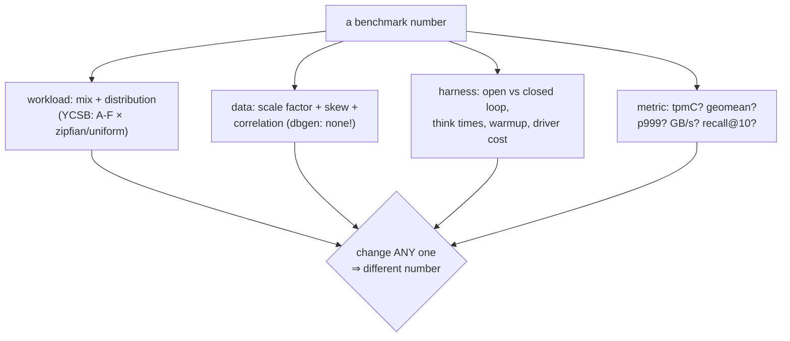

# Topic 22 — Standard Benchmarks: TPC-H, TPC-C, YCSB, LDBC & Friends

Benchmarks are engineering tools only if you know *what each query
actually stresses*. This topic maps the standard suites to their
choke points, builds the two most-copied pieces of benchmark
machinery (the YCSB Zipfian generator, TPC-H Q1/Q6), and sets up
M22's standing regression suite.

## The map

```
            OLTP ◄──────────────────────────► OLAP
  TPC-C  YCSB   TATP  SmallBank │ SSB  TPC-H  TPC-DS  ClickBench
  (txn    (KV                   │ (star (choke (100+q,  (one wide
  contention) mixes×skew)       │ schema) points) skew)   table)
                                │
  graph: LDBC SNB interactive (OLTP-ish) / BI (OLAP) / Graphalytics
  vector: ann-benchmarks (recall vs QPS — topic 14)
  real cardinalities: JOB (topic 10 — built because TPC-H is uniform)
```



## Choke points, one line each

- **TPC-H Q1**: tiny group domain ⇒ hash table free ⇒ pure
  expression eval + fused agg (our `q1_flat` makes it explicit).
- **TPC-H Q6**: 2%-selective scan ⇒ SIMD predicates, the "GB/s"
  headline query (our `q6_branchless`, topic 17's filter shapes).
- **TPC-H Q9**: 6-way join order + LIKE '%green%' + skew — the
  optimizer punisher (topic 10).
- **TPC-C**: the D_NEXT_O_ID hot counter + 1% remote warehouses +
  think times nobody runs — contention by design, not throughput.
- **YCSB**: mix × distribution factoring; θ=0.99 zipfian is the
  whole personality (see the generator math in the reading guide).
- **LDBC SNB**: correlated power-law datagen + choke points for
  graphs (topic 13's guide) — M22's centerpiece.

## Measured baselines (bench_suite, M3 Pro, single thread)

| lane | result |
|---|---|
| Q1 oracle (row-at-a-time HashMap) | SF 0.25: 10.2 ms, 5.6 GB/s effective |
| Q6 oracle (branchy scalar) | SF 0.25: 2.7 ms, 15.7 GB/s |
| YCSB uniform A/B/C/D/E/F | 2.88 / 4.15 / 3.72 / 4.40 / 1.11 / 2.85 Mops/s |
| YCSB E p50 | 917 ns — scans are 4× a point read, visible instantly |

Q6's oracle at 15.7 GB/s is already half of memory bandwidth with
branches — predict what branchless + autovec adds *at this 2%
selectivity* before implementing (topic 17 says: maybe nothing!).

## Benchmarking sins checklist (see topic 0's reading-fair-benchmarking.md)

1. closed-loop tails quoted as latency (coordinated omission)
2. warm cache vs cold unstated; SF that fits in LLC
3. "TPC-C" without think times ⇒ you measured a latch
4. geomean over arithmetic mean (or vice versa) chosen post hoc
5. comparing your tuned build vs their defaults (Fair Benchmarking's
   core sin)
6. uniform data standing in for skewed reality (dbgen's lie; JOB's
   reason to exist)

## Reading guides

- [reading-boncz-tpch.md](reading-boncz-tpch.md) — the choke-point paper, queries open
- [reading-ycsb.md](reading-ycsb.md) — YCSB + the zipfian generator internals (go-ycsb)
- [reading-oltpbench-tpcc.md](reading-oltpbench-tpcc.md) — OLTP-Bench/BenchBase + TPC-C's designed contention
- [reading-duckdb-tpch.md](reading-duckdb-tpch.md) — dbgen as a table function; run real TPC-H here
- topic 0: `reading-fair-benchmarking.md` (DBTest '18) — methodology
- topic 13: `reading-ldbc-snb.md` — SNB datagen + interactive driver
- topic 10: `reading-leis-vldb15.md` analogue — JOB, real cardinalities

## Experiments

| file | status | what it shows |
|---|---|---|
| `lineitem.rs` | provided | dbgen-lite columnar lineitem (SF×6M rows) |
| `tpch.rs` oracles | provided | Q1 HashMap row-at-a-time, Q6 branchy scalar |
| `tpch.rs` `q1_flat`/`q6_branchless` | **stub** | flat group array; mask-multiply scan |
| `zipf.rs` `Zipfian`/`Scrambled` | **stub** | THE YCSB generator, statistical contract tests |
| `ycsb.rs` | provided | A-F mixes, BTreeMap store, ns-percentile driver |
| `bin/bench_suite.rs` | provided | both sections, stub lanes catch_unwind |

## M22 checklist

- [ ] standing suite: LDBC SNB interactive + graph micro-benches +
      ann-benchmarks recall/QPS, one command, results as data files
- [ ] regression tracking across milestones (M0 baselines are the
      floor; every M* run appends, plots trend)
- [ ] three-way shootout: falkordb-scratch vs falkordb-rs-next-gen
      vs FalkorDB — same driver, same data, same machine, fair-
      benchmarking checklist applied
