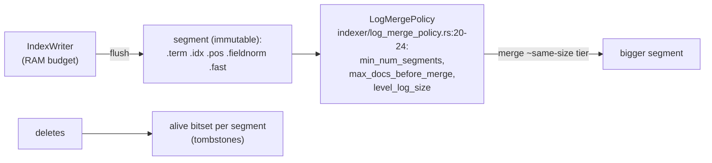

# tantivy: Lucene's architecture in readable Rust

The reference implementation for everything the previous chapters
derived: FST term dictionary, bitpacked posting blocks with
block-max skip data, BM25 as a table lookup, and an LSM-shaped
indexer. Before pointing you at source, this chapter walks the
engine as six concepts — the analysis pipeline, the term
dictionary, the posting blocks, the skip data, the scoring/WAND
wiring, and the segment write path — then hands you every file:line
anchor and a 90-minute read order.

## The problem in one sentence

Turn "quick fox" into a ranked top-10 over millions of documents in
single-digit milliseconds, while new documents stream in — using
only immutable files, four lookups deep:

```
 "quick fox" ──TextAnalyzer──► terms ──FST──► TermInfo ──► postings blocks ──► BM25 + WAND
   tokenizer/          termdict/fst_termdict/   postings/            query/
```

## The concepts, step by step

### Step 1 — analysis: text becomes terms before anything is indexed

An analyzer is the pipeline that converts raw text into the terms
the index actually stores: tokenize (split on word boundaries) →
lowercase → stem ("running" → "run") → drop stopwords. Query text
runs through the *same* pipeline, so query terms and indexed terms
meet in the same normalized space — mismatched analyzers are the
classic "search finds nothing" bug. tantivy models this as
composition: `TextAnalyzer` (`tokenizer/tokenizer.rs`) is a boxed
`Tokenizer` plus a filter chain (lower_caser, stemmer,
stop_word_filter, ngram…), with one dyn-dispatch per *stream*, not
per token — pipeline flexibility without a virtual call in the
per-token hot loop.

### Step 2 — the term dictionary: an FST from term bytes to postings

The term dictionary maps each term's bytes to where its postings
live. tantivy uses an **FST** (finite state transducer — a
minimized automaton over sorted keys that shares common prefixes
AND suffixes, like a trie compressed from both ends) mapping term
bytes → term ordinal → a `TermInfoStore` entry. Versus a hash map,
the FST is smaller (shared structure) and *ordered* — enabling
prefix, range, and regex queries by automaton intersection, which a
hash can never do. The price: an FST is built from sorted keys and
is immutable (`MapBuilder`, `termdict/fst_termdict/termdict.rs:25`,
insert at `:46`) — hence per-segment build + merge (Step 6), and
opening is mmap-friendly (`:92 open_fst_index`, `Fst::new(bytes)` —
no deserialization).

The value side is `TermInfo { doc_freq, postings_range }`
(`postings/term_info.rs:9-13`): **df rides in the dictionary**, so
idf — and WAND's per-term ceiling — is known before a single
posting is read.

### Step 3 — posting blocks: 128 deltas, one bit width, SIMD unpack

Posting lists store doc ids as deltas (previous chapter's Zipf
argument) in fixed blocks of 128 (`postings/compression/mod.rs:3`,
`COMPRESSION_BLOCK_SIZE = BitPacker4x::BLOCK_LEN`), where each
block is bit-packed to the width of its *largest* delta (`:61`,
delta-encoded against `block_minus_one`):

```rust
// 128 doc-id deltas, bit-packed to the WHOLE block's max width
fn write_block(docs: &[u32; 128], prev_last: u32, out: &mut Vec<u8>) {
    let mut deltas = [0u32; 128];
    for i in 0..128 {
        deltas[i] = docs[i] - if i == 0 { prev_last } else { docs[i - 1] };
    }
    let bits = 32 - deltas.iter().max().unwrap().leading_zeros() as u8;
    out.push(bits);              // ONE width per block → SIMD unpacks all
    bitpack(&deltas, bits, out); //   128 at once, no per-posting branches
}
// next to it, a skip entry: { last_doc, block_max_score } — WAND moves
// across blocks without ever decoding the losers
```

One width per block wastes a few bits on outlier deltas but buys
branchless SIMD decode of 128 postings at once — the opposite
trade from RediSearch's per-entry varint (next chapter, and
question 3 covers the <128-tail vint fallback).

### Step 4 — skip data: block metadata that answers questions without decoding

Next to each compressed block lives an uncompressed skip entry:
`last_doc_in_block` (`postings/skip.rs:186`) and
`block_max_score` (`:175`, via `bm25_weight`), read through
`SkipReader` (`:93`). This is the block-max WAND chapter's
"shallow pointer movement" made concrete: a cursor can answer "does
this block contain doc ≥ d?" and "can this block possibly beat θ?"
from metadata alone, decompressing only blocks that survive both
tests. The design rule: keep the metadata that *steers* uncompressed
and tiny, and the payload it steers compressed and bulky.

### Step 5 — scoring and WAND: the previous chapters, wired together

Scoring is BM25 exactly as derived: K1/B at `query/bm25.rs:8-9`,
idf at `:52`, and the length-norm term precomputed per 1-byte
fieldnorm into a 256-entry table (`:59`) — scoring is a table
lookup plus one multiply-add per posting. Top-k evaluation is
block-max WAND: `find_pivot_doc`
(`query/boolean_query/block_wand_union.rs:8-24`) walks scorers
sorted by doc id accumulating `max_weight` until it crosses the
threshold — the SIGIR'11 paper, shipped — with the sibling
`block_wand_intersection.rs` for AND queries. Nothing in this step
is new if you read the two previous chapters; that's the point —
tantivy is those papers with error handling.

### Step 6 — the write path: topic 4's LSM wearing a hat

Everything above is immutable — so writes go to an in-RAM segment
that is *flushed*, never updated:



`LogMergePolicy` groups segments into log-size levels and merges
within a level — Lucene's tiered compaction, not leveled: full-text
tolerates overlapping "levels" because every query fans out over all
segments anyway (there's no key range to prune, unlike topic 4's
SSTable ranges). Deletes are an alive-bitmap per segment, purged at
merge. The cost of more segments isn't wrong answers — it's
per-query fan-out and duplicated dictionary lookups (question 4).

Fast fields (`fastfield/`) are the columnar side — doc values for
sorting/faceting — literally topic 12 embedded in a text index.

## Where each step lives in the code

| subsystem (step) | anchor | what to see |
|---|---|---|
| analysis (1) | `tokenizer/tokenizer.rs` `TextAnalyzer` — boxed `Tokenizer` + filter chain (lower_caser, stemmer, stop_word_filter, ngram…) | pipelines as composition, one dyn-dispatch per stream not per token |
| term dict (2) | `termdict/fst_termdict/termdict.rs:25` builder wraps `tantivy_fst::MapBuilder`; `:46 insert(term, &TermInfo)`; `:92 open_fst_index` (mmap-friendly `Fst::new(bytes)`) | FST maps term bytes → term ordinal → `TermInfoStore` — prefix+suffix sharing beats a hash dict AND gives range/regex queries |
| term info (2) | `postings/term_info.rs:9-13` `TermInfo { doc_freq, postings_range }` | df rides in the dictionary — idf is known before touching postings |
| postings (3) | `postings/compression/mod.rs:3` `COMPRESSION_BLOCK_SIZE = BitPacker4x::BLOCK_LEN` (=128); `:61` delta-encode against `block_minus_one` | 128 deltas bit-packed to the block's max width; SIMD unpack |
| skip data (4) | `postings/skip.rs:93` `SkipReader`; `:175 block_max_score(bm25_weight)`; `:186 last_doc_in_block` | block-max metadata lives in skip entries — moving blocks never decodes postings |
| scoring (5) | `query/bm25.rs:8-9` K1/B; `:52` idf; `:59` tf-norm via 1-byte fieldnorm table | scoring = table lookup + multiply-add |
| WAND (5) | `query/boolean_query/block_wand_union.rs:8-24` `find_pivot_doc`; sibling `block_wand_intersection.rs` | the SIGIR'11 paper, shipped |
| merge (6) | `indexer/log_merge_policy.rs:20-24` | tiered, not leveled, compaction |

Suggested 90-minute read order:

1. `postings/term_info.rs` + `termdict/fst_termdict/termdict.rs` (15')
2. `postings/compression/mod.rs` then `skip.rs` (25')
3. `query/bm25.rs` (10')
4. `query/boolean_query/block_wand_union.rs` — compare with your
   `wand_topk` after implementing, not before (30')
5. `indexer/log_merge_policy.rs` (10')

## Questions (answer in notes.md)

1. Why an FST and not a hash map for the term dictionary? List the
   three query types the FST enables that a hash can't, and the cost
   (insert path — `MapBuilder` needs sorted keys, hence per-segment
   build + merge).
2. `TermInfo.doc_freq` lives in the dictionary. Which of WAND's
   inputs does that make free, before any posting is read?
3. BitPacker4x blocks of 128: what happens to the last <128 postings
   of a list (see compression/mod.rs's vint fallback)? Compare with
   RediSearch's always-varint choice.
4. LogMergePolicy vs topic 4's leveled compaction: why does
   overlapping-tiers hurt an LSM's point reads but not a text
   index's queries? What DOES more segments cost here?
5. Quickwit runs tantivy segments on object storage (topic 28
   preview): which of the five segment files does BM25 top-k
   actually need to fetch, and in what order — how does the layout
   minimize round trips?

## References

**Code**
- [tantivy](https://github.com/quickwit-oss/tantivy) — the anchors
  above: `src/tokenizer/tokenizer.rs`,
  `src/termdict/fst_termdict/termdict.rs`,
  `src/postings/term_info.rs`, `src/postings/compression/mod.rs`,
  `src/postings/skip.rs`, `src/query/bm25.rs`,
  `src/query/boolean_query/block_wand_union.rs`,
  `src/indexer/log_merge_policy.rs` — the 90-minute order above is
  the recommended pass
