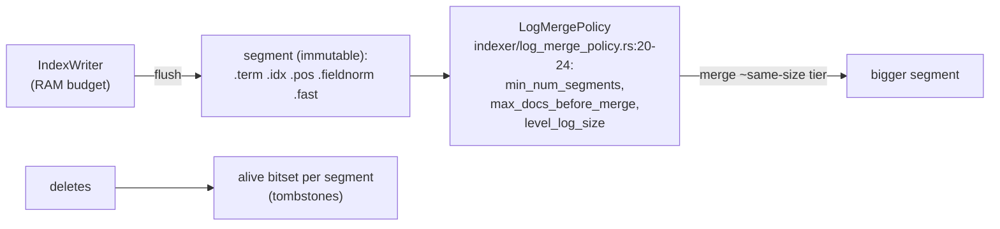

# Reading guide — tantivy internals (`~/repos/tantivy`)

Lucene's architecture, rewritten in readable Rust. Read it as four
subsystems: analysis, term dictionary, postings, and the LSM-shaped
indexer. Everything below is anchored to source.

## The read path, file by file

```
 "quick fox" ──TextAnalyzer──► terms ──FST──► TermInfo ──► postings blocks ──► BM25 + WAND
   tokenizer/          termdict/fst_termdict/   postings/            query/
```

| subsystem | anchor | what to see |
|---|---|---|
| analysis | `tokenizer/tokenizer.rs` `TextAnalyzer` — boxed `Tokenizer` + filter chain (lower_caser, stemmer, stop_word_filter, ngram…) | pipelines as composition, one dyn-dispatch per stream not per token |
| term dict | `termdict/fst_termdict/termdict.rs:25` builder wraps `tantivy_fst::MapBuilder`; `:46 insert(term, &TermInfo)`; `:92 open_fst_index` (mmap-friendly `Fst::new(bytes)`) | FST maps term bytes → term ordinal → `TermInfoStore` — prefix+suffix sharing beats a hash dict AND gives range/regex queries |
| term info | `postings/term_info.rs:9-13` `TermInfo { doc_freq, postings_range }` | df rides in the dictionary — idf is known before touching postings |
| postings | `postings/compression/mod.rs:3` `COMPRESSION_BLOCK_SIZE = BitPacker4x::BLOCK_LEN` (=128); `:61` delta-encode against `block_minus_one` | 128 deltas bit-packed to the block's max width; SIMD unpack |
| skip data | `postings/skip.rs:93` `SkipReader`; `:175 block_max_score(bm25_weight)`; `:186 last_doc_in_block` | block-max metadata lives in skip entries — moving blocks never decodes postings |
| scoring | `query/bm25.rs:8-9` K1/B; `:52` idf; `:59` tf-norm via 1-byte fieldnorm table | scoring = table lookup + multiply-add |
| WAND | `query/boolean_query/block_wand_union.rs:8-24` `find_pivot_doc`; sibling `block_wand_intersection.rs` | the SIGIR'11 paper, shipped |

## The write path = topic 4 wearing a hat



`LogMergePolicy` groups segments into log-size levels and merges
within a level — Lucene's tiered compaction, not leveled: full-text
tolerates overlapping "levels" because every query fans out over all
segments anyway (there's no key range to prune, unlike topic 4's
SSTable ranges).

Fast fields (`fastfield/`) are the columnar side — doc values for
sorting/faceting — literally topic 12 embedded in a text index.

## Suggested 90-minute read order

1. `postings/term_info.rs` + `termdict/fst_termdict/termdict.rs` (15')
2. `postings/compression/mod.rs` then `skip.rs` (25')
3. `query/bm25.rs` (10')
4. `query/boolean_query/block_wand_union.rs` — compare with your
   `wand_topk` after implementing, not before (30')
5. `indexer/log_merge_policy.rs` (10')

## Questions (answer in notes.md)

1. Why an FST and not a hash map for the term dictionary? List the
   three query types the FST enables that a hash can't, and the cost
   (insert path — `MapBuilder` needs sorted keys, hence per-segment
   build + merge).
2. `TermInfo.doc_freq` lives in the dictionary. Which of WAND's
   inputs does that make free, before any posting is read?
3. BitPacker4x blocks of 128: what happens to the last <128 postings
   of a list (see compression/mod.rs's vint fallback)? Compare with
   RediSearch's always-varint choice.
4. LogMergePolicy vs topic 4's leveled compaction: why does
   overlapping-tiers hurt an LSM's point reads but not a text
   index's queries? What DOES more segments cost here?
5. Quickwit runs tantivy segments on object storage (topic 28
   preview): which of the five segment files does BM25 top-k
   actually need to fetch, and in what order — how does the layout
   minimize round trips?
