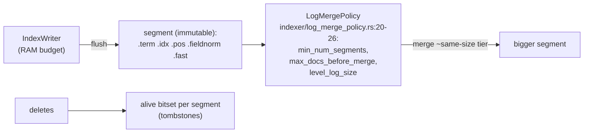

# tantivy: Lucene's architecture in readable Rust

The reference implementation for everything the previous chapters
derived: FST term dictionary, bitpacked posting blocks with
block-max skip data, BM25 as a table lookup, and an LSM-shaped
indexer. Before pointing you at source, this chapter walks the
engine as six concepts — the analysis pipeline, the term
dictionary, the posting blocks, the skip data, the scoring/WAND
wiring, and the segment write path — then hands you every file:line
anchor and a 90-minute read order.

Source pin: every anchor below is tantivy at `7152d53` and was
re-verified with `tools/pinned-source.py` at that SHA. A **segment**
is one immutable, self-contained mini-index (its own dictionary +
postings); a query fans out over all of them.

## The problem in one sentence

Turn "quick fox" into a ranked top-10 over millions of documents in
single-digit milliseconds, while new documents stream in — using
only immutable files, four lookups deep:

```
 "quick fox" ──TextAnalyzer──► terms ──FST──► TermInfo ──► postings blocks ──► BM25 + WAND
   tokenizer/          termdict/fst_termdict/   postings/            query/
```

## The concepts, step by step

### Step 1 — analysis: text becomes terms before anything is indexed

> **In:** raw document text (and, at query time, raw query text).
> **Out:** a stream of normalized terms produced by the *same* pipeline for both, so query terms and indexed terms meet in one space.

An **analyzer** is the pipeline that converts raw text into the terms
the index actually stores: tokenize (split on word boundaries) →
lowercase → stem ("running" → "run") → drop stopwords. Query text
runs through the *same* pipeline, so query terms and indexed terms
meet in the same normalized space — mismatched analyzers are the
classic "search finds nothing" bug. tantivy models this as
composition: `TextAnalyzer` (`tokenizer/tokenizer.rs:9-11`) is a
single boxed `Box<dyn BoxableTokenizer>` (:10) wrapping a
tokenizer plus its filter chain (lower_caser, stemmer,
stop_word_filter, ngram…). `token_stream` does one dyn-dispatch per
*stream* (:19-20), not per token — pipeline flexibility without a
virtual call in the per-token hot loop.

### Step 2 — the term dictionary: an FST from term bytes to postings

> **In:** a term's bytes (e.g. `b"fox"`).
> **Out:** a `TermInfo` — where the postings live and how many docs contain the term — reached through an ordered automaton, not a hash.

The term dictionary maps each term's bytes to where its postings
live. tantivy uses an **FST** (finite state transducer — a
minimized automaton over sorted keys that shares common prefixes
AND suffixes, like a trie compressed from both ends) mapping term
bytes → term ordinal → a `TermInfoStore` entry. Versus a hash map,
the FST is smaller (shared structure) and *ordered* — enabling
prefix, range, and regex queries by automaton intersection, which a
hash can never do. The price: an FST is built from sorted keys and
is immutable (`MapBuilder` field at
`termdict/fst_termdict/termdict.rs:25`, `insert(term, &TermInfo)` at
`:46`) — hence per-segment build + merge (Step 6), and opening is
mmap-friendly (`:92 open_fst_index`, `Fst::new(bytes)` at `:94` — no
deserialization).

The value side is `TermInfo { doc_freq, postings_range,
positions_range }` (`postings/term_info.rs:9-16` — `doc_freq` at
:11, the `.idx` byte range at :13, the `.pos` byte range at :15):
**df rides in the dictionary**, so idf — and WAND's per-term ceiling
— is known before a single posting is read.

### Step 3 — posting blocks: 128 deltas, one bit width, SIMD unpack

> **In:** a term's doc-sorted posting list.
> **Out:** fixed 128-doc blocks, each delta-encoded and bit-packed to the width of its largest delta, so all 128 unpack branch-free with SIMD.

Posting lists store doc ids as deltas (previous chapter's Zipf
argument) in fixed blocks of 128
(`postings/compression/mod.rs:3`, `COMPRESSION_BLOCK_SIZE =
BitPacker4x::BLOCK_LEN` = 128). Doc-id blocks are *strictly sorted*,
so they go through `compress_block_sorted(block, offset)`
(`compression/mod.rs:36-46`): it delta-encodes against `offset` —
the previous block's last doc id (`None` for the first block, :39) —
then bitpacks with `compress_strictly_sorted` (:43-44) to the width
of the block's largest delta. (The separate `block_minus_one` path
at `:61` is inside `compress_block_unsorted` (:54-69) for
*term-frequency* values, which are ≥1 and unsorted — comment
:50-53; it is NOT the doc-id delta path, a point an earlier draft of
this guide got wrong.) Worked, for a block whose largest gap is 100:

```
bits    = 32 − leading_zeros(100) = 32 − 25 = 7 bits per delta
block   = 1 width byte + ⌈7·128 / 8⌉ = 1 + 112 = 113 bytes for 128 docs
        ≈ 7.06 bits/posting — vs 32 bits raw, and one branch-free SIMD unpack
```

The design, reconstructed (the real code delegates the pack to
`BitPacker4x`):

```rust
// ILLUSTRATION — the real doc-id path is compress_block_sorted at
// src/postings/compression/mod.rs:36-46, which calls the SIMD
// BitPacker4x::compress_strictly_sorted (offset = prev block's last doc).
fn write_block(docs: &[u32; 128], prev_last: u32, out: &mut Vec<u8>) {
    let mut deltas = [0u32; 128];
    for i in 0..128 {
        deltas[i] = docs[i] - if i == 0 { prev_last } else { docs[i - 1] };
    }
    let bits = 32 - deltas.iter().max().unwrap().leading_zeros() as u8;
    out.push(bits);              // ONE width per block → SIMD unpacks all
    bitpack(&deltas, bits, out); //   128 at once, no per-posting branches
}
```

One width per block wastes a few bits on outlier deltas but buys
branchless SIMD decode of 128 postings at once — the opposite
trade from RediSearch's per-entry varint (next chapter, and
question 3 covers the <128-tail vint fallback).

### Step 4 — skip data: block metadata that answers questions without decoding

> **In:** a compressed posting list and a WAND cursor asking "any doc ≥ d here? could this block beat θ?".
> **Out:** both answers from a tiny uncompressed skip entry, decoding only blocks that survive both tests.

Next to each compressed block lives an uncompressed skip entry, read
through `SkipReader` (`postings/skip.rs:93`). It stores the block's
`last_doc_in_block` (`:186-187`) and the block-WAND inputs
`(block_wand_fieldnorm_id, block_wand_term_freq)` (:113-114) — not
the score itself; `block_max_score(bm25_weight)` (`:175-181`)
*recomputes* the ceiling on demand via `bm25_weight.score(...)`,
returning `None` for the last incomplete block. This is the
block-max WAND chapter's "shallow pointer movement" made concrete: a
cursor can answer "does this block contain doc ≥ d?" and "can this
block possibly beat θ?" from metadata alone, decompressing only
blocks that survive both tests. The design rule: keep the metadata
that *steers* uncompressed and tiny, and the payload it steers
compressed and bulky.

### Step 5 — scoring and WAND: the previous chapters, wired together

> **In:** a `TermInfo` per query term and a posting stream.
> **Out:** a BM25 score per surviving doc (a table lookup + one multiply-add) and a block-max WAND top-k loop over them — the two previous chapters, shipped.

Scoring is BM25 exactly as derived: K1/B at `query/bm25.rs:8-9`,
idf at `:52-56`, and the length-norm term precomputed per 1-byte
fieldnorm into a 256-entry table (`cached_tf_component` :58-60,
`compute_tf_cache` :62-68) — scoring is a table lookup plus one
multiply-add per posting. Top-k evaluation is block-max WAND:
`find_pivot_doc` (`query/boolean_query/block_wand_union.rs:16-43`)
walks scorers sorted by doc id accumulating `max_score` (:20, :25)
until it crosses `threshold` (:26) — the SIGIR'11 paper, shipped —
with the sibling `block_wand_intersection.rs` for AND queries.
Nothing in this step is new if you read the two previous chapters;
that's the point — tantivy is those papers with error handling.

### Step 6 — the write path: topic 4's LSM wearing a hat

> **In:** a stream of new documents into an immutable-file engine.
> **Out:** RAM-buffered segments flushed (never updated) to disk, then merged in log-size tiers — an LSM without a key range to prune.

Everything above is immutable — so writes go to an in-RAM segment
that is *flushed*, never updated:


```mermaid
graph LR
    A["IndexWriter<br/>(RAM budget)"] -->|flush| S1["segment (immutable):<br/>.term .idx .pos .fieldnorm .fast"]
    S1 --> MP["LogMergePolicy<br/>indexer/log_merge_policy.rs:20-26:<br/>min_num_segments,<br/>max_docs_before_merge,<br/>level_log_size"]
    MP -->|merge ~same-size tier| S2["bigger segment"]
    D["deletes"] --> DB["alive bitset per segment<br/>(tombstones)"]
```

`LogMergePolicy` (struct :20-26; defaults :8-11 —
`level_log_size=0.75`, `min_layer_size=10_000`,
`min_num_segments=8`, `max_docs_before_merge=10_000_000`) groups
segments into log-size levels and merges within a level — Lucene's
tiered compaction, not leveled: full-text tolerates overlapping
"levels" because every query fans out over all segments anyway
(there's no key range to prune, unlike topic 4's SSTable ranges).
Deletes are an alive-bitmap per segment, purged at merge. The cost
of more segments isn't wrong answers — it's per-query fan-out and
duplicated dictionary lookups (question 4).

Fast fields (`fastfield/`) are the columnar side — doc values for
sorting/faceting — literally topic 12 embedded in a text index.

## Where each step lives in the code

| subsystem (step) | anchor | what to see |
|---|---|---|
| analysis (1) | `tokenizer/tokenizer.rs:9-11` `TextAnalyzer` (boxed `BoxableTokenizer`); `token_stream` :19-20 | pipelines as composition, one dyn-dispatch per stream not per token |
| term dict (2) | `termdict/fst_termdict/termdict.rs:25` `MapBuilder` field; `:46 insert(term, &TermInfo)`; `:92 open_fst_index` (mmap `Fst::new` :94) | FST maps term bytes → term ordinal → `TermInfoStore` — prefix+suffix sharing beats a hash dict AND gives range/regex queries |
| term info (2) | `postings/term_info.rs:9-16` `TermInfo { doc_freq, postings_range, positions_range }` | df rides in the dictionary — idf is known before touching postings |
| postings (3) | `postings/compression/mod.rs:3` `COMPRESSION_BLOCK_SIZE` (=128); doc-id path `compress_block_sorted` :36-46 (delta vs prev block's last, then bitpack) | 128 deltas bit-packed to the block's max width; SIMD unpack |
| skip data (4) | `postings/skip.rs:93` `SkipReader`; `:175-181 block_max_score(bm25_weight)` (recomputes); `:186-187 last_doc_in_block` | block-max metadata lives in skip entries — moving blocks never decodes postings |
| scoring (5) | `query/bm25.rs:8-9` K1/B; `:52-56` idf; `:58-68` tf-norm 256-entry fieldnorm table | scoring = table lookup + multiply-add |
| WAND (5) | `query/boolean_query/block_wand_union.rs:16-43` `find_pivot_doc`; sibling `block_wand_intersection.rs` | the SIGIR'11 paper, shipped |
| merge (6) | `indexer/log_merge_policy.rs:20-26` | tiered, not leveled, compaction |

Suggested 90-minute read order:

1. `postings/term_info.rs` + `termdict/fst_termdict/termdict.rs` (15')
2. `postings/compression/mod.rs` then `skip.rs` (25')
3. `query/bm25.rs` (10')
4. `query/boolean_query/block_wand_union.rs` — compare with your
   `wand_topk` after implementing, not before (30')
5. `indexer/log_merge_policy.rs` (10')

## Questions (answer in notes.md)

1. Why an FST and not a hash map for the term dictionary? List the
   three query types the FST enables that a hash can't, and the cost
   (insert path — `MapBuilder` needs sorted keys, hence per-segment
   build + merge).
2. `TermInfo.doc_freq` lives in the dictionary. Which of WAND's
   inputs does that make free, before any posting is read?
3. BitPacker4x blocks of 128: what happens to the last <128 postings
   of a list (see compression/mod.rs's vint fallback)? Compare with
   RediSearch's always-varint choice.
4. LogMergePolicy vs topic 4's leveled compaction: why does
   overlapping-tiers hurt an LSM's point reads but not a text
   index's queries? What DOES more segments cost here?
5. Quickwit runs tantivy segments on object storage (topic 28
   preview): which of the five segment files does BM25 top-k
   actually need to fetch, and in what order — how does the layout
   minimize round trips?

## Done when

Answer each before unfolding it.

- [ ] You can say why the term dictionary is an FST rather than a hash map, and list what the FST gives you that a hash cannot.
  <details><summary>ordered automaton vs hash</summary>
  An FST shares prefixes AND suffixes (smaller than a hash dict) and
  keeps keys *ordered*, so prefix, range, and regex queries run by
  automaton intersection — a hash offers none of these. The cost:
  build-from-sorted-keys + immutability, hence per-segment build and
  merge.
  </details>
- [ ] You can describe 128-delta posting blocks with one bit width, and what happens to a final partial block.
  <details><summary>fixed blocks + vint tail</summary>
  Each 128-doc block is delta-encoded (`compress_block_sorted`,
  compression/mod.rs:36-46) and bit-packed to the block's largest
  delta width — one width byte + packed deltas, SIMD-unpacked. The
  trailing <128 postings can't fill a BitPacker4x block, so they fall
  back to variable-length ints (question 3).
  </details>
- [ ] You can explain what skip data answers without decoding.
  <details><summary>steer without decode</summary>
  A skip entry (skip.rs:93) gives `last_doc_in_block` (:186-187) and
  the block-WAND inputs to recompute `block_max_score` (:175-181), so
  a cursor answers "any doc ≥ d here?" and "can this block beat θ?"
  from metadata — decoding only blocks that survive both.
  </details>
- [ ] You can explain why the write path is topic 4's LSM wearing a hat, and contrast LogMergePolicy with leveled compaction.
  <details><summary>tiered, no key range</summary>
  Writes buffer in RAM and flush to immutable segments; merges happen
  in log-size tiers (LogMergePolicy :20-26), like Lucene's tiered
  compaction. Unlike a leveled LSM there's no key range to prune —
  every query fans out over all segments — so overlapping tiers cost
  fan-out, not correctness.
  </details>
- [ ] You wrote answers to all five questions in notes.md, including which of WAND's needs `TermInfo.doc_freq` serves.
  <details><summary>check</summary>
  Five answers in notes.md; the doc_freq one names idf (and hence
  WAND's per-term ceiling `idf·(K1+1)`) as the input made free by
  df riding in the dictionary.
  </details>

## References

**Code**
- [tantivy](https://github.com/quickwit-oss/tantivy) `@7152d53` —
  the anchors above: `src/tokenizer/tokenizer.rs:9-11`,
  `src/termdict/fst_termdict/termdict.rs:25,46,92`,
  `src/postings/term_info.rs:9-16`,
  `src/postings/compression/mod.rs:3,36-46`,
  `src/postings/skip.rs:93,175-181,186-187`,
  `src/query/bm25.rs:8-9,52-68`,
  `src/query/boolean_query/block_wand_union.rs:16-43`,
  `src/indexer/log_merge_policy.rs:20-26` — the 90-minute order above
  is the recommended pass
