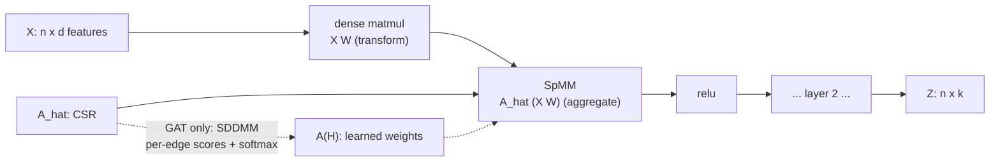
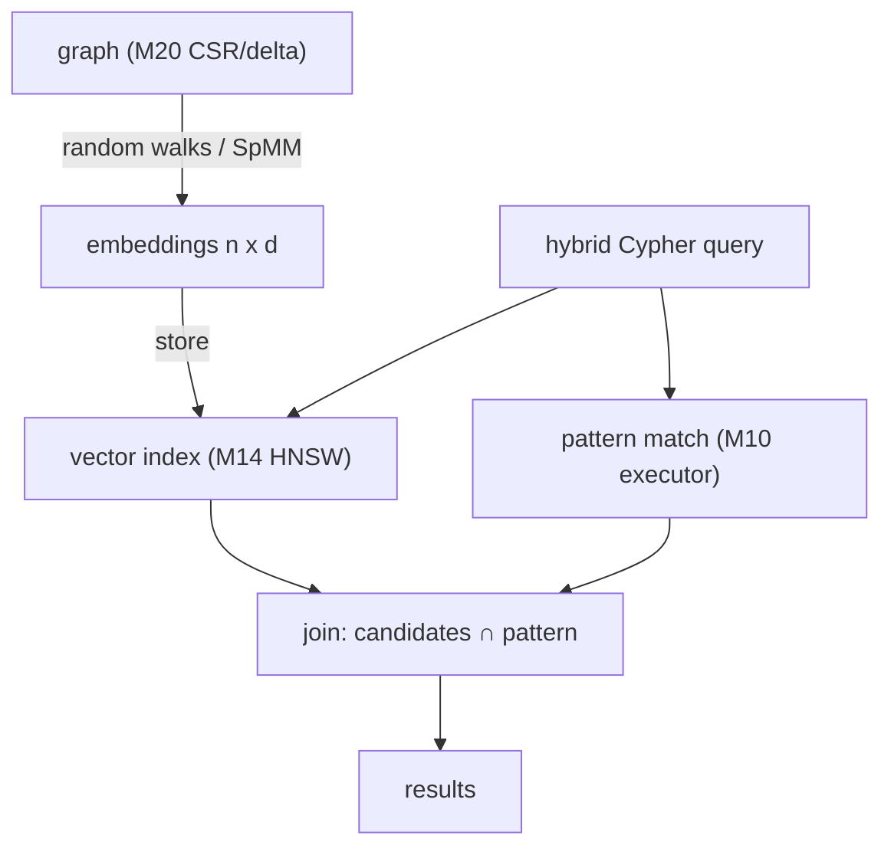

# Topic 25 — Graph Neural Networks & Graph ML for a database engine

**Why this matters for FalkorDB:** message passing *is* SpMM over a
semiring — the M20 sparse core is already a GNN inference engine waiting
for a feature matrix. And GraphRAG (your own GraphRAG-SDK) is pulling graph
databases into the ML serving path: embeddings stored next to nodes, vector
index + pattern match in one Cypher query. This topic is about seeing GNNs
as sparse linear algebra you already own, not as a framework to import.

## The one-slide version

```
  "GNN layer"                          what an engine sees
  ─────────────────────────────────────────────────────────
  H' = sigma( A_hat . H . W )          SpMM  (aggregate, sparse)
        │       │    │  └─ dense matmul (transform, small)
        │       │    └─ n x d feature matrix (dense, FAT rows)
        │       └─ normalized adjacency (CSR — you have this)
        └─ elementwise (free)

  node2vec / DeepWalk                  random walks (you have CSR
    walks -> skip-gram                 traversal) + word2vec SGD

  GraphRAG                             embeddings in a vector index
                                       (topic 14) + Cypher pattern
                                       match — ONE query, two indexes
```

## Message passing = SpMM, with receipts

PyG's `MessagePassing.propagate` (message_passing.py:421) has a fused
fast path: if the layer defines `message_and_aggregate`, the per-edge
`message()` + scatter `aggregate()` pair is replaced by one call.
What do the big three layers put there?

| layer | message_and_aggregate | anchor |
|---|---|---|
| GCNConv | `spmm(adj_t, x, reduce=sum)` | gcn_conv.py:273 |
| SAGEConv | `spmm(adj_t, x[0], reduce=mean)` | sage_conv.py:149-152 |
| GATConv | — (can't fuse: per-edge softmax weights) | gat_conv.py:392-408 |

GCN and SAGE are literally one SpMM per layer. GAT is the exception that
proves the rule: its edge weights depend on the *current* features
(attention), so it needs SDDMM (sampled dense-dense matmul: compute
`leaky_relu(a . [h_u || h_v])` only where A has a nonzero) followed by a
row-softmax, *then* the SpMM. SDDMM+SpMM is the masked-SpGEMM pattern from
topic 24's triangle counting wearing a learning costume.



**Associativity is a query plan.** `A(XW)` costs `2·nnz·hidden` for the
SpMM; `(AX)W` costs `2·nnz·in_dim`. With in_dim=1433 (Cora) and hidden=16,
transform-first is 90x cheaper on the sparse side. Same decision as join
ordering (topic 10) — the frameworks hardcode the good order; an engine
with a cost model could *choose*.

## Our numbers (Apple M3 Pro, SBM n=16,384, m=566K directed, 2026-07-10)

| lane | result |
|---|---|
| SBM build (64 blocks x 256) | 34.4 ms |
| uniform walks 65,536 x 40 steps | 61.2 ms, 42.8 Msteps/s |
| SpMM (D^-1 A) x X[16384x64] | 3.42 ms/iter, **21.2 GFLOP/s** |
| dense matmul [16384x64]x[64x64] | 5.12 ms/iter, 26.2 GFLOP/s |

The headline: naive scalar SpMM reaches **81% of dense matmul's
throughput** on this graph. Sparse's irregular gather is amortized by the
64-float dense rows it drags along — a GNN's SpMM is memory-friendly in
exactly the way topic 20's SpMV (1-wide) is not. Fat right-hand sides
forgive sparsity.

## Random-walk embeddings (DeepWalk -> node2vec)

```
  walk corpus                skip-gram (word2vec, unchanged)
  ┌────────────────────┐     for each center u, context c in window:
  │ 5 12 7 7 3 12 ...  │       maximize  sigma(z_u . c_c)
  │ 9 2 44 2 9 61 ...  │     + for k random "negative" c':
  │ ...                │       maximize  sigma(-z_u . c_c')
  └────────────────────┘     (PyG Node2Vec.loss, node2vec.py:135 —
   vertices are words,        exactly this expression)
   walks are sentences
```

DeepWalk uses uniform walks. node2vec biases them with two knobs evaluated
against the PREVIOUS vertex t (second-order walk): weight 1/p to return to
t, 1 to move to a mutual neighbor of t, 1/q to move away. Low q = outward/
DFS-ish = communities; high q = local/BFS-ish = structural roles. The
implementation trap: per-edge alias tables are O(m·avg_deg) memory —
rejection sampling (bound max(1, 1/p, 1/q)) is O(1) and what our stub
prescribes.

## The stubs (experiments/)

| stub | contract |
|---|---|
| `walks::node2vec_walks` | p=q=1 matches degree-stationary distribution; q orders exploration (ring of cliques); p orders backtrack rate |
| `embed::train_skipgram` | SBM intra-block cosine > inter-block + 0.2 |
| `gcn::gcn_norm` + `gcn_forward` | matches dense definitional oracle to 1e-4; rows sorted; transform-before-aggregate |

Provided: CSR + SBM/ring-of-cliques generators (`graph.rs`), dense Mat +
glorot init (`dense.rs`), SpMM + row-normalized adjacency (`spmm.rs`),
uniform walks (`walks.rs`), dense GCN oracle (`gcn.rs`), `gnn_bench`.

## GraphRAG: where this lands in the database

Your GraphRAG-SDK already does the serving half against FalkorDB:
`vector_store.py:344` — `CALL db.idx.vector.queryNodes('Chunk',
'embedding', $top_k, vecf32($vector))`, then Cypher expands from the hits
(`retrieval/strategies/relationship_expansion.py`). What's *missing* is the
production half: embeddings computed OUTSIDE (OpenAI API) and written back
with `SET c.embedding = vecf32($vector)` (:219). M25 closes the loop:
compute node2vec/GCN embeddings with the engine's own SpMM, store into the
M14 vector index, answer hybrid queries without leaving the database.



## Reading guides

- [reading-node2vec.md](reading-node2vec.md) — Grover & Leskovec KDD'16
- [reading-gcn.md](reading-gcn.md) — Kipf & Welling ICLR'17
- [reading-graphsage.md](reading-graphsage.md) — Hamilton et al. NeurIPS'17 (sampling!)
- [reading-gat.md](reading-gat.md) — Veličković et al. ICLR'18 (SDDMM)
- [reading-pyg-message-passing.md](reading-pyg-message-passing.md) — the framework as sparse ops (`~/repos/pytorch_geometric`)
- [reading-transe.md](reading-transe.md) — Bordes et al. NeurIPS'13, KG embeddings
- [reading-graphrag-sdk.md](reading-graphrag-sdk.md) — your own SDK with systems eyes (`~/repos/GraphRAG-SDK`)

## Cross-topic links

- Topic 20: SpMM/semirings — the aggregation kernel is M20's `mxm` with a
  dense B; direction switching does NOT apply (always dense frontier, like
  Ligra's PageRank row in topic 24's reading-ligra.md).
- Topic 14: the vector index that stores what this topic computes.
- Topic 10: associativity-as-query-plan; GAT's SDDMM = masked SpGEMM
  (topic 24 TC).
- Topic 27 (ahead): are embeddings incrementally maintainable views over
  the graph? (Spoiler: walks no, GCN partially — see notes.md.)
