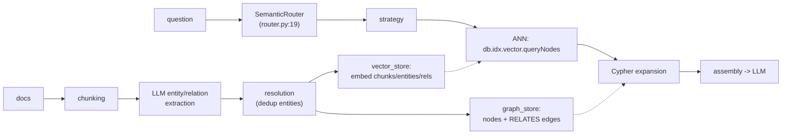

# GraphRAG-SDK: a RAG pipeline read as a workload spec

Your own SDK, re-read as a database workload spec. Every Python line here
is a feature request against FalkorDB: what it does client-side in
asyncio is what M25 should evaluate doing engine-side. Layout:
`src/graphrag_sdk/{ingestion, storage, retrieval, core}`. This chapter
builds the workload step by step — what RAG is, the ingestion
dataflow, the storage contract the SDK demands, the retrieval joins it
hand-rolls, and the four systems smells that name M25's work.

## The problem in one sentence

Answering a question over private documents means finding the right
evidence before the LLM ever runs — and this SDK does it with **k+1
round trips per question** (one vector search plus one graph
expansion per hit) and client-side score fusion in Python, all of
which is work a database with the right query surface would do in one
plan.

## The concepts, step by step

### Step 1 — RAG, and why a graph gets involved

**RAG** (retrieval-augmented generation) answers questions by
retrieving relevant evidence from a private corpus and stuffing it
into an LLM's prompt — the LLM supplies fluency, retrieval supplies
facts it was never trained on. The standard pipeline splits documents
into **chunks** (passages of a few hundred tokens), computes an
**embedding** per chunk (a dense vector whose geometry encodes
meaning — reading-node2vec.md Step 1, but for text), and at question
time runs **ANN search** (approximate nearest neighbor — find the
k closest vectors fast, topic 14's index) to fetch the top-k chunks.
GraphRAG's addition: also extract *entities and relations* from the
text into a graph, so retrieval can follow explicit structure ("who
supplied whom") instead of only fuzzy similarity — questions whose
answers span multiple documents need the join, not just the nearest
neighbors.

### Step 2 — the pipeline as a dataflow

The SDK's whole shape is one ingestion path that writes two indexes,
and one query path that reads them both:

Ingestion is LLM-heavy (extraction and resolution are model calls);
querying is database-heavy (ANN + Cypher). The dataflow's key
property for a database person: the graph store and the vector store
are the SAME FalkorDB instance — the split into "two stores" is a
client-side fiction, which is exactly why the joins in Step 4 hurt.

### Step 3 — the storage contract: what the SDK asks the database for

`storage/vector_store.py` is the SDK's entire database contract, and
reading it tells you which features carry the workload:

| anchor | what |
|---|---|
| `:344` | `CALL db.idx.vector.queryNodes('{label}', 'embedding', $top_k, vecf32($vector))` — chunk ANN |
| `:378` | same over `__Entity__` — entity ANN |
| `:426` | `queryRelationships('RELATES', ...)` — EDGE vectors, with a Cypher cosine-scan fallback (:414) if unsupported |
| `:219,:234,:312` | `SET c.embedding = vecf32($vector)` — embeddings computed OUTSIDE, written back as properties |
| `:133` | full-text index too — hybrid = vector + FT + graph, three indexes on one store |

Note the asymmetry: the read path is database-native (three index
types queried through Cypher), but the WRITE path — embedding
computation — is an external API call per chunk/entity, round-tripped
to OpenAI and written back as a property. M25's thesis: with
node2vec/GCN kernels in the engine, *structural* embeddings never
leave the database — only text embeddings need the round-trip.

### Step 4 — retrieval strategies: joins, hand-rolled in the client

Each retrieval strategy is a query plan executed by Python instead of
the database:

- `relationship_expansion.py:12` `expand_relationships`: ANN hits →
  `MATCH (a:__Entity__ {id: eid})-[r:RELATES]->(b)` (:35) and a 2-hop
  variant (:62). This is a client-side JOIN between the vector index
  and the graph: k queries where one Cypher query with a vector
  predicate should do — the exact hybrid query M25's capstone must
  serve in ONE plan.
- `multi_path.py:48` runs chunk-ANN, entity-ANN, edge-ANN
  concurrently, reranks with client-side `_cosine_sim` (:362) — a
  scatter-gather union of three indexes with score fusion done in
  Python. Compare topic 23's WAND: score fusion is what the engine's
  top-k machinery is FOR.

The cost is structural, not incidental: every strategy pays k+1 round
trips and recomputes distances the index already knew. The asyncio
sophistication is compensation for a missing query surface.

### Step 5 — the router: a planner with no cost model

`router.py:19` `SemanticRouter` picks a retrieval strategy per
question by embedding the question and matching it against strategy
descriptions — a query PLANNER driven by embeddings instead of
statistics (topic 9 with vibes). The structure is right (multiple
plans, a chooser); what's missing is everything topic 9 built:
cardinality estimates, cost per plan, feedback from execution.
Question 4 asks what statistic would turn "graph expansion vs pure
ANN" into a costed choice — the router names M25's planner-shaped
hole.

### Step 6 — the four systems smells: M25's worklist

Reading the whole SDK as a bug report against the engine yields four
named deficiencies:

1. **k+1 round trips**: ANN then per-hit expansion — push the join down.
2. **Client-side rerank**: cosine in Python over returned vectors — the
   index already computed distances; return them.
3. **Embedding writes are not transactional** with the entities they
   describe (batch SET after ingest) — staleness window with no
   read-your-writes story (topic 8).
4. **No incremental re-embed**: edit a chunk → re-embed everything or
   drift silently (topic 27's IVM question, in RAG costume).

Each smell maps to a topic already covered — join pushdown (10),
top-k machinery (23), transactional visibility (8), incremental view
maintenance (27) — which is the point: a RAG SDK is a database
workload wearing an application costume, and M25 closes the loop by
computing embeddings with the engine's own SpMM, storing into the M14
vector index, and answering hybrid queries without leaving the
database.

## Where each step lives in the code

- **Step 2 — ingestion**: `src/graphrag_sdk/ingestion/` (chunking,
  extraction, resolution) and `core/` — skim; the LLM calls are the
  content, the orchestration is asyncio plumbing.
- **Step 3 — the contract**: `storage/vector_store.py` — the anchor
  table above; read `:344` and `:219` first, they are the read and
  write halves of the contract.
- **Step 4 — the joins**:
  `retrieval/strategies/relationship_expansion.py` (:12, :35, :62)
  and `retrieval/strategies/multi_path.py` (:48, :362).
- **Step 5 — the router**: `retrieval/router.py:19`.
- Navigation advice: read each file as a feature request against the
  engine, not as Python to review — the question is never "is this
  code good" but "which missing engine feature made this code
  necessary".

## Questions (answer in notes.md)

1. Write the ONE Cypher query that replaces expand_relationships'
   ANN + k MATCHes. What must the planner know to not execute it as
   k+1 lookups anyway?
2. multi_path fuses three scores client-side — design the engine-side
   fusion: is it WAND-able (topic 23) given vector distances aren't
   monotone doc-at-a-time?
3. Which of the four smells does `SET c.embedding = vecf32(...)` inside
   the SAME transaction as entity creation fix, and what does it cost the
   ingest pipeline's throughput?
4. The router is a planner with no cost model. What statistic would make
   "graph expansion vs pure ANN" a COSTED choice (selectivity of the
   pattern? recall@k of the index?)?
5. M25 acceptance test: pattern + similarity in one query, verified
   against this SDK's answers on the same data — sketch it.

## References

**Code**
- [GraphRAG-SDK](https://github.com/FalkorDB/GraphRAG-SDK)
  `src/graphrag_sdk/` — `storage/vector_store.py` (the DB contract),
  `retrieval/strategies/relationship_expansion.py`,
  `retrieval/strategies/multi_path.py`, `retrieval/router.py`; read
  each as a feature request against the engine
