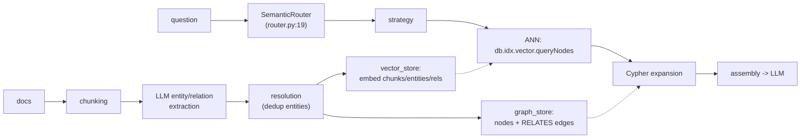

# Reading guide — GraphRAG-SDK with systems eyes ([`~/repos/GraphRAG-SDK/graphrag_sdk`](https://github.com/FalkorDB/GraphRAG-SDK))

Your own SDK, re-read as a database workload spec. Every Python line here
is a feature request against FalkorDB: what it does client-side in
asyncio is what M25 should evaluate doing engine-side. Layout:
`src/graphrag_sdk/{ingestion, storage, retrieval, core}`.

## The pipeline as a dataflow

## storage/vector_store.py — the DB contract

| anchor | what |
|---|---|
| `:344` | `CALL db.idx.vector.queryNodes('{label}', 'embedding', $top_k, vecf32($vector))` — chunk ANN |
| `:378` | same over `__Entity__` — entity ANN |
| `:426` | `queryRelationships('RELATES', ...)` — EDGE vectors, with a Cypher cosine-scan fallback (:414) if unsupported |
| `:219,:234,:312` | `SET c.embedding = vecf32($vector)` — embeddings computed OUTSIDE, written back as properties |
| `:133` | full-text index too — hybrid = vector + FT + graph, three indexes on one store |

The read path is database-native; the WRITE path (embedding computation)
is an external API call per chunk/entity. M25's thesis: with node2vec/GCN
kernels in the engine, *structural* embeddings never leave the database —
only text embeddings need the round-trip.

## retrieval/strategies — hybrid queries, hand-rolled

- `relationship_expansion.py:12` `expand_relationships`: ANN hits →
  `MATCH (a:__Entity__ {id: eid})-[r:RELATES]->(b)` (:35) and a 2-hop
  variant (:62). This is a client-side JOIN between the vector index and
  the graph: k queries where one Cypher query with a vector predicate
  should do — the exact hybrid query M25's capstone must serve in ONE
  plan.
- `multi_path.py:48` runs chunk-ANN, entity-ANN, edge-ANN concurrently,
  reranks with client-side `_cosine_sim` (:362) — a scatter-gather union
  of three indexes with score fusion done in Python. Compare topic 23's
  WAND: score fusion is what the engine's top-k machinery is FOR.
- `router.py:19` SemanticRouter picks a strategy per question — a query
  PLANNER driven by embeddings instead of statistics (topic 9 with vibes).

## Systems smells to fix in M25

1. **k+1 round trips**: ANN then per-hit expansion — push the join down.
2. **Client-side rerank**: cosine in Python over returned vectors — the
   index already computed distances; return them.
3. **Embedding writes are not transactional** with the entities they
   describe (batch SET after ingest) — staleness window with no
   read-your-writes story (topic 8).
4. **No incremental re-embed**: edit a chunk → re-embed everything or
   drift silently (topic 27's IVM question, in RAG costume).

## Questions (answer in notes.md)

1. Write the ONE Cypher query that replaces expand_relationships'
   ANN + k MATCHes. What must the planner know to not execute it as
   k+1 lookups anyway?
2. multi_path fuses three scores client-side — design the engine-side
   fusion: is it WAND-able (topic 23) given vector distances aren't
   monotone doc-at-a-time?
3. Which of the four smells does `SET c.embedding = vecf32(...)` inside
   the SAME transaction as entity creation fix, and what does it cost the
   ingest pipeline's throughput?
4. The router is a planner with no cost model. What statistic would make
   "graph expansion vs pure ANN" a COSTED choice (selectivity of the
   pattern? recall@k of the index?)?
5. M25 acceptance test: pattern + similarity in one query, verified
   against this SDK's answers on the same data — sketch it.
