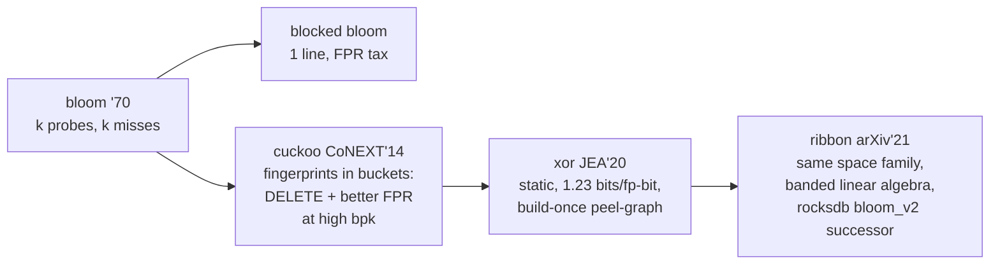

# Topic 26 — Indexing & Probabilistic Data Structures

**Why this matters:** indexes are bets — write amplification paid for read
speed. Probabilistic structures make a sharper bet: be *slightly wrong* in
a bounded, one-sided way and win orders of magnitude in space/time. Redis
PFCOUNT, RocksDB's bloom-per-SST, roaring in Lucene/ClickHouse — this is
production math, not exotica.

## Our motivation numbers first (Apple M3 Pro, 10M sorted u64, 2026-07-10)

| point-miss lookup | ns | memory |
|---|---|---|
| binary search over sorted vec | 167 | 76 MB (the data) |
| BTreeMap | 218 | ~200 MB |
| HashSet | 24 | **224 MB** |
| blocked bloom (stub target) | ~15-25 | **12 MB** at 10 bits/key |

The whole topic in one row: the bloom filter should answer "definitely
absent" at HashSet speed with 5% of HashSet's memory — by being wrong
(one-sided!) 1% of the time. And binary search's 167 ns is ~23 dependent
cache misses; the learned index bets most of that tree walk is
predictable.

## The three families

```
  FILTERS: "is X in the set?"          one-sided error (no false negatives)
    bloom ── blocked bloom ── cuckoo ── xor ── ribbon
    (k probes) (1 cache line) (+delete) (static,   (rocksdb's pick:
                                        1.23x info  space near xor,
                                        bound)      streaming build)

  SKETCHES: "how many / how often?"    bounded relative error
    HLL (count distinct)  count-min (frequencies)  t-digest (quantiles)

  LEARNED / SUCCINCT: "where is X?"    bounded position error
    RMI ── PGM (eps-guarantee PLA) ── ALEX (updatable gapped arrays)
    Elias-Fano (postings/adjacency in near-information-theoretic space)
```

## Bloom math you should be able to reproduce

```
  k probes, b bits/key:  FPR ≈ (1 − e^(−k/b))^k
  optimal k = b·ln2  →  at 10 bits/key: k≈7, FPR ≈ 0.82%
  rule of thumb: every +4.8 bits/key HALVES... no — ×10 needs +4.8 bits? 
  memorize instead: 10 bits/key ≈ 1%, 16 ≈ 0.04%, each bit/key is ~2× FPR
```

Blocked bloom (RocksDB `FastLocalBloomImpl`, util/bloom_impl.h:144) puts
all k probes in ONE 512-bit cache line: a miss costs exactly one memory
access instead of k. The price is Poisson crowding — some lines hold too
many keys and their FPR spikes (bloom_impl.h:42 `CacheLocalFpRate` sums
the two tails). Measured claim to verify in the stub: ~1.5-2× the standard
FPR at the same bits/key, for k× fewer misses.

## The lineage in one diagram



Cuckoo's enabling trick (RedisBloom cuckoo.c:122 `getAltHash`): the
alternate bucket is `i XOR hash(fp)` — computable from the *fingerprint
alone*, so residents can be kicked without knowing their original keys.
Deletion falls out: fingerprints are discrete residents, not smeared bits.

## HLL: counting distinct in 12 KB

One hashed key contributes only its leading-zero count. Register j keeps
the max rank seen among keys landing there; harmonic-mean magic turns
16,384 six-bit maxima into a cardinality estimate at 0.81% standard error
(P=14). Redis (`hyperloglog.c`) adds a sparse encoding — ZERO/XZERO/VAL
opcodes (:380) — so an HLL tracking 100 elements costs ~30 bytes, not
12 KB, and promotes to dense at 3 KB (:593 `hllSparseToDense`). Merge =
register-wise max = perfect sharding (PFMERGE; AVX2 version at :1116).

## Learned indexes: the index IS a model

PGM (pgm_index.hpp:67): recursively fit piecewise-linear segments with a
HARD error bound ε — lookup = walk 2-3 segment levels, binary-search a
2ε+2 window. On smooth key distributions, segments ≪ n and the hot path
fits in cache where a B-tree's top levels don't even. ALEX answers the
update question with gapped arrays + model-based insertion (alex_nodes.h;
exponential search from the predicted slot). The honest question our bench
asks: does PGM's 167→~100 ns win survive keys that aren't uniform, and
does ALEX survive adversarial inserts? (Predict in notes.md first.)

## Geo indexes: 2D keys through 1D indexes

Same theme as learned indexes — encode structure into the key. Redis/
valkey GEO is not a spatial index at all: it's a **52-bit interleaved
geohash stored as a zset score**. Bit-interleave lat/lon
(`interleave64`, geohash.c:52 — the Morton/Z-order trick with magic
masks), and prefix-similar codes = spatially-near points, so a bounding
box becomes a handful of zset RANGE queries
(`scoresOfGeoHashBox`, geo.c:338: score range = hashcode << shift to
hashcode+1 << shift). GEOSEARCH = pick a cell size covering the radius
(`geohashEstimateStepsByRadius`, geohash_helper.c:64), scan the cell +
its 8 neighbors (`membersOfAllNeighbors`, geo.c:375), then exact
haversine post-filter — a candidate-generation + verification pattern,
exactly like a bloom filter's "maybe" answer.

```
 the menu:
 Z-order/geohash   interleave bits; 1D-index reuse   discontinuities at
                   (zset, B-tree, anything)          cell boundaries
 Hilbert curve     better locality (no big jumps)    costlier encode
 R-tree            bounding-box tree (Guttman'84);   overlap ⇒ multi-path
                   PostGIS via GiST                  descent; R* splits
 S2 / H3           sphere-native cells (Google/Uber) discrete cells only,
                   hierarchy = prefix                great for sharding
```

The deep lesson: postgres didn't hardcode any of these — GiST is an
*extensible* index AM (topic 26's indexam guide) where R-tree is just
one `picksplit`/`penalty` implementation. Geohash-in-a-zset is the
opposite move: zero new index structures, reuse what you have.
→ guide: [`reading-geo-indexes.md`](reading-geo-indexes.md)

## The stubs (experiments/)

| stub | contract |
|---|---|
| `bloom::BlockedBloom` | zero false negatives; FPR < 2.5% at 10 bpk (< 4× theory); halves 8→16 bpk; whole-cache-line sizing |
| `cuckoo::CuckooFilter` | no FN at 90% load; FPR < 1% (12-bit fp); delete works AND leaves others intact; graceful full-failure |
| `hll::Hll` | < 3% error at 1K/100K/5M; merge registers == union registers exactly |
| `pgm::LearnedIndex` | ε-window always contains the key; uniform 1M keys → < 2K segments; ε holds on hostile distributions |

Roaring already has a stub in topic 23 (`postings.rs` — array/bitmap
containers); this topic's reading guide adds run containers + galloping +
SIMD over roaring-rs.

## Reading guides

- [reading-bloom-to-ribbon.md](reading-bloom-to-ribbon.md) — bloom math → blocked → ribbon (RocksDB code)
- [reading-cuckoo-xor.md](reading-cuckoo-xor.md) — CoNEXT'14 + JEA'20 + RedisBloom cuckoo.c
- [reading-hyperloglog.md](reading-hyperloglog.md) — HLL in Practice + redis hyperloglog.c
- [reading-learned-indexes.md](reading-learned-indexes.md) — Kraska'18 → PGM → ALEX (both repos)
- [reading-roaring-internals.md](reading-roaring-internals.md) — SPE'18 + roaring-rs (extends topic 23's guide)
- [reading-geo-indexes.md](reading-geo-indexes.md) — valkey GEO (geohash-in-a-zset), Z-order vs Hilbert vs R-tree vs S2/H3
- [reading-postgres-indexam.md](reading-postgres-indexam.md) — nbtree/GIN/BRIN as the classical baseline

## Cross-topic links

- Topic 4 (LSM): blooms exist because LSM point-misses touch every level.
- Topic 12: BRIN ≈ zone maps; topic 23: roaring = the postings kernel,
  {last_doc, max_score} skip data = a filter on score.
- Topic 20: roaring's array↔bitmap switch = GraphBLAS sparse↔bitmap at
  64K granularity (the same density crossover, measured twice).
- Topic 9 (HLL for count-distinct) → M26's approximate `count(DISTINCT)`.
