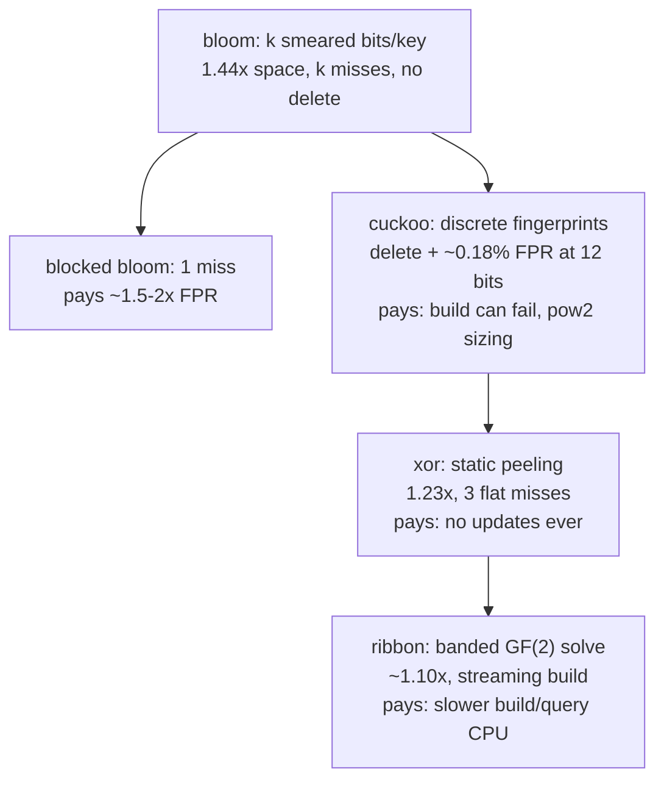

# Cuckoo & XOR filters: fingerprints you can delete

Bloom smears each key across k shared bits; cuckoo filters store each
key as one *discrete* fingerprint in one of two buckets — which buys
deletion and a better space/FPR trade, at the price of inserts that can
fail. XOR filters then drop updatability entirely and win more space.
The reference implementation here is RedisBloom's `cuckoo.c`. Before the
code, this chapter builds the machinery one trick at a time: why bloom
can't delete, what a fingerprint is, the XOR involution that makes
kicking possible, and the peeling construction that makes static filters
smaller.

## The problem in one sentence

Delete one key from a bloom filter and you corrupt others — clearing any
of its k shared bits can create a **false negative** (the filter says
"absent" for a key that is present, breaking the one contract a filter
has) for every key that shares those bits — yet caches, routing tables,
and any filter over churning data need membership *with* deletion.

## The concepts, step by step

### Step 1 — why bloom can't delete: the bits are shared

In a bloom filter, one bit typically serves many keys, so removing a key
has no safe implementation. Concretely: insert A sets bits {3, 17, 40};
insert B sets bits {17, 52, 88}. Delete A by clearing {3, 17, 40} and B —
still present — now fails its probe on bit 17: a false negative, the
forbidden error. (Counting blooms replace each bit with a counter, but
that multiplies space by 4–8× and still can't say *which* key a counter
belongs to.) The fix requires keys to occupy *discrete, identifiable*
residence — which is Step 2.

### Step 2 — fingerprints in buckets: membership as a tiny hash table

Instead of smearing a key across shared bits, store one **fingerprint**
per key — a short hash of the key, e.g. 12 bits — as a discrete resident
in a slot of a hash-table bucket. Query = "does my fingerprint appear in
my bucket?"; delete = find it and zero the slot. A false positive is now
a fingerprint *collision*: some other key in the same bucket happens to
carry your 12 bits — probability ≈ `2 × slots × 2^−f` (two candidate
buckets, `slots` fingerprints compared in each, each matching with
2^−f) — at f=12 and 4 slots, ~0.2%. The open problem this creates:
hash-table buckets fill up, and a plain table stalls at ~50% occupancy.
**Cuckoo hashing** fixes occupancy by giving every key *two* candidate
buckets and, when both are full, evicting ("kicking") a resident to *its*
other bucket, recursively — that discipline pushes usable load to ~95%
with 4-slot buckets (paper Table 2: 1 slot tops out ~50%, 4 slots ~95%).

### Step 3 — the one trick that makes cuckoo *filters* possible

Cuckoo *hashing* moves keys between two candidate buckets — but a filter
stores only fingerprints; after insertion the original key is gone, so how
do you compute a victim's alternate bucket to kick it?

**Partial-key cuckoo hashing** (paper §3.1; `getAltHash`, cuckoo.c:122):

```
  i1 = hash(key)
  i2 = i1 XOR hash(fingerprint)      ← involution: i1 = i2 XOR hash(fp)
```

Because XOR is its own inverse, the alternate bucket is computable from
*(current bucket, fingerprint)* alone — apply the same XOR from either
side and you get the other. Two costs come with the trick: the bucket
count is forced to a power of two (XOR must stay in range — RedisBloom
asserts it at filter creation), and the two buckets aren't independent —
a fingerprint's candidate pair is determined by only
`log2(buckets) + fp_bits` bits, which caps how large the table can get
before FPR degrades (paper §4).

### Step 4 — the kicking loop, mechanically

With Steps 2–3 in hand, insertion is: try both candidate buckets; if both
are full, evict a random resident, move it to *its* other bucket
(computable by the involution), and repeat up to a bound. The insert path
with the kicking loop, in one screen:

```rust
fn insert(&mut self, key: &[u8]) -> bool {
    let (mut fp, i1) = self.fp_and_index(key);       // fp: 12 bits, never 0
    let i2 = (i1 ^ self.hash_fp(fp)) & self.mask;    // partial-key involution
    if self.put_if_free(i1, fp) || self.put_if_free(i2, fp) { return true; }

    let mut i = if coin_flip() { i1 } else { i2 };
    for _ in 0..MAX_KICKS {                           // 500
        fp = self.swap_with_random_resident(i, fp);   // evict someone
        i = (i ^ self.hash_fp(fp)) & self.mask;       // victim's OTHER bucket
        if self.put_if_free(i, fp) { return true; }
    }
    false            // paper behavior; RedisBloom grows a subfilter instead
}
```

The cost that bloom never has: **insertion can fail** — at high load the
kick chain can cycle for 500 hops without finding a free slot. The paper
says return "full"; RedisBloom instead keeps a *chain of subfilters* (like
an LSM of filters): when kicking fails at MAX_KICKS it allocates a new
subfilter and inserts there (`CuckooFilter_InsertFP`, cuckoo.c:256 — try
all subfilters' empty slots first, kick only in the newest). Our stub
returns `false` (the paper behavior) — the graceful-failure test pins
that. Deletion (`CuckooFilter_Delete` :216) is find + zero the slot — but
it is only *safe* for keys actually inserted; deleting a false-positive
fingerprint removes someone else's resident.

### Step 5 — XOR filters: drop updates, win space

The xor filter takes cuckoo's fingerprint idea and asks: if the set is
*static*, why pay for empty slots and kicking at all? Store an array B of
fingerprints such that for every key:

```
  B[h0(x)] XOR B[h1(x)] XOR B[h2(x)] = fingerprint(x)
```

Query = XOR three slots, compare — exactly 3 memory accesses, flat.
Construction "peels" a random 3-uniform hypergraph (each key is an edge
touching its 3 slots): repeatedly find a key that is the *only* one
touching some slot, assign that slot last (stack), pop and back-fill.
Peeling succeeds w.h.p. when slots ≥ 1.23 × keys — hence
**1.23 × f bits/key**, beating both bloom (1.44×) and cuckoo (~1.05/α×
but α≤0.95 plus empty-slot overhead). The price: build-once, forever —
adding one key invalidates the peeling order, so there is no insert, ever.

### Step 6 — the lineage, with the trade each hop makes

Every hop in the fifty-year lineage buys one property by selling another —
updatability, space, cache misses, and build reliability rotate through
the designs:



Matching filter to workload is reading this diagram: churn (inserts *and*
deletes) → cuckoo; immutable set built once (an SST) → xor or ribbon
(ribbon adds streaming build — see
[reading-bloom-to-ribbon.md](reading-bloom-to-ribbon.md)); hot path where
one cache miss matters more than FPR → blocked bloom.

## Where each step lives in the code

`cuckoo.c` — the production shape:

| anchor | step | what it does |
|---|---|---|
| `getAltHash` :122 | 3 | the involution: `i XOR hash(fp)` |
| `Filter_Find` :146 | 2 | check fp in both candidate buckets |
| `Filter_FindAvailable` :241 | 4 | first empty slot in either bucket |
| `Filter_KOInsert` :307 | 4 | the kicking loop: evict a resident (`ii = getAltHash(fp, ii)` :321), swap, retry up to maxIterations |
| `CuckooFilter_InsertFP` :256 | 4 | try all subfilters' empty slots first, kick only in the newest, **grow a new subfilter** when kicking fails |
| `CuckooFilter_Delete` :216 | 4 | delete = find + zero the slot, newest subfilter first |

Note what RedisBloom adds over the paper: the subfilter chain. When
kicking fails at MAX_KICKS it doesn't return "full" — it allocates a new
subfilter and inserts there. The xor filter (Step 5) has no reference
implementation here — read the Graf & Lemire paper §2–3 with the peeling
picture in hand.

## Tie back to the stub

`cuckoo::CuckooFilter` is cuckoo.c minus subfilter chaining: pow-2 buckets
of 4 × u16, 12-bit fp (never 0 = empty), random-victim kicking to
MAX_KICKS=500. The `delete_actually_removes` test is the point of the whole
exercise — it's the test a bloom filter *cannot* pass.

## Questions to answer in notes.md

1. Why hash the fingerprint in `i1 XOR hash(fp)` instead of the simpler
   `i1 XOR fp`? (Paper §3.1: with small fp values, unhashed XOR only
   perturbs the low bits — kicked keys land nearby and clump.)
2. Deletion is only safe if the key was actually inserted (deleting a
   false-positive fingerprint removes *someone else's* resident, creating
   a false negative for them). Redis documents this contract. How would
   you misuse `CF.DEL` to silently corrupt a filter, and why can't bloom
   have this failure mode (nor deletion at all)?
3. Why 4 slots per bucket? Paper Table 2: with 1 slot, load factor tops
   out ~50%; with 4, ~95%. But more slots = more fingerprints compared per
   query = higher FPR (`2 × slots × 2^−f`). Where's our stub's FPR bound
   (12-bit fp, 4 slots, ~0.9 load) relative to the `< 1%` test?
4. The peeling stack is why xor filters are build-once: adding one key
   invalidates the topological order. Ribbon (see
   [reading-bloom-to-ribbon.md](reading-bloom-to-ribbon.md)) gets the same
   space family but supports *streaming* build via banded elimination.
   Rank bloom/cuckoo/xor/ribbon along (updatable, space, query misses) and
   match each to: memtable filter, routing table with churn, immutable SST.

## References

**Papers**
- Fan, Andersen, Kaminsky, Mitzenmacher — "Cuckoo Filter: Practically
  Better Than Bloom" (CoNEXT 2014) — §3 algorithm, §4 why partial-key
  works, §5 space analysis; skim the eval
- Graf & Lemire — "Xor Filters: Faster and Smaller Than Bloom and
  Cuckoo Filters" (ACM JEA 2020,
  [arXiv:1912.08258](https://arxiv.org/abs/1912.08258)) — §2-3

**Code**
- [RedisBloom](https://github.com/RedisBloom/RedisBloom) `src/cuckoo.c`
  — the production shape, including the subfilter-chain growth the
  paper doesn't have
