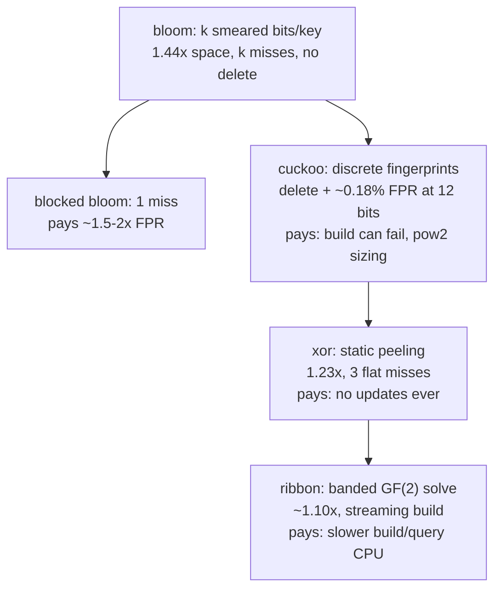

# Cuckoo & XOR filters: fingerprints you can delete

Bloom smears each key across k shared bits; cuckoo filters store each
key as one *discrete* fingerprint in one of two buckets — which buys
deletion and a better space/FPR trade, at the price of inserts that can
fail. XOR filters then drop updatability entirely and win more space.
The reference implementation here is RedisBloom's `cuckoo.c`.

## 1. The one trick that makes cuckoo filters possible

Cuckoo *hashing* moves keys between two candidate buckets. But a filter
stores only fingerprints — after insertion the original key is gone, so how
do you compute a victim's alternate bucket to kick it?

**Partial-key cuckoo hashing** (paper §3.1; `getAltHash`, cuckoo.c:122):

```
  i1 = hash(key)
  i2 = i1 XOR hash(fingerprint)      ← involution: i1 = i2 XOR hash(fp)
```

The alternate is computable from *(current bucket, fingerprint)* alone.
This forces the bucket count to a power of two (XOR must stay in range —
RedisBloom asserts it at filter creation) and it means the two buckets
aren't independent — a fingerprint's candidate pair is determined by only
`log2(buckets) + fp_bits` bits, which caps how large the table can get
before FPR degrades (paper §4).

**Q1.** Why hash the fingerprint in `i1 XOR hash(fp)` instead of the
simpler `i1 XOR fp`? (Paper §3.1: with small fp values, unhashed XOR only
perturbs the low bits — kicked keys land nearby and clump.)

## 2. cuckoo.c — the production shape

| anchor | what it does |
|---|---|
| `getAltHash` :122 | the involution above |
| `Filter_Find` :146 | check fp in both candidate buckets |
| `Filter_FindAvailable` :241 | first empty slot in either bucket |
| `Filter_KOInsert` :307 | the kicking loop: evict a resident (`ii = getAltHash(fp, ii)` :321), swap, retry up to maxIterations |
| `CuckooFilter_InsertFP` :256 | try all subfilters' empty slots first, kick only in the newest, **grow a new subfilter** when kicking fails |
| `CuckooFilter_Delete` :216 | delete = find + zero the slot, newest subfilter first |

The insert path with the kicking loop, in one screen:

```rust
fn insert(&mut self, key: &[u8]) -> bool {
    let (mut fp, i1) = self.fp_and_index(key);       // fp: 12 bits, never 0
    let i2 = (i1 ^ self.hash_fp(fp)) & self.mask;    // partial-key involution
    if self.put_if_free(i1, fp) || self.put_if_free(i2, fp) { return true; }

    let mut i = if coin_flip() { i1 } else { i2 };
    for _ in 0..MAX_KICKS {                           // 500
        fp = self.swap_with_random_resident(i, fp);   // evict someone
        i = (i ^ self.hash_fp(fp)) & self.mask;       // victim's OTHER bucket
        if self.put_if_free(i, fp) { return true; }
    }
    false            // paper behavior; RedisBloom grows a subfilter instead
}
```

Note what RedisBloom adds over the paper: a *chain of subfilters* (like an
LSM of filters). When kicking fails at MAX_KICKS it doesn't return "full" —
it allocates a new subfilter and inserts there. Our stub instead returns
`false` (the paper behavior) — the graceful-failure test pins that.

**Q2.** Deletion is only safe if the key was actually inserted (deleting a
false-positive fingerprint removes *someone else's* resident, creating a
false negative for them). Redis documents this contract. How would you
misuse `CF.DEL` to silently corrupt a filter, and why can't bloom have this
failure mode (nor deletion at all)?

**Q3.** Why 4 slots per bucket? Paper Table 2: with 1 slot, load factor
tops out ~50%; with 4, ~95%. But more slots = more fingerprints compared
per query = higher FPR (`2 × slots × 2^−f`). Where's our stub's FPR bound
(12-bit fp, 4 slots, ~0.9 load) relative to the `< 1%` test?

## 3. Xor filters — drop updates, win space

The xor filter takes cuckoo's fingerprint idea and asks: if the set is
*static*, why pay for empty slots and kicking at all? Store an array B of
fingerprints such that for every key:

```
  B[h0(x)] XOR B[h1(x)] XOR B[h2(x)] = fingerprint(x)
```

Construction "peels" a random 3-uniform hypergraph: repeatedly find a key
that is the *only* one touching some slot, assign that slot last (stack),
pop and back-fill. Succeeds w.h.p. when slots ≥ 1.23 × keys — hence
**1.23 × f bits/key**, beating both bloom (1.44×) and cuckoo (~1.05/α× but
α≤0.95 plus empty-slot overhead), with exactly 3 memory accesses per query.

**Q4.** The peeling stack is why xor filters are build-once: adding one key
invalidates the topological order. Ribbon (see
[reading-bloom-to-ribbon.md](reading-bloom-to-ribbon.md)) gets the same
space family but supports *streaming* build via banded elimination. Rank
bloom/cuckoo/xor/ribbon along (updatable, space, query misses) and match
each to: memtable filter, routing table with churn, immutable SST.

## 4. The lineage, with the trade each hop makes



## 5. Tie back to the stub

`cuckoo::CuckooFilter` is cuckoo.c minus subfilter chaining: pow-2 buckets
of 4 × u16, 12-bit fp (never 0 = empty), random-victim kicking to
MAX_KICKS=500. The `delete_actually_removes` test is the point of the whole
exercise — it's the test a bloom filter *cannot* pass.

## References

**Papers**
- Fan, Andersen, Kaminsky, Mitzenmacher — "Cuckoo Filter: Practically
  Better Than Bloom" (CoNEXT 2014) — §3 algorithm, §4 why partial-key
  works, §5 space analysis; skim the eval
- Graf & Lemire — "Xor Filters: Faster and Smaller Than Bloom and
  Cuckoo Filters" (ACM JEA 2020,
  [arXiv:1912.08258](https://arxiv.org/abs/1912.08258)) — §2-3

**Code**
- [RedisBloom](https://github.com/RedisBloom/RedisBloom) `src/cuckoo.c`
  — the production shape, including the subfilter-chain growth the
  paper doesn't have
