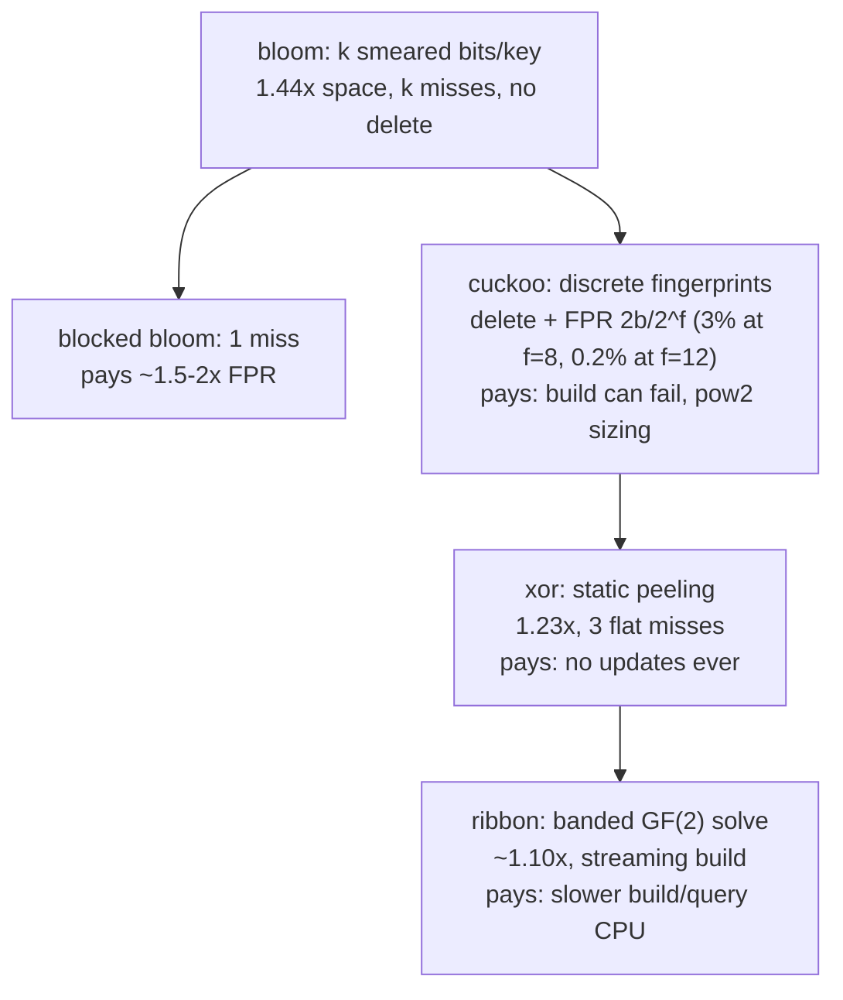

# Cuckoo & XOR filters: fingerprints you can delete

Bloom smears each key across k shared bits; cuckoo filters store each
key as one *discrete* fingerprint in one of two buckets — which buys
deletion and a better space/FPR trade, at the price of inserts that can
fail. XOR filters then drop updatability entirely and win more space.
The reference implementation here is RedisBloom's `cuckoo.c`. Before the
code, this chapter builds the machinery one trick at a time: why bloom
can't delete, what a fingerprint is, the XOR involution that makes
kicking possible, and the peeling construction that makes static filters
smaller.

Every code anchor below is RedisBloom at commit `ab734fa`, the revision
this repo pins (`src/cuckoo.c` is 439 lines), quoted with the line
numbers the code occupies there. The formulas are Fan, Andersen,
Kaminsky & Mitzenmacher, *Cuckoo Filter* (CoNEXT 2014) and Graf &
Lemire, *Xor Filters* (ACM JEA 2020); every figure is worked on the spot
from the equation it cites. Two fingerprint sizes appear on purpose:
production `cuckoo.c` uses an **8-bit** fingerprint (`fp = hash % 255 + 1`,
:127), while this topic's stub (`experiments/src/cuckoo.rs`) uses a
**12-bit** one — the guide labels which is which every time it quotes a
number.

## The problem in one sentence

Delete one key from a bloom filter and you corrupt others — clearing any
of its k shared bits can create a **false negative** (the filter says
"absent" for a key that is present, breaking the one contract a filter
has) for every key that shares those bits — yet caches, routing tables,
and any filter over churning data need membership *with* deletion, and
they need it cheap: a point miss over 10M keys costs **246 ns** (binary
search) or **299 ns** (BTreeMap) while a 224 MB HashSet answers in
**28 ns** ([FINDINGS.md](../../FINDINGS.md) row 26) — that gap is what a
filter is bidding for.

## The concepts, step by step

### Step 1 — why bloom can't delete: the bits are shared

> **In:** nothing yet — this step fixes the failure every later step is
> built to avoid.
> **Out:** the requirement — *discrete, identifiable residence* per key —
> that Step 2 satisfies with fingerprints.

In a bloom filter, one bit typically serves many keys, so removing a key
has no safe implementation. Concretely: insert A sets bits {3, 17, 40};
insert B sets bits {17, 52, 88}. Delete A by clearing {3, 17, 40} and B —
still present — now fails its probe on bit 17: a false negative, the
forbidden error. (**Counting bloom filters** — bloom with a small counter
per bit instead of a single bit — support decrement-on-delete, but that
multiplies space by 4–8× and a counter still can't say *which* key it
belongs to.) The fix requires keys to occupy *discrete, identifiable*
residence — which is Step 2.

### Step 2 — fingerprints in buckets: membership as a tiny hash table

> **In:** the discrete-residence requirement from Step 1.
> **Out:** the fingerprint, the false-positive formula (Eq 5) and the
> minimal fingerprint size (Eq 6) — plus the two-candidate-bucket table
> whose alternate-bucket problem Step 3 has to solve.

Instead of smearing a key across shared bits, store one **fingerprint**
per key — a short hash of the key — as a discrete resident in a slot of a
hash-table **bucket** (a fixed group of slots; 4 in both `cuckoo.c` and
the stub). In production `cuckoo.c` the fingerprint is
`fp = hash % 255 + 1` (`getLookupParams`, :127): an 8-bit value in the
range 1..255, with 0 (`CUCKOO_NULLFP`) reserved to mean "empty slot".
Query = "is my fingerprint in either of my candidate buckets?"
(`Filter_Find` :146 scans both with `Bucket_Find` :137); delete = find it
and zero the slot (`Filter_Delete` :164 via `Bucket_Delete` :154).

A **false positive** here is a fingerprint *collision*: some other key in
a candidate bucket happens to carry your fingerprint. The paper computes
its rate in Eq (5), line 771:

```
  false-positive rate  =  1 - (1 - 1/2^f)^(2b)  ≈  2b / 2^f
```

Name every symbol: **f** is the fingerprint length in bits; **b** is the
bucket size (slots per bucket). The exponent **2b** is the number of
comparisons a lookup makes — *two* candidate buckets × *b* slots each —
and each comparison hits your fingerprint with probability 1/2^f. Worked
on three concrete configurations (arithmetic verified):

- **production** f=8, b=4: exact 1−(1−1/2^8)^8 = **3.08%**, approximation
  2b/2^f = 8/256 = **3.125%**. (`cuckoo.c`'s fingerprint has 255 values,
  not 256, so its per-comparison rate is 1/255 and the figure is
  8/255 = **3.14%** — essentially the same.)
- **stub** f=12, b=4: exact 1−(1−1/2^12)^8 = **0.195%**, approximation
  8/4096 = **0.195%**.
- f=16, b=4: 8/65536 = **0.0122%**.

Each extra fingerprint bit halves the FPR. The inverse question — how many
fingerprint bits does a target rate demand? — is Eq (6), line 775:

```
  f  ≥  ⌈log2(2b / ϵ)⌉  =  ⌈log2(1/ϵ) + log2(2b)⌉  bits
```

where **ϵ** is the target false-positive rate. Worked (verified):

- ϵ = 1/64 (≈1.56%), b=4: 2b/ϵ = 8·64 = 512, log₂512 = 9 → **f ≥ 9 bits**.
- ϵ = 0.2% (0.002), b=4: 8/0.002 = 4000, log₂4000 = 11.97 →
  **f ≥ 12 bits** — which is exactly why the stub picks 12.
- ϵ = 3.125% (production's operating point), b=4: 8/0.03125 = 256,
  log₂256 = 8 → **f ≥ 8 bits** — which is why 8 bits suffice for
  `cuckoo.c`.

The open problem this creates: hash-table buckets fill up, and a plain
table stalls at ~50% **occupancy** (the fraction of slots in use, also
called **load factor** α). **Cuckoo hashing** — give every key *two*
candidate buckets and, when both are full, evict ("kick") a resident to
*its* other bucket, recursively — pushes usable load far higher. Paper
Figure 2 / §4: with b=1 the load factor tops out at **50%** (line 731),
with b=4 it reaches **95%** (line 663), with b=8 **98%** (line 664). That
b in the denominator is why fingerprints stay short: the minimum size
grows only as f = Ω(log n / b) bits (line 641).

### Step 3 — the one trick that makes cuckoo *filters* possible

> **In:** the two-candidate-bucket table from Step 2 — where a kick must
> compute a victim's *other* bucket, but the victim's original key is gone.
> **Out:** the `getAltHash` involution, the single operation Step 4's
> kicking loop calls to move a fingerprint.

Cuckoo *hashing* moves keys between two candidate buckets — but a filter
stores only fingerprints; after insertion the original key is gone, so how
do you compute a victim's alternate bucket to kick it?

**Partial-key cuckoo hashing** (paper §3.1, Eq 1–2). The whole trick is
one line of `cuckoo.c`:

```c
// src/cuckoo.c — getAltHash, 122-124
   122  static CuckooHash getAltHash(CuckooFingerprint fp, CuckooHash index) {
   123      return ((CuckooHash)(index ^ ((CuckooHash)fp * 0x5bd1e995)));
   124  }
```

Line 123 carries the argument: the alternate bucket is
`index XOR (fp × 0x5bd1e995)`, where `0x5bd1e995` is the MurmurHash2
mixing constant — a cheap multiplicative hash of the fingerprint. The
paper writes it as Eq (1) `h1(x) = hash(x)`, `h2(x) = h1(x) ⊕ hash(fp)`
and Eq (2) `j = i ⊕ hash(fp)`. Because XOR is its own inverse, applying
the same operation from either bucket returns the other — an
**involution** (a function that is its own inverse). So the alternate
bucket is computable from *(current bucket, fingerprint)* alone, and an
insertion "only uses information in the table, and never has to retrieve
the original item x" (§3.1).

Worked with real numbers (numBuckets = 2^16, so an index is reduced mod
65536; for fp=200 the low 16 bits of `fp × 0x5bd1e995` are 31848):

- i1 = 12345 → i2 = 12345 XOR 31848 = **19537**.
- from i2: 19537 XOR 31848 = **12345** = i1 — it round-trips exactly.

That round-trip holds only because reducing mod a power of two *is*
masking the low bits, and XOR commutes with masking. That is why
`cuckoo.c` forces the bucket count to a power of two:
`numBuckets = getNextN2(capacity / bucketSize)` (`CuckooFilter_Init` :50)
and then `assert(isPower2(filter->numBuckets))` (:54).

Why hash the fingerprint at all instead of the simpler `i XOR fp`? Paper
§3.1: with an 8-bit fingerprint, unhashed `i XOR fp` flips only the low 8
bits, so a kicked key "will be placed to buckets that are at most 256
buckets away from bucket i" and clumps; multiplying by `0x5bd1e995` first
spreads the flip across all bits, "relocating to buckets in an entirely
different part of the hash table". Two costs come with the trick: the
power-of-two sizing above, and the fact that a fingerprint's candidate
pair is determined by only `log₂(buckets) + f` bits, so as the table
grows those pairs repeat and the load analysis degrades (paper §4).

### Step 4 — the kicking loop, mechanically

> **In:** the involution from Step 3 and the two-bucket table from Step 2.
> **Out:** a working insert — plus the failure mode (kick chains that
> cycle) that the stub returns `false` on and production `cuckoo.c`
> absorbs with a subfilter chain.

With Steps 2–3 in hand, insertion is: try both candidate buckets
(`Filter_FindAvailable` :241, first empty slot in either); if both are
full, evict a random resident, move it to *its* other bucket (the
involution), and repeat up to a bound. The real loop is `Filter_KOInsert`
:307; its heart:

```c
// src/cuckoo.c — Filter_KOInsert kick loop, 318-332
   318      while (counter++ < maxIterations) {
   319          uint8_t *bucket = &curFilter->data[ii * bucketSize];
   320          swapFPs(bucket + victimIx, &fp);
   321          ii = getAltHash(fp, ii) % numBuckets;
   322          // Insert the new item in potentially the same bucket
   323          uint8_t *empty = Bucket_FindAvailable(&curFilter->data[ii * bucketSize], bucketSize);
   324          if (empty) {
   // ... 325-327: three debug printf lines elided ...
   328              *empty = fp;
   329              return CuckooInsert_Inserted;
   330          }
   331          victimIx = (victimIx + 1) % bucketSize;
   332      }
```

Line 320 `swapFPs` swaps our fingerprint with the resident at `victimIx`,
so we now carry the evicted one; line 321 computes that evicted
fingerprint's *other* bucket via `getAltHash` (Step 3's involution); line
323 tries to seat it there. If the loop runs `maxIterations` times without
a free slot (the stub and the paper's empirical "full" threshold both use
**500**, line 656), insertion fails. The same conceptual flow, de-C'd so
the whole insert path is on one screen:

```rust
// ILLUSTRATION — not quoted from RedisBloom; the real paths are
// Filter_FindAvailable at src/cuckoo.c:241 and Filter_KOInsert at src/cuckoo.c:307.
fn insert(&mut self, key: u64) -> bool {
    let mut fp = fingerprint(key);                   // 12 bits in the stub, never 0
    let i1 = hash(key) & self.mask;
    let i2 = (i1 ^ hash_fp(fp)) & self.mask;         // partial-key involution (Step 3)
    if self.put_if_free(i1, fp) || self.put_if_free(i2, fp) { return true; }

    let mut i = if coin_flip() { i1 } else { i2 };
    for _ in 0..MAX_KICKS {                          // 500
        fp = self.swap_with_random_resident(i, fp);  // evict someone
        i = (i ^ hash_fp(fp)) & self.mask;           // victim's OTHER bucket
        if self.put_if_free(i, fp) { return true; }
    }
    false            // paper behavior; RedisBloom grows a subfilter instead
}
```

The cost that bloom never has: **insertion can fail** — at high load the
kick chain can cycle for 500 hops without finding a free slot. The paper
says return "full"; RedisBloom instead keeps a *chain of subfilters* (like
an LSM of filters). `CuckooFilter_InsertFP` (:256) tries every existing
subfilter's empty slots first (:257–264, newest first), kicks only in the
newest (:268), and when even kicking fails it grows a fresh subfilter
(`CuckooFilter_Grow` :278) and retries (:283). Our stub returns `false`
(the paper behavior) — the `insert_fails_gracefully_when_full` test pins
that. Deletion (`CuckooFilter_Delete` :216, newest subfilter first) is
find + zero the slot — but it is only *safe* for keys actually inserted;
deleting a false-positive fingerprint removes someone else's resident.

### Step 5 — XOR filters: drop updates, win space

> **In:** the fingerprint idea from Step 2, now applied to a set known to
> be *static*.
> **Out:** the peeling construction and the 1.23 space factor that Step 6
> ranks against bloom, cuckoo and ribbon.

The xor filter takes cuckoo's fingerprint idea and asks: if the set is
*static*, why pay for empty slots and kicking at all? Store an array **B**
of k-bit fingerprints such that for every key x:

```
  B[h0(x)] XOR B[h1(x)] XOR B[h2(x)]  =  fingerprint(x)
```

where **h0, h1, h2** are three independent hash functions, each mapping
into a disjoint third of B (Graf & Lemire, Table 1 / §3, line 153). Query
= XOR three slots, compare — exactly 3 memory accesses, flat. The
false-positive rate is **ϵ = 1/2^k** for a k-bit fingerprint (line 127).

Construction "peels" an **acyclic 3-partite random hypergraph** — a graph
whose edges each touch 3 vertices, here one edge per key touching its 3
slots (§3.2, line 168): repeatedly find a slot touched by exactly one
key, push that (slot, key) onto a stack and remove the key from its three
slots; when the stack holds every key, pop it in reverse and back-fill
each slot so the key's XOR equation holds. The array must be a little
bigger than the key set for peeling to succeed — quote the size formula
(Table 1, line 139):

```
  c  =  ⌊1.23 · |S|⌋ + 32          (c ≈ 1.23 · |S|)
```

Name the symbols: **|S|** is the number of keys, **c** is the array
length in slots. Peeling succeeds with probability > 0.8 at
c = 1.23·|S| + 32 for small sets and → 1 for large ones (line 193); the
**1.23** is the peelability threshold of a random 3-uniform hypergraph.
Worked on k=8-bit fingerprints (verified):

- space = k · 1.23 = 8 × 1.23 = **9.84 bits/key** (line 272); the
  compressed xor+ variant strips the ~19% empty slots (23 empty of every
  123, line 268) to 8 + 1.23 = **9.23 bits/key** (line 273).
- a bloom at the same ϵ = 1/2^8 spends 1.44 × 8 = **11.52 bits/key**, so
  xor is ~15% smaller (9.84 / 11.52 = **0.854**).
- xor's overhead over the 8-bit floor is 9.84 − 8 = **1.84 bits/key**,
  below standard cuckoo's ~3 and the semi-sorted variant's ~2 (line 111).
- concrete array size: |S| = 1,000,000 keys → c = ⌊1.23·10^6⌋ + 32 =
  **1,230,032 slots**.

The price: build-once, forever — adding one key invalidates the peeling
order, so there is no insert, ever.

### Step 6 — the lineage, with the trade each hop makes

> **In:** cuckoo (Steps 2–4) and xor (Step 5), each with its cost.
> **Out:** the workload→filter mapping — the practical output of the whole
> chapter.

Every hop in the fifty-year lineage buys one property by selling another —
updatability, space, cache misses, and build reliability rotate through
the designs:


```mermaid
flowchart TD
    B["bloom: k smeared bits/key<br/>1.44x space, k misses, no delete"]
    BB["blocked bloom: 1 miss<br/>pays ~1.5-2x FPR"]
    CK["cuckoo: discrete fingerprints<br/>delete + FPR 2b/2^f (3% at f=8, 0.2% at f=12)<br/>pays: build can fail, pow2 sizing"]
    X["xor: static peeling<br/>1.23x, 3 flat misses<br/>pays: no updates ever"]
    RB["ribbon: banded GF(2) solve<br/>~1.10x, streaming build<br/>pays: slower build/query CPU"]
    B --> BB
    B --> CK --> X --> RB
```

Matching filter to workload is reading this diagram: churn (inserts *and*
deletes) → cuckoo; immutable set built once (an SST) → xor or ribbon
(ribbon adds streaming build — see
[reading-bloom-to-ribbon.md](reading-bloom-to-ribbon.md)); hot path where
one cache miss matters more than FPR → blocked bloom.

## Where each step lives in the code

`cuckoo.c` — the production shape (RedisBloom @ `ab734fa`):

| anchor | step | what it does |
|---|---|---|
| `getLookupParams` :126 | 2 | `fp = hash % 255 + 1` (:127, 8-bit, 0 = empty), `h1 = hash`, `h2 = getAltHash(fp, h1)` |
| `getAltHash` :122 | 3 | the involution: `index ^ (fp * 0x5bd1e995)` (:123) |
| `CuckooFilter_Init` :44 | 3 | `numBuckets = getNextN2(...)` (:50), `assert(isPower2(...))` (:54) — power-of-two sizing the XOR needs |
| `Filter_Find` :146 | 2 | check fp in both candidate buckets (`Bucket_Find` :137) |
| `Filter_FindAvailable` :241 | 4 | first empty slot in either bucket |
| `Filter_KOInsert` :307 | 4 | the kicking loop: evict a resident, `ii = getAltHash(fp, ii) % numBuckets` (:321), retry up to `maxIterations` |
| `CuckooFilter_InsertFP` :256 | 4 | try all subfilters' empty slots first, kick only in the newest (:268), **grow a new subfilter** (:278) when kicking fails |
| `CuckooFilter_Delete` :216 | 4 | delete = find + zero the slot, newest subfilter first |

Note what RedisBloom adds over the paper: the subfilter chain. When
kicking fails at `maxIterations` it doesn't return "full" — it allocates a
new subfilter and inserts there. The xor filter (Step 5) has no reference
implementation here — read the Graf & Lemire paper §2–3 with the peeling
picture in hand.

## Tie back to the stub

`cuckoo::CuckooFilter` (`experiments/src/cuckoo.rs`) is `cuckoo.c` minus
subfilter chaining, and it swaps the fingerprint width: pow-2 buckets of
4 × `u16`, a **12-bit** fp (never 0 = empty), random-victim kicking to
`MAX_KICKS = 500`. Production `cuckoo.c` uses an 8-bit fp instead, so the
two disagree on FPR by design — 2b/2^f is 3.125% at f=8 and 0.195% at
f=12. The `delete_actually_removes` test is the point of the whole
exercise — it's the test a bloom filter *cannot* pass.

## Questions to answer in notes.md

1. Why hash the fingerprint in `i1 XOR hash(fp)` instead of the simpler
   `i1 XOR fp`? (Paper §3.1: with an 8-bit fp, unhashed XOR flips only the
   low 8 bits, so kicked keys land at most 256 buckets away and clump;
   `× 0x5bd1e995` spreads the flip across all bits.)
2. Deletion is only safe if the key was actually inserted (deleting a
   false-positive fingerprint removes *someone else's* resident, creating
   a false negative for them). Redis documents this contract. How would
   you misuse `CF.DEL` to silently corrupt a filter, and why can't bloom
   have this failure mode (nor deletion at all)?
3. Why 4 slots per bucket? Paper Figure 2 / §4: with b=1 the load factor
   tops out ~50% (line 731); with b=4, ~95% (line 663). But more slots =
   more fingerprints compared per query = higher FPR (2b/2^f). Where's our
   stub's FPR bound (12-bit fp, 4 slots, ~0.9 load → 2·4/4096·0.9 ≈
   0.176%) relative to the `< 1%` test?
4. The peeling stack is why xor filters are build-once: adding one key
   invalidates the topological order. Ribbon (see
   [reading-bloom-to-ribbon.md](reading-bloom-to-ribbon.md)) gets the same
   space family but supports *streaming* build via banded elimination.
   Rank bloom/cuckoo/xor/ribbon along (updatable, space, query misses) and
   match each to: memtable filter, routing table with churn, immutable SST.

## Done when

Answer each before unfolding it.

- [ ] You can explain why bloom cannot delete, in terms of shared bits.

  <details><summary>Answer</summary>

  A bloom bit is shared across many keys, so clearing one key's bits can
  lie about another. Insert A → bits {3, 17, 40}; insert B → {17, 52, 88}.
  Delete A by clearing {3, 17, 40}; now B probes bit 17, finds 0, and is
  reported **absent** though it was inserted — a false negative, the one
  error a filter must never make (Step 1). Counting bloom filters swap each
  bit for a 4–8× larger counter so a delete can decrement, but a counter
  still cannot name *which* key it counts, so it cannot support the
  discrete, per-key residence Step 2 needs.

  </details>

- [ ] You can state the one trick that makes cuckoo *filters* possible: partial-key cuckoo hashing.

  <details><summary>Answer</summary>

  Cuckoo *hashing* relocates keys between two candidate buckets, but a
  filter has thrown the key away and kept only the fingerprint — so it
  cannot recompute a victim's alternate bucket the normal way. Partial-key
  cuckoo hashing computes it from the fingerprint instead:
  `getAltHash` (`src/cuckoo.c:123`) returns `index ^ (fp * 0x5bd1e995)`,
  the paper's Eq (2) `j = i ⊕ hash(fp)`. Since XOR is an involution,
  applying it from either bucket yields the other, so a kick needs nothing
  but the current bucket and the fingerprint sitting in it.

  </details>

- [ ] You can explain why the alternate bucket is `i1 XOR hash(fp)` rather than something simpler.

  <details><summary>Answer</summary>

  You need an involution so that a stored fingerprint can find its way
  back — `i XOR hash(fp)` gives that from either side. The *hash* matters:
  paper §3.1 shows that unhashed `i XOR fp`, with an 8-bit fingerprint,
  flips only the low 8 bits, so a kicked key "will be placed to buckets
  that are at most 256 buckets away" and everything clumps in one region,
  wrecking occupancy. Multiplying by the MurmurHash2 constant
  `0x5bd1e995` (`getAltHash`, :123) scatters the flip across all bits so
  victims relocate to an entirely different part of the table. The trick
  also forces the bucket count to a power of two (`assert(isPower2(...))`,
  :54) so that XOR and the mod-numBuckets reduction commute.

  </details>

- [ ] You can say why deletion is only safe for keys actually inserted.

  <details><summary>Answer</summary>

  `CuckooFilter_Delete` (:216) finds a slot holding your fingerprint and
  zeroes it (`Bucket_Delete` :154). But a fingerprint is only 8 bits in
  production (12 in the stub), so two keys can share one; if you delete a
  key that was never inserted but *collides* with a resident's
  fingerprint, you remove that resident's only copy, and the resident now
  probes both its candidate buckets, finds nothing, and is reported
  **absent** — a false negative you manufactured. So `CF.DEL` is only
  defined for keys you know were added. Bloom cannot even reach this
  failure mode because it has no delete at all (Step 1).

  </details>

- [ ] You can explain why 4 slots per bucket, with the load-factor numbers.

  <details><summary>Answer</summary>

  Bucket size trades occupancy against FPR. Paper Figure 2 / §4: with b=1
  a cuckoo table tops out at ~50% load (line 731), with b=4 it fills to
  ~95% (line 663), with b=8 to ~98% (line 664) — more slots per bucket
  means fewer dead-end kicks. But every extra slot is another fingerprint
  compared per query, so the FPR is 2b/2^f (Eq 5) and climbs linearly with
  b. Four is the knee: near-full tables without paying much FPR. For the
  stub (f=12, b=4, ~0.9 load) that bound is 2·4/4096·0.9 ≈ **0.176%**,
  comfortably under the `< 1%` test.

  </details>

- [ ] You can explain why the peeling stack makes XOR filters build-once.

  <details><summary>Answer</summary>

  Construction peels the 3-uniform hypergraph by repeatedly removing a key
  that is the sole occupant of some slot, pushing it on a stack, then
  popping in reverse to back-fill each slot so `B[h0] XOR B[h1] XOR B[h2]
  = fingerprint` holds (Step 5, §3.2). That order is a global property of
  the whole key set: inserting one new key changes which slots are
  singly-occupied and invalidates the topological order, so there is no
  incremental insert — you rebuild from scratch. It is also why the array
  must carry slack: c = ⌊1.23·|S|⌋ + 32 (line 139), the 1.23 being the
  peelability threshold. Ribbon recovers a streaming build by solving a
  banded GF(2) system instead of peeling.

  </details>

- [ ] You wrote answers to all four questions in notes.md.

  <details><summary>Answer</summary>

  The four questions are the ones above: why the fingerprint is hashed
  before the XOR (§3.1, the 256-bucket clumping argument), how `CF.DEL`
  can corrupt a filter and why bloom can't have that mode, why 4 slots and
  where the stub's 0.176% FPR sits under the `< 1%` test, and the
  bloom/cuckoo/xor/ribbon ranking mapped onto memtable / churny routing
  table / immutable SST. Each answer must cite either a `cuckoo.c` anchor
  or a paper line, not just assert the shape — that is the exercise.

  </details>

## References

**Papers**
- Fan, Andersen, Kaminsky, Mitzenmacher — "Cuckoo Filter: Practically
  Better Than Bloom" (CoNEXT 2014) — §3 algorithm (Eq 1–2 partial-key),
  §4 why partial-key works (Figure 2 load factors), §5 space (Eq 5–7)
- Graf & Lemire — "Xor Filters: Faster and Smaller Than Bloom and
  Cuckoo Filters" (ACM JEA 2020,
  [arXiv:1912.08258](https://arxiv.org/abs/1912.08258)) — §3 (Table 1,
  Algorithms 1–3, the 1.23 factor and xor+ compression)

**Code**
- [RedisBloom](https://github.com/RedisBloom/RedisBloom) `src/cuckoo.c`
  @ `ab734fa` — the production shape, including the subfilter-chain growth
  the paper doesn't have
