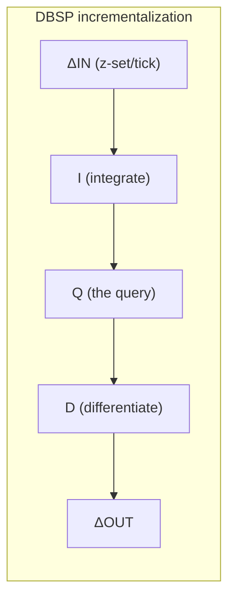

# Topic 27 — Streaming & Incremental View Maintenance

**Why this matters:** recomputing from scratch is the enemy. A standing
query over a changing graph should cost per-*change*, not per-*database*.
Differential dataflow and DBSP made that rigorous — and FalkorDB's delta
matrices (topic 20) are already halfway there conceptually: DP/DM *are*
positive and negative Z-sets waiting for an algebra.

## Our motivation numbers first (Apple M3 Pro, 50K nodes / 500K edges, batches of 100 changes, 2026-07-10)

| standing query | full recompute / batch | incremental target |
|---|---|---|
| triangle count | 97.2 ms | ~µs (stub) — batch·d̄ probes, not m·d̄ |
| 2-hop wedge join | 894.3 ms | ~µs-ms (stub) — bilinear delta rule |
| reachability from src | 24.7 ms (re-BFS) | semi-naive: each edge relaxed O(1) times *ever* |

The gap is 3-5 orders of magnitude, and none of it requires cleverness —
just refusing to touch data that didn't change.

## The one algebraic idea

Changes are **Z-sets**: collections with i64 weights (+1 insert, −1
delete). Operators split into two classes:

```
  LINEAR (stateless to incrementalize)       NONLINEAR (need state)
  map, filter, flat_map, union               distinct, count, sum, top-k,
    op(ΔA) = Δop(A) — deltas stream through    min/max — deleting the last
                                               copy must RETRACT the output,
  BILINEAR (need arranged inputs)              which requires knowing how
  join:  Δ(A⋈B) = ΔA⋈B + A⋈ΔB + ΔA⋈ΔB          many copies existed: state
```

That table *is* the topic. DBSP's contribution: any query built from
these pieces auto-incrementalizes by circuit rewriting; the state each
nonlinear operator needs is exactly an integral (`z^-1` feedback) of its
input. Differential's contribution: it also works *inside recursion*, with
deltas indexed by (iteration, input-version) lattice timestamps.



The chain I→Q→D is the *specification*; the engineering is pushing I and D
through Q's structure until only nonlinear operators keep integrals —
those integrals are Materialize's **arrangements** (shared, indexed,
compacted update logs).

## Timestamps, watermarks, and why "when" is half the problem

Timely's insight (Naiad): every message carries a logical timestamp; the
scheduler broadcasts *progress* ("no more messages ≤ t will ever arrive" —
a frontier/watermark, `MutableAntichain` timely frontier.rs:380). Only
when the frontier passes t may a nonlinear operator emit finalized output
for t. That single mechanism subsumes: batch boundaries, out-of-order
data, iteration rounds (timestamps extend to (epoch, round) pairs), and
exactly-once output (emit per closed timestamp).

RisingWave makes the same call with different machinery: barriers flow
through the dataflow (Chandy-Lamport style), every operator checkpoints
its state to S3 at barrier alignment — its `Op` enum
(stream_chunk.rs:45: Insert/Delete/UpdateDelete/UpdateInsert) is a Z-set
weight wearing protocol clothing.

## The systems, placed

| | timely/differential | DBSP/Feldera | Materialize | RisingWave |
|---|---|---|---|---|
| theory | lattice timestamps | abelian-group circuits | differential underneath | ad-hoc deltas + barriers |
| recursion | full (Naiad loops) | nested circuits | WITH RECURSIVE (limited) | no |
| state | arrangements in RAM | batch/trace spine, spillable | arrangements + persist (S3 log) | Hummock LSM on S3 |
| consistency | multi-versioned by design | per-tick | strict serializable reads | barrier-aligned snapshots |

## The stubs (experiments/)

| stub | contract |
|---|---|
| `djoin::delta_join` + `IncrementalJoin` | equals join(A+ΔA, B+ΔB) − join(A,B) exactly, deletes retract output rows, 30-batch drift-free |
| `tri::IncrementalTriangles` | tracks the full-recompute oracle under insert+delete churn; K4-minus-an-edge = −2; batch of 20 costs < 4K probes on a 40K-edge graph |
| `reach::SemiNaiveReach` | matches re-BFS after every batch; ≤ 4 relaxations/edge across ALL batches; intra-component edges cost 0 |

Provided: `zset.rs` (consolidation, merge, the distinct-is-not-linear
test), `graph.rs` (churn generator + all three full-recompute oracles),
`ivm_bench` (prices the enemy even before the stubs exist).

Deliberate scope cut: `SemiNaiveReach` is insert-only. Deleting an edge
from a reachability result is the problem that *needs* differential's
timestamp machinery — see reading-differential-dataflow.md §4 for why.

## Reading guides

- [reading-naiad-timely.md](reading-naiad-timely.md) — Naiad SOSP'13 + timely progress tracking
- [reading-differential-dataflow.md](reading-differential-dataflow.md) — CIDR'13 + arrange/join_traces/iterate code
- [reading-dbsp.md](reading-dbsp.md) — DBSP VLDB'23 + Feldera circuit code
- [reading-materialize-risingwave.md](reading-materialize-risingwave.md) — two production architectures compared
- [reading-kafka-log.md](reading-kafka-log.md) — NetDB'11 + the log as the database

Further references: "MillWheel" (VLDB 2013) — where *watermarks* (low
watermarks over event time) entered production streaming; the
heuristic ancestor of timely's proof-carrying frontiers, and the
lineage behind Google Dataflow/Beam and Flink's model.

## Cross-topic links

- Topic 20: FalkorDB delta matrices — DP=+Δ, DM=−Δ, `wait` = integrate;
  what's missing vs DBSP is *pushing queries through* the deltas instead
  of forcing a merge first. That gap is exactly M27.
- Topic 4: an arrangement's batch/spine/compaction IS an LSM over update
  triples — merging batches consolidates weights like compaction drops
  tombstones.
- Topic 8: retractions are the MVCC intuition inverted — instead of
  versions hiding rows from the past, negative weights erase rows from
  derived futures.
- Topic 24: semi-naive frontier = delta-stepping's bucket discipline;
  both refuse to re-derive settled facts.
- Topic 5/15: Kafka = the WAL promoted to *the* database; Materialize's
  persist and RisingWave's Hummock both re-derive state from a shared log.
