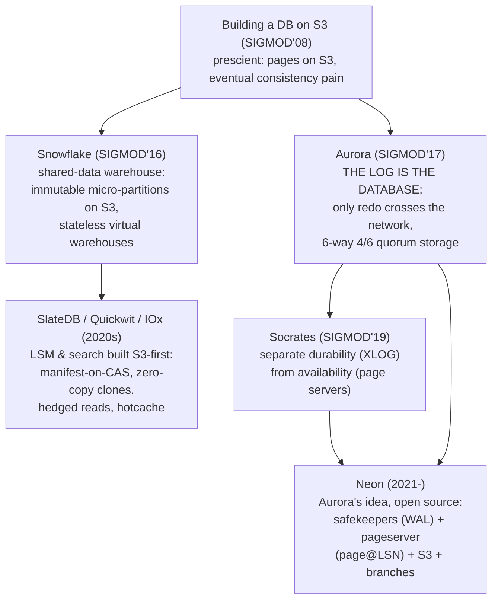

# Topic 28 — Cloud-Native & Disaggregated Storage

The architecture every serious database is converging on: compute is
stateless, the log/object store IS the database. Aurora, Socrates, Snowflake,
Neon, SlateDB — and it reprices every trade-off from topics 3–6.

## 0. The problem, priced (measured here, sim — see notes.md)

| tier | p50 | p99 | vs local |
|---|---|---|---|
| local NVMe read | 0.10 ms | 0.12 ms | 1× |
| raw S3 GET | 14.17 ms | 112.99 ms | 140× / 940× |

Object storage is two orders of magnitude slower at the median and worse at
the tail — and every serious engine moved there anyway, because:

- **$**: S3 ≈ $0.023/GB·month vs ~10× that for provisioned NVMe+replication;
  and you pay for bytes stored, not capacity provisioned.
- **Durability/availability**: 11 nines durability, cross-AZ by default —
  replication (topic 15) becomes *someone else's problem*.
- **Elasticity**: compute scales to zero (nothing local to lose) and any
  node can serve any data (shared-data, not shared-nothing).

The whole topic is the engineering that claws back the 140×: caching tiers,
hedged requests, batching, and putting only the right things (immutable,
big, cold) on the slow tier.

## 1. The lineage



## 2. Neon's shape (the one to internalize — it's Postgres, and it's Rust)

```
  compute (Postgres, STATELESS)
      │ WAL stream                    ▲ GetPage@LSN
      ▼                               │
  safekeepers ×3 ──────────────► pageserver ──── layer files ────► S3
  (Paxos-ish WAL quorum,         (ingests WAL, serves              (cold layers,
   durability, ~RAM+disk)         page versions, hot cache)         all history)
```

- The WAL is durable the moment a quorum of **safekeepers** has it
  (safekeeper.rs:292 `AppendRequest`) — commit latency never touches S3.
- The **pageserver** is a big index of page *versions*: `LayerMap::search
  (key, end_lsn)` (layer_map.rs:448) over delta layers (WAL records, keyed
  key×LSN rectangles) and image layers (materialized pages) — an LSM over
  (page, LSN), the topic 4 shape yet again.
- Reads reconstruct: find newest image ≤ LSN, apply deltas through a
  sandboxed Postgres **walredo** process (walredo.rs:173) — REDO from
  topic 5, promoted to the read path.
- A **branch** is `(parent timeline, LSN)` — created in O(1), no copy
  (tenant.rs:4985 `branch_timeline_impl`); reads walk ancestors capped at
  the branch point (timeline.rs:4548). Our branch.rs stub is exactly this.

## 3. The design space in one table

| axis | Aurora | Socrates | Neon | Snowflake | SlateDB |
|---|---|---|---|---|---|
| what crosses the network | redo log only | log + pages | WAL to safekeepers | micro-partition files | SSTs + manifest |
| durability | 6-way 4/6 quorum | XLOG service | safekeeper quorum | S3 | S3 (+ optional WAL obj) |
| page/read service | storage nodes replay | page servers (RBPEX cache) | pageserver + walredo | warehouse-local cache | block cache + part cache |
| branching/clones | — | snapshots | O(1) LSN branches | zero-copy clone | checkpoint/clone (clone.rs:38) |
| single-writer fencing | epoch in quorum | — | generation numbers | — | writer_epoch CAS (manifest/mod.rs:824) |

Rosetta: **WAL rule (topic 5) → architecture**. Aurora ships *only* the log;
tables/pages are caches of log prefixes materialized near the reader — the
same sentence as Kafka's thesis in topic 27's reading-kafka-log.md, arrived
at independently for OLTP.

## 4. Experiments (`experiments/`)

Simulated tiers with *charged* (not slept) latency — deterministic p50/p99
in milliseconds of wall time. `cargo run --release --bin tier_bench`.

| file | what | status |
|---|---|---|
| `sim.rs` | latency models (NVMe / S3 lognormal+stragglers / scripted), block store, zipf, percentiles | PROVIDED |
| `cache.rs` | `LruBlockCache` + `TieredReader` read-through (slatedb's CachedObjectStore shape) | **STUB** |
| `hedge.rs` | `hedged_get` — backup request at p95 deadline (quickwit's TimeoutAndRetryStorage) | **STUB** |
| `branch.rs` | `BranchStore::get` — CoW branch ancestry walk (Neon timelines) | **STUB** |
| `bin/tier_bench.rs` | the ladder: local vs raw S3 (provided) vs cached/hedged/branched (stubs) | PROVIDED |

Contract highlights: LRU touch-protects; a Zipfian workload must clear 50%
hit rate with a 1/8-size cache; hedging at p95 must halve p99 with <10%
extra GETs; branch creation must copy nothing and a 100-deep chain must
resolve reads correctly.

## 5. Reading guides

- [reading-aurora.md](reading-aurora.md) — the log is the database; 4/6 quorums; why no 2PC
- [reading-socrates.md](reading-socrates.md) — durability ≠ availability; the 4-tier decomposition
- [reading-snowflake-s3.md](reading-snowflake-s3.md) — shared-data warehousing + the prescient 2008 S3 paper
- [reading-neon.md](reading-neon.md) — pageserver/safekeeper code walk (the anchors above)
- [reading-slatedb-quickwit.md](reading-slatedb-quickwit.md) — LSM & search engineered S3-first

Further references: "Lakehouse" (CIDR 2021) + "Delta Lake" (VLDB
2020) — the open-format counterpoint to Snowflake: keep data in
Parquet on object storage, get ACID from a transaction log of file
lists (the same manifest-as-truth move as SlateDB's, at table scale);
"CockroachDB" (SIGMOD 2020) — the shared-nothing rebuttal to this
whole topic's disaggregation thesis (every node stores + computes;
Raft per range instead of a page server).

## 6. Cross-topic threads

- Topic 4: Neon's layer map and SlateDB are LSMs; S3 just moved where the
  levels live. Compaction becomes a *distributed, fenced* actor.
- Topic 5: WAL-as-truth, generalized. Aurora = "ship only WAL"; walredo =
  REDO on the read path; safekeepers = archived WAL with a quorum.
- Topic 6: the buffer pool comes back as the *local cache tier* — same
  eviction questions, new miss cost (15 ms, plus a per-request bill).
- Topic 15: safekeepers are a consensus log; SlateDB replaces leader leases
  with CAS *fencing epochs* on the manifest — consensus outsourced to S3's
  conditional PUT.
- Topic 27: log-is-the-database is Kafka's thesis; Materialize's persist
  crate is this topic applied to IVM state.

## 7. Capstone M28 (FalkorDB)

Tiered storage backend — hot data local, SSTs on object storage — plus
instant graph snapshots/branches. Design notes in notes.md §M-log.
