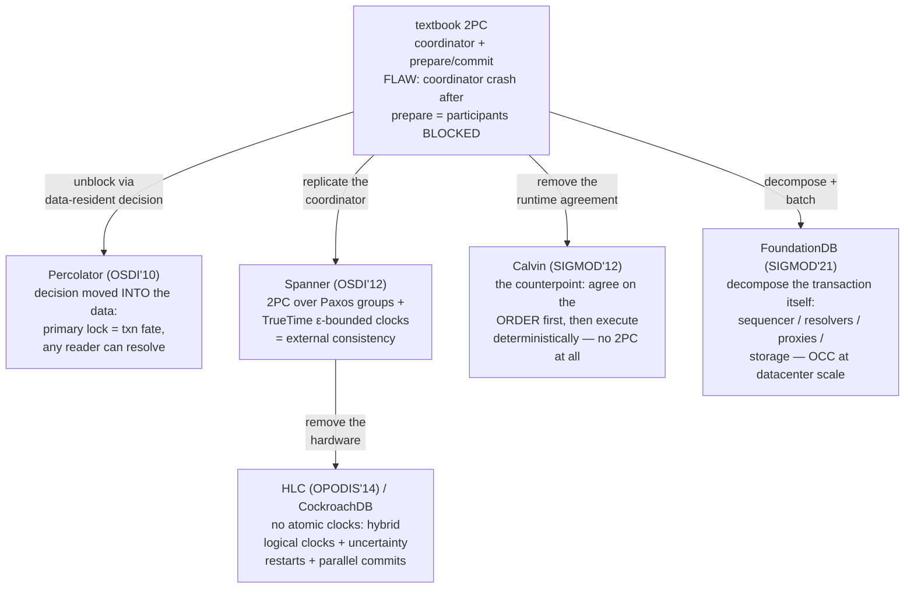

# Topic 29 — Distributed Transactions

The layer above topic 15's Raft: making *transactions* span shards. The gap
between 2PC-in-a-textbook and Spanner/FoundationDB is where the deep
understanding lives.

## 0. The problem, priced (measured here — see notes.md)

Bank transfers, 100K accounts, batches of 8 concurrent txns, Zipfian keys:

| zipf θ | batches with a key collision |
|---|---|
| 0.5 | 0.3% |
| 0.9 | 29.9% |
| 1.1 | 86.2% |
| 1.3 | 99.6% |

Contention isn't an edge case — at real-workload skew (θ≈0.9-1.1) *most*
concurrent batches conflict. Every protocol below is a different answer to
"who aborts, who waits, and who blocks when the coordinator dies."

## 1. The design space



## 2. The one-table summary

| system | concurrency control | clock | cross-shard atomicity | blocking window |
|---|---|---|---|---|
| Percolator/TiKV | optimistic (lock at prewrite) | TSO (central oracle) | primary-key commit point | none — readers resolve |
| Spanner | 2PL + 2PC | TrueTime (ε-bounded GPS/atomic) | 2PC over Paxos groups | Paxos-replicated coordinator |
| CockroachDB | MVCC + timestamp ordering | HLC + max-offset | parallel commits (STAGING) | none — status recoverable |
| Calvin | deterministic execution | sequencer batch order | none needed (order fixed a priori) | none — but no interactive txns |
| FoundationDB | OCC (resolver checks read/write sets) | sequencer versionstamps | proxy makes batch durable | recovery epoch bump |

## 3. Percolator in six lines (the one we build)

```
prewrite(all keys, start_ts):  lock each key (one is PRIMARY), stage data;
                               abort on any lock or any commit > start_ts
commit_primary(commit_ts):     write-record primary, drop its lock  ← THE COMMIT POINT
commit_secondaries:            lazy; crash here is harmless
reader hits stale lock:        look at primary — lock held? roll back.
                               write record? roll forward.  (fate is in the data)
```

TiKV: prewrite = `txn/actions/prewrite.rs:37`, commit = `commit.rs:64`,
resolution = `check_txn_status.rs`/`cleanup.rs` (see reading-percolator-tikv.md).

## 4. Experiments (`experiments/`)

`cargo run --release --bin txn_bench`

| file | what | status |
|---|---|---|
| `kv.rs` | sharded MVCC cluster with Percolator's data/lock/write columns, TSO, Zipf | PROVIDED |
| `tpc.rs` | 2PC coordinator + DST crash points + recovery — the blocking window on display | **STUB** |
| `percolator.rs` | prewrite / commit_primary / commit_secondaries / resolve_lock | **STUB** |
| `hlc.rs` | hybrid logical clock send/recv rules | **STUB** |
| `bin/txn_bench.rs` | conflict probability (provided) + abort rates vs θ + 2PC crash storm | lanes |

Contract highlights: every 2PC crash point must preserve atomicity after
recovery, and a logged decision must roll *forward*; Percolator readers must
roll a crashed txn forward iff the primary committed; HLC must stay
monotonic under backward-jumping physical clocks while `l` never escapes the
max physical time seen (the anti-Lamport-drift bound).

## 5. Reading guides

- [reading-percolator-tikv.md](reading-percolator-tikv.md) — Percolator: 2PC with the coordinator erased
- [reading-spanner-hlc.md](reading-spanner-hlc.md) — Spanner & HLC: timestamps without the oracle
- [reading-calvin.md](reading-calvin.md) — Calvin: agree on inputs, not outcomes
- [reading-foundationdb.md](reading-foundationdb.md) — FoundationDB: the unbundled transaction

## 6. Cross-topic threads

- Topic 15: every serious 2PC participant/coordinator here sits on a Raft/
  Paxos log — Spanner replicates the coordinator, FDB replicates by epoch
  recovery. 2PC and consensus are orthogonal layers, not rivals.
- Topic 16: FDB's simulation (ResolverBug.cpp ships *injectable resolver
  bugs*) is the DST harness our tpc.rs crash points imitate.
- Topic 9 (MVCC): Percolator is postgres's MVCC snapshot rule stretched
  across machines — start_ts/commit_ts are xmin/xmax with a TSO instead of
  a local counter.
- Topic 27: TiKV's resolved-ts / CDC is the changelog of this topic's
  writes — the IVM input stream.
- Topic 24/25: the cross-shard *pattern matching* problem (M29's second
  half) is a distributed join over partitioned adjacency — delta-join
  shapes from topic 27 apply.

## 7. Capstone M29 (FalkorDB)

Cross-shard transactions + cross-shard pattern matching over a partitioned
graph. Design notes in notes.md §M-log.
