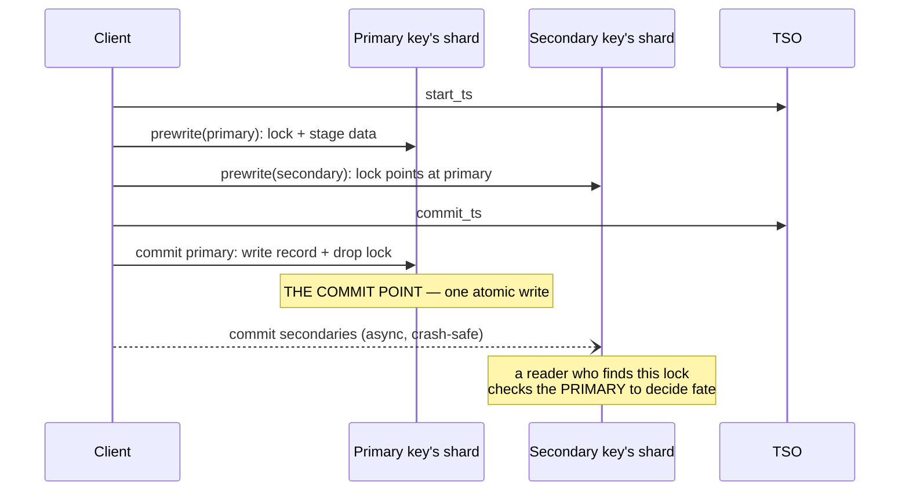

# Percolator: 2PC with the coordinator erased

Textbook 2PC blocks when the coordinator dies holding everyone's locks.
Percolator's answer is to make the coordinator unnecessary: transaction
fate lives *in the data itself*, at one primary key, where any reader can
resolve it. This chapter builds the protocol step by step — the blocking
problem, snapshots from a timestamp oracle, the three column families,
prewrite, the one-write commit point, and reader-driven resolution — then
walks TiKV's Rust reimplementation, the protocol our `percolator.rs` stub
implements.

## The problem in one sentence

A transaction spanning shards must commit atomically on all of them or
none, and the textbook solution leaves a window where one process's crash
freezes every participant — at θ≈1.1 workload skew, where **86% of
concurrent batches conflict** (README §0), those frozen locks are the
hottest keys in the system.

## The concepts, step by step

### Step 1 — two-phase commit, and where it blocks

**Two-phase commit (2PC)** is the classic recipe for atomicity across
shards: a **coordinator** asks every participant shard to **prepare**
(durably stage the writes and lock the keys, promising it *can* commit),
and once all vote yes, it writes the decision and tells everyone to
**commit**. The flaw is in between: a participant that voted yes may
neither commit nor abort on its own — the decision lives only at the
coordinator. Coordinator crashes after prepare ⇒ every participant holds
its locks *indefinitely*, blocking every later transaction that touches
those keys. Our `tpc.rs` crash matrix makes this window measurable. The
fix candidates: replicate the coordinator (Spanner), or — Percolator —
move the decision *into the data*, where anyone can read it.

### Step 2 — snapshots across machines: two timestamps from an oracle

Percolator runs **snapshot isolation** (topic 9's MVCC: readers see the
database frozen as of a start time; writers succeed only if nobody else
committed a conflicting write in between). Each transaction gets two
timestamps from a central **TSO** (timestamp oracle — a single service
handing out strictly increasing integers): `start_ts` when it begins
(fixes its snapshot) and `commit_ts` when it commits (fixes where its
writes become visible). This is Postgres's xmin/xmax stretched across
machines, with the TSO replacing the local counter. The TSO is a SPOF and
a round trip — the price the next chapter's Spanner/HLC designs remove —
but it makes ordering trivial: timestamps *are* the global order.

### Step 3 — the state: three column families per key

The whole protocol is a state machine over three column families
(**CF** — a named sub-keyspace in the storage engine; Percolator ran on
Bigtable, TiKV runs the same three on RocksDB):

```
       data CF                lock CF                  write CF
  (key, start_ts) -> value    key -> {primary,        (key, commit_ts) -> start_ts
                                      start_ts, ttl}
  staged versions             "in flight" markers      the COMMIT INDEX:
  invisible until a           readers must not         a version exists iff
  write record points         skip these               a row here points at it
  at them
```

The invariant that carries everything: **data is invisible until the
write CF points at it**. A read at snapshot `ts` = newest `write` entry
with `commit_ts <= ts`, then fetch `data[(key, its start_ts)]`. Our
`kv.rs` mirrors this exactly (`Shard::latest_write_before`,
`Cluster::read_committed`). Cost: every logical write is two physical
writes (data now, write-record later) plus a transient lock.

### Step 4 — prewrite: lock everything, crown one key primary

Phase one stages every write: for each key, write the value into the data
CF at `start_ts` and place a lock in the lock CF. Prewrite *fails* if the
key has any lock (someone's in flight — Q1 asks why even a newer one
kills us) or any write record with `commit_ts > start_ts` (someone
committed after our snapshot — the snapshot-isolation conflict rule from
Step 2). The twist that erases the coordinator: one key of the
transaction is designated **primary**, and every other ("secondary")
key's lock contains a pointer to it. The primary's lock is now the single
physical location that will decide the transaction's fate — a
coordinator's decision record, stored *in* the database, addressable by
anyone.

### Step 5 — the commit point: one atomic write

Commit = get `commit_ts`, then perform **one atomic operation on the
primary key**: write its write-CF record (making its data visible,
Step 3's invariant) and delete its lock. That single write *is* the
commit — before it the transaction can only roll back; after it, only
forward. Secondaries are committed lazily; a crash anywhere after the
primary commit is harmless:

```rust
fn commit_txn(c: &mut Cluster, writes: &[(Key, Val)]) -> Result<()> {
    let start_ts = c.tso.next();
    let primary = &writes[0].0;
    for (k, v) in writes {                        // PHASE 1: prewrite everything —
        c.shard(k).prewrite(k, v, primary, start_ts)?;  // fails on ANY lock or
    }                                             // any commit_ts > start_ts
    let commit_ts = c.tso.next();
    c.shard(primary)                              // THE COMMIT POINT: write record
        .commit(primary, start_ts, commit_ts)?;   // + drop lock, one atomic write
    for (k, _) in &writes[1..] {                  // secondaries are lazy; a crash
        let _ = c.shard(k).commit(k, start_ts, commit_ts); // here is harmless —
    }                                             // readers roll them forward
    Ok(())
}
```



Compare Step 1: the "decision write" still exists, but it moved from a
coordinator's private log into the primary key's shard, where every
reader can see it.

### Step 6 — readers resolve: fate is in the data

The client can die at any point, so stray locks are the *normal* case —
and any reader blocked on one can finish the dead transaction's job.
Follow the lock's pointer to the primary and look (paper §2.2, our
`resolve_lock` recipe):

| reader finds on primary | verdict | action |
|---|---|---|
| lock still held (TTL expired) | txn never committed | roll BACK everywhere |
| write record at some commit_ts | txn committed | roll FORWARD secondaries |
| neither | already rolled back | clean up stray lock |

The TTL (a lease on the lock) stops readers from rolling back a merely
*slow* transaction (Q3). No process's death can block anyone — the
blocking window of Step 1 is gone. The cost moved to latency and
optimism: readers do resolution work, and prewrite aborts on any conflict
(pure optimistic concurrency dies at high contention — the reason TiKV
grew pessimistic locks, below).

### Step 7 — what a decade of production added (TiKV)

TiKV is the highest-fidelity reimplementation — same three column
families, same primary-key commit point — plus the hardening that shows
where the paper's optimism hurts: **pessimistic locks** (take locks at
execution time, before prewrite, because pure first-locker-wins OCC
thrashes at θ≥1.1 — our txn_bench lane 2), **async commit** (the
primary's lock records *all* secondary keys, so the commit point can be
computed without the client's second round trip), durable **rollback
records** (so a late-arriving prewrite can't resurrect a rolled-back
transaction — Q4), per-key in-memory **latches** (serialize same-key
commands within one node cheaply; the distributed protocol only handles
distributed conflicts), and a **txn status cache** (so resolvers don't
hammer the primary).

## Where each step lives in the code

TiKV, in reading order:

1. `src/storage/txn/actions/prewrite.rs:37` — `pub fn prewrite`: one
   mutation = lock + staged value (Steps 3–4). Note the arguments the
   paper never had: `pessimistic_action` (TiKV grew pessimistic locks
   because pure OCC dies at high contention — exactly what our txn_bench
   lane 2 measures) and `secondary_keys` (async commit: the primary's
   lock records *all* secondaries so the commit point can be computed
   without the client) — Step 7.
2. `src/storage/txn/actions/commit.rs:64` — `pub fn commit`: verify the
   lock is ours, convert lock → write record (Step 5). Just above (`:57`)
   is the idempotency arm: a duplicate commit finds a write record and
   returns `Ok(None)` — commit must be replayable because the client
   retries.
3. `src/storage/txn/actions/check_txn_status.rs:92`
   (`check_txn_status_lock_exists`) and `:241`
   (`check_txn_status_missing_lock`) — the production version of our
   `resolve_lock` (Step 6): a reader blocked on a lock asks the primary's
   shard "did this txn commit?", with `MissingLockAction` (`:458`)
   encoding the roll-back-vs-error choice when no lock is found.
4. `src/storage/txn/actions/cleanup.rs:24` — `pub fn cleanup`: the
   roll-back arm (write a Rollback record so a late prewrite can't
   resurrect the txn — a wrinkle our simulation skips) — Steps 6–7.
5. `src/storage/txn/latch.rs` + `scheduler.rs` — before any of the above
   runs, per-key in-memory latches serialize commands on the same key
   within one TiKV node (Step 7). The Percolator protocol handles
   *distributed* conflicts; latches handle local ones cheaply.
6. `src/storage/txn/txn_status_cache.rs` — cache of recently-committed txn
   statuses, so resolvers don't hammer the primary (Step 7). Optimization
   layered on the same fate-lives-at-the-primary rule.

## Questions to answer while reading

1. Why must `prewrite` fail on *any* lock, even one with `start_ts` newer
   than ours? (Hint: what does the lock's presence say about the write CF's
   future?)
2. The commit point is "write record + remove primary lock" as one atomic
   op. TiKV runs on RocksDB + Raft — what makes that pair atomic there,
   and what makes it atomic in our `kv.rs`?
3. Percolator reads *wait* on locks (paper: TTL + cleanup); our `get`
   returns `Locked` immediately. What livelock does the TTL prevent that
   our simulation can't exhibit?
4. Why does a rolled-back txn need a durable Rollback record in the write
   CF (`cleanup.rs`), when our simulation just deletes the lock? What
   reordering breaks without it?
5. First-locker-wins OCC aborts the *second* arrival. At θ=1.1 (86% of
   batches collide) what abort rate do you predict for lane 2, and why is
   it lower than the collision rate?
6. M29 mapping: FalkorDB shards a graph by node id. A 2-hop traversal
   reads nodes on shards it never prewrites. Does Percolator's snapshot
   `get` suffice for consistent multi-shard *reads*, and what does the TSO
   become in that design?

## References

**Papers**
- Peng & Dabek — "Large-scale Incremental Processing Using Distributed
  Transactions and Notifications" (OSDI 2010) — §2 is the protocol; the
  observer/notification half is skippable for this topic

**Code**
- [tikv](https://github.com/tikv/tikv) `src/storage/txn/` and
  `src/storage/mvcc/` — start at `txn/actions/prewrite.rs` and
  `commit.rs`; the extra arguments over the paper are the decade of
  hardening
