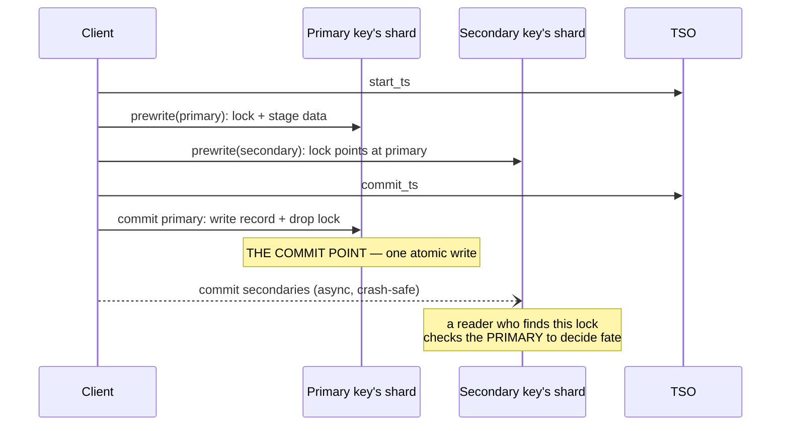

# Reading guide — Percolator (OSDI '10) + TiKV's Rust implementation

Paper: *Large-scale Incremental Processing Using Distributed Transactions and
Notifications*, Peng & Dabek, OSDI 2010. Code: [`~/repos/tikv`](https://github.com/tikv/tikv)
(`src/storage/txn/` and `src/storage/mvcc/`).

## Why this pairing

Percolator is 2PC with the coordinator *erased*: the decision lives in the
data itself (the primary key's lock/write record), so there is no process
whose death can block anyone. TiKV is the highest-fidelity production
reimplementation — same three column families, same primary-key commit
point, plus a decade of hardening (pessimistic locks, async commit, a txn
status cache) that shows where the paper's optimism hurts.

## The three column families (the whole protocol is a state machine over these)

```
       data CF                lock CF                  write CF
  (key, start_ts) -> value    key -> {primary,        (key, commit_ts) -> start_ts
                                      start_ts, ttl}
  staged versions             "in flight" markers      the COMMIT INDEX:
  invisible until a           readers must not         a version exists iff
  write record points         skip these               a row here points at it
  at them
```

A read at snapshot `ts` = newest `write` entry with `commit_ts <= ts`, then
fetch `data[(key, its start_ts)]`. Our `kv.rs` mirrors this exactly
(`Shard::latest_write_before`, `Cluster::read_committed`).

## Transaction lifecycle



Failure rules (paper §2.2, our `resolve_lock` recipe):

| reader finds on primary | verdict | action |
|---|---|---|
| lock still held (TTL expired) | txn never committed | roll BACK everywhere |
| write record at some commit_ts | txn committed | roll FORWARD secondaries |
| neither | already rolled back | clean up stray lock |

## TiKV code walk (in reading order)

1. `src/storage/txn/actions/prewrite.rs:37` — `pub fn prewrite`: one
   mutation = lock + staged value. Note the arguments the paper never had:
   `pessimistic_action` (TiKV grew pessimistic locks because pure OCC dies
   at high contention — exactly what our txn_bench lane 2 measures) and
   `secondary_keys` (async commit: the primary's lock records *all*
   secondaries so the commit point can be computed without the client).
2. `src/storage/txn/actions/commit.rs:64` — `pub fn commit`: verify the
   lock is ours, convert lock → write record. Just above (`:57`) is the
   idempotency arm: a duplicate commit finds a write record and returns
   `Ok(None)` — commit must be replayable because the client retries.
3. `src/storage/txn/actions/check_txn_status.rs:92`
   (`check_txn_status_lock_exists`) and `:241`
   (`check_txn_status_missing_lock`) — the production version of our
   `resolve_lock`: a reader blocked on a lock asks the primary's shard
   "did this txn commit?", with `MissingLockAction` (`:458`) encoding the
   roll-back-vs-error choice when no lock is found.
4. `src/storage/txn/actions/cleanup.rs:24` — `pub fn cleanup`: the
   roll-back arm (write a Rollback record so a late prewrite can't
   resurrect the txn — a wrinkle our simulation skips).
5. `src/storage/txn/latch.rs` + `scheduler.rs` — before any of the above
   runs, per-key in-memory latches serialize commands on the same key
   within one TiKV node. The Percolator protocol handles *distributed*
   conflicts; latches handle local ones cheaply.
6. `src/storage/txn/txn_status_cache.rs` — cache of recently-committed txn
   statuses, so resolvers don't hammer the primary. Optimization layered
   on the same fate-lives-at-the-primary rule.

## Questions to answer while reading

1. Why must `prewrite` fail on *any* lock, even one with `start_ts` newer
   than ours? (Hint: what does the lock's presence say about the write CF's
   future?)
2. The commit point is "write record + remove primary lock" as one atomic
   op. TiKV runs on RocksDB + Raft — what makes that pair atomic there,
   and what makes it atomic in our `kv.rs`?
3. Percolator reads *wait* on locks (paper: TTL + cleanup); our `get`
   returns `Locked` immediately. What livelock does the TTL prevent that
   our simulation can't exhibit?
4. Why does a rolled-back txn need a durable Rollback record in the write
   CF (`cleanup.rs`), when our simulation just deletes the lock? What
   reordering breaks without it?
5. First-locker-wins OCC aborts the *second* arrival. At θ=1.1 (86% of
   batches collide) what abort rate do you predict for lane 2, and why is
   it lower than the collision rate?
6. M29 mapping: FalkorDB shards a graph by node id. A 2-hop traversal
   reads nodes on shards it never prewrites. Does Percolator's snapshot
   `get` suffice for consistent multi-shard *reads*, and what does the TSO
   become in that design?
