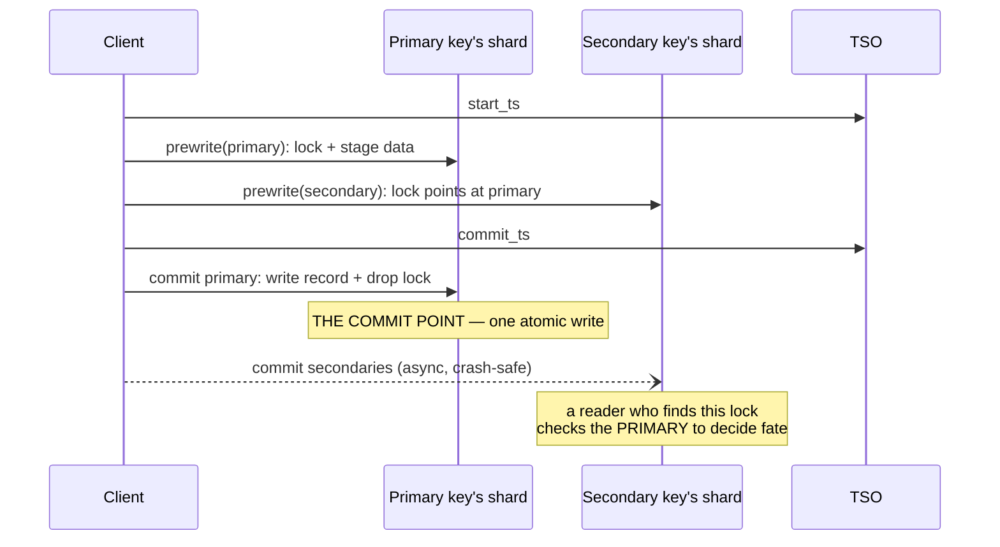

# Percolator: 2PC with the coordinator erased

Textbook 2PC blocks when the coordinator dies holding everyone's locks.
Percolator's answer is to make the coordinator unnecessary: transaction
fate lives *in the data itself*, at one primary key, where any reader can
resolve it. This chapter builds the protocol step by step — the blocking
problem, snapshots from a timestamp oracle, the three column families,
prewrite, the one-write commit point, and reader-driven resolution — then
walks TiKV's Rust reimplementation, the protocol our `percolator.rs` stub
implements.

Paper references below are to Peng & Dabek, **"Large-scale Incremental
Processing Using Distributed Transactions and Notifications"** (OSDI 2010),
cited by section, figure or table. Code anchors are TiKV at the SHA pinned in
`resources/codebases.md`.

## The problem in one sentence

A transaction spanning shards must commit atomically on all of them or
none, and the textbook solution leaves a window where one process's crash
freezes every participant — at θ≈1.1 workload skew, where **86% of
concurrent batches conflict** (README §0), those frozen locks are the
hottest keys in the system.

## The concepts, step by step

### Step 1 — two-phase commit, and where it blocks

> **In:** nothing yet — this step names the coordinator-blocking failure
> that every later step is built to erase.
> **Out:** the specific window (coordinator dies after prepare) that Step 5's
> in-data commit point and Step 6's reader resolution close.

**Two-phase commit (2PC)** is the classic recipe for atomicity across
shards: a **coordinator** asks every participant shard to **prepare**
(durably stage the writes and lock the keys, promising it *can* commit),
and once all vote yes, it writes the decision and tells everyone to
**commit**. The flaw is in between: a participant that voted yes may
neither commit nor abort on its own — the decision lives only at the
coordinator. Coordinator crashes after prepare ⇒ every participant holds
its locks *indefinitely*, blocking every later transaction that touches
those keys. Our `tpc.rs` crash matrix makes this window measurable. The
fix candidates: replicate the coordinator (Spanner), or — Percolator —
move the decision *into the data*, where anyone can read it.

### Step 2 — snapshots across machines: two timestamps from an oracle

> **In:** the atomicity requirement from Step 1.
> **Out:** two timestamps (`start_ts`, `commit_ts`) that fix a transaction's
> snapshot and its visibility point — the coordinates Steps 3–6 read and write.

Percolator runs **snapshot isolation** (topic 9's MVCC: readers see the
database frozen as of a start time; writers succeed only if nobody else
committed a conflicting write in between). Each transaction gets two
timestamps from a central **TSO** (timestamp oracle — a single service
handing out strictly increasing integers): `start_ts` when it begins
(fixes its snapshot) and `commit_ts` when it commits (fixes where its
writes become visible). This is Postgres's xmin/xmax stretched across
machines, with the TSO replacing the local counter. The paper reports the
oracle serving "around 2 million timestamps per second from a single machine"
(§2.3) — workers batch their requests into a single pending RPC, so the
oracle's load bounds throughput, not each transaction. The TSO is still a
SPOF and a round trip — the price the next chapter's Spanner/HLC designs
remove — but it makes ordering trivial: timestamps *are* the global order.

### Step 3 — the state: three column families per key

> **In:** the snapshot timestamps from Step 2.
> **Out:** the three-CF layout (data / lock / write) that the rest of the
> protocol is a state machine over — prewrite (Step 4) writes data+lock, the
> commit point (Step 5) writes the write record, readers (Step 6) read all three.

The whole protocol is a state machine over three column families
(**CF** — a named sub-keyspace in the storage engine; Percolator ran on
Bigtable, TiKV runs the same three on RocksDB):

```
       data CF                lock CF                  write CF
  (key, start_ts) -> value    key -> {primary,        (key, commit_ts) -> start_ts
                                      start_ts, ttl}
  staged versions             "in flight" markers      the COMMIT INDEX:
  invisible until a           readers must not         a version exists iff
  write record points         skip these               a row here points at it
  at them
```

The invariant that carries everything: **data is invisible until the
write CF points at it**. A read at snapshot `ts` = newest `write` entry
with `commit_ts <= ts`, then fetch `data[(key, its start_ts)]`. Our
`kv.rs` mirrors this exactly (`Shard::latest_write_before`,
`Cluster::read_committed`). Cost: every logical write is two physical
writes (data now, write-record later) plus a transient lock. The paper
measures the worst case directly — a single-cell write, so prewrite+commit
is all overhead — at **"roughly a factor of four overhead"** over raw
Bigtable (Figure 8, §3.2): one Bigtable write becomes a read-to-check-locks,
a write to add the lock, and a write to remove it (reads, by contrast, are
~1×). Aggregate CPU per transaction lands ~30× a commercial TPC-E DBMS
(§3.3) — Percolator is an incremental-processing system, not an OLTP one.

### Step 4 — prewrite: lock everything, crown one key primary

> **In:** the three-CF state from Step 3.
> **Out:** every key staged and locked with one key marked primary — the
> single decision location Step 5 flips and Step 6 reads.

Phase one stages every write: for each key, write the value into the data
CF at `start_ts` and place a lock in the lock CF. Prewrite *fails* if the
key has any lock (someone's in flight — Q1 asks why even a newer one
kills us) or any write record with `commit_ts > start_ts` (someone
committed after our snapshot — the snapshot-isolation conflict rule from
Step 2). The twist that erases the coordinator: one key of the
transaction is designated **primary**, and every other ("secondary")
key's lock contains a pointer to it. The primary's lock is now the single
physical location that will decide the transaction's fate — a
coordinator's decision record, stored *in* the database, addressable by
anyone.

### Step 5 — the commit point: one atomic write

> **In:** the prewritten, primary-crowned state from Step 4.
> **Out:** the single atomic primary write that flips the transaction from
> "roll back" to "committed" — the fact Step 6's readers resolve against.

Commit = get `commit_ts`, then perform **one atomic operation on the
primary key**: write its write-CF record (making its data visible,
Step 3's invariant) and delete its lock. That single write *is* the
commit — before it the transaction can only roll back; after it, only
forward. Secondaries are committed lazily; a crash anywhere after the
primary commit is harmless:

```rust
// ILLUSTRATION — our percolator.rs shape; the real commit point is
// tikv src/storage/txn/actions/commit.rs:64 (lock -> write record).
fn commit_txn(c: &mut Cluster, writes: &[(Key, Val)]) -> Result<()> {
    let start_ts = c.tso.next();
    let primary = &writes[0].0;
    for (k, v) in writes {                        // PHASE 1: prewrite everything —
        c.shard(k).prewrite(k, v, primary, start_ts)?;  // fails on ANY lock or
    }                                             // any commit_ts > start_ts
    let commit_ts = c.tso.next();
    c.shard(primary)                              // THE COMMIT POINT: write record
        .commit(primary, start_ts, commit_ts)?;   // + drop lock, one atomic write
    for (k, _) in &writes[1..] {                  // secondaries are lazy; a crash
        let _ = c.shard(k).commit(k, start_ts, commit_ts); // here is harmless —
    }                                             // readers roll them forward
    Ok(())
}
```


```mermaid
sequenceDiagram
    participant C as Client
    participant P as Primary key's shard
    participant S as Secondary key's shard
    participant T as TSO
    C->>T: start_ts
    C->>P: prewrite(primary): lock + stage data
    C->>S: prewrite(secondary): lock points at primary
    C->>T: commit_ts
    C->>P: commit primary: write record + drop lock
    Note over P: THE COMMIT POINT — one atomic write
    C--)S: commit secondaries (async, crash-safe)
    Note over S: a reader who finds this lock<br/>checks the PRIMARY to decide fate
```

Compare Step 1: the "decision write" still exists, but it moved from a
coordinator's private log into the primary key's shard, where every
reader can see it.

### Step 6 — readers resolve: fate is in the data

> **In:** the primary commit point from Step 5.
> **Out:** a rule by which any reader finishes a dead transaction's work from
> the data alone — the property that erases Step 1's blocking window.

The client can die at any point, so stray locks are the *normal* case —
and any reader blocked on one can finish the dead transaction's job.
Follow the lock's pointer to the primary and look (paper §2.2, our
`resolve_lock` recipe):

| reader finds on primary | verdict | action |
|---|---|---|
| lock still held (TTL expired) | txn never committed | roll BACK everywhere |
| write record at some commit_ts | txn committed | roll FORWARD secondaries |
| neither | already rolled back | clean up stray lock |

The TTL (a lease on the lock) stops readers from rolling back a merely
*slow* transaction (Q3). No process's death can block anyone — the
blocking window of Step 1 is gone. The cost moved to latency and
optimism: readers do resolution work, and prewrite aborts on any conflict
(pure optimistic concurrency dies at high contention — the reason TiKV
grew pessimistic locks, below).

### Step 7 — what a decade of production added (TiKV)

> **In:** the paper's optimistic protocol (Steps 2–6).
> **Out:** the named production hardening (pessimistic locks, async commit,
> rollback records, latches, status cache) that the code walk below points at.

TiKV is the highest-fidelity reimplementation — same three column
families, same primary-key commit point — plus the hardening that shows
where the paper's optimism hurts: **pessimistic locks** (take locks at
execution time, before prewrite, because pure first-locker-wins OCC
thrashes at θ≥1.1 — our txn_bench lane 2), **async commit** (the
primary's lock records *all* secondary keys, so the commit point can be
computed without the client's second round trip), durable **rollback
records** (so a late-arriving prewrite can't resurrect a rolled-back
transaction — Q4), per-key in-memory **latches** (serialize same-key
commands within one node cheaply; the distributed protocol only handles
distributed conflicts), and a **txn status cache** (so resolvers don't
hammer the primary).

## Where each step lives in the code

TiKV, in reading order:

1. `src/storage/txn/actions/prewrite.rs:37` — `pub fn prewrite`: one
   mutation = lock + staged value (Steps 3–4). Note the arguments the
   paper never had: `pessimistic_action` (TiKV grew pessimistic locks
   because pure OCC dies at high contention — exactly what our txn_bench
   lane 2 measures) and `secondary_keys` (async commit: the primary's
   lock records *all* secondaries so the commit point can be computed
   without the client) — Step 7.
2. `src/storage/txn/actions/commit.rs:64` — `pub fn commit`: verify the
   lock is ours, convert lock → write record (Step 5). Just above (`:57`)
   is the idempotency arm: a duplicate commit finds a write record and
   returns `Ok(None)` — commit must be replayable because the client
   retries.
3. `src/storage/txn/actions/check_txn_status.rs:92`
   (`check_txn_status_lock_exists`) and `:241`
   (`check_txn_status_missing_lock`) — the production version of our
   `resolve_lock` (Step 6): a reader blocked on a lock asks the primary's
   shard "did this txn commit?", with `MissingLockAction` (`:458`)
   encoding the roll-back-vs-error choice when no lock is found.
4. `src/storage/txn/actions/cleanup.rs:24` — `pub fn cleanup`: the
   roll-back arm (write a Rollback record so a late prewrite can't
   resurrect the txn — a wrinkle our simulation skips) — Steps 6–7.
5. `src/storage/txn/latch.rs` + `scheduler.rs` — before any of the above
   runs, per-key in-memory latches serialize commands on the same key
   within one TiKV node (Step 7). The Percolator protocol handles
   *distributed* conflicts; latches handle local ones cheaply.
6. `src/storage/txn/txn_status_cache.rs` — cache of recently-committed txn
   statuses, so resolvers don't hammer the primary (Step 7). Optimization
   layered on the same fate-lives-at-the-primary rule.

## Questions to answer while reading

1. Why must `prewrite` fail on *any* lock, even one with `start_ts` newer
   than ours? (Hint: what does the lock's presence say about the write CF's
   future?)
2. The commit point is "write record + remove primary lock" as one atomic
   op. TiKV runs on RocksDB + Raft — what makes that pair atomic there,
   and what makes it atomic in our `kv.rs`?
3. Percolator reads *wait* on locks (paper: TTL + cleanup); our `get`
   returns `Locked` immediately. What livelock does the TTL prevent that
   our simulation can't exhibit?
4. Why does a rolled-back txn need a durable Rollback record in the write
   CF (`cleanup.rs`), when our simulation just deletes the lock? What
   reordering breaks without it?
5. First-locker-wins OCC aborts the *second* arrival. At θ=1.1 (86% of
   batches collide) what abort rate do you predict for lane 2, and why is
   it lower than the collision rate?
6. M29 mapping: FalkorDB shards a graph by node id. A 2-hop traversal
   reads nodes on shards it never prewrites. Does Percolator's snapshot
   `get` suffice for consistent multi-shard *reads*, and what does the TSO
   become in that design?

## Done when

Answer each before unfolding it.

- [ ] You can say where classic 2PC blocks and what Percolator replaces the coordinator with.

  <details><summary>Answer</summary>

  2PC blocks when the coordinator crashes *after* participants voted yes:
  each participant holds its locks indefinitely because the decision lived
  only at the coordinator (Step 1). Percolator moves that decision *into the
  data* — one designated **primary key** whose lock-vs-write-record state is
  the commit decision, addressable by any reader (Steps 4–6). No private
  coordinator log means no coordinator to block on.

  </details>

- [ ] You can name the three column families and what each holds.

  <details><summary>Answer</summary>

  **data** CF: `(key, start_ts) → value`, staged versions invisible until
  pointed at. **lock** CF: `key → {primary, start_ts, ttl}`, the "in flight"
  marker a reader must not skip. **write** CF: `(key, commit_ts) → start_ts`,
  the commit index — a version exists *iff* a write-CF row points at it
  (Step 3). The load-bearing invariant: data is invisible until the write CF
  points at it.

  </details>

- [ ] You can explain why prewrite must fail on any lock, even a newer one.

  <details><summary>Answer</summary>

  A lock in the lock CF means another transaction is mid-flight on that key
  and *may* be about to write a write-CF record — possibly at a `commit_ts`
  that would violate our snapshot, and we cannot see its fate yet. Even a lock
  with a newer `start_ts` could commit at a `commit_ts` ordering-conflicting
  with ours, so the only safe move is to refuse rather than gamble on the
  other transaction's outcome (Step 4, Q1).

  </details>

- [ ] You can identify the commit point precisely and say why it is one atomic write.

  <details><summary>Answer</summary>

  The commit point is the single atomic operation on the *primary* key that
  writes its write-CF record and removes its lock (Step 5). It must be atomic
  because that one write is what flips the transaction's fate: before it a
  reader sees a lock (roll back), after it a reader sees a write record (roll
  forward). A torn write would leave fate ambiguous. In TiKV the atomicity
  comes from the underlying RocksDB write batch replicated by Raft; in our
  `kv.rs` from a single-shard atomic apply (Q2).

  </details>

- [ ] You can explain how a reader resolves an abandoned transaction from the data alone.

  <details><summary>Answer</summary>

  It follows the stray lock's pointer to the primary and inspects it: primary
  lock still held past its TTL → the txn never committed, roll everything
  *back*; a write record at some `commit_ts` → it committed, roll the
  secondaries *forward*; neither → already cleaned up, remove the stray lock
  (Step 6). The TTL/lease stops a reader from rolling back a merely *slow*
  live transaction (Q3), so no process's death blocks anyone.

  </details>

- [ ] You can predict the abort rate at θ=1.1, where this topic measures 86.2% of batches containing a key collision, before implementing `percolator.rs`.

  <details><summary>Answer</summary>

  It should be *below* 86.2%. The 86.2% (README §0) is the share of batches
  containing *any* colliding key pair; a collision aborts only the *later*
  arrival on that key under first-locker-wins OCC, not every transaction in
  the batch. So per-batch, the aborting fraction is roughly the colliding
  participants, not the whole batch — abort rate < collision rate. Q5: writing
  the number down first, then measuring lane 2, is the exercise; the point is
  that contention is set by the Zipf θ before any protocol runs.

  </details>

- [ ] You wrote answers to all six questions in notes.md.

  <details><summary>Answer</summary>

  Self-check: Q2 should name RocksDB write-batch + Raft as the atomicity
  source in TiKV; Q4 should show the reordering where a late prewrite
  resurrects a rolled-back txn absent a durable Rollback record; Q6 should
  say the TSO becomes the read-timestamp source for consistent multi-shard
  reads and reason about whether a snapshot `get` suffices without prewriting
  the read shards.

  </details>

## References

**Papers**
- Peng & Dabek — "Large-scale Incremental Processing Using Distributed
  Transactions and Notifications" (OSDI 2010) — §2 is the protocol; the
  observer/notification half is skippable for this topic

**Code**
- [tikv](https://github.com/tikv/tikv) `src/storage/txn/` and
  `src/storage/mvcc/` — start at `txn/actions/prewrite.rs` and
  `commit.rs`; the extra arguments over the paper are the decade of
  hardening
