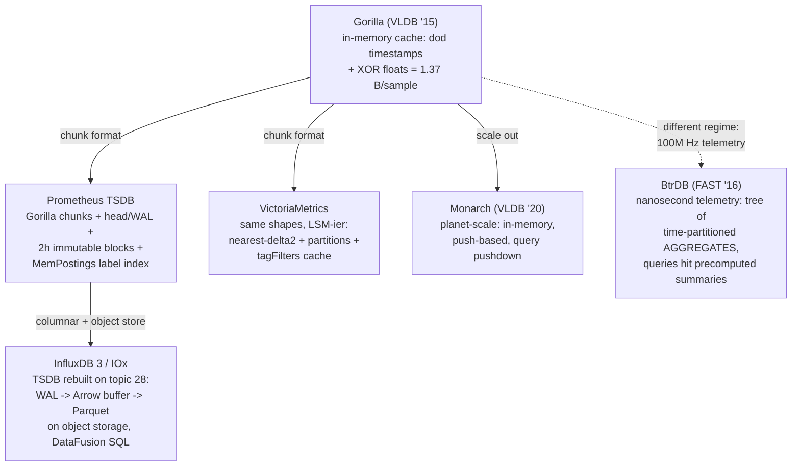

# Topic 30 — Time-Series Engines

Metrics workloads are the most *regular* data any database sees — and
TSDBs are what you get when every design decision exploits that
regularity: append-mostly, time-ordered, compress-by-predicting,
partition-by-time, delete-by-dropping-partitions.

## 0. The shape of the problem

```
  write path                              read path
  ~1M samples/s, tiny (ts, f64) points    "cpu > 90 for job=api over 6h"
  99.9% arrive in time order              always a TIME RANGE
  per-series arrival ~10s apart           always a LABEL SELECTOR
                                          usually an AGGREGATION
        │                                        │
        ▼                                        ▼
  amortize:  batch into per-series       index labels, not values:
  compressed chunks (Gorilla),           inverted index (name,value) -> series,
  flush to immutable time-blocks         then min/max-prune time blocks
```

Baseline measured here (see notes.md): the obvious codec — delta+varint
timestamps, raw f64 values — lands at **11.00 B/sample** regardless of
value shape, because the 8-byte values dominate. The entire point of
Gorilla's XOR trick is attacking those 8 bytes.

## 1. The design space



## 2. The one-table summary

| system | value codec | time organization | label index | out-of-order |
|---|---|---|---|---|
| Gorilla | XOR floats, dod ts | 2h in-memory blocks | (delegated to HBase layer) | rejected |
| Prometheus | same, xor.go | head + 2h blocks, exponential compaction | MemPostings inverted index | bounded OOO window, separate buffer |
| VictoriaMetrics | nearest-delta2 + optional lossy precisionBits | monthly partitions of LSM parts | index_db + tagFilters cache | buffered in raw-rows shards |
| InfluxDB 3 | Parquet encodings | WAL → buffer → Parquet files by time | catalog + last/distinct caches | absorbed by sort at persist |
| BtrDB | delta tree | time-partitioned octree-ish tree | (few, fat streams) | version-annotated inserts |

## 3. Experiments (`experiments/`)

`cargo run --release --bin tsdb_bench`

| file | what | status |
|---|---|---|
| `gen.rs` | scrape timestamps + gauge/counter/constant/random shapes, OOO arrivals, label sets | PROVIDED |
| `bits.rs` | MSB-first BitWriter/BitReader + sign_extend | PROVIDED |
| `baseline.rs` | zigzag varint delta codec — the thing to beat, measured at 11.00 B/sample | PROVIDED |
| `gorilla.rs` | dod timestamp buckets + XOR-float codec | **STUB** |
| `head.rs` | in-order fast path + bounded OOO window + LWW merge flush | **STUB** |
| `index.rs` | MemPostings-style (name,value)→series inverted index + k-way intersect | **STUB** |
| `bin/tsdb_bench.rs` | baselines (provided) + gorilla ratios + OOO tax sweep + selector latency | lanes |

Contract highlights: gorilla roundtrip must be bit-exact for every f64;
constant series ≤ ~2 bits/sample while full-entropy values must *fail* to
compress (>8 B/sample — the codec wins on regularity, not magic); head
rejects samples older than the OOO window and flush output is sorted so
it feeds the in-order-only encoder; index intersection matches brute
force and the unique-per-series label demonstrably explodes the postings
map (the cardinality bomb, counted).

## 4. Reading guides

- [reading-gorilla.md](reading-gorilla.md) — the paper + prometheus's xor.go, bit by bit
- [reading-prometheus-tsdb.md](reading-prometheus-tsdb.md) — head/WAL/blocks/postings/OOO: a full TSDB in readable Go
- [reading-victoriametrics-influx.md](reading-victoriametrics-influx.md) — VM's LSM take + InfluxDB 3's everything-is-Parquet-on-S3
- [reading-monarch-btrdb.md](reading-monarch-btrdb.md) — planet-scale push metrics + the aggregate-tree outlier

## 5. Cross-topic threads

- Topic 4 (LSM): a TSDB is an LSM where the key is time — head=memtable,
  blocks=SSTs, compaction merges by time range, retention = drop the
  oldest level. VictoriaMetrics says "parts" and means it literally.
- Topic 12 (columnar): IOx is the thesis that a TSDB is just a columnar
  store with a time-partitioned catalog — Parquet + DataFusion replace
  the custom chunk format.
- Topic 23 (FTS): MemPostings IS an inverted index; label selectors are
  boolean term queries; high cardinality = unbounded vocabulary.
- Topic 28 (cloud-native): InfluxDB 3's WAL→object-store pipeline is
  topic 28's landing-zone lesson applied to metrics.
- Topic 29: the OOO window is a watermark — the same
  bounded-disorder-then-seal move as streaming watermarks (topic 27).

## 6. Capstone M30 (FalkorDB)

Temporal graph: edge/property history as (entity, attribute, ts) series;
`MATCH ... AT TIME t` = snapshot read at t over history chunks. Design
notes in notes.md §M-log.
