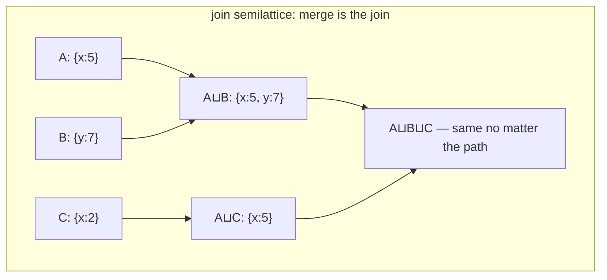

# Topic 31 — CRDTs & Multi-Master Replication

The last topic, and the mirror image of topic 15 (Raft). Consensus says:
*agree on an order, then apply*. CRDTs say: *design the data so order
doesn't matter, then never coordinate*. Both give you replicas that agree;
they pay for it in opposite currencies — latency vs. semantics.

## The shape of the problem

```
  consensus (topic 15)                CRDTs (this topic)
  ────────────────────                ──────────────────
  write ──► leader ──► quorum ──► ok  write ──► local apply ──► ok
            │ 1 RTT minimum                     │ 0 RTT
            ▼                                   ▼
  one total order, one truth          gossip later; merge() must make
  unavailable in minority partition   ANY delivery order converge
                                      available under ANY partition
```

Strong Eventual Consistency (SEC): replicas that have *received the same
set of updates* are in the *same state* — no matter the order received.
That's a theorem you get for free if state forms a **join semilattice**
(merge = least upper bound: associative, commutative, idempotent).



## Two delivery models

| | state-based (CvRDT) | op-based (CmRDT) |
|---|---|---|
| ship | whole state (or delta) | individual operations |
| network needs | nothing — any gossip, any dupes | causal delivery, exactly-once (or idempotent ops) |
| merge | join of semilattice | apply op; concurrent ops must commute |
| in this crate | `counter.rs`, `orset.rs`, `lww.rs`, `graph.rs` | `rga.rs` (Insert/Delete ops) |
| in the wild | Riak, Redis Enterprise CRDTs | Yjs, automerge, loro updates |

## The zoo you build (src/)

| file | CRDT | the one idea | status |
|---|---|---|---|
| `clock.rs` | VClock + Dot | (replica, counter) names every event; pointwise-max join; `partial_cmp → None` **defines** "concurrent" | PROVIDED |
| `lww.rs` | LWW register/map | total order by (ts, replica) — converges by *discarding* concurrent writes | PROVIDED |
| `counter.rs` | G/PN-Counter | per-replica slots + pointwise max; PN = two G-Counters because signed max isn't a join | stub |
| `orset.rs` | add-wins OR-Set | adds tag fresh dots; remove kills only *observed* dots → concurrent add survives | stub |
| `rga.rs` | RGA sequence | identity (Dot) not index; insert-after-parent; skip larger-id siblings; tombstones | stub |
| `graph.rs` | graph CRDT | OR-Set nodes + OR-Set edges + LWW props; dangling edges **hidden, not deleted** | stub |

### LWW's lie, measured (bench lane 1, provided — runs today)

Two replicas, 20K writes each, LWW map, varying keyspace and sync interval.
"Lost" = a write some user made that no replica remembers after merge:

```
    keys   sync_every       lost%
      10            1      94.98%     ← hot keys + constant sync: LWW is a coin flip
    1000          100      88.34%
  100000        10000      12.45%     ← even huge keyspace + rare sync loses 1 in 8
```

This is why "we're eventually consistent" without saying *how conflicts
resolve* is not a semantics. The OR-Set and counters exist to make these
writes survive instead.

## Sequence CRDTs: where the real engineering is

```
insert 'X' after 'a' (parent = a's dot):

  a ──► c              a ──► X ──► c        concurrent 'Y' same parent:
        integrate:           tombstone ok:   a ──► Y ──► X ──► c
        walk after a,        deleted elems   (larger (counter,replica)
        skip larger-id       still anchor    sits closer to parent —
        siblings             children        both replicas agree)
```

Interleaving is the dragon: naive RGA can interleave two users' typed
words character-by-character. Fugue (Loro's algorithm) fixes this with
left+right origins — see `reading-sequence-crdts.md`.

## Code reading (all cloned under ~/repos)

| repo | anchor | what to see |
|---|---|---|
| automerge | `rust/automerge/src/clock.rs:109`, `:145` | our clock.rs, industrial: `covers()`, the partial order |
| automerge | `rust/automerge/src/op_set2/op.rs:52` | `succ` — deletion as *successor ops*, not flags |
| yrs (Yjs) | `yrs/src/block.rs:160`, `:1302`, `:1415` | ID = our Dot; Item = our Element; `integrate()` = the rule you implement in rga.rs |
| diamond-types | `src/listmerge/merge.rs:142`, `yjsspan.rs:29` | same integrate, but ops in a run-length time DAG; `NOT_INSERTED_YET` spans |
| loro | `crates/loro-internal/src/{dag,diff_calc,handler}` | Fugue + fractional_index + generic-btree crates |
| cr-sqlite | `core/rs/core/src/local_writes/mod.rs:83-133` | LWW-per-column over SQLite; db_version bookkeeping — multi-master as an *extension* |

## Reading guides

1. [reading-shapiro-crdts.md](reading-shapiro-crdts.md) — CRDT foundations: convergence without coordination.
2. [reading-kleppmann-json-crdts.md](reading-kleppmann-json-crdts.md) — JSON CRDTs & the move op: identity beats paths.
3. [reading-sequence-crdts.md](reading-sequence-crdts.md) — Sequence CRDTs: what a decade of engineering does to RGA.
4. [reading-cr-sqlite.md](reading-cr-sqlite.md) — cr-sqlite: a real database goes multi-master.

## Experiments

```
cd experiments
cargo test              # 6 provided tests pass; 18 fix the contract for your stubs
cargo run --release --bin crdt_bench
```

Bench lanes: 1 = LWW's lie (provided). 2 = OR-Set convergence storm +
tombstone census. 3 = RGA editing trace (throughput, tombstone bloat).
4 = graph dangling storm (hidden edges, resurrection).

## Exercises

1. Implement the four stubs until all tests pass and lanes 2-4 print.
2. **automerge vs loro bench** (from PLAN; needs deps beyond this crate's
   convention, so it's an exercise): load both crates in a scratch project,
   replay an editing trace (diamond-types repo ships some under
   `benchmark_data/`), compare apply time + memory.
3. Delta-CRDTs: lane 1's `sync_every=1` cost is O(writes × map size)
   because state-based sync ships everything. Sketch the delta-mutator
   version of your OR-Set.
4. Garbage: your OR-Set keeps tombstones forever. What's the *causal
   stability* condition that lets you drop one? Who tracks it?
5. Alternative dangling-edge policies: cascade-delete (remove observed
   edge-dots when a node dies) vs. our hide-not-delete. Which breaks
   add-wins symmetry? Which would FalkorDB users expect?
6. Props keyed by node id survive remove/re-add (our choice). Automerge
   keys object state by *creation op*, so re-add = fresh object. When is
   each right?

## Cross-topic threads

- **Topic 15 (Raft)**: same problem, opposite trade. M31 asks you to run
  the *same workload* against both and compare write latency + conflict
  semantics.
- **Topic 29 (HLC)**: LWW needs timestamps that respect causality —
  that's the HLC from `29-distributed-txn/reading-spanner-hlc.md`.
  cr-sqlite's db_version is a Lamport clock in the same spirit.
- **Topic 5 (MVCC)**: tombstones-as-versions; RGA's deleted elements are
  MVCC's dead versions, and both need a GC horizon (causal stability ↔
  oldest active snapshot).
- **Topic 26 (probabilistic structures)**: vector clocks are exact
  causality; version vectors trimmed by dotted version vectors are the
  space-conscious cousin.

## Capstone M31 — active-active FalkorDB

Two masters, both accepting writes, no leader:

- nodes/edges = add-wins OR-Sets (`orset.rs` semantics, `graph.rs`
  composition) — concurrent `CREATE`/`DELETE` of the same node resolves
  add-wins; re-add resurrects hidden edges.
- properties = LWW maps with HLC timestamps (topic 29) — and now you can
  *quantify* the lost-write rate you're signing up for (lane 1).
- anti-entropy: periodic state merge (or dotted-version-vector deltas).
- Contrast with M15: same graph workload through Raft — measure the
  write-latency gap, then write down which conflicts Raft *prevented*
  that active-active *resolved* (and whether users would agree with the
  resolutions).
