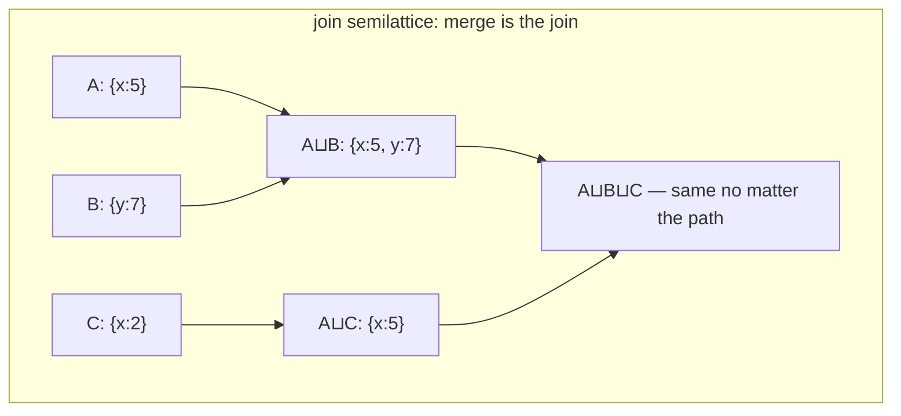

# CRDT foundations: convergence without coordination

Consensus agrees on an order, then applies; CRDTs design the data so
order doesn't matter, then never coordinate. This chapter distills the
two founding documents — Shapiro et al.'s 14-page SSS'11 theory and the
50-page INRIA catalog (RR-7506) you'll keep coming back to. Before you
open either, this chapter builds the theory from zero — the divergence
problem, the convergence spec, the semilattice trick that proves it, and
the catalog structures you implement in `experiments/src/` — then hands
you a section-by-section route through both documents.

## The problem in one sentence

Two replicas both accept a write during a network partition; a
quorum-based system would have refused one of them (or paid ≥1 RTT,
~50–150 ms cross-region, to order them) — CRDTs accept both at 0 RTT and
must *guarantee by construction* that the replicas converge to the same
state when they reconnect.

## The concepts, step by step

### Step 1 — multi-master replication: everyone accepts writes, nobody asks

Multi-master replication means every replica applies writes locally and
immediately, then gossips them to the others later — there is no leader,
no lock, no round trip before acknowledging. The upside is the whole
sales pitch: writes cost 0 network round trips and keep working under any
partition. The downside is the whole problem: two replicas can now hold
*different* states that both claim to be the database.

```
  consensus (topic 15)                multi-master (this chapter)
  ────────────────────                ───────────────────────────
  write ──► leader ──► quorum ──► ok  write ──► local apply ──► ok
            │ 1 RTT minimum                     │ 0 RTT
            ▼                                   ▼
  one total order, one truth          gossip later; states may have
  unavailable in minority partition   DIVERGED — now what?
```

The naive fix — "apply updates in the order they arrive" — fails because
replicas receive them in *different* orders. Everything that follows is
about making order not matter.

### Step 2 — Strong Eventual Consistency: the spec, stated precisely

Strong Eventual Consistency (SEC) is the correctness contract CRDTs
promise: **replicas that have received the same *set* of updates are in
the same state — regardless of the order received.** SSS'11 Def. 2.3
states it as three clauses: eventual delivery (every update reaches every
replica), termination (applying an update finishes), and confluence (same
update-set ⇒ same state). Plain "eventual consistency" only promises
replicas *eventually* agree via some conflict-resolution magic — possibly
rollback, possibly a human; SEC removes the magic: convergence is
deterministic and immediate upon delivery, no rollback, no consensus.
That "no rollback" matters commercially: a replica never has to undo an
acknowledged write.

### Step 3 — the join semilattice: the algebra that makes SEC a theorem

A join semilattice is a set of states with a partial order and a **join**
operation (least upper bound — the smallest state that is ≥ both inputs)
that is **associative, commutative, and idempotent**. If (a) replica
states live in a semilattice, (b) every update only moves a state *up*
the order (an "inflation": `s ⊑ update(s)`), and (c) `merge = join`, then
SEC is a theorem, not a test suite: any batching (associativity), any
arrival order (commutativity), any duplicate delivery (idempotence) all
land on the same least upper bound.



The concrete example to hold: states = sets of integers, order =
`⊆`, join = set union. `{1,2} ∪ {2,3} = {1,2,3}` in any order, any
grouping, any number of times. Most CRDTs in the catalog are dressed-up
set unions. The cost: the state can only *grow* — deletion needs a trick
(Step 6), and garbage needs a story (Step 8).

### Step 4 — naming events: dots, vector clocks, and what "concurrent" means

To merge sensibly you must distinguish "this write happened *before*
that one" from "these writes raced." A **dot** is a pair
`(replica_id, counter)` — a globally unique name for one event, minted by
incrementing the replica's own counter. A **vector clock** is a map from
replica id to the highest counter seen from that replica; comparing two
clocks pointwise gives a *partial* order: A ≤ B if every entry of A is ≤
B's. When neither dominates — `partial_cmp → None` in this topic's
provided `clock.rs` — the events are **concurrent**, by definition.

```
  A = {a:3, b:1}   B = {a:2, b:4}     neither ≤ the other
                                       ⇒ CONCURRENT — no causal order
  join(A,B) = {a:3, b:4}               (pointwise max: itself a semilattice)
```

Concurrency is exactly the case CRDTs must legislate: every structure in
the catalog is one policy for what concurrent updates should mean.

### Step 5 — the simple catalog entries: counters and registers

With dots and joins in hand, the catalog's opening structures are one
idea each:

- **G-Counter** (grow-only counter): one slot per replica; each replica
  increments only its own slot; value = sum of slots; merge = pointwise
  max. Why not a single integer with `merge = max`? Because two replicas
  that each add 1 to a shared value 5 would merge `max(6,6) = 6`, losing
  an increment — per-replica slots make `{a:6, b:6}` sum to 12 minus the
  base, counting both.
- **PN-Counter**: increments *and* decrements = two G-Counters (P and N),
  value = sum(P) − sum(N). Two are needed because signed max is not a
  join — a decrement would not be an inflation (Step 3's condition b
  breaks). This is your `counter.rs` doc comment, derived.
- **LWW register** (last-writer-wins): value + timestamp; merge keeps
  the larger `(timestamp, replica_id)`. It converges by *discarding* one
  of every pair of concurrent writes — the topic README's bench lane 1
  measured that discard rate at **94.98% lost writes** on hot keys.
- **MV-register** (multi-value): the honest register — on concurrent
  writes it keeps *both* values (tagged with their dots) and hands the
  application the conflict LWW silently ate.

### Step 6 — the OR-Set: deletion done right, and the flagship of the catalog

A set needs `remove`, but a semilattice state only grows (Step 3) — so
the OR-Set (observed-remove set) makes removal itself a *growing* record:
every `add` mints a fresh dot; `remove(x)` tombstones only the dots for
`x` it has *observed*. A concurrent `add(x)` carries a dot the remover
never saw, so it survives — **add-wins**, and it's a policy you can point
to, not an accident of timing. The catalog's flagship (Report §3.3.5,
your `orset.rs`) in one screen — every property SEC needs falls out of
set union:

```rust
struct OrSet<T> { adds: HashMap<T, HashSet<Dot>>, removed: HashSet<Dot> }

fn add(&mut self, x: T, dot: Dot) { self.adds.entry(x).or_default().insert(dot); }

fn remove(&mut self, x: &T) {                 // kill only dots we have OBSERVED —
    self.removed.extend(&self.adds[x]);       // a concurrent add's fresh dot
}                                             // survives: add-wins

fn contains(&self, x: &T) -> bool {
    self.adds.get(x).is_some_and(|ds| ds.iter().any(|d| !self.removed.contains(d)))
}

fn merge(&mut self, other: &Self) {           // join = union of everything:
    for (x, ds) in &other.adds { self.adds.entry(x.clone()).or_default().extend(ds); }
    self.removed.extend(&other.removed);      // assoc + comm + idem ⇒ SEC for free
}
```

Contrast the 2P-Set (two-phase set, Report §3.3): one add-set, one
remove-set, remove wins forever — an element once removed can *never* be
re-added. The OR-Set buys re-addability with metadata: one dot per add,
tombstones kept indefinitely (Step 8's problem).

### Step 7 — two delivery models, provably equivalent

Everything so far ships *state* and merges — a **CvRDT**
(convergent/state-based CRDT). The alternative ships *operations* — a
**CmRDT** (commutative/op-based CRDT): broadcast "insert(x)" rather than
the whole set, and require that concurrent ops commute. The trade is
metadata-vs-network-contract: state-based tolerates any gossip, any
duplication, any order (idempotent join absorbs it all) but ships
everything; op-based ships tiny deltas but demands **causal delivery**
(ops arrive after the ops they causally depend on) and exactly-once
semantics (or idempotent ops) from the transport layer.

```
            Strong Eventual Consistency (SEC)
  ┌──────────────────────────────────────────────────────┐
  │  eventual delivery + termination + CONFLUENCE:       │
  │  same set of updates received ⇒ same state,          │
  │  regardless of order                                 │
  └──────────────────────────────────────────────────────┘
        ▲ guaranteed by either of two sufficient conditions ▲
        │                                                   │
  CvRDT (state-based)                          CmRDT (op-based)
  states form a join semilattice:              concurrent ops commute;
  merge = LUB (assoc, comm, idem);             delivery is causal +
  updates are inflations (s ⊑ update(s))       exactly-once/idempotent
        │                                                   │
  ship state, tolerate any gossip              ship ops, need a smarter
  (counter.rs, orset.rs, lww.rs)               network layer (rga.rs)
  ────────────── §3 of SSS'11 proves these EQUIVALENT ──────────────
       (a CvRDT can emulate a CmRDT and vice versa — the choice
        is an engineering trade, not an expressiveness one)
```

SSS'11 §3 proves the two models can emulate each other — so choosing one
is an engineering decision (payload size, transport guarantees), never
an expressiveness one. In this topic's crate: `counter.rs`, `orset.rs`,
`lww.rs`, `graph.rs` are state-based; `rga.rs` ships Insert/Delete ops.
In the wild: Riak and Redis Enterprise shipped state; Yjs, automerge,
and loro ship ops.

### Step 8 — where the theory stops: graphs and garbage

Two open edges the papers are honest about, and both land on your desk:

- **Graphs** (Report §4): compose an OR-Set of nodes with an OR-Set of
  edges and you immediately hit `addEdge(u,v)` concurrent with
  `removeVertex(u)` — a dangling edge. The report's verdict: there is
  *no universally right answer*; it's application policy. This topic's
  `graph.rs` chooses hide-not-delete (the edge is retained but invisible
  while its endpoint is absent — re-adding the node resurrects it), and
  M31's active-active FalkorDB inherits the choice.
- **Garbage** (Report §5): OR-Set tombstones and counter slots accumulate
  forever unless you can prove an entry is **causally stable** — every
  replica has seen it, so no concurrent op referencing it can still
  arrive (Wuu & Bernstein's condition). Tracking that requires knowing
  the replica set and their clocks — the exact bookkeeping topic 5's MVCC
  does with its oldest-active-snapshot horizon. Exercise 4 makes you
  state the condition.

## How to read the paper (with the concepts in hand)

Read SSS'11 §1–3 first, then treat the INRIA report as a reference for
each structure as you implement it — not a cover-to-cover read.

| section | what to extract |
|---|---|
| SSS'11 §2.1 | the system model: no rollback, no consensus, updates applied locally first (Step 1) |
| SSS'11 §2.3 Def. 2.3 | SEC stated precisely — memorize the three clauses (Step 2) |
| SSS'11 §3.1-3.2 | the two sufficient conditions (semilattice / commutativity) and the equivalence proof (Steps 3, 7) |
| Report §3.1 | counters: G, PN — why PN needs two G-Counters (Step 5; your `counter.rs` doc comment) |
| Report §3.2 | registers: LWW and MV-register (multi-value: keep *both* concurrent writes — the honest register LWW isn't) (Step 5) |
| Report §3.3 | sets: G-Set, 2P-Set (remove is forever!), OR-Set (§3.3.5 — your `orset.rs`) (Step 6) |
| Report §4 | graphs! 2P2P-Graph and the remark that concurrent addEdge/removeVertex has *no* universally right answer — the dangling-edge problem M31 inherits (Step 8) |
| Report §5 | garbage collection needs "stability" (Wuu & Bernstein) — ties to exercise 4 (Step 8) |

## Questions

1. State the three clauses of SEC. Which clause does a Raft-replicated
   register satisfy trivially, and which does it *not need* because
   there's a total order?
2. Why is `max()` over a single signed counter not a valid CvRDT merge,
   while per-replica-slot pointwise max is? (Prove non-inflation breaks;
   then check your `counter.rs` PN design against Report §3.1.)
3. The 2P-Set forbids re-adding a removed element; the OR-Set allows it.
   What *metadata* does OR-Set pay for this (look at your `orset.rs`
   tombstones after bench lane 2), and what lets you ever reclaim it?
4. MV-register vs LWW-register: after bench lane 1's ~95% lost-writes
   row, argue when each is right. What does the MV-register push onto
   the application?
5. CvRDT and CmRDT are equivalent in theory (§3). Give two *engineering*
   reasons Yjs/automerge ship ops while Riak shipped state.
6. **M31 mapping**: Report §4's graph CRDTs stop at "concurrent
   addEdge(u,v) ∥ removeVertex(u) is application-specific." Write the
   FalkorDB answer: which of hide/cascade/resurrect did `graph.rs`
   choose, and what would a Cypher user observe in each case?

## Done when

You can state SEC's three clauses from memory, prove your `counter.rs`
merge is a join (associative, commutative, idempotent, inflationary),
and explain — via dots — why a concurrent add survives an OR-Set remove.

## References

**Papers**
- Shapiro, Preguiça, Baquero, Zawirski — "Conflict-free Replicated Data
  Types" (SSS 2011) — the 14-page theory; read §1-3 first
- Shapiro, Preguiça, Baquero, Zawirski — "A comprehensive study of
  Convergent and Commutative Replicated Data Types" (INRIA RR-7506,
  2011) — the 50-page catalog; use as a reference per structure, not a
  cover-to-cover read

**Code**
- Paper-only chapter — the catalog's structures map one-to-one onto this
  topic's `experiments/src/` stubs
