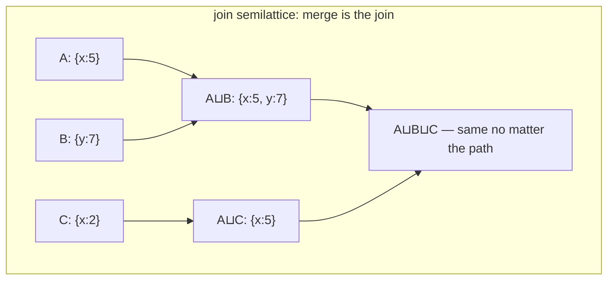

# CRDT foundations: convergence without coordination

Consensus agrees on an order, then applies; CRDTs design the data so
order doesn't matter, then never coordinate. This chapter distills the
two founding documents — Shapiro et al.'s 14-page SSS'11 theory and the
50-page INRIA catalog (RR-7506) you'll keep coming back to. Before you
open either, this chapter builds the theory from zero — the divergence
problem, the convergence spec, the semilattice trick that proves it, and
the catalog structures you implement in `experiments/src/` — then hands
you a section-by-section route through both documents.

## The problem in one sentence

Two replicas both accept a write during a network partition; a
quorum-based system would have refused one of them (or paid ≥1 RTT,
~50–150 ms cross-region, to order them) — CRDTs accept both at 0 RTT and
must *guarantee by construction* that the replicas converge to the same
state when they reconnect.

## The concepts, step by step

### Step 1 — multi-master replication: everyone accepts writes, nobody asks

> **In:** the partition scenario from the problem statement — two replicas,
> no coordination allowed.
> **Out:** two replicas that both hold "the database" and disagree — the
> divergence every later step exists to legislate away.

Multi-master replication means every replica applies writes locally and
immediately, then gossips them to the others later — there is no leader,
no lock, no round trip before acknowledging. The upside is the whole
sales pitch: writes cost 0 network round trips and keep working under any
partition. The downside is the whole problem: two replicas can now hold
*different* states that both claim to be the database.

```
  consensus (topic 15)                multi-master (this chapter)
  ────────────────────                ───────────────────────────
  write ──► leader ──► quorum ──► ok  write ──► local apply ──► ok
            │ 1 RTT minimum                     │ 0 RTT
            ▼                                   ▼
  one total order, one truth          gossip later; states may have
  unavailable in minority partition   DIVERGED — now what?
```

The naive fix — "apply updates in the order they arrive" — fails because
replicas receive them in *different* orders. Everything that follows is
about making order not matter.

### Step 2 — Strong Eventual Consistency: the spec, stated precisely

> **In:** the divergence problem from Step 1.
> **Out:** the exact correctness contract — SEC — that every mechanism in
> the rest of the chapter exists to satisfy.

Strong Eventual Consistency (SEC) is the correctness contract CRDTs
promise: **replicas that have received the same *set* of updates are in
the same state — regardless of the order received.** SSS'11 §2.2 builds
it in two definitions. **Definition 2 (Eventual Consistency)** is three
clauses: *eventual delivery* (an update at one correct replica is
eventually delivered to all), *convergence* (replicas that delivered the
same updates *eventually reach* equivalent state), and *termination*
(every method execution finishes). **Definition 3 (Strong Eventual
Consistency)** is EC plus one stronger clause, *strong convergence*:
"Correct replicas that have delivered the same updates **have**
equivalent state." The whole distinction is the word *have* versus EC's
*eventually reach*: SEC forbids the transient disagree-then-reconcile
window, so convergence is deterministic and immediate upon delivery — no
rollback, no consensus. Plain "eventual consistency" allows the magic SEC
removes: a replica may apply a write, discover a conflict, and roll back
(SSS'11 §2.2 calls this out as "a waste of resources" that "in general
requires a consensus"). That "no rollback" matters commercially: a
replica never has to undo an acknowledged write.

### Step 3 — the join semilattice: the algebra that makes SEC a theorem

> **In:** the SEC contract from Step 2 — a promise still to be earned.
> **Out:** the algebra (a join semilattice) that turns SEC from a property
> you test into a theorem you get for free.

A join semilattice is a set of states with a partial order and a **join**
operation (least upper bound — the smallest state that is ≥ both inputs)
that is **associative, commutative, and idempotent**. If (a) replica
states live in a semilattice, (b) every update only moves a state *up*
the order (an "inflation": `s ⊑ update(s)`), and (c) `merge = join`, then
SEC is a theorem, not a test suite: any batching (associativity), any
arrival order (commutativity), any duplicate delivery (idempotence) all
land on the same least upper bound. This is SSS'11 **Theorem 1** (§2.3):
a *monotonic semilattice object* (Definition 4 — payload ordered by ≤,
merge computes the LUB `s • m(s′) = s ⊔ s′`, updates never decrease state
`s ≤ s • u`) is SEC, assuming only eventual delivery and termination.


```mermaid
graph TD
    subgraph sl["join semilattice: merge is the join"]
        A["A: {x:5}"] --> AB["A⊔B: {x:5, y:7}"]
        B["B: {y:7}"] --> AB
        AB --> ABC["A⊔B⊔C — same no matter the path"]
        C["C: {x:2}"] --> AC["A⊔C: {x:5}"]
        AC --> ABC
    end
```

The concrete example to hold: states = sets of integers, order =
`⊆`, join = set union. `{1,2} ∪ {2,3} = {1,2,3}` in any order, any
grouping, any number of times. Most CRDTs in the catalog are dressed-up
set unions. The cost: the state can only *grow* — deletion needs a trick
(Step 6), and garbage needs a story (Step 8).

### Step 4 — naming events: dots, vector clocks, and what "concurrent" means

> **In:** the semilattice from Step 3, which can merge states but cannot
> yet tell a causal update from a race.
> **Out:** a precise definition of *concurrent* (neither clock dominates)
> — the one case every catalog entry in Steps 5–8 must legislate.

To merge sensibly you must distinguish "this write happened *before*
that one" from "these writes raced." A **dot** is a pair
`(replica_id, counter)` — a globally unique name for one event, minted by
incrementing the replica's own counter. A **vector clock** is a map from
replica id to the highest counter seen from that replica; comparing two
clocks pointwise gives a *partial* order: A ≤ B if every entry of A is ≤
B's. When neither dominates — `partial_cmp → None` in this topic's
provided `clock.rs` — the events are **concurrent**, by definition.

```
  A = {a:3, b:1}   B = {a:2, b:4}     neither ≤ the other
                                       ⇒ CONCURRENT — no causal order
  join(A,B) = {a:3, b:4}               (pointwise max: itself a semilattice)
```

Concurrency is exactly the case CRDTs must legislate: every structure in
the catalog is one policy for what concurrent updates should mean.

### Step 5 — the simple catalog entries: counters and registers

> **In:** dots and joins from Steps 3–4.
> **Out:** the catalog's simplest entries — counters and registers — each
> one concrete policy for a concurrent write, and one measured failure mode.

With dots and joins in hand, the catalog's opening structures are one
idea each (SSS'11 §4.1 gives the counters; the registers are named in the
RR-7506 catalog and, for LWW, SSS'11 §6's related work):

- **G-Counter** (grow-only counter): one slot per replica; each replica
  increments only its own slot; value = sum of slots; merge = pointwise
  max. Why not a single integer with `merge = max`? Because two replicas
  that each add 1 to a shared value 5 would merge `max(6,6) = 6`, losing
  an increment — per-replica slots make `{a:6, b:6}` sum to 12 minus the
  base, counting both.
- **PN-Counter**: increments *and* decrements = two G-Counters (P and N),
  value = sum(P) − sum(N). Two are needed because signed max is not a
  join — a decrement would not be an inflation (Step 3's condition b
  breaks). This is your `counter.rs` doc comment, derived.
- **LWW register** (last-writer-wins): value + timestamp; merge keeps
  the larger `(timestamp, replica_id)`. It converges by *discarding* one
  of every pair of concurrent writes — this topic's bench lane 1
  (FINDINGS row 31) measured that discard rate at **94.98%**: of 40,000
  acknowledged writes to 10 hot keys under per-write sync, 37,991 are
  remembered by no replica. LWW converges, but "converges" here means
  "agrees on the survivor and drops the rest."
- **MV-register** (multi-value): the honest register — on concurrent
  writes it keeps *both* values (tagged with their dots) and hands the
  application the conflict LWW silently ate. (The MV-register is the
  RR-7506 catalog's structure; SSS'11 itself names only the LWW-Register,
  in its §6 related-work discussion of Johnson et al.)

### Step 6 — the OR-Set: deletion done right, and the flagship of the catalog

> **In:** the register and counter policies from Step 5, none of which can
> express a true *remove* under a grow-only state.
> **Out:** the OR-Set — remove turned into a growing record, resolving
> concurrent add/remove as add-wins by construction.

A set needs `remove`, but a semilattice state only grows (Step 3) — so
the OR-Set (observed-remove set) makes removal itself a *growing* record:
every `add` mints a fresh dot; `remove(x)` tombstones only the dots for
`x` it has *observed*. A concurrent `add(x)` carries a dot the remover
never saw, so it survives — **add-wins**, and it's a policy you can point
to, not an accident of timing. This is the add/remove-set construction
SSS'11 calls the **U-Set** (§4.2, after Wuu & Bernstein); the "OR-Set"
name and its per-add unique tags are the RR-7506 catalog's flagship, and
it maps onto your `orset.rs`. The whole structure in one screen — every
property SEC needs falls out of set union:

```rust
// ILLUSTRATION — not quoted from the crate; this is the OR-Set shape the
// topic's orset.rs stub asks you to implement (orset.rs:1, add-wins).
struct OrSet<T> { adds: HashMap<T, HashSet<Dot>>, removed: HashSet<Dot> }

fn add(&mut self, x: T, dot: Dot) { self.adds.entry(x).or_default().insert(dot); }

fn remove(&mut self, x: &T) {                 // kill only dots we have OBSERVED —
    self.removed.extend(&self.adds[x]);       // a concurrent add's fresh dot
}                                             // survives: add-wins

fn contains(&self, x: &T) -> bool {
    self.adds.get(x).is_some_and(|ds| ds.iter().any(|d| !self.removed.contains(d)))
}

fn merge(&mut self, other: &Self) {           // join = union of everything:
    for (x, ds) in &other.adds { self.adds.entry(x.clone()).or_default().extend(ds); }
    self.removed.extend(&other.removed);      // assoc + comm + idem ⇒ SEC for free
}
```

Contrast the 2P-Set (two-phase set): one add-set, one remove-set, remove
wins forever — an element once removed can *never* be re-added. The
OR-Set buys re-addability with metadata: one dot per add, tombstones kept
indefinitely (Step 8's problem). Put a number on that cost — with a dot
of `(replica_id: u64, counter: u64)` ≈ 16 B, a key that is added and
removed 1,000 times carries ~1,000 tombstoned dots ≈ 16 KB of metadata to
represent a set that currently holds *one* element (or none). The
metadata is O(adds-ever), not O(current size); Step 8 is how you bound it.

### Step 7 — two delivery models, provably equivalent

> **In:** the state-shipping structures of Steps 3–6 (all CvRDTs).
> **Out:** the op-based alternative (CmRDT), the two sufficient conditions
> for SEC, and the proof (SSS'11 §3.2) that the choice is engineering,
> not expressiveness.

Everything so far ships *state* and merges — a **CvRDT**
(convergent/state-based CRDT). The alternative ships *operations* — a
**CmRDT** (commutative/op-based CRDT): broadcast "insert(x)" rather than
the whole set, and require that concurrent ops commute. The trade is
metadata-vs-network-contract: state-based tolerates any gossip, any
duplication, any order (idempotent join absorbs it all) but ships
everything; op-based ships tiny deltas but demands **causal delivery**
(ops arrive after the ops they causally depend on) and exactly-once
semantics (or idempotent ops) from the transport layer.

```
            Strong Eventual Consistency (SEC)
  ┌──────────────────────────────────────────────────────┐
  │  = Eventual Consistency (eventual delivery +          │
  │  convergence + termination) PLUS strong convergence:  │
  │  replicas that delivered the same updates HAVE        │
  │  equivalent state — immediately, no rollback          │
  └──────────────────────────────────────────────────────┘
        ▲ guaranteed by either of two sufficient conditions ▲
        │                                                   │
  CvRDT (state-based)                          CmRDT (op-based)
  states form a join semilattice:              concurrent ops commute;
  merge = LUB (assoc, comm, idem);             delivery is causal +
  updates are inflations (s ⊑ update(s))       exactly-once/idempotent
  SSS'11 §2.3, Theorem 1                        SSS'11 §2.4, Theorem 2
        │                                                   │
  ship state, tolerate any gossip              ship ops, need a smarter
  (counter.rs, orset.rs, lww.rs)               network layer (rga.rs)
  ──────────── §3.2 of SSS'11 proves these EQUIVALENT ──────────────
       (Theorems 3 & 4: a CvRDT can emulate a CmRDT and vice versa —
        the choice is an engineering trade, not an expressiveness one)
```

SSS'11 §3.2 (Theorems 3 and 4) proves the two models can emulate each
other — so choosing one is an engineering decision (payload size,
transport guarantees), never an expressiveness one. In this topic's
crate: `counter.rs`, `orset.rs`, `lww.rs`, `graph.rs` are state-based;
`rga.rs` ships Insert/Delete ops. In the wild: Riak and Redis Enterprise
shipped state; Yjs, automerge, and loro ship ops.

### Step 8 — where the theory stops: graphs and garbage

> **In:** the single structures of Steps 5–7, each solved in isolation.
> **Out:** the two open edges the papers are honest about — composed
> graphs and unbounded metadata — both of which land on your desk in M31.

Two open edges the papers are honest about, and both land on your desk:

- **Graphs** (SSS'11 §5): compose an OR-Set of nodes with an OR-Set of
  edges and you immediately hit `addEdge(u,v)` concurrent with
  `removeVertex(u)` — a dangling edge. §5.2 ("Design alternatives for arc
  removal") lays out three *named* choices — removeVertex wins (hide the
  arcs), addEdge wins (restore the endpoint), or delay until synced — and
  states there is *no perfect choice*; it's application policy. This
  topic's `graph.rs` chooses hide-not-delete (the edge is retained but
  invisible while its endpoint is absent — re-adding the node resurrects
  it, exactly the §5.3 add-wins-vertex behaviour), and M31's active-active
  FalkorDB inherits the choice.
- **Garbage** (SSS'11 §4.2): OR-Set/U-Set tombstones and counter slots
  accumulate forever unless you can prove an entry is **causally stable**
  — every replica has seen it, so no concurrent op referencing it can
  still arrive (Wuu & Bernstein's condition, cited in §4.2). Tracking that
  requires knowing the replica set and their clocks — the exact
  bookkeeping topic 5's MVCC does with its oldest-active-snapshot horizon.
  Exercise 4 makes you state the condition.

## How to read the paper (with the concepts in hand)

Read SSS'11 §1–3 first, then treat the INRIA report as a reference for
each structure as you implement it — not a cover-to-cover read.

| section | what to extract |
|---|---|
| SSS'11 §2.1 | the system model: no rollback, no consensus, updates applied locally first (Step 1) |
| SSS'11 §2.2 | SEC stated precisely — **Def 2 = EC** (eventual delivery + convergence + termination), **Def 3 = SEC** (= EC + *strong convergence*: same updates ⇒ replicas *have* equal state) (Step 2) |
| SSS'11 §2.3–§2.4 | the two sufficient conditions: Theorem 1 (monotonic semilattice ⇒ SEC) and Theorem 2 (commuting concurrent ops + causal delivery ⇒ SEC) (Steps 3, 7) |
| SSS'11 §3.2 | Theorems 3 & 4: CvRDT and CmRDT emulate each other — the equivalence (Step 7) |
| SSS'11 §4.1 | counters: G, PN — why PN needs two G-Counters (Step 5; your `counter.rs` doc comment) |
| SSS'11 §4.2 | the U-Set (add/remove-set with tombstones, after Wuu & Bernstein) — the OR-Set's core; and garbage collection needs *causal stability* — ties to exercise 4 (Steps 6, 8) |
| SSS'11 §5 | the Directed Graph CRDT: §5.2's three arc-removal alternatives and the remark that concurrent addEdge/removeVertex has *no* perfect choice — the dangling-edge problem M31 inherits (Step 8) |
| SSS'11 §6 | related work: where the LWW-Register is named (Johnson et al.). The MV-register and the "OR-Set"/"2P-Set" names live in the RR-7506 catalog, which extends this paper structure by structure (Step 5) |

## Questions

1. State EC's three clauses and the fourth (strong convergence) that
   upgrades it to SEC. Which does a Raft-replicated register satisfy
   trivially, and which is *moot* because a total order already exists?
2. Why is `max()` over a single signed counter not a valid CvRDT merge,
   while per-replica-slot pointwise max is? (Prove non-inflation breaks;
   then check your `counter.rs` PN design against Report §3.1.)
3. The 2P-Set forbids re-adding a removed element; the OR-Set allows it.
   What *metadata* does OR-Set pay for this (look at your `orset.rs`
   tombstones after bench lane 2), and what lets you ever reclaim it?
4. MV-register vs LWW-register: after bench lane 1's ~95% lost-writes
   row, argue when each is right. What does the MV-register push onto
   the application?
5. CvRDT and CmRDT are equivalent in theory (§3). Give two *engineering*
   reasons Yjs/automerge ship ops while Riak shipped state.
6. **M31 mapping**: Report §4's graph CRDTs stop at "concurrent
   addEdge(u,v) ∥ removeVertex(u) is application-specific." Write the
   FalkorDB answer: which of hide/cascade/resurrect did `graph.rs`
   choose, and what would a Cypher user observe in each case?

## Done when

Answer each before unfolding it.

- [ ] You can state EC's three clauses and the one clause that upgrades EC to SEC, from memory.

  <details><summary>Answer</summary>

  EC (SSS'11 Definition 2, §2.2) is three clauses: **eventual delivery**
  (an update at one correct replica eventually reaches all correct
  replicas), **convergence** (replicas that delivered the same updates
  *eventually reach* equivalent state), and **termination** (every method
  execution finishes). SEC (Definition 3) is EC plus **strong
  convergence**: replicas that delivered the same updates *have* equivalent
  state — note *have*, not *eventually reach*. That one word removes the
  apply-then-rollback window EC tolerates, so convergence is immediate and
  deterministic with no consensus (Step 2).

  </details>

- [ ] You can prove your `counter.rs` merge is a join — associative, commutative, idempotent, and inflationary.

  <details><summary>Answer</summary>

  A G-Counter's state is a map `replica → count`; merge is pointwise
  `max`. `max` on each key is **commutative** (`max(a,b)=max(b,a)`),
  **associative** (`max(max(a,b),c)=max(a,max(b,c))`), and **idempotent**
  (`max(a,a)=a`), so the pointwise map merge inherits all three — that is
  exactly SSS'11 Definition 4's semilattice with LUB = pointwise max. It is
  **inflationary** because a local increment only raises this replica's own
  slot, so `s ≤ s • u` (no slot ever decreases). The PN-Counter is two such
  maps (P and D); the same proof applies to each, and the value `ΣP − ΣD`
  is read-only, so signedness never enters the merge (Step 3, Step 5).

  </details>

- [ ] You can explain, via dots, why a concurrent add survives an OR-Set remove.

  <details><summary>Answer</summary>

  Every `add(x)` mints a fresh dot `(replica, counter)` and stores it under
  `x`; `remove(x)` moves only the dots it has *already observed* into the
  tombstone set. A concurrent `add(x)` on another replica mints a dot the
  remover has never seen, so that dot is not in the tombstone set after
  merge (which is just set union). `contains(x)` is true iff some dot for
  `x` is untombstoned — and the concurrent add's dot is — so `x` survives.
  That is **add-wins**, and it is a chosen policy, not a timing accident:
  the survival is decided by *which dots were observed*, identically on
  every replica (Step 6).

  </details>

- [ ] You can say why the LWW-register's convergence is not free of cost, using lane 1's number.

  <details><summary>Answer</summary>

  LWW converges by keeping the larger `(timestamp, replica_id)` of each
  pair of concurrent writes and *discarding* the other. Convergence is
  guaranteed, but every discarded write is an acknowledged write no replica
  remembers. Bench lane 1 (FINDINGS row 31) measured the discard rate at
  **94.98%** — 37,991 of 40,000 acknowledged writes to 10 hot keys under
  per-write sync are lost. The MV-register is the alternative that keeps
  both concurrent values and pushes the resolution to the application
  (Step 5).

  </details>

## References

**Papers**
- Shapiro, Preguiça, Baquero, Zawirski — "Conflict-free Replicated Data
  Types" (SSS 2011) — the 14-page theory; read §1-3 first
- Shapiro, Preguiça, Baquero, Zawirski — "A comprehensive study of
  Convergent and Commutative Replicated Data Types" (INRIA RR-7506,
  2011) — the 50-page catalog; use as a reference per structure, not a
  cover-to-cover read

**Code**
- Paper-only chapter — the catalog's structures map one-to-one onto this
  topic's `experiments/src/` stubs
