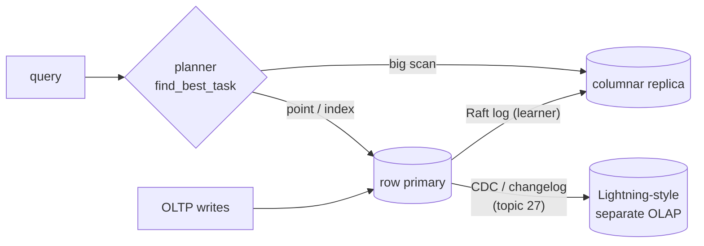

# Topic 32 — HTAP Architectures

Topic 12 gave you the columnar layout, topic 27 the changelog, topic 15 the
replicated log. HTAP is where they collide: one system that answers
point-writes at OLTP latency *and* analytical scans at columnar speed,
without the nightly ETL that made "the dashboard is a day old" normal.

## The problem, measured (bench lane 1, provided — runs today)

One store, one coarse lock, 1M rows. A writer hammers point-updates while
an analytical scanner free-runs full scans on the same copy. Fixed 2-second
window per mode:

```
                  mode     p50 ns     p99 ns     p99.9 ns  writes/2s   scans
          writes alone        125        333          541   11438647       0
   writes + full scans        125 7490728791   7490728791         69    3261
```

Read that again: throughput collapsed from **11.4 million writes to 69**,
and p99 write latency went from 333 ns to **7.49 seconds** — the scanner
starved the writer almost completely (unfair lock + ~2 ms scans back to
back). The lock is deliberately coarse, but the shape survives every
mitigation short of separation: scans and writes on one copy fight over
*something* (locks, cache lines, buffer pool, MVCC GC). HTAP architectures
are the catalog of ways to stop the fight.

## The trilemma

```
            freshness
            (how stale may analytics be?)
               ▲
              ╱ ╲        pick a point, not a corner:
             ╱   ╲
            ╱  ×  ╲      × = TiFlash: fresh (learner wait),
           ╱       ╲         isolated (separate nodes),
          ▼─────────▼        pays in replica cost + read wait
   isolation        cost
   (does OLAP hurt  (extra copies,
    OLTP p99?)       extra nodes)
```

## The architecture menu

| architecture | one copy? | freshness | isolation | example |
|---|---|---|---|---|
| single engine, dual format | yes (delta+main) | perfect | poor–ok | SAP HANA |
| fork() snapshot | virtual copy (CoW pages) | snapshot age | good | HyPer |
| columnar replica in-consensus | no — Raft learner | bounded (learner wait) | strong | TiDB + TiFlash |
| CDC-fed separate system | no — changelog | seconds | total | F1 Lightning |
| query offload to attached OLAP | no — shared files | snapshot | strong | pg_duckdb-style |



The deep thread: the **changelog is the glue** in every split design —
topic 27's thesis, now load-bearing. And the replica's storage is delta+main:
TiFlash's DeltaTree ≈ HANA's delta merge ≈ topic 4's LSM ≈ FalkorDB's
delta matrices. Writes land append-friendly, reads merge, compaction folds.

## Code reading (all cloned under ~/repos)

| repo | anchor | what to see |
|---|---|---|
| tiflash | `dbms/src/Storages/KVStore/Read/LearnerRead.cpp:35`, `:61` | `doLearnerRead` — freshness as a *wait*, with a timeout |
| tiflash | `dbms/src/Storages/DeltaMerge/DeltaMergeStore.h:107`, `:668` | the store; `segmentMergeDelta` = your `merge_delta()` |
| tiflash | `dbms/src/Storages/DeltaMerge/Segment.h:84`, `:715` | Segment = delta over stable; `placeUpsert` |
| tiflash | `dbms/src/Storages/DeltaMerge/Delta/{MemTableSet,DeltaValueSpace}.h`, `Delta/MinorCompaction.h` | the delta layer's own little LSM |
| tiflash | `dbms/src/Storages/DeltaMerge/DeltaIndex/DeltaIndex.h:27` | index that makes delta+stable merge reads cheap |
| tidb | `pkg/planner/core/find_best_task.go:535`, `:1841`, `:1878` | one optimizer, two engines: TiKV vs TiFlash paths priced together |

## Reading guides

1. [reading-tidb-htap.md](reading-tidb-htap.md) — TiDB HTAP: the columnar replica is a Raft learner.
2. [reading-tiflash-deltatree.md](reading-tiflash-deltatree.md) — DeltaTree: columnar storage built for writes.
3. [reading-hyper-hana.md](reading-hyper-hana.md) — HyPer & HANA: one copy serves both.
4. [reading-f1-lightning.md](reading-f1-lightning.md) — F1 Lightning: HTAP without touching OLTP.

## Experiments

```
cd experiments
cargo test              # 5 provided tests pass; 7 fix the contract for your stubs
cargo run --release --bin htap_bench
```

- `row.rs` (PROVIDED) — the OLTP primary: row store + every write appended
  to a changelog (`log`). Also the scan oracle.
- `replica.rs` (stub) — columnar replica with delta+main: `apply` the log,
  `scan_sum_a` merging delta over main, `merge_delta` compaction.
- `learner.rs` (stub) — `read_wait`: how long a consistent read blocks on
  an apply schedule. Freshness priced as a wait distribution.

Bench lanes: 1 = interference (provided, above). 2 = scan speedup
row vs delta-heavy vs merged replica + freshness lag vs batch size.
3 = learner-read wait distribution vs apply interval.

## Exercises

1. Implement the stubs until all tests pass and lanes 2-3 print.
2. Lane 1 starves the writer with an unfair lock. Swap in a readers-writer
   lock — does p99 recover? What did full scans *still* cost?
3. Lane 2's merged scan beats the delta-heavy scan. Find the delta size
   where scanning delta+main crosses over merged+fresh-delta — that
   crossover is TiFlash's delta-merge trigger heuristic.
4. Lane 3 demands lsn == now (freshest). Re-run demanding `now - 100`
   (bounded staleness) — how much wait does 100 lsns of slack buy? That's
   the follower-read / stale-read knob.
5. Your replica applies the log single-threaded. Which parts of `apply`
   and `merge_delta` parallelize safely (topic 20's rayon), and what does
   the answer share with LSM compaction scheduling (topic 4)?
6. Sketch M32's router: which FalkorDB queries go to delta-matrix "main"
   vs need the freshest delta — and what's the analogue of `read_wait`?

## Cross-topic threads

- **Topic 4 (LSM)**: delta+main IS an LSM with exactly two levels;
  `merge_delta` is minor compaction; the delta index is the memtable's
  answer to read amplification.
- **Topic 12 (columnar)**: the replica's `main_a`/`main_b` are topic 12's
  column vectors; lane 2 re-measures that scan gap, now with freshness
  attached.
- **Topic 15 (Raft)**: TiFlash is a *learner* — replicates, never votes.
  Learner reads are read-index reads (topic 15's ReadIndex) done by the
  follower.
- **Topic 27 (streaming/IVM)**: the changelog feeding the replica is the
  same changelog; F1 Lightning is CDC-as-architecture. M27's changelog
  becomes M32's replication stream.
- **Topic 20 (GraphBLAS)**: FalkorDB's delta matrices are delta+main for
  adjacency — pending-block writes folded into the stable matrix. M32 is
  this topic wearing graph clothes.

## Capstone M32 — changelog-fed analytical replica for FalkorDB

- Feed M27's changelog into a columnar/matrix replica (delta matrices as
  the delta layer, stable matrices as main); `merge_delta` = pending
  flush.
- Learner-read rule: analytical queries carry a freshness bound; router
  waits (`read_wait`) or routes to primary if the bound is tight.
- Measure the M32 version of lane 1: OLTP p99 on the primary with and
  without analytics offloaded — the 69-writes number is the before shot.
