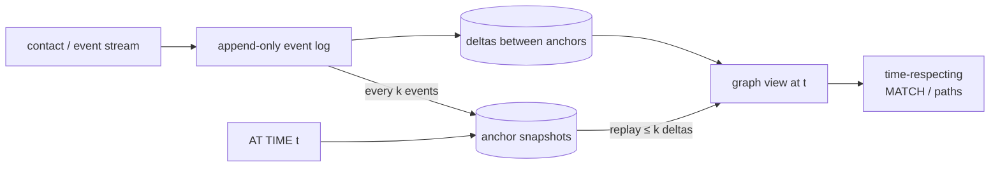

# Topic 33 — Temporal Graphs

Topic 13 gave you graph engines frozen at "now"; topic 8 gave you version
chains that already ARE per-object histories; M30 promised time-travel.
Temporal graphs are what happens when time stops being metadata and joins
the data model: edges exist *at* times, paths must respect ordering, and
"the graph AT TIME t" is a query, not a restore job.

## The problem, measured (bench lane 1, provided — runs today)

2,000 nodes, contacts (timestamped edges) sprinkled uniformly over a
10,000-tick horizon. For 20 sampled sources: reachability by a
timestamp-blind BFS on the condensed static graph vs true time-respecting
reachability (a path must use contacts with non-decreasing times):

```
     nodes   contacts   static-reach   temporal-reach   false positives
      2000       3999          25031              137             99.5%
      2000       7998          36956              925             97.5%
      2000      15996          39980            17229             56.9%
      2000      63969          39980            39980              0.0%
```

At realistic sparsity, **99.5% of statically-reachable pairs are
temporally unreachable** — the static condensation is not an
approximation, it's a different (and wrong) question. Only when the
stream is dense enough that every hop has a later contact available does
the lie vanish. Every temporal-graph data structure and algorithm in
this topic exists because of that column.

## The two times (and the object they describe)

```
 static graph:    u ──────▶ v            edge = (u, v)
 temporal graph:  u ──t=5,λ=2──▶ v       contact = (u, v, t, λ)
                                          departs t, arrives t+λ

 valid time:        when it was true in the WORLD   (flight departs 09:05)
 transaction time:  when the DB learned it          (row committed 09:07)
 bitemporal:        both axes, independently queryable
```

Time-respecting path: contacts with non-decreasing times, each departure
no earlier than the previous arrival. The killer property: **temporal
reachability is not transitive** — u⇝w and w⇝v do NOT imply u⇝v (w's
onward contact may have already left). That single fact breaks
DP-on-subpaths, so the four "shortest path" variants split apart:
earliest arrival, latest departure, fastest (min duration), shortest
(min hops) — one algorithm each, not one Dijkstra.

## The storage menu

| design | idea | AT TIME t cost | example |
|---|---|---|---|
| snapshot per t | copy the graph each tick | O(1) lookup, O(V+E)·T space | naive baseline |
| event-log-first | the log IS the graph; views are lenses | replay or index probe | Raphtory |
| anchor + delta | periodic full snapshots + deltas between | nearest anchor + bounded replay | AeonG |
| MVCC-as-history | version chains keep old states anyway | walk chains w/ ts predicate | topic 8's begin_ts/end_ts, reused |



The deep thread: anchor+delta is topic 5's checkpoint-vs-redo trade
wearing graph clothes, and MVCC-as-history is the observation that topic
8's version machinery — begin_ts/end_ts on every version — already
stores a transaction-time temporal graph; AeonG literally builds on
memgraph's delta chains (topic 13).

## Code reading (cloned under ~/repos)

| repo | anchor | what to see |
|---|---|---|
| raphtory | `raphtory-api/src/core/storage/timeindex.rs:28` | `EventTime(t, event_id)` — time plus tiebreaker as the universal key |
| raphtory | `raphtory-core/src/entities/properties/tcell.rs:10` | `TCell` — a value in time: Empty / one / SVM / BTreeMap, size-adaptive |
| raphtory | `raphtory-core/src/storage/timeindex.rs:13` | `TimeIndex` — when an entity existed, same Empty/One/Set laddering |
| raphtory | `raphtory/src/db/graph/views/window_graph.rs:87` | `WindowedGraph{graph, start, end}` is `Copy` — BETWEEN as a zero-copy lens |
| raphtory | `raphtory/src/db/api/view/time.rs:116` | `TimeOps::window` — every view type gets AT TIME/BETWEEN for free |
| memgraph | `src/storage/v2/delta.hpp` (topic 13 clone) | the delta chain AeonG extends into a historical store |

## Reading guides

1. [reading-temporal-paths.md](reading-temporal-paths.md) — Wu et al. (VLDB 2014): four minimum temporal paths, one-pass algorithms.
2. [reading-temporal-motifs.md](reading-temporal-motifs.md) — Paranjape/Benson/Leskovec (WSDM 2017): δ-temporal motifs, counting ordered patterns.
3. [reading-aeong.md](reading-aeong.md) — AeonG (VLDB 2024): built-in temporal support via anchor+delta on an MVCC engine.
4. [reading-raphtory.md](reading-raphtory.md) — Raphtory: an event-log-first temporal graph engine in Rust.

## Experiments

```
cd experiments
cargo test              # 3 provided tests pass; 6 fix the contract for your stubs
cargo run --release --bin temporal_bench
```

- `events.rs` (PROVIDED) — contact/event generators; `static_reachable`
  (the liar) and `earliest_arrival_oracle` (fixpoint ground truth);
  `replay_at_time` (the naive AT TIME oracle).
- `temporal_reach.rs` (stub) — `earliest_arrival`: one pass over the
  time-sorted stream, no fixpoint loop. Wu et al.'s core insight, typed.
- `snapshot.rs` (stub) — `AnchorDeltaStore`: append events, anchor every
  k, `at_time(t)` = nearest anchor + bounded replay. AeonG in miniature.

Bench lanes: 1 = static-vs-temporal false positives (provided, above).
2 = one-pass earliest-arrival vs fixpoint oracle throughput. 3 = AT TIME
read latency + replay length vs checkpoint spacing.

## Exercises

1. Implement the stubs until all tests pass and lanes 2-3 print.
2. Prove (a paragraph in notes.md) why one relaxation per contact
   suffices when the stream is sorted by departure time — and construct
   the λ=0 tie-order stream where an unsorted pass gets it wrong.
3. Lane 1's false-positive rate falls with density. Re-run with horizon
   100 instead of 10,000 (same contacts, compressed time) — why does the
   rate move, and which real workload does each regime model?
4. Lane 3 prices checkpoint spacing. Find the spacing where p99 AT TIME
   latency crosses 2× the dense-anchor floor — then compute the storage
   ratio you saved. That pair of numbers is AeonG's Table-vs-Figure claim
   on your laptop.
5. Extend `earliest_arrival` to return the actual path (parent pointers
   need timestamps too — why can't you just store the parent node?).
6. Sketch M33's `MATCH` semantics: which of the four minimum-path
   variants should FalkorDB's `temporalPath()` return by default, and
   what does BETWEEN do to matrix algebra (hint: topic 20's masks)?

## Cross-topic threads

- **Topic 5 (WAL/recovery)**: anchor+delta IS checkpoint+redo; lane 3's
  spacing dial is checkpoint frequency, priced for reads instead of
  recovery.
- **Topic 8 (MVCC)**: begin_ts/end_ts version chains are a
  transaction-time temporal graph nobody queries — AeonG's whole move is
  to keep them and add the query surface. Place AeonG in Wu/Pavlo's
  5-axis table.
- **Topic 13 (graph engines)**: memgraph's per-object delta chains
  (N2O) are the substrate AeonG extends; Raphtory picks the opposite
  pole — the log is primary, objects are views.
- **Topic 24 (streaming graphs)**: same event stream, different
  question — streaming asks "maintain a result as edges arrive," temporal
  asks "query the past with time in the semantics."
- **Topic 30 (versioned graphs)**: M30 stores history; M33 gives it
  path semantics. Time-travel answers "what did the graph look like?";
  temporal paths answer "what could have flowed through it?"

## Capstone M33 — time-respecting queries for FalkorDB

- `AT TIME t` / `BETWEEN t1 AND t2` graph views over M30's versioned
  store (anchor+delta or MVCC-as-history — lane 3 tells you which).
- Time-respecting `MATCH`: non-decreasing timestamps along the matched
  path, plus a `WITHIN δ` window (the motif paper's δ).
- `temporalPath(src, dst, 'earliest')` — the one-pass algorithm as a
  path function, benched against snapshot-per-timestamp naive.
- The before shot: lane 1's false-positive column, reproduced on the
  M30 store by running static MATCH where temporal MATCH was meant.
