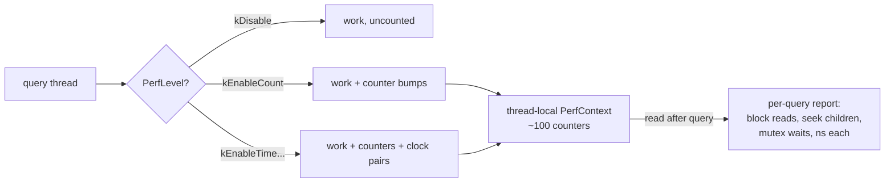

# Topic 34 — Debugging & Production Diagnosis

Topic 16 was about *preventing* bugs (testing, fuzzing, simulation);
this topic is about the ones that ship anyway. A database in production
fails in exactly three currencies — wrong answers, latency, and crashes
— and each has a diagnosis discipline: record-and-replay for the
unreproducible, honest measurement for the slow, and self-diagnosis
surfaces (slow logs, perf contexts, doctors, watchdogs) that the
database must carry *before* the incident, because you can't attach a
debugger to last Tuesday.

## The problem, measured (bench lane 1, provided — runs today)

One simulated service: 1 µs per op, except a 100 ms stall every 100K
ops (a GC pause / fork checkpoint / compaction in miniature). One
million ops, clients intending to arrive every 10 µs. Measured two ways:

```
   protocol      p50        p99        p99.9      p99.99     max
   closed-loop     1.0 µs     1.0 µs     1.0 µs     1.0 µs   100.0 ms
   open-loop       1.0 µs    90.0 ms    99.0 ms    99.9 ms   100.0 ms
```

Same service, same stalls. The closed-loop client — every naive
`start = now(); op(); record(now() - start)` bench loop ever written —
reports **p99.99 = 1 µs**. The open-loop client, which charges each
request from its *intended* send time like real users do, reports
**p99 = 90 ms**: a 90,000× disagreement at p99. This is Gil Tene's
*coordinated omission*: the closed-loop client politely stops sending
during the stall, so the stall is seen by exactly one sample and the
requests that would have queued behind it never exist. Every latency
number you've ever produced with a synchronous bench loop is suspect
until you know which protocol produced it.

## The three failure currencies

```
            ┌─────────────────────────────────────────────────┐
            │              production database                │
            └───────┬───────────────┬────────────────┬────────┘
                    ▼               ▼                ▼
              wrong answers      too slow          crashed
                    │               │                │
        record-and-replay    honest measurement   forensics
        (rr: capture the     (open-loop bench,    (core dumps,
        nondeterminism       log histograms,      watchdog stacks,
        once, replay         flame graphs,        sanitizer builds,
        forever)             slow logs)           corruption tools)
```

The shared constraint: production evidence is *perishable*. The
race won't re-fire under a debugger; the stall is gone by the time you
ssh in; the corrupted page tells you where the write landed, not who
issued it. So the discipline is: **make the failure capturable**
(deterministic replay, always-on histograms) or **make the database
confess** (slow log, doctors, watchdog) — ideally both.

## Record-and-replay: rr in one diagram

```
 record once                          replay forever
 ┌───────────────────────────┐        ┌───────────────────────────┐
 │ tracee (your db, 1 core)  │        │ same binary, same inputs  │
 │  syscall results ─────────┼─▶ log ─┼─▶ injected, not re-run    │
 │  async events (signals,   │        │  delivered at the SAME    │
 │   ctx switches) at        │        │  (RCB count, registers)   │
 │   (RCB count, registers) ─┼─▶ log ─┼─▶ execution point         │
 └───────────────────────────┘        └───────────────────────────┘
   RCB = retired conditional branches — the one hw counter that is
   deterministic; RCB + full registers = a unique moment in execution
```

rr (Mozilla, ATC'17) records at the user-space/kernel boundary: the
only nondeterminism that can reach a single-core user-space program is
*what syscalls return* and *when async events land*. Record those, and
replay is deterministic — the intermittent race becomes a bug you can
step through backwards, thousands of times, identically. The price:
one thread at a time (races become context-switch-timing bugs;
weak-memory bugs are unobservable), and < 2× slowdown on the workloads
Mozilla cared about — cheap enough to leave on in CI. The engineering
is in making syscalls fast (seccomp-bpf reroutes them in-process,
avoiding 4 context switches each) — see the reading guide.

## The self-diagnosis surface (what redis carries into every incident)

| surface | trigger | cost when idle | anchor |
|---|---|---|---|
| SLOWLOG | duration ≥ threshold after every command | one compare | `slowlog.c:103` |
| LATENCY tracker | event > threshold → 160-entry ring per event | macro is no-op when threshold unset | `latency.h:50`, `latency.c:63` |
| LATENCY DOCTOR | on demand: rings → human advice | zero | `latency.c:182` |
| MEMORY DOCTOR | on demand: fragmentation/policy advice | zero | `object.c:1421` |
| watchdog | SIGALRM while stuck → stack trace in the log | disabled by default | `debug.c:2643` |

Redis's design theorem: the *always-on* tier must cost ~one branch per
command (slowlog's threshold check), the *armed* tier a few samples
(latency rings, 160 entries each), and the *expensive* tier must be
on-demand only (doctors, watchdog). Lane 3 of the bench measures
exactly this always-on tax so M34 can honor the same budget.

## Counting without keeping: log-bucketed histograms

You cannot keep 10M samples per second to sort later. RocksDB packs
all of u64 into **109 buckets** (`histogram.h:21`) whose boundaries
grow geometrically; HdrHistogram makes the error a parameter. The deal:

- memory is O(buckets), forever, no matter how many samples;
- any percentile is wrong by at most a bounded *relative* error
  (being 3 µs off at 3 ms is fine; 3 ms off at 3 µs is not);
- histograms from different threads **merge exactly** — the property
  that averages-of-percentiles famously lack.

The experiments' `LogHistogram` stub is this structure: linear buckets
below 2^sub_bits, then 2^sub_bits sub-buckets per power-of-two octave,
error ≤ 2^-sub_bits. Its contract tests *are* the three bullets above.

## Paying for visibility: RocksDB's PerfContext



RocksDB's answer to "why was THIS query slow" is a thread-local struct
of ~100 counters (`perf_context.h:305`) written through macros that a
runtime `PerfLevel` gates (`perf_level.h:27`) and a compile flag can
remove entirely. The timer is an RAII guard (`perf_step_timer.h:13`) —
start on construction, add-elapsed on destruction. The lesson for M34:
observability is a *dial*, not a switch, and the zero position must be
actually zero.

## Code reading (cloned under ~/repos)

| repo | anchor | what to see |
|---|---|---|
| redis | `src/slowlog.c:103` | `slowlogPushEntryIfNeeded` — the whole always-on tier is 4 lines |
| redis | `src/latency.h:50` | `latencyStartMonitor` — zero-cost-when-off as a macro discipline |
| redis | `src/latency.c:182` | `createLatencyReport` — an advice engine over 160-sample rings |
| redis | `src/debug.c:2643` | `sigalrmSignalHandler` — the watchdog that stack-traces a stuck server |
| rocksdb | `include/rocksdb/perf_context.h:305` | `PerfContext` — per-query counters, thread-local |
| rocksdb | `monitoring/perf_context_imp.h:45` (live), `:27` (`NPERF_CONTEXT` no-op) | `PERF_TIMER_GUARD` — compile-out-able; the level check is in `PerfStepTimer`'s ctor (`perf_step_timer.h:19`), not the macro |
| rocksdb | `monitoring/histogram.h:21` | `HistogramBucketMapper` — all of u64 in 109 buckets |
| FalkorDB | `src/slow_log/slow_log.c` | `SlowLog_Add` — the C surface M34 ports to the Rust engine |

## Reading guides

1. [reading-rr.md](reading-rr.md) — Engineering Record and Replay for Deployability (ATC'17): rr's design.
2. [reading-flamegraphs.md](reading-flamegraphs.md) — Gregg (CACM 2016): flame graphs, on- and off-CPU.
3. [reading-redis-doctors.md](reading-redis-doctors.md) — code read: slowlog, latency tracker, doctors, watchdog.
4. [reading-rocksdb-perfcontext.md](reading-rocksdb-perfcontext.md) — code read: PerfContext, PerfLevel, the 109-bucket histogram.

## Experiments

```
cd experiments
cargo test              # 3 provided tests pass; 6 fix the contract for your stubs
cargo run --release --bin debug_bench
```

- `workload.rs` (PROVIDED) — the stall model on a virtual clock;
  `closed_loop` (the liar) and `open_loop` (honest) measurement.
- `histogram.rs` (stub) — `LogHistogram`: bounded relative error, O(1)
  memory, exact merge. RocksDB's mapper with HdrHistogram's knob.
- `slowlog.rs` (stub) — `SlowLog`: redis semantics exactly (≥ threshold
  logs, negative disables, ids survive reset, fixed ring).

Bench lanes: 1 = coordinated omission (provided, above). 2 = histogram
record cost + percentile error vs sort-everything ground truth. 3 = the
observability tax — ns/op of a hot loop bare vs clock-pair vs histogram
vs histogram+slowlog. Lane 3's number is M34's overhead budget.

## Exercises

1. Implement the stubs until all 9 tests pass and lanes 2-3 print.
2. Lane 1 with `stall_every: 100` (the test model) makes utilization
   exceed 1 — latencies compound forever. Compute the utilization of
   both configs and explain why coordinated omission is a *different*
   lie than overload (one hides queueing that happened; the other has
   unbounded queueing to hide).
3. Lane 2's histogram reports upper bounds, so `est ≥ true` always.
   Change `percentile()` to return the bucket midpoint and watch which
   contract test fails — why is over-reporting the right bias for an
   SLO check, and under- for capacity planning?
4. Lane 3: find the slowlog threshold where the tax becomes measurable
   (hint: it shouldn't exist — the check is one compare; if you can
   measure it, your fast path allocates).
5. Run the real thing: `rr record` a failing (seeded) test from topic
   16's crate, then `rr replay` with a watchpoint on the corrupted
   value and reverse-continue to the writer.
6. Sketch M34's `GRAPH.SLOWLOG` + per-query perf context: which of
   parse/plan/execute/serialize get timers at which PerfLevel, and what
   does level 0 cost (prove it with lane 3's harness)?

## Cross-topic threads

- **Topic 16 (testing)**: simulation testing makes failures
  reproducible *before* ship; rr makes them reproducible *after*. Same
  goal — control nondeterminism — opposite ends of the lifecycle.
- **Topic 11 (benchmarking)**: every latency number M11's harness
  produced was closed-loop. Lane 1 is the correction factor; re-read
  M11's p99 claims with this topic's eyes.
- **Topic 6/8 (MVCC, GC)**: the 100 ms stall in lane 1 is topic 8's GC
  pause / topic 5's fork checkpoint. Coordinated omission is *why*
  those pauses hide from naive benchmarks and surface in prod.
- **Topic 13 (graph engines)**: FalkorDB already carries
  GRAPH.SLOWLOG and GRAPH.PROFILE in C — M34 is not inventing the
  surface, it's porting it with a measured budget.

## Capstone M34 — a self-diagnosis surface for the Rust engine

- `GRAPH.SLOWLOG` on the Rust engine: redis semantics (threshold,
  ring, monotonic ids), fed from per-query timing already on hand.
- Per-query perf context: parse/plan/execute/serialize step timers +
  operator counters behind a PerfLevel-style dial; level 0 provably
  free (lane 3 harness), full level < 5% on the M11 bench suite.
- Latency histograms (the lane 2 structure) per query type, merged
  across threads exactly, exported for percentile dashboards.
- The before shot: closed-loop vs open-loop p99 on the Rust engine
  under an induced stall — lane 1 reproduced on the real system.
