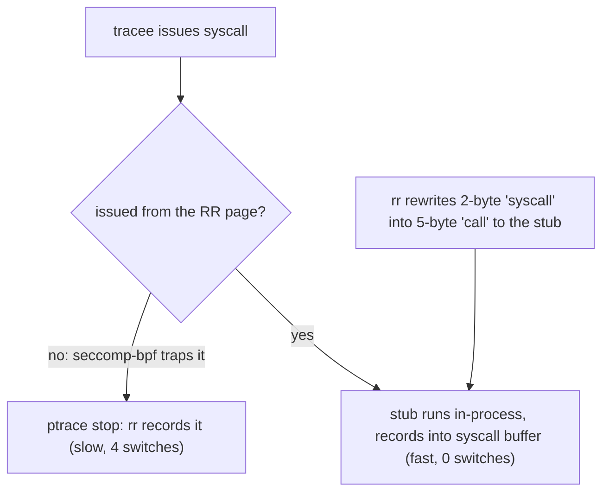

# rr: freeze the nondeterminism, replay the bug forever

Topic 34's premise is that production evidence is perishable — a heap
corruption you saw once at 3am is gone by the time you attach a
debugger. rr (Mozilla, USENIX ATC 2017) is the sharpest answer to that:
record a failing run once, on stock Linux with no kernel module, no
root, no special hardware, and replay it deterministically as many
times as it takes — including *backwards*, with gdb watchpoints running
in reverse. If topic 16's deterministic simulation testing controls
nondeterminism *before* you ship, rr captures it *after* — the same
move (put all nondeterminism behind one interface and log it), applied
at the opposite end of the lifecycle. This chapter builds the six
engineering ideas that make it deployable; then a section map.

This is a *paper*, not a repo in this course's pin table, so every claim
below cites a **section or figure** of the paper rather than a
`file:line`. Cite the **arXiv version, 1705.05937** — note that this is
the ~21-page **Extended Technical Report** (its title page says so, and
§1 states "this extended technical report elaborates on published
[work]"); the ATC'17 conference paper is the shorter ~14-page version.
Section numbers below are the extended report's.

## The problem in one sentence

Record-and-replay systems existed for decades but nobody could run
them, because they demanded kernel patches, hypervisors, or custom
hardware; rr gets sub-2× recording overhead on Firefox-scale workloads
using only unprivileged, unmodified Linux — ptrace, seccomp-bpf, and
one deterministic hardware counter.

## The concepts, step by step

### Step 1 — the record boundary is the user/kernel interface

> **In:** nothing yet — this step draws the line everything else is
> defined relative to.
> **Out:** the two nondeterminism sources (syscall results, async-event
> timing) that Steps 2–5 each pin down.

Everything below the syscall line is the environment; everything above
it is the program. A **tracee** is the process rr records. For a
user-space tracee confined to a single core, exactly two kinds of
nondeterminism cross that line (paper §2.1):

```
            ┌─────────────────────────────────────┐
            │   tracee (user space, one core)     │
            │   deterministic given its inputs    │
            └───────▲──────────────────▲──────────┘
   (a) syscall      │                  │   (b) async events:
       results ─────┘                  └── signals, context
       (read(), mmap(), time...)           switches — WHEN they land
            ════════ record boundary ════════
            │            kernel                  │
            └────────────────────────────────────┘
```

Record (a) the result and side effects of every syscall and (b) the
exact point at which every async event was delivered, and replay is
just "run the same code, feed it the same answers at the same points."
Why it matters: this is the identical abstraction bet as topic 16's
simulation harness — DST mocks the interface so tests are deterministic
by construction; rr logs the interface so one real execution becomes
deterministic in retrospect.

### Step 2 — one core, one thread at a time

> **In:** the "async events" source (b) from Step 1 — specifically
> context switches, the hardest to reproduce.
> **Out:** the single-core scheduling decision that demotes a context
> switch to just another recordable async event, and the bug classes it
> costs you.

rr pins all tracee threads to a single core (`sched_setaffinity`) and
runs them one at a time (§2.2). This is what makes (b) tractable: a
context switch is just another async event with a recordable delivery
point, not a source of true parallelism. The paper is explicit that
this makes weak-memory reordering unobservable and penalizes
high-parallelism workloads. The trade is stark:

| Bug class                    | Under rr                          |
|------------------------------|-----------------------------------|
| Data race                    | becomes a context-switch-timing   |
|                              | bug — often still reproducible    |
| Weak-memory reordering       | unobservable — one core has a     |
|                              | sequentially consistent view      |
| Parallel-only perf pathology | invisible — you serialized it     |

Why it matters for a database engine: your executor is a thread pool
hammering shared version chains and matrices. rr will still catch many
races (as interleavings at switch points), but a bug that only exists
because two cores genuinely raced on a cache line will never fire under
rr. Know which class you're hunting before you reach for the tool.

### Step 3 — RCB + registers = an execution point

> **In:** the requirement from Step 1(b) — replay must re-deliver each
> async event at the *exact* instruction it originally hit.
> **Out:** the (RCB, registers) coordinate that names that instruction,
> and the hardware constraint (Step 5 relies on it) that this coordinate
> demands.

To replay "SIGSEGV was delivered *here*," rr needs a coordinate system
for points in an execution. An **execution point** is a specific
dynamic instruction instance, not just a code address (the same address
recurs every loop iteration). Instruction counters on real CPUs are
mostly nondeterministic — the paper notes "instructions retired" is
unusable because a page-faulting instruction is restarted and counted
twice (§2.4.1) — but "modern Intel CPUs have exactly one deterministic
performance counter: retired conditional branches (RCB)" (§2.4.1). RCB
alone does not uniquely identify a point, so rr pairs it with "the
complete state of general-purpose registers (including the program
counter)": the execution point is the pair **(RCB count, full register
state)**. Run replay forward until the counter reaches the target
neighborhood, then match registers to land on the exact instruction,
and re-deliver the async event precisely there.

Two corollaries the paper is honest about. RDTSC (the timestamp
instruction) must be trapped and emulated so the program can't read a
nondeterministic clock behind rr's back (§2.6). And the whole
(RCB, registers) scheme rests on RCB being deterministic — see Step 5's
ARM note for where that footing gives way. Why it matters: the entire
replay guarantee hangs on one line in a CPU errata sheet;
"deployability" includes being at the mercy of silicon you don't
control.

### Step 4 — in-process syscall buffering (the performance trick)

> **In:** the "record every syscall" requirement from Step 1(a), which
> is ruinously slow if each syscall traps to rr.
> **Out:** the seccomp-bpf + RR-page + instruction-rewrite fast path
> that makes recording sub-2×, and the scratch buffers Step 5 injects
> from.

A ptrace stop costs 4 context switches per syscall (§3, Fig 1:
tracee→kernel→rr→kernel→tracee — two blocking ptrace notifications). At
database or browser syscall rates that's fatal; the paper notes that
for common syscalls this one context-switch cost "dwarfs" the syscall
itself. rr's fix: intercept common syscalls *in-process*, without any
stop (§3.1–3.2).



The mechanism: a seccomp-bpf filter makes every syscall trap *unless*
it is issued from a designated "RR page" (§3.2); rr then patches the hot
call sites — the x86 `syscall` instruction is 2 bytes, rewritten into a
5-byte `call` into an injected stub (§3.1) — so common syscalls run the
real syscall from the RR page and log their results into a **syscall
buffer**, never waking rr at all. Syscall outputs are redirected into
scratch buffers during recording, so that during replay the recorded
bytes can be injected in their place. Why it matters: this is classic
hot-path engineering — keep the slow, general ptrace path as the
correctness fallback, carve a monitored fast path for the common case.
It's the same shape as your syscall-heavy Redis module I/O: the overhead
story is decided entirely by what happens per-event on the hot path.

### Step 5 — replay: inject, don't re-execute

> **In:** the recorded log from Step 4 (syscall results) and the
> (RCB, registers) points from Step 3 (async events).
> **Out:** a fully deterministic re-execution — the "perishable evidence
> made permanent" payoff, and the input Step 6's reverse debugging
> replays over.

During replay, syscalls are not re-executed against the kernel — their
recorded results are injected from the log (§3.8), and async events are
re-delivered at their recorded (RCB, registers) points. The program's
own computation, being deterministic given those inputs (Step 1), takes
care of itself. Consequence: replay is *fully* deterministic — the same
bug fires at the same instruction every single time, no matter how flaky
the original repro was. A once-in-a-thousand-runs crash, captured once,
becomes a 100%-reproducible artifact you can attach to a bug report.

The load-bearing caveat, and the correction to a common misconception:
rr's ARM port *failed* not because ARM lacks an RCB-like counter, but
because "all ARM atomic memory operations use the load-linked/
store-conditional approach, which is inherently nondeterministic" — the
conditional store can fail due to non-user-space-observable activity
(e.g. a hardware interrupt), so retired-branch/instruction counts for
code doing atomics are nondeterministic (§5.1). On x86(-64), atomics
like compare-and-swap are deterministic in user-space state, so RCB
holds. Why it matters: this converts debugging from statistics back into
logic — the perishable production evidence of this topic's framing, made
permanent — but only on hardware where the counter keeps its promise.

### Step 6 — reverse execution: replay + checkpoints under gdb

> **In:** the deterministic replay from Step 5.
> **Out:** the time-travel workflow (backwards watchpoints) that turns a
> multi-day "who wrote this?" bisect into one `reverse-continue` — this
> topic's exercise 5.

"Deterministic replay" upgrades gdb from a state inspector into a time
machine. rr serves the gdb remote protocol; `reverse-continue` and
backwards watchpoints are implemented on top of replay plus checkpoints.
A **checkpoint** is a cheap snapshot: the paper takes them by `fork`ing
the replay process to clone its address space, typically in under ~10 ms
(§6.2). Reverse execution then restores the nearest earlier checkpoint,
replays forward, and uses determinism to stop just before the point you
came from. The killer workflow — exercise 5 in this topic's README — is:

```
1. rr record ./test --seed 42        # capture the failing run once
2. rr replay                          # gdb attaches to the replay
3. (gdb) watch -l corrupted_field     # hw watchpoint on the bad value
4. (gdb) reverse-continue             # run BACKWARDS to the write
5. stopped at the culprit store, full stack, full state
```

Why it matters: "who scribbled on this version chain?" is normally a
days-long bisect; under rr it is one watchpoint and one
reverse-continue, because the write that corrupted the value must happen
at the same execution point in every replay.

## How to read the paper (with the concepts in hand)

arXiv:1705.05937 (the extended technical report, ~21 pp; the ATC'17
conference version is ~14 pp); budget ~1.5h.

- **Abstract + §1 intro** (10 min) — the deployability thesis: ptrace,
  no kernel modules, no root, no special hardware (Step 1's boundary,
  and why every prior system failed to spread). Read it as a systems
  paper about *constraints*, not features.
- **§2 Design** (20 min) — single-core scheduling (§2.2, Step 2), the
  two nondeterminism sources (§2.1), and the (RCB, registers)
  execution-point scheme (§2.4, Step 3). This is the conceptual core;
  the rest is engineering to make it fast.
- **§3 In-process system-call interception** (25 min) — the seccomp-bpf
  + RR-page + instruction-rewriting machinery, scratch buffers, and
  (from §2.6) RDTSC trapping (Step 4). Slowest, densest, most valuable
  part for you — map it onto "what would intercepting FalkorDB's hot
  syscalls cost."
- **§3.8 + reverse execution / §6.2** (15 min) — injection instead of
  re-execution, gdb integration, fork-based checkpoints (Steps 5–6).
- **§4 Results (Fig 5)** (15 min) — where "under 2× for the workloads
  Mozilla cared about" comes from (Firefox test suites; cheap enough for
  CI). Check which workloads before generalizing to a database server.
- **§5 Constraints** (5 min) — weak memory, ARM (§5.1), shared memory
  (§5.2). These are Step 2 and Step 5's trades stated by the authors
  themselves.

## Questions to answer in notes.md

1. rr and topic 16's deterministic simulation testing both put
   nondeterminism behind an interface — but DST *replaces* the
   environment and rr *records* it. For FalkorDB, which failure classes
   does each end of the lifecycle catch that the other structurally
   cannot?
2. One-thread-at-a-time on one core is both rr's superpower and its
   blind spot for a database engine: which FalkorDB bug classes (MVCC
   version-chain races, lock-free index ops, GraphBLAS parallel kernels)
   stay observable as switch-timing bugs, and which become invisible
   because they need true multi-core interleaving or weak-memory
   reordering?
3. Reconstruct the per-syscall cost argument: what exactly do the 4
   context switches of a ptrace stop cost (§3, Fig 1), and how do
   seccomp-bpf + the RR page + the 2-byte-to-5-byte rewrite eliminate
   them for the common case? What limits which syscalls can take the
   fast path?
4. Why is (RCB count, register state) sufficient to identify a unique
   execution point in practice, and what would break if the counter
   overcounted by even one on rare occasions? Connect to why the ARM
   port failed (§5.1).
5. After doing exercise 5 (`rr record` a failing seeded test, then
   watchpoint + reverse-continue to the corrupting write): how long did
   the same hunt take you last time without rr, and what recording
   overhead would you accept to run rr on FalkorDB's CI flakes?

## Done when

Answer each before unfolding it.

- [ ] You can name the two nondeterminism sources rr records and state why nothing else crosses the boundary on a single core.

  <details><summary>Answer</summary>

  The two sources (§2.1) are (a) the results and side effects of
  syscalls — what the kernel hands back across the interface — and (b)
  the *timing* of asynchronous events: signals and context switches,
  i.e. *when* they are delivered. On a single core with threads run one
  at a time (§2.2), there is no true parallelism, so a context switch is
  itself just another async event with a recordable delivery point; the
  tracee's own user-space computation is deterministic given its inputs,
  so once (a) and (b) are pinned, nothing else can differ between
  record and replay.

  </details>

- [ ] You can explain how an async signal gets re-delivered at exactly the recorded instruction during replay, using RCB + registers.

  <details><summary>Answer</summary>

  rr records the execution point at which the signal was delivered as
  the pair (retired-conditional-branch count, full general-purpose
  register state including the program counter) (§2.4.1). On replay it
  programs the RCB performance counter to fire an interrupt as the count
  approaches the recorded value, single-steps into the neighborhood, and
  compares registers until they match the recorded state exactly — that
  uniquely identifies the dynamic instruction instance (RCB alone does
  not, e.g. an `inc [x]; jmp` loop repeats the same PC). It then injects
  the signal there, reproducing the original delivery point precisely.

  </details>

- [ ] You can sketch the syscall fast path (seccomp-bpf, RR page, rewritten stub, syscall buffer) and say which context switches it removes.

  <details><summary>Answer</summary>

  A ptrace-trapped syscall costs 4 context switches (tracee→kernel→rr→
  kernel→tracee — two blocking ptrace notifications; §3, Fig 1). The
  fast path removes all of them for common syscalls: a seccomp-bpf
  filter traps every syscall *except* those issued from a designated "RR
  page" (§3.2); rr rewrites the hot 2-byte `syscall` instructions into
  5-byte `call`s into an injected stub (§3.1) that performs the real
  syscall from the RR page and logs its result into an in-process
  syscall buffer — so the common case never wakes rr (0 extra switches).
  Uncommon or unsafe syscalls fall back to the slow 4-switch ptrace
  path.

  </details>

- [ ] You have completed exercise 5: recorded a failing seeded test and found the corrupting write with a watchpoint plus reverse-continue.

  <details><summary>Answer</summary>

  Concretely: `rr record ./test --seed 42` captures the flaky run once;
  `rr replay` starts a deterministic replay with gdb attached; a
  hardware watchpoint `watch -l corrupted_field` arms on the bad memory;
  `reverse-continue` runs the replay *backwards* to the store that last
  wrote it, stopping with full stack and register state. It works
  because replay is fully deterministic (Step 5) and reverse execution
  is replay-from-a-fork-checkpoint plus determinism (§6.2), so the
  corrupting write sits at the same execution point in every replay.

  </details>

## References

**Papers**
- O'Callahan, Jones, Froyd, Huey, Noll, Partush — "Engineering Record
  and Replay for Deployability" (USENIX ATC 2017; extended technical
  report) — [arXiv:1705.05937](https://arxiv.org/abs/1705.05937).
  Sections cited: §2.1 (nondeterminism sources), §2.2 (single-core
  scheduling), §2.4.1 (RCB + registers), §2.6 (RDTSC), §3/§3.1/§3.2
  (syscall interception, Fig 1), §3.8 (replay), §4 (results, Fig 5),
  §5.1 (ARM/hardware), §6.2 (fork checkpoints).

**Code**
- [rr](https://github.com/rr-debugger/rr) — the debugger itself;
  `rr record` / `rr replay` are all exercise 5 needs. (Not in this
  course's pin table; no `file:line` anchors are cited above.)
- Topic 16 (deterministic simulation testing) — the same
  capture-nondeterminism-behind-an-interface move, before ship.
