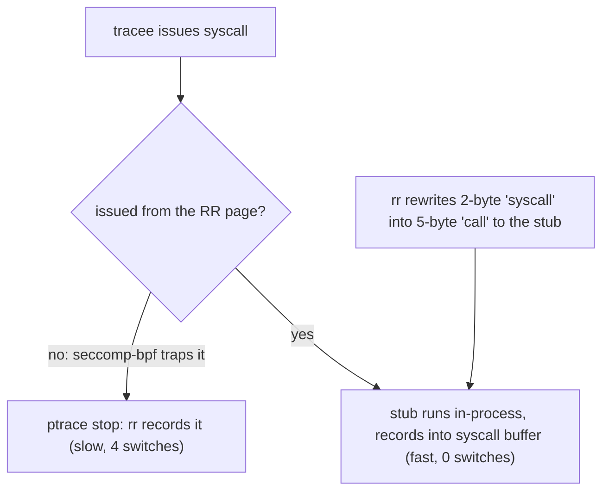

# rr: freeze the nondeterminism, replay the bug forever

Topic 34's premise is that production evidence is perishable — a heap
corruption you saw once at 3am is gone by the time you attach a
debugger. rr (Mozilla, USENIX ATC 2017) is the sharpest answer to
that: record a failing run once, on stock Linux with no kernel module,
no root, no special hardware, and replay it deterministically as many
times as it takes — including *backwards*, with gdb watchpoints
running in reverse. If topic 16's deterministic simulation testing
controls nondeterminism *before* you ship, rr captures it *after* —
the same move (put all nondeterminism behind one interface and log
it), applied at the opposite end of the lifecycle. This chapter builds
the six engineering ideas that make it deployable; then a section map.

## The problem in one sentence

Record-and-replay systems existed for decades but nobody could run
them, because they demanded kernel patches, hypervisors, or custom
hardware; rr gets sub-2× recording overhead on Firefox-scale workloads
using only unprivileged, unmodified Linux — ptrace, seccomp-bpf, and
one deterministic hardware counter.

## The concepts, step by step

### Step 1 — the record boundary is the user/kernel interface

Everything below the syscall line is the environment; everything above
it is the program. For a user-space program confined to a single core,
exactly two kinds of nondeterminism cross that line:

```
            ┌─────────────────────────────────────┐
            │   tracee (user space, one core)     │
            │   deterministic given its inputs    │
            └───────▲──────────────────▲──────────┘
   (a) syscall      │                  │   (b) async events:
       results ─────┘                  └── signals, context
       (read(), mmap(), time...)           switches — WHEN they land
            ════════ record boundary ════════
            │            kernel                  │
            └────────────────────────────────────┘
```

Record (a) the result and side effects of every syscall and (b) the
exact point at which every async event was delivered, and replay is
just "run the same code, feed it the same answers at the same
points." Why it matters: this is the identical abstraction bet as
topic 16's simulation harness — DST mocks the interface so tests are
deterministic by construction; rr logs the interface so one real
execution becomes deterministic in retrospect.

### Step 2 — one core, one thread at a time

rr pins all tracee threads to a single core (`sched_setaffinity`) and
runs them one at a time. This is what makes (b) tractable: a context
switch is just another async event with a recordable delivery point,
not a source of true parallelism. The trade is stark:

| Bug class                    | Under rr                          |
|------------------------------|-----------------------------------|
| Data race                    | becomes a context-switch-timing   |
|                              | bug — often still reproducible    |
| Weak-memory reordering       | unobservable — one core has a     |
|                              | sequentially consistent view      |
| Parallel-only perf pathology | invisible — you serialized it     |

Why it matters for a database engine: your executor is a thread pool
hammering shared version chains and matrices. rr will still catch
many races (as interleavings at switch points), but a bug that only
exists because two cores genuinely raced on a cache line will never
fire under rr. Know which class you're hunting before you reach for
the tool.

### Step 3 — RCB + registers = an execution point

To replay "SIGSEGV was delivered *here*," rr needs a coordinate system
for points in an execution. Instruction counters on real CPUs are
mostly nondeterministic noise, but one counter — **retired conditional
branches (RCB)** — is deterministic on modern Intel CPUs. rr
identifies an execution point as the pair **(RCB count, full register
state)**: run replay forward until the counter says you're in the
right neighborhood, then match registers to land on the exact
instruction, and re-deliver the async event precisely there. Two
corollaries the paper is honest about: RDTSC must be trapped (via
`prctl`) so the program can't read a nondeterministic clock behind
rr's back, and at the time of the paper rr could not work on ARM — no
suitable deterministic counter existed there. Why it matters: the
entire replay guarantee hangs on one line in a CPU errata sheet;
"deployability" includes being at the mercy of silicon you don't
control.

### Step 4 — in-process syscall buffering (the performance trick)

A ptrace stop costs 4 context switches per syscall (tracee→kernel→
rr→kernel→tracee). At database or browser syscall rates that's fatal.
rr's fix: intercept common syscalls *in-process*, without any stop.



The mechanism: a seccomp-bpf filter makes every syscall trap *unless*
it is issued from a designated "RR page"; rr then patches the hot call
sites — rewriting 2-byte `syscall` instructions into 5-byte `call`
instructions into a stub — so common syscalls run the real syscall
from the RR page and log their results into a **syscall buffer**,
never waking rr at all. Syscall outputs are redirected into **scratch
buffers** during recording, so that during replay the recorded bytes
can be injected in their place. Why it matters: this is classic
hot-path engineering — keep the slow, general ptrace path as the
correctness fallback, carve a monitored fast path for the common case.
It's the same shape as your syscall-heavy Redis module I/O: the
overhead story is decided entirely by what happens per-event on the
hot path.

### Step 5 — replay: inject, don't re-execute

During replay, syscalls are not re-executed against the kernel —
their recorded results are injected from the log, and async events are
re-delivered at their recorded (RCB, registers) points. The program's
own computation, being deterministic given those inputs (Step 1),
takes care of itself. Consequence: replay is *fully* deterministic —
the same bug fires at the same instruction every single time, no
matter how flaky the original repro was. A once-in-a-thousand-runs
crash, captured once, becomes a 100%-reproducible artifact you can
attach to a bug report. Why it matters: this converts debugging from
statistics back into logic — the perishable production evidence of
this topic's framing, made permanent.

### Step 6 — reverse execution: replay + checkpoints under gdb

"Deterministic replay" upgrades gdb from a state inspector into a time
machine. rr serves the gdb remote protocol; `reverse-continue` and
backwards watchpoints are implemented on top of replay plus
checkpoints: restore an earlier checkpoint, replay forward, and use
determinism to stop just before the point you came from. The killer
workflow — exercise 5 in this topic's README — is:

```
1. rr record ./test --seed 42        # capture the failing run once
2. rr replay                          # gdb attaches to the replay
3. (gdb) watch -l corrupted_field     # hw watchpoint on the bad value
4. (gdb) reverse-continue             # run BACKWARDS to the write
5. stopped at the culprit store, full stack, full state
```

Why it matters: "who scribbled on this version chain?" is normally a
days-long bisect; under rr it is one watchpoint and one
reverse-continue, because the write that corrupted the value must
happen at the same execution point in every replay.

## How to read the paper (with the concepts in hand)

USENIX ATC 2017 (arXiv:1705.05937), ~14 pages; budget ~1.5h.

- **Abstract + intro** (10 min) — the deployability thesis: ptrace,
  no kernel modules, no root, no special hardware (Step 1's boundary,
  and why every prior system failed to spread). Read it as a systems
  paper about *constraints*, not features.
- **Design/approach sections** (20 min) — single-core scheduling
  (Step 2), the two nondeterminism sources, and the (RCB, registers)
  execution-point scheme (Step 3). This is the conceptual core; the
  rest is engineering to make it fast.
- **Syscall buffering / performance engineering** (25 min) — the
  seccomp-bpf + RR-page + instruction-rewriting machinery, scratch
  buffers, RDTSC trapping (Step 4). Slowest, densest, most valuable
  part for you — map it onto "what would intercepting FalkorDB's hot
  syscalls cost."
- **Replay and reverse execution** (15 min) — injection instead of
  re-execution, gdb integration, checkpoints (Steps 5-6).
- **Evaluation** (15 min) — where "under 2× for the workloads Mozilla
  cared about" comes from (Firefox test suites; cheap enough for CI).
  Check which workloads before generalizing to a database server.
- **Limitations** (5 min) — weak memory, ARM, parallelism. These are
  Step 2 and Step 3's trades stated by the authors themselves.

## Questions to answer in notes.md

1. rr and topic 16's deterministic simulation testing both put
   nondeterminism behind an interface — but DST *replaces* the
   environment and rr *records* it. For FalkorDB, which failure
   classes does each end of the lifecycle catch that the other
   structurally cannot?
2. One-thread-at-a-time on one core is both rr's superpower and its
   blind spot for a database engine: which FalkorDB bug classes
   (MVCC version-chain races, lock-free index ops, GraphBLAS
   parallel kernels) stay observable as switch-timing bugs, and which
   become invisible because they need true multi-core interleaving or
   weak-memory reordering?
3. Reconstruct the per-syscall cost argument: what exactly do the 4
   context switches of a ptrace stop cost, and how do seccomp-bpf +
   the RR page + the 2-byte-to-5-byte rewrite eliminate them for the
   common case? What limits which syscalls can take the fast path?
4. Why is (RCB count, register state) sufficient to identify a unique
   execution point, and what would break if the counter overcounted
   by even one on rare occasions? Connect to why ARM was unsupported.
5. After doing exercise 5 (`rr record` a failing seeded test, then
   watchpoint + reverse-continue to the corrupting write): how long
   did the same hunt take you last time without rr, and what recording
   overhead would you accept to run rr on FalkorDB's CI flakes?

## Done when

- [ ] You can name the two nondeterminism sources rr records and state
      why nothing else crosses the boundary on a single core.
- [ ] You can explain how an async signal gets re-delivered at exactly
      the recorded instruction during replay, using RCB + registers.
- [ ] You can sketch the syscall fast path (seccomp-bpf, RR page,
      rewritten stub, syscall buffer) and say which context switches
      it removes.
- [ ] You have completed exercise 5: recorded a failing seeded test
      and found the corrupting write with a watchpoint plus
      reverse-continue.

## References

**Papers**
- O'Callahan, Jones, Froyd, Huey, Noll, Partush — "Engineering Record
  and Replay for Deployability" (USENIX ATC 2017) —
  [arXiv:1705.05937](https://arxiv.org/abs/1705.05937)

**Code**
- [rr](https://github.com/rr-debugger/rr) — the debugger itself;
  `rr record` / `rr replay` are all exercise 5 needs
- Topic 16 (deterministic simulation testing) — the same
  capture-nondeterminism-behind-an-interface move, before ship
