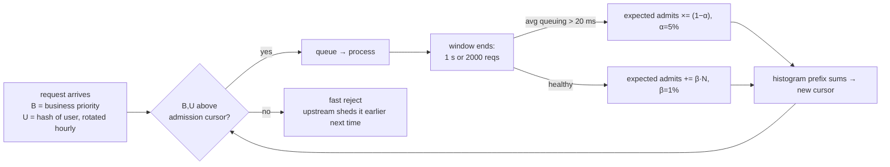

# Topic 35 — Overload Control & Resource Governance

Topic 34 taught the database to confess when it's slow; this topic is
about the day it's slow because everyone is asking at once. Overload is
not just "more load than capacity": retries, timeouts, and failover
create feedback loops in which a *temporary* trigger flips the system
into a *permanent* zero-goodput state that outlives the trigger —
Bronson et al. call these **metastable failures**, and they "account
for many of the largest outages at major web companies." The defenses —
retry budgets, priority admission control, backpressure — are policies
a database must carry before the incident, for exactly topic 34's
reason: you cannot deploy a load shedder to last Tuesday.

## The problem, measured (bench lane 1, provided — runs today)

One simulated server: 300 QPS capacity, clients that time out at 1 s
and retry once, and a single 10 s outage at t=30 s. Two runs differ
*only* in offered load — both comfortably below capacity:

```
           ── load 280 QPS ──   ── load 140 QPS ──
   t(s)    offered  goodput      offered  goodput
     20        280      280          140      140
     29        280      280          140      140
     35        560        0          280        0
     60        560        0          280        0
    120        560        0          280        0
    160        560        0          140      251
    199        560        0          140      140

   280 QPS: goodput never recovers — the outage ended at t=40 s
   140 QPS: heals at t=161 s
```

At 280 QPS the outage queues ~2,800 requests; every queued request
misses its 1 s timeout, every miss spawns a retry, and the offered load
locks at 560 QPS — on a 300 QPS server. Goodput is **still zero at
t=199 s**, 160 seconds after the trigger ended, and would be zero
forever: the retry storm *is* the failure now. At 140 QPS the identical
trigger produces the identical storm (280 QPS), but 280 < 300, so the
backlog drains and the system heals itself. The dividing line is the
**hidden capacity**: with one retry, it's capacity/2 = 150 QPS. The
simulator is deterministic virtual-clock arithmetic (the same trick as
topic 34's lane 1), so these are provable numbers.

## The metastable lifecycle

```
              load rises                    trigger (outage, spike,
   ┌────────┐ past hidden ┌────────────┐    cache wipe, slow node)  ┌──────────────┐
   │ stable │────────────▶│ vulnerable │───────────────────────────▶│  metastable  │
   │        │◀────────────│ (efficient,│                            │ (goodput ~0, │
   └────────┘  load drops │  looks     │◀───────── ONLY by ─────────│  self-       │
               below      │  identical │   breaking the loop:       │  sustaining) │
               hidden     │  to stable)│   shed load / kill retries └──────────────┘
               capacity   └────────────┘   / restart into less load
```

Three states, and the middle one is invisible: a vulnerable system
serves every request perfectly (lane 1, t<30). Systems run vulnerable
*on purpose* — provisioning below hidden capacity wastes half the
fleet. The paper's discipline: the **root cause is the sustaining
feedback loop, not the trigger**. Fixing the outage that tripped you
(the "root cause" in the postmortem) leaves you exactly as vulnerable
to the next trigger; fixing the retry policy removes the failure mode.
And because the failure is emergent — "one cannot write a unit or
integration test to trigger them" — reproduction needs a load generator
without coordinated omission (the paper cites Tene; topic 34's lane 1
is prerequisite reading).

## Work amplification: the loops that sustain

| loop | amplification | where you've seen it |
|---|---|---|
| retry on timeout | ×(1+retries) on *hidden* capacity | lane 1: 1 retry halves it |
| look-aside cache loss | ×1/(miss rate): 90% hit rate = ×10 | a 3,000 QPS app on a 300 QPS database |
| failover | herd onto the survivors | topic 21's elections |
| slow error path | error handling costs more than success | logging with locks on the failure path |

The cache row is the scariest: the paper's example app *advertises*
3,000 QPS but *hides* a 300 QPS database behind a 90% hit rate. Any
event that cools the cache (restart, eviction bug, key rotation) asks
the database for 10× — and the recovery itself keeps the cache cold.
Facebook's link-imbalance incident ran this loop through a **MRU
connection pool** and stayed undiagnosed for over two years; the fix
was one line (pool policy), on a loop spanning four systems.

## Detection: what signal says "overloaded"?

```
   response time  = queuing + service + DOWNSTREAM response times
                    → recursive along the call path: an overloaded leaf
                      makes every healthy ancestor look overloaded
   CPU usage      = busy ≠ overloaded (batch work pegs CPU harmlessly)
   queuing time   = processing start − arrival, purely LOCAL
                    → high iff THIS node can't keep up        ← DAGOR
   min sojourn    = CoDel: min queuing delay over a sliding window
                    → a standing queue vs a harmless burst
```

WeChat's DAGOR measures **average request queuing time** over a window
of 1 s or 2,000 requests, threshold 20 ms. Not response time — their
DAGOR_r variant, shedding on 250 ms response time, saturates at 630
QPS where queuing-time DAGOR_q reaches 750 QPS on the same 3-server
service, because response time conflates local queueing with
downstream slowness. Not CPU — WeChat runs hot all day. The
metastable paper endorses the same family: CoDel's minimum-over-window
distinguishes persistent overload from a spike that would clear on its
own.

## DAGOR: admission as a cursor over priorities



The parts that earn their place: **business priority** is a hash-table
lookup (Login highest; WeChat Pay above messaging — a 100× complaint
ratio when payments fail), copied to every downstream request so a
shed decision is consistent across the call tree. **User priority**
(128 sublevels per business level, hash of user id rotated hourly)
exists because shedding at bare business-level granularity oscillates
between level τ (too much shed) and τ−1 (overload again); the
compound (B,U) cursor moves in fine steps. Session-based priority was
rejected for a human reason: users learned that logout/login re-rolled
their session dice. **Adaptation** is multiplicative-decrease (5%) /
additive-increase (1%) on an admit *count*, converted to a cursor via
a priority histogram — and downstream piggybacks its cursor on
responses so the *upstream* rejects doomed requests before sending
them (collaborative shedding: the reject costs the overloaded node
nothing at all).

## CockroachDB: overload control as a scheduler

| mechanism | resource | signal | anchor |
|---|---|---|---|
| slots (kv work) | CPU concurrency | runnable goroutines per CPU ≥ threshold | `kv_slot_adjuster.go:16` |
| tokens (io work) | LSM health | Pebble L0 file / sub-level counts | `io_load_listener.go:69` |
| WorkQueue | ordering | (tenant, `WorkPriority` int8, FIFO ts) | `work_queue.go:303` |

CockroachDB's admission package states the reframe in its package doc:
the goal is to **shift queueing out of the goroutine scheduler** —
where the runtime picks what runs next — **into admission queues that
can reorder by priority and tenant** (`admission.go:1`). Slots
(concurrency, occupied-while-running) govern CPU; tokens
(rate, consumed-at-admission) govern IO, because LSM overload isn't a
point-in-time queue but debt — L0 read amplification that compactions
must pay down (topic 4's write stalls, promoted from per-store reflex
to node-wide policy). The slot count itself is AIMD-adjusted from a
1 ms-sampled `runnable goroutines per CPU` signal — queuing-time
detection in scheduler clothing.

## Redis: backpressure surfaces on one thread

| surface | mechanism | anchor |
|---|---|---|
| maxmemory | evict via 16-entry pool of sampled-LRU candidates before each command | `evict.c:36,:384,:532` |
| OOM gate | reject DENYOOM commands with `-OOM` when eviction can't free enough | `server.c:4391,:4498` |
| output buffers | async-disconnect clients whose reply backlog exceeds limits | `networking.c:5151` |
| busy scripts | after `busy_reply_threshold`, answer `-BUSY` instead of queueing | `server.c:2130` |
| CLIENT PAUSE | suspend intake wholesale (failover choreography) | `server.c:4850` |

Single-threaded redis can't shed by priority — every accepted command
runs. So its governance is at the *edges*: memory (don't accept writes
you can't hold), replies (don't buffer for a client that won't read —
that's the slow-consumer feedback loop), and time (don't let one
script starve everyone silently). Each surface converts unbounded
queueing into a bounded, fast error — the same move as DAGOR's reject,
one node instead of 3,000 services.

## Code reading (cloned under ~/repos)

| repo | anchor | what to see |
|---|---|---|
| redis | `src/evict.c:384` | `getMaxmemoryState` — how far over budget, and can we evict our way out |
| redis | `src/server.c:4391` | the OOM gate in `processCommand` — reject-before-work |
| redis | `src/networking.c:5151` | `checkClientOutputBufferLimits` — backpressure on slow readers |
| cockroach | `pkg/util/admission/admission.go:1` | the package doc — the whole design in one comment |
| cockroach | `pkg/util/admission/work_queue.go:813` | `Admit` — where requests wait, ordered by (tenant, priority, ts) |
| cockroach | `pkg/util/admission/kv_slot_adjuster.go:46` | `CPULoad` — AIMD slots from runnable-goroutine counts |
| cockroach | `pkg/util/admission/io_load_listener.go:69` | L0 thresholds — LSM debt as an admission signal |

## Reading guides

1. [reading-metastable.md](reading-metastable.md) — Bronson et al. (HotOS'21): metastable failures.
2. [reading-dagor.md](reading-dagor.md) — Zhou et al. (SoCC'18): DAGOR, WeChat's overload control.
3. [reading-redis-backpressure.md](reading-redis-backpressure.md) — code read: eviction, OOM gate, output-buffer limits, -BUSY.
4. [reading-cockroach-admission.md](reading-cockroach-admission.md) — code read: slots, tokens, WorkQueue, io_load_listener.

## Experiments

```
cd experiments
cargo test              # 3 provided tests pass; 6 fix the contract for your stubs
cargo run --release --bin overload_bench
```

- `sim.rs` (PROVIDED) — deterministic virtual-clock queueing simulator:
  open-loop arrivals, client timeout, retries, an outage trigger, and a
  `Policy` trait with admit / allow-retry / observe-queuing hooks.
- `tokenbucket.rs` (stub) — `TokenBucket`: the retry budget. Refill at
  a fixed rate, cap at burst, O(1) acquire.
- `admission.rs` (stub) — `DagorGate`: queuing-time windows, shed
  lowest-priority-first via a cursor, 5%-down/1%-up adaptation.

Bench lanes: 1 = the metastable failure (provided, above). 2 = retry
budgets of 15 vs 25 QPS on the 280 QPS scenario — one heals it, one
doesn't, and the difference is whether the budget fits in the 20 QPS
headroom. 3 = DAGOR-lite under sustained 2× overload: goodput and
per-priority success, with and without admission control.

## Exercises

1. Implement the stubs until all 9 tests pass and lanes 2-3 print.
2. Lane 1's hidden capacity is capacity/(1+retries). Verify by bisecting:
   find the load (to within 5 QPS) where the 10 s outage stops being
   fatal, with max_retries = 1, 2, 3.
3. Trigger intensity: at 280 QPS, what is the *largest* outage the
   system survives? At 160 QPS? (The paper: a system at 151 QPS
   recovers from a much bigger spike than one at 299 — vulnerability
   is a spectrum, not a bit.)
4. Lane 2 shows budget-15 heals and budget-25 never does. Find the
   healing time as a function of budget ∈ {5, 10, 15, 19} and explain
   the shape (hint: drain rate = headroom − budget).
5. Lane 3 with `max_retries: 1` instead of 0: show that admission
   control *alone* now fails (rejects spawn no retry in our sim, but
   timed-out admitted work does) and that DAGOR + retry budget together
   restore goodput. Policies compose.
6. Sketch M35: which query attributes map to business priority in a
   graph database, where does the queuing-time window live in the
   executor, and what is the fast-reject path's cost (measure a
   `-BUSY`-style early error vs a full query)?

## Cross-topic threads

- **Topic 34 (debugging)**: lane 1 here *is* lane 1 there with a
  feedback loop attached — and the metastable paper explicitly warns
  that reproducing these failures needs a load generator free of
  coordinated omission. Honest measurement is a prerequisite for
  overload research.
- **Topic 4 (LSM)**: write stalls were per-store backpressure;
  cockroach's io_load_listener lifts the same L0 signals into
  node-wide admission — governance beats reflex.
- **Topic 8 (GC) / topic 5 (checkpoints)**: every stall from those
  topics is a *trigger* in this one's vocabulary. The pause was never
  the outage; the retry storm it seeds is.
- **Topic 21 (replication)**: failover is a work-amplification loop —
  the herd that lands on the new primary is lane 1's storm wearing a
  different trigger.

## Capstone M35 — overload control for the Rust engine

- Per-query priority (system > write > read > analytical), carried in
  the query context; a DAGOR-style admission cursor fed by executor
  queuing time (arrival → first operator), windowed 1 s / 2,000 queries.
- Retry-budget guidance surfaced to clients: fast `-BUSY`-style
  rejects with a retry-after hint, so well-behaved clients never build
  the storm.
- Memory governance: a global budget with per-query accounting;
  queries that would exceed it are rejected at plan time, not OOM-killed
  mid-execution (redis's DENYOOM gate, per-query).
- Targets: ≥ 80% of saturated throughput sustained at 2× offered
  overload (DAGOR's bar); lane 1 reproduced against the real engine
  (induced 10 s stall, open-loop client), then *fixed* — same trigger,
  goodput recovers.
