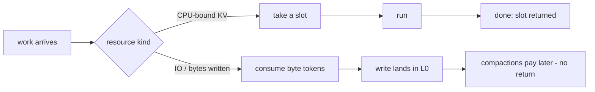
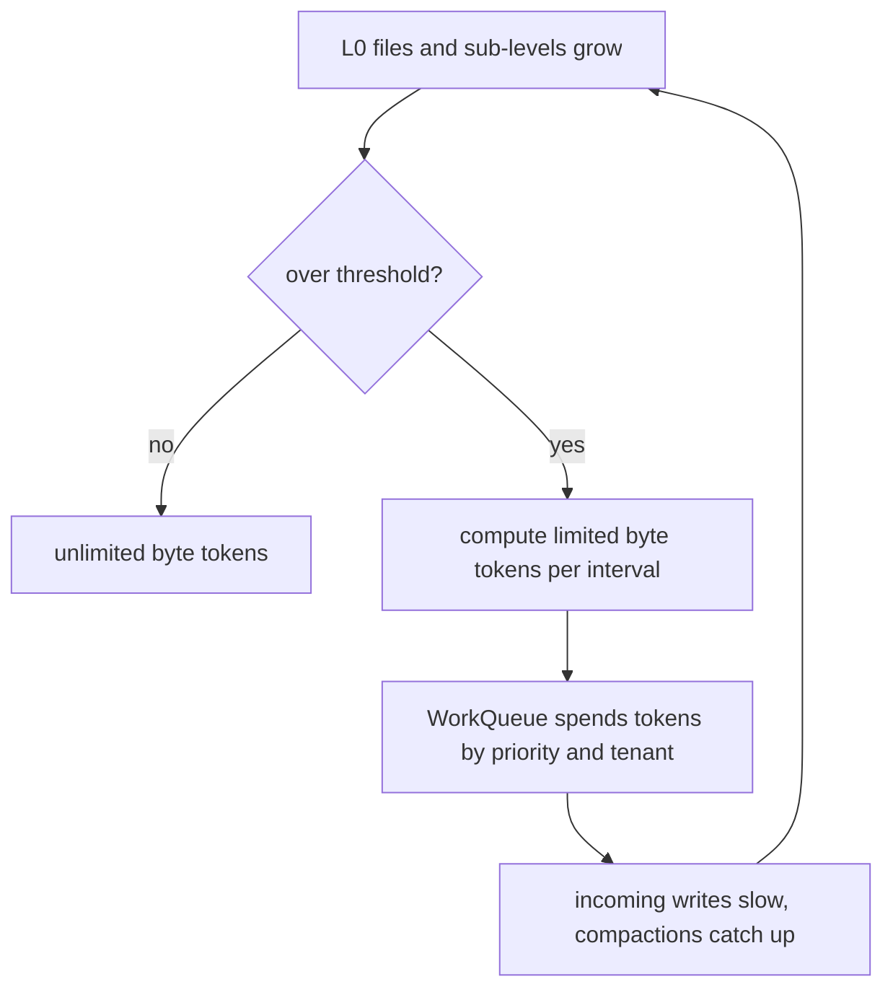

# CockroachDB admission control: stealing the queue back from the scheduler

CockroachDB's `pkg/util/admission` is the production counterpoint to
this topic's papers: where DAGOR sheds across services and redis
rejects on one thread, cockroach builds a user-space scheduler inside
each node — work is intercepted before it becomes a runnable
goroutine and queued where it can be reordered by tenant and
priority. The repo is cloned at `~/repos/cockroach`; this is a
code-read, ~1.5h, focused on two interfaces, one queue, and two
overload signals. Before opening files, this chapter builds the ideas
in order; the anchor table below maps each step to an exact
file:line.

## The problem in one sentence

**When a node saturates, queueing happens somewhere — and the Go
scheduler's runnable queue is FIFO with no notion of priority or
tenant, so a backup can starve user reads unless the database moves
the queue into its own code.** Admission control doesn't eliminate
the wait; it relocates it to a place that can reorder it while
keeping the CPU and disks busy.

## The concepts, step by step

### Step 1 — the reframe: overload control as a user-space scheduler

The package doc comment (`admission.go:1-120`) states the two goals —
limit node overload, and provide performance isolation between
priorities and tenants — and the central move: "shift queueing from
system-provided resource allocation abstractions that we do not
control, like the goroutine scheduler, to queueing in admission
control, where we can reorder." Scope is deliberately node-local, not
cluster-level: in a system with strong work affinity, only the node
itself can protect itself in time.

```
 without admission control:            with admission control:

 reqs ──▶ goroutines ──▶ Go runqueue   reqs ──▶ WorkQueue ──▶ few goroutines
                         (FIFO, blind          (ordered by tenant,
                          to priority           priority, arrival)
                          and tenant)                 │
                                               grant when a slot/token frees
```

Why it matters: as with topic 34's coordinated omission, latency
lives in the queue you aren't looking at. Cockroach makes the queue
visible, owned, and reorderable.

### Step 2 — slots vs tokens: concurrency vs rate

The package doc (`admission.go:54`, "Tokens and slots are the two
ways admission is granted") splits resources by whether work
completion is observable. A **slot** models concurrency: occupied
while the work runs, returned when it finishes — right for CPU-bound
KV work, where "done" is well-defined. A **token** models rate:
consumed at admission and never returned — right for IO, because a
write's true cost lands later, when compactions rewrite those bytes;
there is nothing to hand back.



Why it matters: the slot/token split is the type system of overload —
it encodes whether backpressure can be closed-loop (slots: measure
occupancy) or must be open-loop (tokens: refill on a capacity model).

### Step 3 — the CPU signal: runnable goroutines per CPU, AIMD slots

The overload signal for CPU is not utilization — it is **runnable
goroutines per CPU, sampled every 1 ms**
(`kv_slot_adjuster.go:16`, `KVSlotAdjusterOverloadThreshold`,
default 32). A runnable-but-not-running goroutine is work that is
already waiting; this is queuing-time detection in scheduler
clothing — the same instinct as DAGOR's average queuing time, and for
the same reason both are local signals and neither is CPU
utilization: 100% busy with an empty queue is healthy, 100% busy
with a deep queue is overload.

`kvSlotAdjuster.CPULoad(runnable, procs, samplePeriod)`
(`kv_slot_adjuster.go:29` for the type, `:46` for the method) turns
the signal into an adaptive concurrency limit: at
`runnable >= threshold*procs` it decreases total slots (`:99`); at or
below half that (`:103`) it increases them — additive up, additive
down, every millisecond, an AIMD-style controller hunting the
concurrency the machine can actually sustain.

```
 runnable/CPU
   ▲
   │ ≥ threshold        → slots-- (overloaded: shrink concurrency)
   │
   │  (dead band)         hold
   │
   │ ≤ threshold/2      → slots++ (underloaded: probe upward)
   └────────────────────────────▶ sampled every 1 ms
```

### Step 4 — the IO signal: L0 debt, tokens as compaction budget

For stores, overload is read straight off the LSM: **L0 file count
and L0 sub-level count** (`io_load_listener.go:69` and `:77`). You
know these numbers from topic 4 — they are Pebble's write-stall
signals, the shape of unpaid compaction debt. Cockroach promotes them
from a per-store reflex (stall everyone identically when L0 is deep)
to a node-wide admission policy: when L0 crosses the thresholds, byte
tokens for incoming writes are limited — sized so compactions can pay
the debt down — and the WorkQueue spends that budget on the
highest-priority work first, instead of stalling all writers blindly.



Why it matters: this closes the loop the token model opened in Step 2
— tokens can't be returned, but the L0 signal measures the
accumulated consequence of past grants and throttles future ones.

### Step 5 — the priority ladder: below zero means "yield to users"

`WorkPriority` is an `int8` (`admissionpb/admissionpb.go:23`) and the
ladder is deliberate: `LowPri` = MinInt8, `BulkLowPri` = -100,
`UserLowPri` = -50, `BulkNormalPri` = -30, `NormalPri` = 0,
`LockingNormalPri` = 10, `UserHighPri` = 50. Everything below zero is
bulk/background — backups, rebalancing, changefeed catch-up — so under
overload it is precisely the elastic work that waits while user
foreground traffic keeps its latency. Within one priority, the
WorkQueue enforces fairness *across tenants*: priority orders classes
of work, tenancy divides capacity inside a class.

### Step 6 — the grant loop: requester and granter

Two small interfaces decouple "who wants to run" from "what resource
is free": `requester` (`admission.go:178`) answers
`hasWaitingRequests` and accepts `granted`, while `granter`
(`admission.go:198`) offers `tryGet` (the uncontended fast path) and
`returnGrant`. The concrete requester is `WorkQueue`
(`work_queue.go:303`), which orders waiting work by (tenant,
WorkPriority, FIFO arrival time). A request enters at
`WorkQueue.Admit` (`work_queue.go:813`) — try the fast path, else
queue and block — and CPU-bound KV work reports completion via
`AdmittedWorkDone` (`work_queue.go:1196`), returning its slot and
closing the loop of Step 2. Because signal (Steps 3-4), policy (Step
5), and mechanism (this loop) are separate interfaces, adding a
resource means writing a granter, not a scheduler.

### Step 7 — contrast: redis rejects, DAGOR spans services, cockroach reorders

Hold this topic's three code-reads side by side. Redis
(reading-redis-backpressure.md) is single-threaded: it cannot reorder
admitted work, so its only move is a fast error at the door (OOM
gate, output-buffer kills). DAGOR (reading-dagor.md) works *between*
services: priorities travel in RPC headers, upstream throttles for
downstream. Cockroach sits in the middle: intra-node like redis, but
multi-core and priority-aware like DAGOR — it neither rejects (work
waits, it doesn't fail) nor coordinates across nodes (the doc comment
leaves distributed admission as a complement, not a replacement).

## Where each step lives in the code

All paths relative to `~/repos/cockroach/pkg/util/admission`.

| Step | Anchor | What to see |
|---|---|---|
| 1 | `admission.go:1-120` | Package doc: goals, "shift queueing... where we can reorder", node-level scope |
| 2 | `admission.go:54` | Package-doc line naming tokens and slots as the two grant kinds |
| 3 | `kv_slot_adjuster.go:16` | `KVSlotAdjusterOverloadThreshold` — runnable goroutines per CPU |
| 3 | `kv_slot_adjuster.go:29`, `:46` | `kvSlotAdjuster` and `CPULoad`; decrease at `:99`, increase at `:103` |
| 4 | `io_load_listener.go:69`, `:77` | `L0FileCountOverloadThreshold`, `L0SubLevelCountOverloadThreshold` |
| 5 | `admissionpb/admissionpb.go:23` | `WorkPriority int8` and the full ladder of constants |
| 6 | `admission.go:178`, `:198` | `requester` / `granter` — the two halves of the grant loop |
| 6 | `work_queue.go:303` | `WorkQueue` — ordering by (tenant, priority, arrival) |
| 6 | `work_queue.go:813` | `WorkQueue.Admit` — fast path, else wait |
| 6 | `work_queue.go:1196` | `AdmittedWorkDone` — slot return for KV work |

Read order: the package doc top to bottom (it is the design document)
→ `requester`/`granter` → `WorkQueue.Admit` → `kvSlotAdjuster.CPULoad`
→ the two L0 thresholds and the `io_load_listener.go` comment block.
Resist reading the rest of work_queue.go; these anchors are the skeleton.

## Questions to answer in notes.md

1. Why is runnable-goroutines-per-CPU a better overload signal than
   CPU utilization? Relate it to DAGOR's finding that queuing-time
   (DAGOR_q) beats response-time (DAGOR_r) shedding — what does each
   pair of signals say about *where waiting lives*?
2. Why can a slot be returned but a token cannot? Trace one KV read
   and one write: at what moment is each resource's true cost fully
   known, and what does that imply for closed- vs open-loop control?
3. The AIMD slot adjuster decreases at `threshold*procs` but only
   increases at or below half that. What failure mode does the dead
   band prevent, and what would equal thresholds do?
4. Topic 4's Pebble stalls writes when L0 gets deep — every writer,
   equally. What can cockroach's token-based version do that the
   stall cannot, and what risk does granting *any* writes during L0
   debt introduce?
5. For the M35 capstone gate: FalkorDB executes queries on a fixed
   thread pool over GraphBLAS kernels. Which of cockroach's pieces
   map (WorkQueue in front of the pool? slots = pool threads?), and
   which signal replaces runnable-goroutines-per-CPU when you don't
   own the scheduler?

## Done when

- [ ] You can narrate one KV request end to end — `Admit` fast path
      vs queue, grant by (tenant, priority, arrival), run,
      `AdmittedWorkDone` slot return — naming each hop's interface.
- [ ] You can state both overload signals (runnable per CPU; L0
      files/sub-levels) and say why neither is utilization.
- [ ] You can explain, in two sentences, why writes get tokens and
      CPU work gets slots — and why the two are not interchangeable.
- [ ] You can place cockroach, redis, and DAGOR on the axes
      reject-vs-reorder and intra-node-vs-cross-service unaided.

## References

**Code**
- [CockroachDB](https://github.com/cockroachdb/cockroach) —
  `pkg/util/admission`, cloned at `~/repos/cockroach`

**Related guides**
- [README.md](README.md) — topic 35 overview and the capstone gate
- [reading-redis-backpressure.md](reading-redis-backpressure.md) —
  the reject-don't-reorder pole
- [reading-dagor.md](reading-dagor.md) — the cross-service pole
- [../04-lsm-deep-dive/README.md](../04-lsm-deep-dive/README.md) —
  where L0 files and sub-levels were first met as write-stall signals
