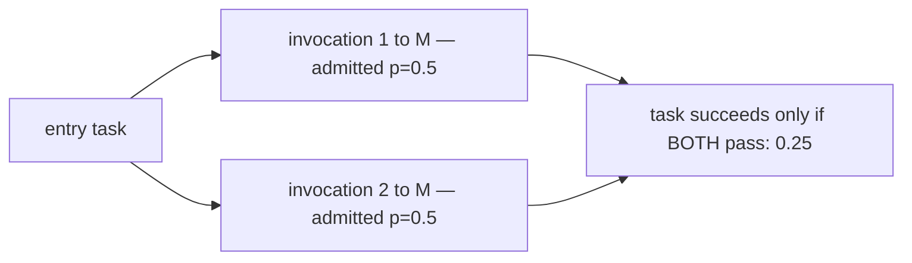
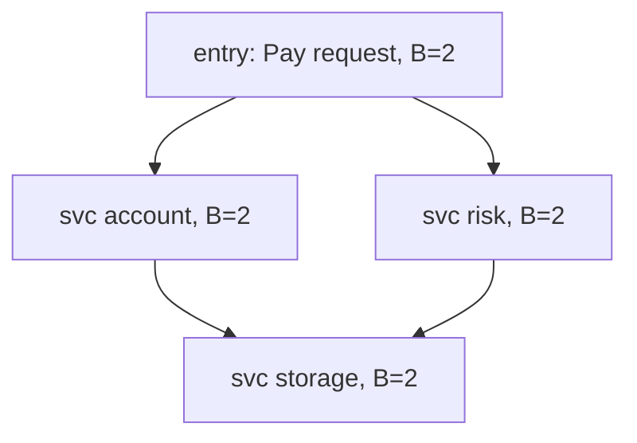
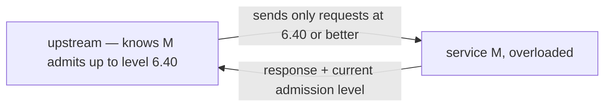

# DAGOR: overload control when every task is a fan-out

DAGOR (Zhou et al., SoCC 2018) is the overload-control system inside
WeChat's microservice platform: more than 3000 services on over 20000
machines (§2.2) absorbing 10^10–10^11 requests per day (§2.2), with a
daily peak around 3× the daily average and Chinese New Year pushing the
peak to roughly 10× the daily average (§2.3). You cannot provision for
that; you must shed — and the paper's contribution is *which* load to
shed, *where* to detect the need, and *who* pays for the rejection,
when a user-visible task fans out and partial success is worth nothing.
This chapter builds the seven ideas first, then maps the ~12-page
paper.

## The problem in one sentence

**In a microservice architecture a task succeeds only if all of its
service invocations succeed, so naive random load shedding at the
overloaded service wastes the work of every partially-completed task —
overload control must shed consistently, by priority, across the whole
call tree.** The paper calls this *subsequent overload* (§3.1,
Definition 1) — the failure mode single-server admission controllers
like CoDel and SEDA were never designed to see.

Terms of art, used with the paper's definitions:

- **Entry task** — one user-visible request (open a chat, send a
  payment). It fans out into many **service invocations** down a call
  tree, and succeeds only if *all* of them succeed.
- **Subsequent overload** (§3.1, Definition 1) — overload in which more
  than one service is overloaded along a task's path, *or* a single
  overloaded service is invoked multiple times by one task. This is
  what makes random shedding collapse.
- **Admission level** — the priority cursor a server is currently
  admitting down to. A compound (business, user) value; a server admits
  a request iff its priority is at least as high as the current level.
- **Business / user priority** — the two halves of a request's
  priority: a coarse per-action rank (login > pay > message) and a fine
  per-user tiebreak.

## The concepts, step by step

### Step 1 — subsequent overload: why random shedding collapses

> **In:** nothing yet — this step is the motivation, the failure mode
> single-server admission controllers cannot see.
> **Out:** the reason shedding must key on a *task-wide priority* rather
> than a per-request coin flip — the constraint every later step obeys.

Suppose service M is at 2× capacity and sheds 50% of requests at
random, and each task must call M twice (§3.1, the paper's own worked
example, Figure 2.b / Form 2):



Success probability is 0.5 × 0.5 = 25% — yet M did 50% of its normal
useful work admitting first calls whose sibling call then died. §3.1
works it in throughput terms: feed rate 2C at service M with capacity
C, random shedding admits half, so each M-invocation succeeds with
p=0.5; a task that calls M twice survives with p=0.25, so of C tasks
issued (2C requests to M) only `0.25C` tasks survive while M burns its
full C of capacity. The served half-tasks are pure waste; with k
invocations, random shedding admits `0.5^k` of tasks while burning full
capacity — for k=3 that is `0.5^3 = 12.5%`, for k=4, `6.25%`. The fix
is *consistency*: admit or kill whole tasks, which forces shedding to
key on a priority that travels with the task, not a per-request coin
flip. (§3.1 also notes the flip side: if the offered load is only
0.5C, service M is *just* saturated and `0.5C` tasks survive — the
seed of Step 7's f_sat/f yardstick.)

### Step 2 — the signal: queuing time, not response time or CPU

> **In:** Step 1's requirement to shed the right load; a controller
> first needs to know it is overloaded.
> **Out:** the local, demand-sensitive overload signal (queuing time)
> and its window (1 s or 2000 requests, 20 ms threshold) that Steps 5–6
> feed on.

DAGOR declares overload from the **average request queuing time** —
arrival to start of processing — over a window of 1 second or 2000
requests, whichever comes first, against a 20 ms threshold (task
timeout: 500 ms) (§4.1). It explicitly rejects the two obvious
alternatives:

```
  response time = queuing + processing, and processing is RECURSIVE:

   upstream A ──► B ──► C(overloaded)
      resp(A) = q(A) + p(A) + resp(B)
      resp(B) = q(B) + p(B) + resp(C)   ◄─ C's overload inflates
      resp(C) = q(C) + p(C)                A and B too → false
                                           positives upstream
  queuing time is LOCAL: q(B) only grows if B itself cannot keep up.
```

CPU utilization fails the other way: high CPU-busy is normal on a
well-utilized server — busy is not overloaded (§4.1). Queuing time
alone is both local and demand-sensitive: topic 34's lesson again, the
queue is where the truth lives. The window bounds — 1 s or 2000
requests — matter: a shorter window would react to bursts, a longer one
would lag; and the 20 ms threshold sits well under the 500 ms task
timeout so the controller acts before deadlines start firing.

### Step 3 — business priority: assigned once, copied everywhere

> **In:** Step 1's demand for a task-wide priority and Step 2's overload
> signal.
> **Out:** the coarse half of that priority (business level) and the
> mechanic — decided at the entry task, copied to every child — that
> makes shedding consistent across a call tree.

Priorities come from a replicated hash table with a few tens of entries
(§4.2.1, Figure 3); smaller value means higher priority. Login is the
highest, and WeChat Pay sits above Instant Messaging because users
complain about failed payments roughly 100× more than about failed
messages. The crucial mechanic: the **business priority** is decided at
the **entry task** and **copied to every subsequent request in the
task's call tree**:



Every server shedding at admission level τ therefore makes the *same*
decision for all pieces of one task — exactly the consistency Step 1
demanded: whole tasks admitted or killed, never fragments. This is why
a per-request coin flip (Step 1) is replaced by a per-*task* label: the
label is set once, at the tree root, and inherited unchanged.

### Step 4 — user priority: 128 sublevels so the cursor can settle

> **In:** the business level from Step 3, which is too coarse to tune
> against.
> **Out:** the fine half of the priority (128 user sublevels) that gives
> the admission cursor enough resolution not to oscillate, plus two
> anti-gaming design choices.

Business levels alone are too coarse: with a few tens of levels the
load gap between neighbors is huge, so admission level τ sheds too
much, τ−1 is overloaded again, and the controller oscillates forever.
DAGOR splits each business level into 128 **user levels** — a hash of
the user ID (§4.2.2, Figure 4) — giving a compound (business, user)
priority with ~10^4 fine-grained levels, enough resolution for the
cursor to settle:

```
  business level:   ... │  B=5  │  B=6  │ ...      tens of levels
  compound level:   ... │5.0 5.1 ... 5.127│6.0 ...  ~10^4 levels
                              ▲
                     cursor can stop mid-B instead of
                     flapping between whole levels
```

Two design notes from §4.2.2. The hash is **rotated hourly**, so no
user is permanently the sacrificial low-priority one. And a
session-oriented priority was considered and **rejected because users
figured it out**: logging out and back in re-rolled the priority, so
people relogged to escape shedding. Hourly user-ID hashing removes the
incentive while keeping the property that all of one user's requests
sort together, so a user tends to see whole tasks succeed or whole
tasks fail rather than half-broken results.

### Step 5 — adaptive admission: histogram plus prefix sums

> **In:** the overload verdict from Step 2 and the fine (B, U) levels
> from Steps 3–4.
> **Out:** the AIMD-style rule that moves the admission cursor each
> window, and the O(1) histogram + prefix-sum trick that turns "admit N
> requests" back into a concrete (B, U) cursor.

The cursor is not adjusted by fixed steps. DAGOR's **Algorithm 1**
(§4.2.3) adapts an *expected admitted count*: when a window is
overloaded (average queuing time over 20 ms), the next window's
expected admissions shrink multiplicatively to (1−α)·N_adm with α = 5%;
when healthy, they grow additively by β·N with β = 1% — this is a
genuine **AIMD** (additive-increase/multiplicative-decrease) rule, the
classic TCP-congestion shape pointed at admission. To turn "admit
roughly N requests" back into a cursor, each server keeps a histogram
of request counts per compound (B, U) level; a prefix-sum walk finds
the lowest-priority level whose cumulative count still fits under the
expected total — that level is the new cursor. This is exactly the
contract of this topic's stub in `experiments/src/admission.rs` —
priority histogram, 5%/1% adaptation, O(1) `admit(priority)` gate —
minus the user sublevels.

### Step 6 — collaborative shedding: reject before you send

> **In:** the per-server admission level maintained by Step 5.
> **Out:** how enforcement migrates one hop upstream so the overloaded
> server never pays for rejections — while detection and adaptation
> stay local.

Local admission control still charges the overloaded server for every
rejection: the request crossed the network and sat in the queue before
being refused. DAGOR makes rejection free for the victim by
**piggybacking** the server's current admission level (B, U) on every
response (§4.2.4, Figure 5's workflow); each upstream stores the
freshest level per downstream and sheds doomed requests *before*
sending them:



The overloaded server spends its cycles only on requests it will
actually serve. Detection and adaptation stay purely local (Steps 2 and
5), but enforcement migrates upstream one hop at a time — no central
coordinator, no config push. This is the "collective, not per-service"
feedback the paper stresses: no single component sees global state, yet
the composition converges because each server advertises its own cursor
and each upstream respects the freshest cursor it has seen.

### Step 7 — the yardstick: optimal success rate is f_sat/f

> **In:** all the machinery of Steps 1–6.
> **Out:** the single curve the evaluation measures everything against
> (f_sat/f), and the two headline results (630 vs 750 QPS; ~50% over
> CoDel/SEDA) that show DAGOR tracking it.

Under subsequent overload, the best any controller can do is serve
whole tasks up to saturation: with offered load f and saturation
throughput f_sat, the optimal task success rate is **f_sat/f** (§5.3,
defined exactly: f_sat is "the maximum feed rate that makes the
downstream service just saturated," f is "the actual feed rate when the
downstream service is overloaded") — the line the evaluation plots
everything against. In the stress tests (§5.1), service M is deployed
over 3 servers and saturates at ~750 QPS. DAGOR_q (the real thing:
queuing-time signal, 20 ms) sheds correctly all the way to saturation,
postponing shedding to ~750 QPS; DAGOR_r (a variant on a 250 ms
response-time threshold) begins shedding at ~630 QPS — Step 2's
recursive false positives, measured (§5.2, Figure 6). On the M²
workload (each task makes 2 calls into the overloaded service) DAGOR
beats CoDel and SEDA by about 50% in task success rate (§5.3, Figure
7.b), and across M¹–M⁴ at a fixed 1500 QPS feed rate (Figure 8) its
advantage grows with subsequent-overload depth while CoDel and SEDA,
tuned for simple overload (M¹, Figure 7.a where all are roughly equal),
fall away. One workload detail (§5.1, footnote 8): upstreams resend
rejected invocations up to 3 times, so shedding also multiplies offered
load — another reason rejection must be cheap (Step 6).

## How to read the paper (with the concepts in hand)

SoCC 2018, ~12 pages (arXiv:1806.04075); budget ~1.5 h. The paper is
seven sections; §5 is the **Evaluation** and §6 is **Related Work** —
there is no standalone implementation section (the wiring is §4.3
Workflow).

- **§1 Introduction** (10 min) — the problem and DAGOR's design
  principles (service-agnostic, decentralized, no central quorum).
- **§2 Background** (10 min) — §2.1 service architecture and entry
  tasks (Figure 1: just enough topology to see why a priority must be
  copied down a call tree, Step 3); §2.2 the scale numbers (3000+
  services, 20000+ machines, 10^10–10^11 requests/day); §2.3 the
  dynamic workload — ~3× daily average at peak, ~10× the daily average
  at Chinese New Year — that makes provisioning hopeless.
- **§3 Overload in WeChat** (15 min) — §3.1 Definition 1 and the
  subsequent-overload arithmetic with Figure 2's three forms (Step 1);
  do the 0.25 computation yourself before reading theirs. §3.2 lists the
  scaling challenges DAGOR's decentralization answers.
- **§4 DAGOR Overload Control** (30 min) — **the core**. §4.1
  queuing-time detection with the 20 ms / 1 s-or-2000-requests window
  (Step 2); §4.2.1 business priority (Figure 3) and §4.2.2 user priority
  with the rejected session priority (Figure 4, Steps 3–4); §4.2.3
  Algorithm 1 with α = 5%, β = 1% (Step 5); §4.2.4 collaborative
  shedding (Step 6); §4.3 the end-to-end workflow (Figure 5).
- **§5 Evaluation** (20 min) — find every number from Step 7 in its
  figure: §5.2 Figure 6 gives 750 vs 630 QPS for DAGOR_q/DAGOR_r; §5.3
  Figures 7–8 give the ~50% win over CoDel/SEDA on M² and the M¹–M⁴
  progression at 1500 QPS; §5.4 Figure 9 is fairness. Ask of each graph:
  how far below f_sat/f is each line, and why?
- **§6 Related Work** (5 min) — where CoDel and SEDA sit relative to
  DAGOR; skim.
- **§7 Conclusion** (5 min) — skim.

## Questions to answer in notes.md

1. Reproduce Definition 1's arithmetic for a task making k = 3 calls
   into a service shedding 50% at random, then state what fraction of
   the overloaded server's admitted work is wasted. How does
   priority-copied shedding change both numbers?
2. Why does queuing time avoid the false positives that response time
   produces, and why is CPU utilization wrong in the *opposite*
   direction? Tie this to topic 34's coordinated-omission lesson about
   measuring queues rather than service times.
3. Walk Algorithm 1 by hand: 10 compound levels, a histogram you
   invent, one overloaded window (α = 5%) then three healthy windows
   (β = 1%). Where does the cursor settle, and why would bare
   business-level granularity oscillate between τ and τ−1?
4. Session-oriented user priority was rejected because users re-rolled
   it by relogging. What property must any sub-priority have to be
   both fair over time and gaming-resistant, and how does the
   hourly-rotated user-ID hash satisfy it?
5. A database analogy: FalkorDB serving Cypher queries that fan out
   into multiple internal module calls under memory pressure — which
   DAGOR pieces transfer directly (signal, priority copying,
   collaborative shedding) and which assume an RPC boundary that a
   single-process database does not have?

## Done when

Answer each before unfolding it.

- [ ] You can state from memory why queuing time beats response time
      and CPU as the overload signal, with the recursive-inflation
      argument.

  <details><summary>Answer</summary>

  Response time is `queuing + processing`, and processing is recursive:
  an overloaded leaf C inflates the response time of every ancestor
  (`resp(A) = q(A) + p(A) + resp(B)`, and so on), so a
  response-time signal fires false positives at servers that are
  themselves healthy (§4.1). CPU utilization fails the other way — a
  well-utilized server runs at high CPU-busy without being overloaded,
  so it is not a distinguishing signal. **Queuing time** (arrival →
  start of processing) is *local* — `q(B)` only grows when B itself
  cannot keep up — and demand-sensitive. DAGOR averages it over a 1 s /
  2000-request window against a 20 ms threshold (task timeout 500 ms).

  </details>

- [ ] You can explain subsequent overload with the 0.5 × 0.5 = 25%
      example and say what "consistent shedding" buys instead.

  <details><summary>Answer</summary>

  A task that calls overloaded service M twice, where M sheds 50% at
  random, succeeds with `0.5 × 0.5 = 25%` (§3.1) — yet M spent its full
  capacity admitting first calls whose siblings then died, so half its
  useful work is waste. With k calls the survival rate is `0.5^k`
  (12.5% at k=3) while M stays saturated. **Consistent shedding** keys
  the decision on a task-wide priority copied down the whole call tree
  (Steps 3–4), so every server admits or kills the *same* tasks:
  whole tasks survive up to saturation instead of `0.5^k` fragments,
  which is what lets DAGOR approach the f_sat/f optimum.

  </details>

- [ ] You can run Algorithm 1 on paper: window verdict → (1−α)·N_adm
      or +β·N → prefix-sum over the (B, U) histogram → new cursor.

  <details><summary>Answer</summary>

  Each window, DAGOR compares average queuing time to 20 ms. If
  overloaded, the expected admitted count shrinks *multiplicatively* to
  `(1−α)·N_adm` with α = 5%; if healthy, it grows *additively* by `β·N`
  with β = 1% (§4.2.3, Algorithm 1) — additive-increase/
  multiplicative-decrease. To convert that count into a cursor, the
  server keeps a histogram of request counts per compound (B, U) level
  and walks a prefix sum from highest priority down, stopping at the
  lowest-priority level whose cumulative count still fits under the
  expected total — that level becomes the new admission level. The 128
  user sublevels (Step 4) give the prefix-sum enough resolution to
  settle instead of oscillating between whole business levels.

  </details>

- [ ] You have implemented the gate in `experiments/src/admission.rs`
      far enough that its tests exercise the 5%/1% adaptation.

  <details><summary>Answer</summary>

  The stub mirrors DAGOR's core minus user sublevels: a priority
  histogram, an O(1) `admit(priority)` gate that compares against the
  current cursor, and the Algorithm-1 adaptation — `(1−0.05)·N_adm` on
  an overloaded window, `+0.01·N` on a healthy one — that moves the
  cursor via a prefix-sum walk. The tests are the specification: they
  drive overloaded and healthy windows and assert the cursor tightens
  and loosens by those factors, and that `admit` is consistent for a
  given priority within a window (the Step-1 consistency property). The
  reference numbers live in `notes.md`.

  </details>

## References

**Papers**
- Zhou et al. — "Overload Control for Scaling WeChat Microservices"
  (SoCC 2018) — [arXiv:1806.04075](https://arxiv.org/abs/1806.04075).
  Definition 1 and the 0.25C arithmetic are §3.1; the queuing-time
  signal is §4.1; business/user priority are §4.2.1–4.2.2 (Figures 3–4);
  Algorithm 1 is §4.2.3; collaborative shedding is §4.2.4; the f_sat/f
  yardstick and the 630/750 QPS and ~50% results are §5.2–5.3
  (Figures 6–8).

**This learning path**
- [Topic 35 README](README.md) — the overload topic this guide belongs
  to, and the bench lanes that price shedding strategies.
- [Topic 34 — debugging and production diagnosis](../34-debugging/README.md)
  — coordinated omission and slow logs; the measurement discipline
  DAGOR's queuing-time signal comes from.
- This topic's `experiments/src/admission.rs` — DAGOR-lite stub:
  queuing-time windows, priority cursor, 5%/1% adaptation of
  Algorithm 1, minus user sublevels.
