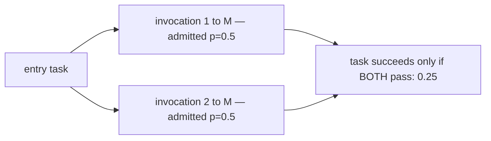
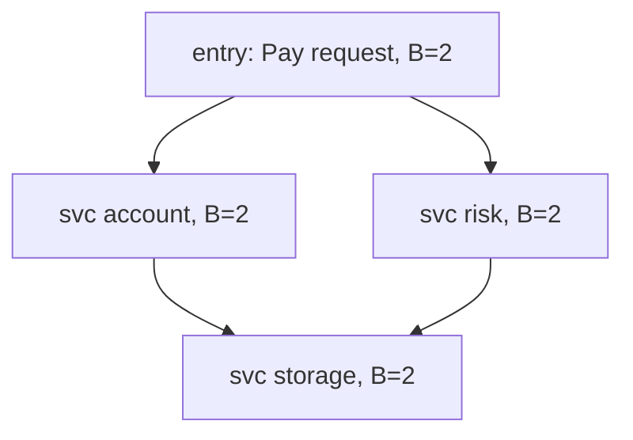
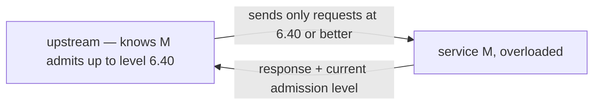

# DAGOR: overload control when every task is a fan-out

DAGOR (Zhou et al., SoCC 2018) is the overload-control system inside
WeChat's microservice platform: 3000+ services on 20000+ machines
absorbing 10^10–10^11 requests per day, with a daily peak around 3×
the average and Chinese New Year pushing the request rate to roughly
10× the daily peak. You cannot provision for that; you must shed —
and the paper's contribution is *which* load to shed, *where* to
detect the need, and *who* pays for the rejection, when a user-visible
task fans out and partial success is worth nothing. This chapter
builds the seven ideas first, then maps the ~12-page paper.

## The problem in one sentence

**In a microservice architecture a task succeeds only if all of its
service invocations succeed, so naive random load shedding at the
overloaded service wastes the work of every partially-completed task —
overload control must shed consistently, by priority, across the whole
call tree.** The paper calls this *subsequent overload* (Definition
1) — the failure mode single-server admission controllers like CoDel
and SEDA were never designed to see.

## The concepts, step by step

### Step 1 — subsequent overload: why random shedding collapses

Suppose service M is at 2× capacity and sheds 50% of requests at
random, and each task must call M twice:



Success probability is 0.5 × 0.5 = 25% — yet M did 50% of its normal
useful work admitting first calls whose sibling call then died. The
served half-tasks are pure waste; with k invocations, random shedding
admits `0.5^k` of tasks while burning full capacity. The fix is
*consistency*: admit or kill whole tasks, which forces shedding to key
on a priority that travels with the task, not a per-request coin flip.

### Step 2 — the signal: queuing time, not response time or CPU

DAGOR declares overload from the **average request queuing time** —
arrival to start of processing — over a window of 1 second or 2000
requests, whichever comes first, against a 20 ms threshold (task
timeout: 500 ms). It explicitly rejects the two obvious alternatives:

```
  response time = queuing + processing, and processing is RECURSIVE:

   upstream A ──► B ──► C(overloaded)
      resp(A) = q(A) + p(A) + resp(B)
      resp(B) = q(B) + p(B) + resp(C)   ◄─ C's overload inflates
      resp(C) = q(C) + p(C)                A and B too → false
                                           positives upstream
  queuing time is LOCAL: q(B) only grows if B itself cannot keep up.
```

CPU utilization fails the other way: high CPU-busy is normal on a
well-utilized server — busy is not overloaded. Queuing time alone is
both local and demand-sensitive: topic 34's lesson again, the queue is
where the truth lives.

### Step 3 — business priority: assigned once, copied everywhere

Priorities come from a replicated hash table with a few tens of
entries; smaller value means higher priority. Login is the highest,
and WeChat Pay sits above Instant Messaging because users complain
about failed payments roughly 100× more than about failed messages.
The crucial mechanic: the priority is decided at the **entry task**
and **copied to every subsequent request in the task's call tree**:



Every server shedding at admission level τ therefore makes the *same*
decision for all pieces of one task — exactly the consistency Step 1
demanded: whole tasks admitted or killed, never fragments.

### Step 4 — user priority: 128 sublevels so the cursor can settle

Business levels alone are too coarse: with a few tens of levels the
load gap between neighbors is huge, so admission level τ sheds too
much, τ−1 is overloaded again, and the controller oscillates forever.
DAGOR splits each business level into 128 **user levels** — a hash of
the user ID — giving a compound (business, user) priority with ~10^4
fine-grained levels, enough resolution for the cursor to settle:

```
  business level:   ... │  B=5  │  B=6  │ ...      tens of levels
  compound level:   ... │5.0 5.1 ... 5.127│6.0 ...  ~10^4 levels
                              ▲
                     cursor can stop mid-B instead of
                     flapping between whole levels
```

Two design notes. The hash is **rotated hourly**, so no user is
permanently the sacrificial low-priority one. And a session-oriented
priority was considered and **rejected because users figured it out**:
logging out and back in re-rolled the priority, so people relogged to
escape shedding. Hourly user-ID hashing removes the incentive.

### Step 5 — adaptive admission: histogram plus prefix sums

The cursor is not adjusted by fixed steps. DAGOR's Algorithm 1 adapts
an *expected admitted count*: when a window is overloaded (average
queuing time over 20 ms), the next window's expected admissions shrink
multiplicatively to (1−α)·N_adm with α = 5%; when healthy, they grow
additively by β·N with β = 1% — AIMD's cousin, pointed at admission.
To turn "admit roughly N requests" back into a cursor, each server
keeps a histogram of request counts per compound (B, U) level; a
prefix-sum walk finds the lowest-priority level whose cumulative count
still fits under the expected total — that level is the new cursor.
This is exactly the contract of this topic's stub in
`experiments/src/admission.rs` — priority histogram, 5%/1% adaptation,
O(1) `admit(priority)` gate — minus the user sublevels.

### Step 6 — collaborative shedding: reject before you send

Local admission control still charges the overloaded server for every
rejection: the request crossed the network and sat in the queue before
being refused. DAGOR makes rejection free for the victim by
**piggybacking** the server's current admission level (B, U) on every
response; each upstream stores the freshest level per downstream and
sheds doomed requests *before* sending them:



The overloaded server spends its cycles only on requests it will
actually serve. Detection and adaptation stay purely local (Steps 2
and 5), but enforcement migrates upstream one hop at a time — no
central coordinator, no config push.

### Step 7 — the yardstick: optimal success rate is f_sat/f

Under subsequent overload, the best any controller can do is serve
whole tasks up to saturation: with offered load f and saturation
throughput f_sat, the optimal task success rate is **f_sat/f** — the
line the evaluation plots everything against. In the stress tests,
service M saturates at ~750 QPS on 3 servers. DAGOR_q (the real thing:
queuing-time signal, 20 ms) sheds correctly all the way to saturation,
sustaining ~750 QPS; DAGOR_r (a variant on a 250 ms response-time
threshold) begins shedding at ~630 QPS — Step 2's recursive false
positives, measured. On the M² workload (each task makes 2 calls into
the overloaded service) DAGOR beats CoDel and SEDA by about 50% in
task success rate, and across M¹–M⁴ (tasks with 1–4 subsequent calls)
its success rate stays uniform while CoDel favors the simple-overload
case. One workload detail: upstreams resend rejected invocations up to
3 times, so shedding also multiplies offered load — another reason
rejection must be cheap (Step 6).

## How to read the paper (with the concepts in hand)

SoCC 2018, ~12 pages (arXiv:1806.04075); budget ~1.5h.

- **§1, intro** (10 min) — the scale numbers (3000+ services, 20000+
  machines, 10^10–10^11 requests/day) and the burstiness (~3× daily
  peak, ~10× at Chinese New Year) that makes provisioning hopeless.
- **§2, WeChat background** (10 min) — the service DAG and entry
  tasks: just enough topology to see why a priority must be copied
  down a call tree (Step 3).
- **§3, overload in microservices** (15 min) — Definition 1 and the
  subsequent-overload arithmetic (Step 1). Do the 0.25 computation
  yourself before reading theirs.
- **§4, DAGOR design** (30 min) — **the core**. Queuing-time detection
  with the 20 ms / 1 s-or-2000-requests window (Step 2); business and
  user priorities, including the rejected session priority (Steps
  3–4); Algorithm 1 with α = 5%, β = 1% (Step 5); collaborative
  shedding (Step 6).
- **§5, implementation** (5 min) — where the hooks live in the RPC
  framework; note how little each service must change.
- **§6, evaluation** (20 min) — find every number from Step 7 in its
  figure: 750 vs 630 QPS for DAGOR_q/DAGOR_r, the ~50% win over
  CoDel/SEDA on M², the M¹–M⁴ fairness plot. Ask of each graph: how
  far below f_sat/f is each line, and why?

## Questions to answer in notes.md

1. Reproduce Definition 1's arithmetic for a task making k = 3 calls
   into a service shedding 50% at random, then state what fraction of
   the overloaded server's admitted work is wasted. How does
   priority-copied shedding change both numbers?
2. Why does queuing time avoid the false positives that response time
   produces, and why is CPU utilization wrong in the *opposite*
   direction? Tie this to topic 34's coordinated-omission lesson about
   measuring queues rather than service times.
3. Walk Algorithm 1 by hand: 10 compound levels, a histogram you
   invent, one overloaded window (α = 5%) then three healthy windows
   (β = 1%). Where does the cursor settle, and why would bare
   business-level granularity oscillate between τ and τ−1?
4. Session-oriented user priority was rejected because users re-rolled
   it by relogging. What property must any sub-priority have to be
   both fair over time and gaming-resistant, and how does the
   hourly-rotated user-ID hash satisfy it?
5. A database analogy: FalkorDB serving Cypher queries that fan out
   into multiple internal module calls under memory pressure — which
   DAGOR pieces transfer directly (signal, priority copying,
   collaborative shedding) and which assume an RPC boundary that a
   single-process database does not have?

## Done when

- [ ] You can state from memory why queuing time beats response time
      and CPU as the overload signal, with the recursive-inflation
      argument.
- [ ] You can explain subsequent overload with the 0.5 × 0.5 = 25%
      example and say what "consistent shedding" buys instead.
- [ ] You can run Algorithm 1 on paper: window verdict → (1−α)·N_adm
      or +β·N → prefix-sum over the (B, U) histogram → new cursor.
- [ ] You have implemented the gate in `experiments/src/admission.rs`
      far enough that its tests exercise the 5%/1% adaptation.

## References

**Papers**
- Zhou et al. — "Overload Control for Scaling WeChat Microservices"
  (SoCC 2018) — [arXiv:1806.04075](https://arxiv.org/abs/1806.04075)

**This learning path**
- [Topic 35 README](README.md) — the overload topic this guide belongs
  to, and the bench lanes that price shedding strategies
- [Topic 34 — debugging and production diagnosis](../34-debugging/README.md)
  — coordinated omission and slow logs; the measurement discipline
  DAGOR's queuing-time signal comes from
- This topic's `experiments/src/admission.rs` — DAGOR-lite stub:
  queuing-time windows, priority cursor, 5%/1% adaptation of
  Algorithm 1, minus user sublevels
