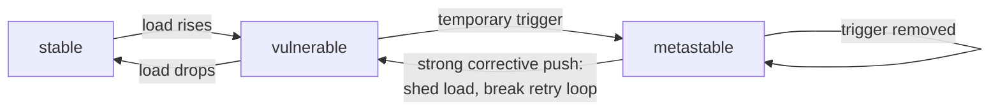
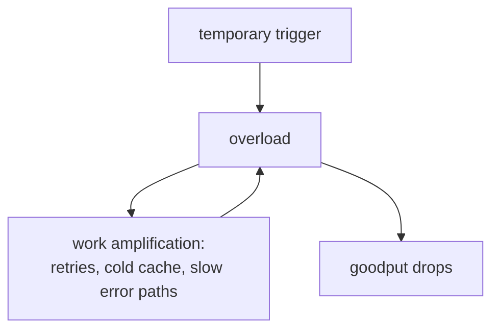

# Metastable failures: the outage that outlives its trigger

Bronson, Aghayev, Charapko, and Zhu (HotOS 2021) name a failure class
you have seen in an incident channel: something bad happens for ten
seconds, the bad thing goes away, and the system stays down anyway —
until a human sheds load or restarts everything. The paper's claim is
that these *metastable failures* account for many of the largest
outages at major web companies, and that they are systematically
misdiagnosed because everyone hunts the trigger while the real culprit
is a feedback loop. Read this 7-page position paper as the theory
chapter for this topic's simulator: every number in its Figure 2 is
reproduced exactly in `experiments/` (lane 1).

## The problem in one sentence

**A metastable failure is a bad state that a temporary trigger pushes
the system into and that a work-amplifying feedback loop sustains
after the trigger is gone — so the root cause is the loop, not the
trigger.** Postmortems that end at "a network blip caused the outage"
fix nothing: the same system falls into the same trap on the next
blip. The paper contributes a vocabulary (stable / vulnerable /
metastable), a minimal worked example, and a catalog of sustaining
loops and mitigations.

## The concepts, step by step

### Step 1 — three states, one arrow that does not reverse itself

A system moves between three states. The trigger arrow is temporary;
the trap is that removing the trigger does not walk you back:



The self-loop on *metastable* is the whole paper. Recovery never
happens passively; it requires a deliberate push — shed load below the
hidden capacity, or break the retry loop directly.

### Step 2 — vulnerable is not a defect

The vulnerable state is where efficient systems live on purpose:
higher utilization means fewer machines, so staying out of the
vulnerable region wastes most of your capacity most of the time.
Organizational incentives push the same direction: the paper's example
is a better cache eviction algorithm that raises the hit rate, which
lets you serve more load from the same database — and thereby raises
the hidden work amplification if the cache is ever lost. A false
economy, invisible until the trigger arrives. So do not read
"vulnerable" as "buggy"; read it as "operating with a hidden debt that
a trigger can call in."

### Step 3 — Figure 2, the minimal metastable system

The paper's worked example needs only two components: a database that
handles at most 300 QPS (requests complete in under 100 ms below
that), and a web app that sends 1 query per request with 1 retry
after a 1 s timeout.

```
 offered load: 280 QPS (vulnerable: inside 150-300)
                                          capacity
 t=0s ── 10s outage ──┐                    300 QPS ┄┄┄┄┄┄┄┄┄┄┄┄
                      │  queued requests all
                      │  hit the 1s timeout          sustained
                      ▼                              arrivals
        every request retried  ─────────►  280 + 280 = 560 QPS
                      ▲                              │
                      │   still over capacity, so    │
                      └── new requests time out too ◄┘
                                goodput: 0, forever
```

At 280 QPS offered, a 10 s outage queues enough requests that every
one of them times out and is retried: the server now faces a sustained
560 QPS against a 300 QPS capacity, and goodput drops to 0
*permanently*. The stable region is load below 150 QPS; between 150
and 300 QPS the system is vulnerable. Recovery requires dropping
offered load below 150 QPS or the retry rate below 20 QPS. Note the
gap: *advertised* capacity is 300 QPS, but the *hidden* capacity —
what survives the retry amplification — is 150.

### Step 4 — work amplification is the fuel

Every sustaining loop runs on work amplification: the failure mode
makes each unit of user demand cost more than in the healthy state.
Retries are the simplest amplifier (2× in Fig 2); the paper mentions a
100× anecdote in the wild. The look-aside cache is the scarier common
case: a 90% hit rate lets a 3,000 QPS application run on a 300 QPS
database, so losing the cache is a 10× work amplification — and the
cold cache cannot refill, because refilling requires database reads
and the database is saturated. Hidden capacity 300 QPS, advertised
capacity 3,000 QPS. A third amplifier hides in error handling itself:
if the error path costs more than the success path (e.g., logging that
takes locks), the system does its most expensive work exactly when
capacity is gone.



### Step 5 — the loop spans systems that are individually fine

The paper's flagship case study is Facebook's link-imbalance outage:
an MRU connection pool interacted with hash-assigned aggregated
network links to form a sustaining loop — congestion on one link
slowed its connections, and the MRU policy then concentrated traffic
onto exactly those connections, keeping the link congested. It went
undiagnosed for over 2 years; the eventual fix was a one-line change
to the connection-pool policy. The lesson: no single component was
broken — the feedback loop only exists in the composition, which is
why the paper calls metastable failures "emergent behavior rather than
a logic bug — one cannot write a unit or integration test to trigger
them."

### Step 6 — breaking the loop: change policy under overload

The mitigations share one shape: detect persistent overload, then
*switch policies* rather than trying harder at the normal one — LIFO
queues, retry budgets, circuit breakers, smaller queues, disabling
failover. Detection matters because bursts are normal: the paper
endorses a CoDel-style signal — the *minimum* queueing latency over a
sliding window; a burst leaves the minimum low, persistent overload
raises it. Other levers: give retries lower priority; make error paths
fast (a bounded lock-free queue feeding a logging thread, sampled
stack traces); and define a "characteristic metric" per known feedback
loop — retry rate, cache hit rate — since goodput alone tells you that
you are dying, not which loop is killing you.

### Step 7 — trigger intensity, distance from the cliff

How big a trigger you survive depends on how deep in the vulnerable
region you sit. A system at 151 QPS recovers from a much bigger spike
than one at 299 QPS — both are "vulnerable," but the margin between
offered load and hidden capacity is the real safety budget:

```
 QPS
  0 ──────────── 150 ─────────────────── 300
  │   stable      │      vulnerable       │  over capacity
  │               │  151: big margin,     │
  │               │  survives big spikes  │
  │               │           299: any    │
  │               │           nudge tips  │
  └───────────────┴───── it over ─────────┘
                hidden            advertised
                capacity          capacity
```

This is also why testing is hard: stress tests at small scale are weak
at finding metastable failures, because the loop's gain depends on
scale and traffic shape — Facebook's Kraken does live-traffic testing
instead. And reproducing one requires a load generator free of
coordinated omission — the paper cites Gil Tene here, exactly topic
34's lane 1: a generator that backs off when the server slows down
silently erases the sustained arrivals that make Fig 2 lock up.

## How to read the paper (with the concepts in hand)

7 pages, HotOS position-paper style; budget ~1h.

- **§1** (10 min) — the definition and the trigger-vs-root-cause
  claim (Step 1). Read carefully; every later section leans on the
  "root cause = sustaining loop" framing.
- **§2** (15 min) — the state machine and **Figure 2**. This is the
  figure to stare at: reproduce the 280→560 QPS arithmetic (Step 3) on
  paper, then verify it against this topic's simulator output.
- **§3** (10 min) — the vulnerability discussion (Steps 2 and 7):
  why systems run vulnerable deliberately, and why trigger intensity
  interacts with distance from the cliff.
- **§4** (10 min) — the catalog of sustaining loops (Step 4): retries,
  look-aside cache, slow error handling. Skim the list but slow down
  on the cache arithmetic — it is the 10× version of Fig 2's 2×.
- **§5** (10 min) — the Facebook link-imbalance case study (Step 5).
  Read fully; it is the only production narrative in the paper.
- **§6** (10 min) — approaches to handling (Step 6): policy switches,
  CoDel-style detection, retry priority, fast error paths, Kraken,
  characteristic metrics, the organizational-incentives point.
- **§7** (5 min) — skim the research agenda; note which items your
  simulator already touches.

## Questions to answer in notes.md

1. In Fig 2's system, why is recovery possible at load below 150 QPS
   or retry rate below 20 QPS, but not at 200 QPS offered? Derive both
   thresholds from the 300 QPS capacity and the 1-retry policy.
2. The look-aside cache gives 10× amplification vs the retry loop's
   2×. Which property of a system determines its hidden capacity, and
   how would you measure hidden capacity in production *without*
   triggering the failure?
3. The link-imbalance loop spanned a connection pool and network link
   hashing, neither broken alone. What "characteristic metric" would
   have caught it earlier, and where in FalkorDB's stack could an
   analogous cross-component loop hide (e.g., client retries ×
   fork-based persistence)?
4. Why does a CoDel-style minimum-queueing-latency signal over a
   sliding window distinguish persistent overload from a burst, where
   average or p99 queueing latency does not?
5. Explain, using topic 34's coordinated-omission argument, why a
   closed-loop load generator cannot reproduce Fig 2 — what does it do
   during the 10 s outage that an open-loop generator does not?

## Done when

- [ ] You can draw the stable → vulnerable → metastable state machine
      from memory and state why the bad state persists after the
      trigger is removed.
- [ ] You can reproduce Fig 2's arithmetic (280 offered → 560
      sustained vs 300 capacity; recovery below 150 QPS load or 20 QPS
      retries) and match lane 1 of `experiments/`: 280 QPS never
      recovers (offered locks at 560 QPS, goodput 0 at t=199 s though
      the outage ended at t=40 s), 140 QPS heals at t=161 s.
- [ ] You can name three sustaining loops (retries, cold look-aside
      cache, slow error paths) with their amplification factors and
      one policy switch that breaks each.
- [ ] You can explain hidden vs advertised capacity and why a better
      cache eviction algorithm can *widen* that gap.

## References

**Papers**
- Bronson, Aghayev, Charapko, Zhu — "Metastable Failures in
  Distributed Systems" (HotOS 2021) —
  [PDF](https://sigops.org/s/conferences/hotos/2021/papers/hotos21-s11-bronson.pdf)

**Cross-links**
- [Topic 34 — debugging & production diagnosis](../34-debugging/README.md)
  — Gil Tene's coordinated omission; the paper cites Tene for why
  reproducing a metastable failure needs an open-loop load generator.
- This topic's [README](README.md) and [`experiments/`](experiments/)
  — the deterministic simulator whose lane 1 reproduces Fig 2 exactly.
