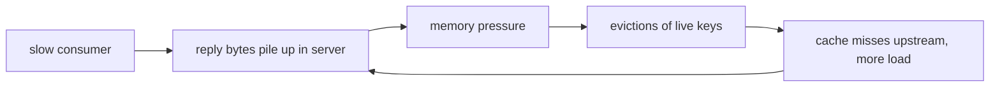

# Redis: overload control at the edges, because one thread can't shed by priority

Redis is the minimalist pole of topic 35's code reads: a
single-threaded server has no scheduler to reorder work — every
accepted command runs to completion on the one thread — so DAGOR-style
priority admission is structurally unavailable. Instead, redis's
overload control lives at the *edges* of the event loop, converting
each unbounded queue (memory, reply buffers, time behind a script)
into a bounded, fast error. The repo is cloned at `~/repos/redis`
(pinned at `redis@a176d1225`); this is a code-read, ~1.5 h, across
`evict.c`, `server.c`, and `networking.c` (all anchors under `src/`).

## The problem in one sentence

**Keep a single-threaded server out of the metastable basin by making
every overload answer — `-OOM`, `-BUSY`, disconnect — cheaper than the
work it replaces, and issued before that work begins.** Lane 1 in the
README showed how queueing plus retries sustains zero goodput after
the trigger ends; redis's stance is that no queue ever grows without a
bound and a cheap error on the far side of it.

Terms of art used below:

- **`CMD_DENYOOM`** — a per-command flag marking commands that may grow
  memory (writes, mostly). Only these are rejected when over budget; a
  read still runs.
- **Approximated LRU** — redis does not keep a true global
  least-recently-used list; it *samples* keys and keeps a small sorted
  pool of eviction candidates (Step 3).
- **Hard vs soft output-buffer limit** — a hard limit disconnects a
  client the instant its pending replies exceed N bytes; a soft limit
  disconnects only if replies stay above M bytes for T seconds (Step 5).

## The concepts, step by step

### Step 1 — one thread means the edges are all you have

> **In:** nothing yet — this step frames the architectural constraint
> that shapes every later step.
> **Out:** the two moments (left edge, right edge) where a
> single-threaded server can act, and why priority shedding is off the
> table.

DAGOR sheds by priority: under pressure, drop low-priority work, keep
high. That requires a queue the scheduler can reorder. Redis's event
loop has none — once `processCommand` dispatches, the command owns the
thread — so the only moments redis can act are *before* accepting work
and *after* producing replies:

```
            ┌───────────── the one thread ─────────────┐
 client ───▶│ gate?  ──▶  execute (uninterruptible) ──▶│──▶ reply buffer ──▶ client
            │  ▲                                       │        ▲
            │  reject here (-OOM, -BUSY, pause)        │        or cut here
            │  = the ONLY shed points                  │        (buffer limits)
            └───────────────────────────────────────────┘
```

Everything below is a gate on the left edge or a limit on the right
edge. Why it matters: cockroach's admission package (the other code
read) is the opposite pole — a real scheduler; overload control is
shaped by the scheduling freedom the architecture leaves you.

### Step 2 — the memory budget: getMaxmemoryState

> **In:** the left-edge gate from Step 1 needs a cheap "am I over
> budget?" test.
> **Out:** `getMaxmemoryState`'s budget math and its fast path — the
> precondition for the reject-before-work gate in Step 4.

`maxmemory` turns RAM into an explicit budget. `getMaxmemoryState`
(`evict.c:384`) computes usage, bytes over budget (`mem_tofree`), and
a `level` ratio that may exceed 1.0; it returns `C_ERR` when over the
limit and eviction can't help. Note the fast path: with no `maxmemory`
set it returns `C_OK` almost immediately — the *check* must stay cheap
because Step 4 runs it before every command. `overMaxmemoryAfterAlloc`
(`evict.c:425`) asks the same question prospectively. Why it matters:
a budget you can compute cheaply and often is the precondition for
reject-before-work; one you discover only by malloc failing is a crash,
not a policy.

### Step 3 — approximated LRU: a 16-entry pool fed by 5-key samples

> **In:** Step 2's verdict that redis is over budget and must free
> memory.
> **Out:** how redis chooses victims cheaply (sample 5, keep a sorted
> 16-slot pool) so the defense itself never becomes steady-state load.

Redis keeps no global LRU list — linking every key into one would tax
*every* command to fund the rare eviction. Instead
`evictionPoolPopulate` (`evict.c:134`) grabs `maxmemory-samples`
random keys (default 5, `config.c:3223`) and inserts better candidates
into a shared pool of `EVPOOL_SIZE` 16 entries (`evict.c:36`), kept
sorted so the best victim sits at the right end:

```
   keyspace (millions)          eviction pool (16 slots, sorted by idle)
   ┌─────────────────┐          ┌────┬────┬────┬─── ─┬────┐
   │  ● ● ● ● ● ● ●  │─sample──▶│ 3s │ 9s │41s │ ... │2h  │──▶ evict
   │  ● ● ● ● ● ● ●  │  5 keys  └────┴────┴────┴─── ─┴────┘   rightmost
   └─────────────────┘          (pool persists: candidates accumulate)
```

Statistically this converges on nearly the same victims as true LRU,
at O(samples) cost paid only when actually over budget. Why it
matters: the governance mechanism must not itself become load — a
defense with heavy steady-state cost is work amplification.

### Step 4 — the OOM gate: reject-before-work with `-OOM`

> **In:** the budget check (Step 2) and the eviction loop (Step 3).
> **Out:** the exact reject-before-work sequence in `processCommand`,
> and why the error path is strictly cheaper than the work it replaces
> — the anti-metastability property.

Before each command, `processCommand` runs the eviction loop:
`performEvictions` (`evict.c:532`) frees keys until under budget —
returning `EVICT_OK`, `EVICT_RUNNING`, or `EVICT_FAIL` — then the gate:

```c
// src/server.c:4484–4499 — the OOM gate in processCommand (4487–4494 comments elided)
4484    if (server.maxmemory && !isInsideYieldingLongCommand()) {
4485        int out_of_memory = (performEvictions() == EVICT_FAIL);
4495        if (server.current_client == NULL) return C_ERR;
4497        if (out_of_memory && is_denyoom_command) {
4498            rejectCommand(c, shared.oomerr);
4499            return C_OK;
```

`is_denyoom_command` (`server.c:4391`) is any command flagged
`CMD_DENYOOM` — writes, mostly; reads still pass, because they don't
grow the queue. The guard on line 4484 is important: eviction is
skipped when a yielding long command is running (Step 6), so its
replication stream is not interleaved with eviction DELs. `-OOM` is a
shared preallocated string (`shared.oomerr`): zero allocation, zero
keyspace work, the cheapest possible shed. Why it matters: the error
path costs strictly less than the work path, so the more overloaded
redis gets, the less each request costs it — a stabilizing loop, not a
sustaining one: anti-metastability.

### Step 5 — output-buffer limits: backpressure on slow readers

> **In:** the memory budget from Steps 2–4, which writers grow.
> **Out:** the right-edge limit that bounds memory grown by *slow
> readers* — and why, as producer, redis's only bounded outcome is to
> evict the consumer.

Memory pressure doesn't only come from writers. A client that issues
big reads but never drains its socket forces redis to hold the replies
— memory grows with no bound the *client* controls:



`checkClientOutputBufferLimits` (`networking.c:5151`) enforces a
**hard** limit (`used_mem >= hard_limit_bytes`: gone now, line 5175)
and a **soft** limit (over `soft_limit_bytes` continuously for
`soft_limit_seconds`: gone, lines 5178–5197), per client class. The
defaults are literal in the source, and normal clients are *unlimited*
by default — only replicas and pubsub subscribers are capped:

```c
// src/config.c:171–175 — clientBufferLimitsDefaults {hard, soft, soft_seconds}
171 clientBufferLimitsConfig clientBufferLimitsDefaults[CLIENT_TYPE_OBUF_COUNT] = {
172     {0, 0, 0}, /* normal  — no limit */
173     {1024*1024*256, 1024*1024*64, 60}, /* slave  — 256MB hard, 64MB soft/60s */
174     {1024*1024*32, 1024*1024*8, 60}  /* pubsub — 32MB hard, 8MB soft/60s */
175 };
```

Even unauthenticated clients are capped at 1 KB
(`networking.c:5157`: `used_mem > 1024 && authRequired(c)`).
`closeClientOnOutputBufferLimitReached` (`networking.c:5215`)
disconnects *asynchronously* (`freeClientAsync`): it is called deep
inside reply-writing code, where freeing the client under your own
feet would be unsafe. Why it matters: redis is the *producer* here, so
backpressure can't slow anything — the only bounded outcome is to
evict the consumer.

### Step 6 — `-BUSY`: bounding the time axis

> **In:** the memory and reply queues bounded in Steps 4–5.
> **Out:** the third queue — time behind a long command — and how
> `-BUSY` keeps redis answerable instead of banking a storm.

Memory and reply bytes are two queues; *time behind a long command* is
the third. While a Lua script or module command runs past
`server.busy_reply_threshold` (checked in `script.c:150`; default
5000 ms, set at `config.c:3264` under the name `busy-reply-threshold`,
alias `lua-time-limit`), redis re-enters the event loop just enough to
answer new commands with `-BUSY` — the shared errors at
`server.c:2130` — instead of banking a storm it must later drain.
`isInsideYieldingLongCommand` (`server.c:825`) marks this mode; Step
4's gate consults it to skip eviction while yielded (eviction DELs must
not interleave with the script's replication stream). Why it matters:
without `-BUSY`, a 30 s script under 280 QPS banks 30 × 280 = 8,400
commands — lane 1's backlog on the time axis, exactly the queued mass
that sustains a metastable stall once the script returns.

### Step 7 — CLIENT PAUSE: intake suspension as choreography

> **In:** the per-axis bounds of Steps 4–6, which shed individual
> requests.
> **Out:** the blunt whole-intake suspension used for the brief windows
> (shutdown, failover) where accepting a write would lose it.

The bluntest instrument: stop accepting (some) work entirely.
`pauseActions(PAUSE_DURING_SHUTDOWN, ...)` (`server.c:4850`) reuses
the CLIENT PAUSE machinery during shutdown — writes are suspended so
replicas can catch up before the primary exits; failover does the same
dance. `unpauseActions(PAUSE_BY_CLIENT_COMMAND)` (`networking.c:4482`)
lifts a client-commanded pause; pauses stack by *purpose*, each with a
deadline and an action set (writes only, or all). Why it matters: this
is shedding at fraction 1.0 — useless as steady-state policy, exactly
right for the few hundred milliseconds where accepting a write would
lose it: pause the herd, don't let it stampede the survivor.

### Step 8 — the pattern: every queue bounded, every error cheap

> **In:** all four shed points from Steps 4–7.
> **Out:** the single invariant that unifies them, and where redis sits
> on the scheduling-freedom axis against DAGOR and cockroach.

```
   axis        queue                bound              cheap error
   ─────────   ──────────────────   ────────────────   ─────────────────
   memory      keyspace bytes       maxmemory          -OOM  (Step 4)
   replies     output buffer        soft+hard limits   disconnect (Step 5)
   time        cmds behind script   busy threshold     -BUSY (Step 6)
   (intake)    everything           pause deadline     silence (Step 7)
```

Redis rejects *everything equally* — no priorities, because one thread
has no scheduling freedom to honor them (Step 1). DAGOR sits mid-pole
(a priority cursor over a queue it controls); cockroach's admission
package is the far pole (a full scheduler: tenant fairness, additive
CPU-slot control, LSM-debt tokens). Same invariant everywhere: the
response to overload must cost less than the work declined.

## Where each step lives in the code

| Step | Anchor | What to see |
|---|---|---|
| 2 | `evict.c:384` | `getMaxmemoryState` — budget math; early `C_OK` when no maxmemory |
| 2 | `evict.c:425` | `overMaxmemoryAfterAlloc` — the prospective form |
| 3 | `evict.c:36`, `evict.c:134` | `EVPOOL_SIZE 16` + its comment; `evictionPoolPopulate` — sample, insert sorted |
| 3 | `config.c:3223` | `maxmemory-samples` default 5 |
| 4 | `evict.c:532` | `performEvictions` — the three-value return contract in the comment |
| 4 | `server.c:4391` | `is_denyoom_command` — CMD_DENYOOM plus the MULTI/EXEC case |
| 4 | `server.c:4484`–`4499` | the gate: `EVICT_FAIL` → `rejectCommand(c, shared.oomerr)` |
| 5 | `networking.c:5151` | `checkClientOutputBufferLimits` — soft (limit + time) vs hard; 1KB unauthenticated cap |
| 5 | `config.c:171` | `clientBufferLimitsDefaults` — normal `{0,0,0}`, replica 256/64MB/60s, pubsub 32/8MB/60s |
| 5 | `networking.c:5215` | `closeClientOnOutputBufferLimitReached` — why async |
| 6 | `server.c:2130` | the `-BUSY` shared error strings |
| 6 | `script.c:150`, `config.c:3264` | the threshold check in a running script; `busy-reply-threshold` default 5000 ms |
| 6 | `server.c:825` | `isInsideYieldingLongCommand` |
| 7 | `server.c:4850` | `pauseActions(PAUSE_DURING_SHUTDOWN, ...)` in the shutdown path |
| 7 | `networking.c:4482` | `unpauseActions(PAUSE_BY_CLIENT_COMMAND)` |

Read order: `getMaxmemoryState` → `evictionPoolPopulate` →
`performEvictions` → the gate → output-buffer pair → `-BUSY` → pause.

## Questions to answer in notes.md

1. Step 4's gate lets non-`CMD_DENYOOM` commands (reads, DEL) through
   while over budget. Which of Step 5's limits eventually bounds a
   read with a huge reply, and could a read-only workload alone push
   redis over `maxmemory`?
2. Why is a persistent 16-slot pool fed by 5-key samples a better
   victim estimator than sampling 16 fresh keys each pass — and what
   workload shift makes stale pool entries wrong?
3. `-BUSY` still admits `SCRIPT KILL` and `SHUTDOWN NOSAVE` — in
   DAGOR's vocabulary, exactly two priorities. What makes these two
   safe to run mid-script when nothing else is?
4. In lane 1's simulator, model the OOM gate: rejects cost ~0 and
   return in ~0 time, so clients retry immediately. Does that alone
   break the metastable loop at 280 QPS, or does it need the
   client-side retry budget too? Compute it.
5. FalkorDB inherits every gate here — but a `CMD_DENYOOM` graph query
   allocates mid-execution, *after* the gate passed. Which anchor is
   the right template for a mid-query memory check, and what does
   redis's design say it should return?

## Done when

Answer each before unfolding it.

- [ ] You can narrate the pre-command sequence at `server.c:4485` —
      evict, gate, reject — and say why eviction runs *before* the
      check rather than lazily on allocation failure.

  <details><summary>Answer</summary>

  In `processCommand`, guarded by `if (server.maxmemory &&
  !isInsideYieldingLongCommand())` (`server.c:4484`), redis first runs
  `performEvictions()` and records `out_of_memory = (… == EVICT_FAIL)`
  (`:4485`). Only if eviction failed *and* the command is
  `is_denyoom_command` does it `rejectCommand(c, shared.oomerr)` and
  `return C_OK` (`:4497–4499`). Eviction runs *first*, and *before* the
  command executes, because reject-before-work is the whole point: a
  budget discovered by malloc failing mid-command is a crash, not a
  policy, and `shared.oomerr` is a preallocated string so the shed costs
  no allocation and no keyspace work — strictly less than the write it
  declines.

  </details>

- [ ] You can explain approximated LRU (5 samples, 16-slot sorted
      pool, evict rightmost) and its cost when under budget (zero).

  <details><summary>Answer</summary>

  A true global LRU list would tax *every* command to maintain, funding
  a rare eviction from the common path. Instead `evictionPoolPopulate`
  (`evict.c:134`) samples `maxmemory-samples` random keys (default 5,
  `config.c:3223`) and merges the better candidates into a persistent
  sorted pool of `EVPOOL_SIZE` = 16 entries (`evict.c:36`), best victim
  at the right end. Over many passes this converges on nearly the same
  victims as exact LRU at O(samples) cost — and that cost is paid only
  when actually over budget, so the steady-state overhead is zero. The
  governance mechanism must not itself become load; a defense with heavy
  steady-state cost would be its own work amplification.

  </details>

- [ ] You can name the three queues (memory, replies, time), the bound
      on each, and the cheap error on the far side of each bound.

  <details><summary>Answer</summary>

  **Memory** — keyspace bytes, bounded by `maxmemory`, cheap error
  `-OOM` (`shared.oomerr`, Step 4). **Replies** — per-client output
  buffer, bounded by hard/soft `client-output-buffer-limit`
  (`networking.c:5151`; defaults `{0,0,0}` normal, 256/64 MB·60 s
  replica, 32/8 MB·60 s pubsub at `config.c:171`), cheap error an async
  disconnect (Step 5). **Time** — commands banked behind a long
  script/module, bounded by `busy-reply-threshold` (default 5000 ms,
  `config.c:3264`), cheap error `-BUSY` (`server.c:2130`, Step 6). A
  fourth, blunt lever — `CLIENT PAUSE` — suspends intake entirely for
  short windows (Step 7). Every queue has a bound and a far-side error
  cheaper than the work it replaces.

  </details>

- [ ] You can place redis, DAGOR, and cockroach admission on the
      scheduling-freedom axis and say which surface redis cannot build.

  <details><summary>Answer</summary>

  Redis is the low-freedom pole: one thread, no reorderable queue, so it
  can only gate at the left edge (before dispatch) and cut at the right
  edge (reply buffers), and it rejects *everything equally* — it cannot
  build a priority admission surface at all (Step 1). DAGOR is the
  mid-pole: a priority cursor over a queue it controls, shedding
  low-priority whole tasks first. Cockroach's `pkg/util/admission` is
  the far pole: a full user-space scheduler with tenant fairness,
  additive CPU-slot control, and LSM-debt tokens, reordering work by
  priority and tenant. The invariant is shared across all three: the
  overload response must cost less than the declined work.

  </details>

## References

- [redis](https://github.com/redis/redis) — cloned at `~/repos/redis`,
  pinned at `redis@a176d1225`; all anchors under `src/`
- [README.md](README.md) — topic 35: metastability, hidden capacity,
  the code-anchor table this guide expands
- [reading-cockroach-admission.md](reading-cockroach-admission.md) —
  the opposite pole: overload control as a scheduler
- [reading-dagor.md](reading-dagor.md) — priority admission, the
  mid-pole redis's single thread rules out
- [reading-metastable.md](reading-metastable.md) — Bronson et al.; the
  sustaining-loop vocabulary used throughout
