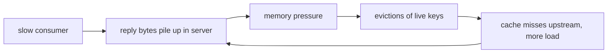

# Redis: overload control at the edges, because one thread can't shed by priority

Redis is the minimalist pole of topic 35's code reads: a
single-threaded server has no scheduler to reorder work — every
accepted command runs to completion on the one thread — so DAGOR-style
priority admission is structurally unavailable. Instead, redis's
overload control lives at the *edges* of the event loop, converting
each unbounded queue (memory, reply buffers, time behind a script)
into a bounded, fast error. The repo is cloned at `~/repos/redis`;
this is a code-read, ~1.5h, across `evict.c`, `server.c`, and
`networking.c` (all anchors under `src/`).

## The problem in one sentence

**Keep a single-threaded server out of the metastable basin by making
every overload answer — `-OOM`, `-BUSY`, disconnect — cheaper than the
work it replaces, and issued before that work begins.** Lane 1 in the
README showed how queueing plus retries sustains zero goodput after
the trigger ends; redis's stance is that no queue ever grows without a
bound and a cheap error on the far side of it.

## The concepts, step by step

### Step 1 — one thread means the edges are all you have

DAGOR sheds by priority: under pressure, drop low-priority work, keep
high. That requires a queue the scheduler can reorder. Redis's event
loop has none — once `processCommand` dispatches, the command owns the
thread — so the only moments redis can act are *before* accepting work
and *after* producing replies:

```
            ┌───────────── the one thread ─────────────┐
 client ───▶│ gate?  ──▶  execute (uninterruptible) ──▶│──▶ reply buffer ──▶ client
            │  ▲                                       │        ▲
            │  reject here (-OOM, -BUSY, pause)        │        or cut here
            │  = the ONLY shed points                  │        (buffer limits)
            └───────────────────────────────────────────┘
```

Everything below is a gate on the left edge or a limit on the right
edge. Why it matters: cockroach's admission package (the other code
read) is the opposite pole — a real scheduler; overload control is
shaped by the scheduling freedom the architecture leaves you.

### Step 2 — the memory budget: getMaxmemoryState

`maxmemory` turns RAM into an explicit budget. `getMaxmemoryState`
(`evict.c:384`) computes usage, bytes over budget (`mem_tofree`), and
a `level` ratio that may exceed 1.0; it returns `C_ERR` when over the
limit and eviction can't help. Note the fast path: with no `maxmemory`
set it returns `C_OK` almost immediately — the *check* must stay cheap
because Step 4 runs it before every command. `overMaxmemoryAfterAlloc`
(`evict.c:425`) asks the same question prospectively. Why it matters:
a budget you can compute cheaply and often is the precondition for
reject-before-work; one you discover only by malloc failing is a crash,
not a policy.

### Step 3 — approximated LRU: a 16-entry pool fed by 5-key samples

Redis keeps no global LRU list — linking every key into one would tax
*every* command to fund the rare eviction. Instead
`evictionPoolPopulate` (`evict.c:134`) grabs `maxmemory-samples`
random keys (default 5, `config.c:3223`) and inserts better candidates
into a shared pool of `EVPOOL_SIZE` 16 entries (`evict.c:36`), kept
sorted so the best victim sits at the right end:

```
   keyspace (millions)          eviction pool (16 slots, sorted by idle)
   ┌─────────────────┐          ┌────┬────┬────┬─── ─┬────┐
   │  ● ● ● ● ● ● ●  │─sample──▶│ 3s │ 9s │41s │ ... │2h  │──▶ evict
   │  ● ● ● ● ● ● ●  │  5 keys  └────┴────┴────┴─── ─┴────┘   rightmost
   └─────────────────┘          (pool persists: candidates accumulate)
```

Statistically this converges on nearly the same victims as true LRU,
at O(samples) cost paid only when actually over budget. Why it
matters: the governance mechanism must not itself become load — a
defense with heavy steady-state cost is work amplification.

### Step 4 — the OOM gate: reject-before-work with `-OOM`

Before each command, `processCommand` runs the eviction loop:
`performEvictions` (`evict.c:532`) frees keys until under budget —
returning `EVICT_OK`, `EVICT_RUNNING`, or `EVICT_FAIL` — then the gate
(`server.c:4485`):

```c
int out_of_memory = (performEvictions() == EVICT_FAIL);
...
if (out_of_memory && is_denyoom_command) {
    rejectCommand(c, shared.oomerr);          /* server.c:4498 */
```

`is_denyoom_command` (`server.c:4391`) is any command flagged
`CMD_DENYOOM` — writes, mostly; reads still pass, because they don't
grow the queue. `-OOM` is a shared preallocated string: zero
allocation, zero keyspace work, the cheapest possible shed. Why it
matters: the error path costs strictly less than the work path, so the
more overloaded redis gets, the less each request costs it — a
stabilizing loop, not a sustaining one: anti-metastability.

### Step 5 — output-buffer limits: backpressure on slow readers

Memory pressure doesn't only come from writers. A client that issues
big reads but never drains its socket forces redis to hold the replies
— memory grows with no bound the *client* controls:



`checkClientOutputBufferLimits` (`networking.c:5151`) enforces a
**hard** limit (over N bytes: gone now) and a **soft** limit (over M
bytes for T seconds: gone), per client class — normal, replica,
pubsub; even unauthenticated clients are capped at 1KB.
`closeClientOnOutputBufferLimitReached` (`networking.c:5215`)
disconnects *asynchronously* (`freeClientAsync`): it is called deep
inside reply-writing code, where freeing the client under your own
feet would be unsafe. Why it matters: redis is the *producer* here, so
backpressure can't slow anything — the only bounded outcome is to
evict the consumer.

### Step 6 — `-BUSY`: bounding the time axis

Memory and reply bytes are two queues; *time behind a long command* is
the third. While a Lua script or module command runs past
`busy_reply_threshold` (checked in `script.c:150`, default 5s), redis
re-enters the event loop just enough to answer new commands with
`-BUSY` — the shared errors at `server.c:2130` — instead of banking a
storm it must later drain. `isInsideYieldingLongCommand`
(`server.c:825`) marks this mode; Step 4's gate consults it to skip
eviction while yielded (eviction DELs must not interleave with the
script's replication stream). Why it matters: without `-BUSY`, a 30s
script under 280 QPS banks 8,400 commands — lane 1's backlog on the
time axis.

### Step 7 — CLIENT PAUSE: intake suspension as choreography

The bluntest instrument: stop accepting (some) work entirely.
`pauseActions(PAUSE_DURING_SHUTDOWN, ...)` (`server.c:4850`) reuses
the CLIENT PAUSE machinery during shutdown — writes are suspended so
replicas can catch up before the primary exits; failover does the same
dance. `unpauseActions(PAUSE_BY_CLIENT_COMMAND)` (`networking.c:4482`)
lifts a client-commanded pause; pauses stack by *purpose*, each with a
deadline and an action set (writes only, or all). Why it matters: this
is shedding at fraction 1.0 — useless as steady-state policy, exactly
right for the few hundred milliseconds where accepting a write would
lose it: pause the herd, don't let it stampede the survivor.

### Step 8 — the pattern: every queue bounded, every error cheap

```
   axis        queue                bound              cheap error
   ─────────   ──────────────────   ────────────────   ─────────────────
   memory      keyspace bytes       maxmemory          -OOM  (Step 4)
   replies     output buffer        soft+hard limits   disconnect (Step 5)
   time        cmds behind script   busy threshold     -BUSY (Step 6)
   (intake)    everything           pause deadline     silence (Step 7)
```

Redis rejects *everything equally* — no priorities, because one thread
has no scheduling freedom to honor them (Step 1). DAGOR sits mid-pole
(a priority cursor over a queue it controls); cockroach's admission
package is the far pole (a full scheduler: tenant fairness, AIMD
slots, LSM-debt tokens). Same invariant everywhere: the response to
overload must cost less than the work declined.

## Where each step lives in the code

| Step | Anchor | What to see |
|---|---|---|
| 2 | `evict.c:384` | `getMaxmemoryState` — budget math; early `C_OK` when no maxmemory |
| 2 | `evict.c:425` | `overMaxmemoryAfterAlloc` — the prospective form |
| 3 | `evict.c:36`, `evict.c:134` | `EVPOOL_SIZE 16` + its comment; `evictionPoolPopulate` — sample, insert sorted |
| 3 | `config.c:3223` | `maxmemory-samples` default 5 |
| 4 | `evict.c:532` | `performEvictions` — the three-value return contract in the comment |
| 4 | `server.c:4391` | `is_denyoom_command` — CMD_DENYOOM plus the MULTI/EXEC case |
| 4 | `server.c:4485`, `server.c:4498` | the gate: `EVICT_FAIL` → `rejectCommand(c, shared.oomerr)` |
| 5 | `networking.c:5151` | `checkClientOutputBufferLimits` — soft (limit + time) vs hard; 1KB unauthenticated cap |
| 5 | `networking.c:5215` | `closeClientOnOutputBufferLimitReached` — why async |
| 6 | `server.c:2130` | the `-BUSY` shared error strings |
| 6 | `script.c:150`, `server.c:825` | the threshold check in a running script; `isInsideYieldingLongCommand` |
| 7 | `server.c:4850` | `pauseActions(PAUSE_DURING_SHUTDOWN, ...)` in the shutdown path |
| 7 | `networking.c:4482` | `unpauseActions(PAUSE_BY_CLIENT_COMMAND)` |

Read order: `getMaxmemoryState` → `evictionPoolPopulate` →
`performEvictions` → the gate → output-buffer pair → `-BUSY` → pause.

## Questions to answer in notes.md

1. Step 4's gate lets non-`CMD_DENYOOM` commands (reads, DEL) through
   while over budget. Which of Step 5's limits eventually bounds a
   read with a huge reply, and could a read-only workload alone push
   redis over `maxmemory`?
2. Why is a persistent 16-slot pool fed by 5-key samples a better
   victim estimator than sampling 16 fresh keys each pass — and what
   workload shift makes stale pool entries wrong?
3. `-BUSY` still admits `SCRIPT KILL` and `SHUTDOWN NOSAVE` — in
   DAGOR's vocabulary, exactly two priorities. What makes these two
   safe to run mid-script when nothing else is?
4. In lane 1's simulator, model the OOM gate: rejects cost ~0 and
   return in ~0 time, so clients retry immediately. Does that alone
   break the metastable loop at 280 QPS, or does it need the
   client-side retry budget too? Compute it.
5. FalkorDB inherits every gate here — but a `CMD_DENYOOM` graph query
   allocates mid-execution, *after* the gate passed. Which anchor is
   the right template for a mid-query memory check, and what does
   redis's design say it should return?

## Done when

- [ ] You can narrate the pre-command sequence at `server.c:4485` —
      evict, gate, reject — and say why eviction runs *before* the
      check rather than lazily on allocation failure.
- [ ] You can explain approximated LRU (5 samples, 16-slot sorted
      pool, evict rightmost) and its cost when under budget (zero).
- [ ] You can name the three queues (memory, replies, time), the bound
      on each, and the cheap error on the far side of each bound.
- [ ] You can place redis, DAGOR, and cockroach admission on the
      scheduling-freedom axis and say which surface redis cannot build.

## References

- [redis](https://github.com/redis/redis) — cloned at `~/repos/redis`;
  all anchors under `src/`
- [README.md](README.md) — topic 35: metastability, hidden capacity,
  the code-anchor table this guide expands
- [reading-cockroach-admission.md](reading-cockroach-admission.md) —
  the opposite pole: overload control as a scheduler
- [reading-dagor.md](reading-dagor.md) — priority admission, the
  mid-pole redis's single thread rules out
- [reading-metastable.md](reading-metastable.md) — Bronson et al.; the
  sustaining-loop vocabulary used throughout
