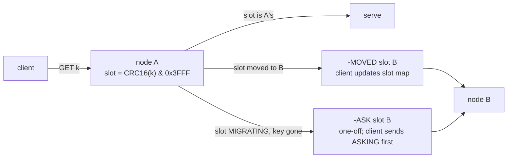

# Topic 36 — Sharding, Partitioning & Rebalancing

Every distributed topic so far assumed the data was already split;
this topic is the split itself. Placement determines three costs at
once: **movement** when the cluster grows or shrinks, **balance** when
the workload is skewed, and — for graphs — the **edge-cut** every
distributed traversal pays in network round trips. The obvious scheme
loses on all three: `hash(key) mod N` moves N/(N+1) of all keys on
growth, can't split a hot key, and random vertex placement on p
machines cuts an expected 1−1/p of a graph's edges (PowerGraph
Theorem 5.1 — at p=8, 87.5% of edges cross the network).

## The problem, measured (bench lane 1, provided — runs today)

```
   growing N shards to N+1: fraction of keys that move
   N -> N+1     mod-N    ideal 1/(N+1)
    4 ->  5      80.0%        20.0%
    5 ->  6      83.4%        16.7%
    8 ->  9      88.9%        11.1%
   16 -> 17      94.1%         5.9%

   Zipf(s) traffic, 10k keys on 16 hash shards; ideal share 6.25%
   s = 0.8: hottest shard carries  9.5% of traffic (1.5x ideal)
   s = 1.0: hottest shard carries 14.7% of traffic (2.4x ideal)
   s = 1.2: hottest shard carries 23.8% of traffic (3.8x ideal)
```

The movement number is exact, not sampled: `k mod 4 == k mod 5` iff
`k mod 20` is in 0..4, so exactly 4 of every 20 keys stay — mod-N moves
N/(N+1) of keys, and it gets *worse* as the cluster grows, precisely
when reshards happen most. Consistent hashing inverts the fraction to
1/(N+1). The Zipf rows show the failure hashing can't fix: the rank-1
key alone carries ~10% of Zipf(1.0) traffic, all of it to one shard,
because a hash function maps one key to one place by definition. Only
range splitting (split *between* keys, cockroach-style) or replication
of the hot key addresses skew.

## Consistent hashing, and Dynamo's three tries at it

```
        0                        u64::MAX
        ├───A──B────C──A───B──C────A──┤   each node = many vnode points
                       ▲
              key K ──hash──▶ first point clockwise owns K

   add node D: D's points claim arcs from their clockwise successors
   → ≈1/(N+1) of keys move, all TO D, nothing else reshuffles
```

Dynamo (SOSP'07) ran this in production and evolved the token scheme
three times (§6.2):

| strategy | scheme | what broke / what it bought |
|---|---|---|
| 1 | T random tokens per node; partition = token gap | new node must "steal" ranges: donors *scan disk* to find the keys (bootstrap "took almost a day"), Merkle trees of split ranges recomputed, no clean key-space snapshot |
| 2 | T random tokens + Q fixed equal partitions | decouples placement from partitioning — an interim step |
| 3 | Q/S tokens per node, equal partitions | best balance; membership metadata **3 orders of magnitude smaller** than strategy 1; partitions transfer as whole files; archival is trivial |

The lesson generalizes: **fixed partitions + movable ownership** beats
"partition boundaries follow node identity." Redis cluster hard-codes
it (16384 slots), and Dynamo's Fig 8 measured it (strategy 3's load
balancing efficiency best at S=30, N=3). Replication rides the same
ring: each key's **preference list** is its N clockwise successors
(skipping vnodes of the same physical node), quorums are R + W > N
(production default (3,2,2)), and a node outage doesn't block writes —
the **sloppy quorum** writes to the next healthy node with a *hint*,
and hinted handoff delivers the data back when the owner recovers.
Permanent divergence is caught by per-partition **Merkle trees**:
exchange roots, descend only where hashes differ.

## Redis cluster: slots, MOVED, ASK



16384 slots (`cluster.h:23`), slot = CRC16 masked to 14 bits
(`keyHashSlot`, cluster.h:59). A **hash tag** — the substring between
the first `{` and the next `}`, if non-empty — is hashed instead of the
whole key, so `user:{42}:cart` and `user:{42}:profile` share a slot and
multi-key ops on them work. Migration is a per-slot state machine
(`SETSLOT MIGRATING / IMPORTING / STABLE / NODE`, cluster_legacy.c:6072):
while a slot migrates, the source serves keys it still has and answers
`-ASK` for keys already moved (`getNodeByQuery` → `clusterRedirectClient`,
cluster.c:1191/:1443); `-MOVED` means the slot's home changed for good.
The client-visible difference is the contract: MOVED updates the
client's slot map, ASK is a one-shot redirect that must not.

## CockroachDB: ranges that split, merge, and move themselves

| mechanism | trigger | anchor |
|---|---|---|
| size split | range > 512 MB (`RangeMaxBytes`) | `zone.go:257`, `split_queue.go:145` |
| load split | > 2500 QPS or > 500 ms CPU/s sustained | `replica_split_load.go:34,:52` |
| split-key search | windowed per-key load sketch (`Decider`) | `split/decider.go:155,:222` |
| merge | range shrinks below threshold | `merge_queue.go:138` |
| rebalance | store-level load imbalance → lease transfers | `store_rebalancer.go:114,:218` |

Range partitioning keeps scans local and makes splits *semantic*: a
range splits **between** keys, so a hot range can keep splitting until
the hot key stands alone — the answer to lane 1's Zipf row that hashing
cannot give. The `Decider` tracks per-key load in a sliding window to
find the split point, and exports the honest failure counters:
`PopularKeyCount` (one key = most of the load — splitting won't help)
and `NoSplitKeyCount`. Rebalancing is topic-35-aware by construction:
allocator actions are queued and paced, because a migration is itself
load.

## Graphs: edge-cut vs vertex-cut

```
   edge-cut (place vertices)             vertex-cut (place edges)
   ┌─────────┐   ┌─────────┐            ┌─────────┐   ┌─────────┐
   │ u ─── v─┼───┼─▶ w     │            │ u ── v  │   │ v'── w  │
   └─────────┘   └─────────┘            └─────────┘   └─────────┘
   cut edges cross machines             vertex v is REPLICATED (mirror v')
   cost = cut edges                     cost = Σ|A(v)| replicas to sync
```

PowerGraph's argument (OSDI'12): natural graphs are power-law
(P(d) ∝ d^−α, α≈2; Twitter's follower graph has in-degree α=1.7 and 1%
of vertices adjacent to nearly half the edges), so *balanced edge-cuts
barely beat random* — Theorem 5.1: random vertex placement cuts
1−1/p of edges. Cutting **vertices** instead works: assign each *edge*
to one machine, replicate the vertices that span machines, and the
skew becomes an asset — Theorem 5.2 gives expected replication from the
degree distribution, and the gains over edge-cuts *grow* as α falls.
The **greedy** placement rule for edge (u,v) is four cases: intersection
of A(u), A(v) if non-empty; else the machine of the endpoint with more
unassigned edges; else the assigned endpoint's machine; else the least
loaded. Lane 3's streaming partitioner (LDG-style) is the vertex-place
cousin: one pass, score parts by already-placed neighbors × remaining
capacity.

## Code reading (cloned under ~/repos)

| repo | anchor | what to see |
|---|---|---|
| redis | `src/cluster.h:59` | `keyHashSlot` — CRC16 & 0x3FFF, the hash-tag carve-out |
| redis | `src/cluster.c:1191` | `getNodeByQuery` — slot ownership, MIGRATING/IMPORTING checks |
| redis | `src/cluster.c:1443` | `clusterRedirectClient` — the MOVED vs ASK reply |
| cockroach | `pkg/kv/kvserver/replica_split_load.go:34` | load-split thresholds (2500 QPS / 500 ms CPU) |
| cockroach | `pkg/kv/kvserver/split/decider.go:155` | `Decider` — finding *where* to split a hot range |
| cockroach | `pkg/kv/kvserver/store_rebalancer.go:114` | store-level rebalancing via lease transfers |

## Reading guides

1. [reading-dynamo.md](reading-dynamo.md) — DeCandia et al. (SOSP'07): the ring, quorums, and the partitioning-strategy evolution.
2. [reading-powergraph.md](reading-powergraph.md) — Gonzalez et al. (OSDI'12): power-law graphs and vertex-cuts.
3. [reading-redis-cluster.md](reading-redis-cluster.md) — code read: slots, hash tags, MOVED/ASK, SETSLOT migration.
4. [reading-cockroach-rebalancing.md](reading-cockroach-rebalancing.md) — code read: size/load splits, the Decider, merge queue, store rebalancer.

## Experiments

```
cd experiments
cargo test              # 4 provided tests pass; 6 fix the contract for your stubs
cargo run --release --bin shard_bench
```

- `placement.rs` (PROVIDED) — mod-N movement, Zipf sampler (harmonic
  CDF + binary search), hot-shard share, splitmix64.
- `graphs.rs` (PROVIDED) — planted-partition and preferential-attachment
  generators, `edge_cut`, random baseline.
- `hashring.rs` (stub) — consistent-hash ring with virtual nodes:
  add/remove node, O(log n) lookup.
- `partitioner.rs` (stub) — one-pass greedy partitioner (LDG-style):
  score = placed neighbors × (1 − |P|/C), hard capacity.

Bench lanes: 1 = movement + hot shard (provided, above). 2 = ring
movement on 4→5 (≈20% vs mod-N's 80%), removal moving only the removed
node's share, balance vs vnodes {1, 8, 64, 512}. 3 = edge-cut at k=8,
random vs greedy, on community and power-law graphs.

## Exercises

1. Implement the stubs until all 10 tests pass and lanes 2-3 print.
2. Prove the lane-1 closed form: mod-N movement N→N+1 is exactly
   N/(N+1) (CRT: residues agree iff k mod N(N+1) is below N). Note the
   symmetry: mod-N moves N/(N+1), the ring moves 1/(N+1).
3. Extend lane 2's balance table: how many vnodes until max/mean ≤ 1.05
   on 8 nodes? Compare with Dynamo strategy 3's equal-size partitions
   (which hit 1.0 by construction — at what metadata cost?).
4. Fix the hot shard: salt the rank-0 key across R replicas (reads fan
   out, writes multiply by R). Measure hottest-shard share vs R and
   state the read/write amplification trade.
5. Run lane 3 and explain the gap: greedy's win is large on the
   community graph and smaller on power-law — PowerGraph's point. Using
   Theorem 5.2's formula with your generated degree sequence, compute
   expected replication for a random *vertex-cut* at p=8 and compare
   both against the edge-cut numbers.
6. Sketch M36: slots-per-graph, hash-tag scheme for co-locating a
   vertex with its adjacency, and the MOVED/ASK equivalents in the
   protocol. What is the unit of migration — slot, vertex, or edge
   block?

## Cross-topic threads

- **Topic 29 (distributed transactions)**: 2PC/Percolator assumed a
  placement function; this topic is that function. Cross-shard abort
  rates are a function of co-location — hash tags exist to keep
  transactions single-slot.
- **Topic 28 (disaggregated storage)**: Dynamo's strategy-3 lesson —
  fixed partitions that transfer as whole files — is the same shape as
  LSM tiering to object storage: the unit of rebalancing should be a
  sealed artifact, not a live scan.
- **Topic 35 (overload)**: a rebalance is offered load. Cockroach paces
  allocator actions and snapshots for exactly the metastable reason —
  an unthrottled migration is its own trigger.
- **Topic 18/26 (GPU & matrices)**: edge-cut is the communication term
  in any distributed SpMV — partition quality is a direct multiplier on
  M26's matrix-op latency if the graph ever spans machines.

## Capstone M36 — sharding the Rust engine's graph

- Slot-style placement: `slot = hash(vertex_key) & 0x3FFF`, hash tags
  for forced co-location; edges live with their source vertex
  (out-adjacency local by construction), greedy placement for the
  replication of high-degree targets.
- Protocol: MOVED/ASK-equivalent redirects so clients keep their own
  slot map; per-slot migration state machine with dual-routing during
  moves.
- Rebalancing: one slot at a time, throttled (topic 35's admission
  layer sees migration traffic as low-priority work).
- Deliverable numbers: edge-cut and replication factor vs random
  placement on a power-law graph; keys moved during 4→5 growth vs
  mod-N (target ≈ 1/(N+1)); p99 during a live slot migration vs steady
  state.
