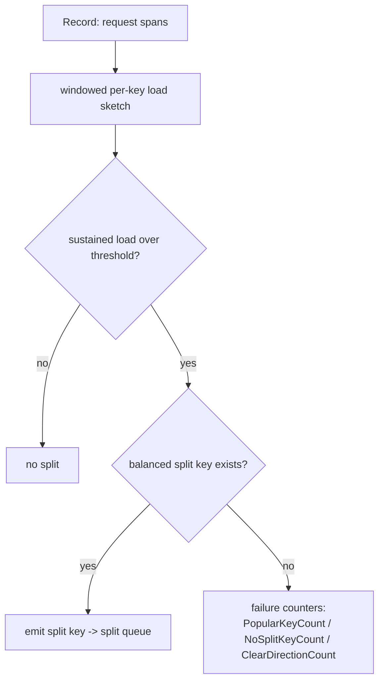

# CockroachDB rebalancing: ranges that split where the load is

CockroachDB is the production counter-design to Redis Cluster's fixed 16384 hash slots
(see `reading-redis-cluster.md`): the keyspace is one big sorted map, chopped into
contiguous **ranges** (~512 MB each, every range a Raft group — topics 15/21), and the
range boundaries *move*. Ranges split when they get too big **or too hot**, merge back
when they get small and cold, and get shuffled between stores by a two-level placement
machine (per-range allocator + store-level rebalancer). This guide walks the code that
makes those four decisions.

The payoff for topic 36 is the hot-key story. Lane 1's Zipf experiment showed hashing's
dead end: with Zipf(1.0) on 16 hash shards, the hottest shard takes 14.7% of traffic
(2.4x its fair share) and no re-hashing can split a single key's load. Range
partitioning *can* split between keys — and CockroachDB's `Decider` even keeps honest
counters for the moment that stops working, when one key IS the load.

## The problem in one sentence

**Static partitioning of a skewed, shifting workload leaves some shards overloaded and
others idle; CockroachDB instead treats partition boundaries and replica placement as
continuously re-optimized outputs of observed size and load.**

Every mechanism below is a feedback loop: measure a range (bytes, QPS, CPU) or a store
(aggregate load), compare to a threshold, and emit a cheap corrective action — split,
merge, lease transfer, replica move — ordered from cheapest to most expensive.

## The concepts, step by step

### Step 1 — Range partitioning: contiguous spans you can cut anywhere

The keyspace is ordered; a range is the span between two boundary keys. Hashing scatters
adjacent keys to fixed buckets; ranges keep them together, so a split is just "pick a
key in the middle, write two descriptors." The default size cap is in
`pkg/config/zonepb/zone.go`:

```go
RangeMaxBytes: proto.Int64(512 << 20), // 512 MB
```

```text
  Hash slots (redis):  key --CRC16--> slot 0..16383   (boundaries FIXED)
      [s0][s1][s2] ... [s16383]      hot key -> hot slot, cannot subdivide

  Ranges (cockroach):  sorted keyspace, boundaries MOVABLE
      |----r1----|--r2--|-------r3-------|-r4-|
      a          f      k                s    z
                        ^ hot? split r3 at any key between k and s
```

Because a range is a Raft group, a split is metadata-cheap: allocate a new range ID,
new descriptor, new Raft group at the boundary key. No data is copied at split time —
that expense is deferred to rebalancing (step 7).

### Step 2 — Size-based splits: the split queue

Each store runs a `splitQueue`. Its `shouldQueue` (`split_queue.go:194`) asks
`shouldSplitRange` (`split_queue.go:145`): does the range exceed `RangeMaxBytes` for
its zone, or does the load-split machinery (steps 3-4) say split? Size splits keep
snapshots, backups, and Raft log truncation bounded; they are the boring baseline that
runs regardless of load.

### Step 3 — Load-based splits: from QPS to CPU as the signal

Size says nothing about heat: a 64 MB range can eat a core. Two cluster settings in
`replica_split_load.go` define "too hot":

```go
// replica_split_load.go:34
SplitByLoadQPSThreshold  // "kv.range_split.load_qps_threshold", default 2500
// replica_split_load.go:52
SplitByLoadCPUThreshold  // "kv.range_split.load_cpu_threshold", default 500ms
```

CPU became the default objective: 500ms of attributed CPU per second of wall time,
i.e. half a core per range. The comment block explains why 500ms: attributed CPU is
roughly one third of real usage, so at most ~cores/1.5 load splits happen per node, and
the value was tuned with kv(0|95) workloads and allocbench (issue #96869). QPS is a
poor proxy — one query can be a point read or a full scan — while CPU is the resource
that actually saturates.

### Step 4 — The Decider: WHERE to split, and when no key helps

Crossing the threshold answers "should we split?" but not "where?" — the median of the
*key distribution* is useless if 99% of requests hit one end. `Decider`
(`split/decider.go:155`) holds per-replica load-split state: every request span is fed
into a windowed per-key load sketch via `Record` (`decider.go:222`, plus `RecordMax`
at `:329`), and the Decider searches for a key with ~half the observed load on each side.



The failure counters are the honest part (`LoadSplitterMetrics`):

- **PopularKeyCount** — a single key dominates; every candidate boundary leaves the
  load on one side. Splitting *cannot* help. This is the Zipf hot-key lesson surviving
  into range partitioning: when one key stands alone, the remaining tools are
  replication (spread reads) and admission control (topic 35), not partitioning.
- **NoSplitKeyCount** — no balanced boundary found (e.g. spans straddle every candidate).
- **ClearDirectionCount** — load is a moving scan front (sequential ingest); the "hot
  half" keeps shifting, so a split would go stale immediately.

### Step 5 — The merge queue: splits must be undoable

Without merges, splits are a one-way ratchet: a table that shrank, or a load spike
that passed, leaves behind tiny ranges whose fixed overhead (Raft heartbeats, replica
metadata, queue scanning) accumulates forever. `mergeQueue.shouldQueue`
(`merge_queue.go:138`) finds a range that is small and cold, checks its *right
neighbor*, and merges the pair back if the combined range would not immediately
re-split on size or load. Note the symmetry: merge criteria mirror split criteria, so
the two queues don't fight.

### Step 6 — Allocator vs store rebalancer: two levels of placement

Placement decisions are split across two components with different scopes:

```text
  per-RANGE view                          per-STORE view
  ┌─────────────────────────┐            ┌──────────────────────────────┐
  │ Allocator               │            │ StoreRebalancer              │
  │ "is THIS range ok?"     │            │ "is THIS STORE overloaded?"  │
  │ AllocatorAction:        │            │ compare store loads;         │
  │  add / remove /         │            │  1) transfer LEASES (cheap)  │
  │  replace / rebalance    │            │  2) move replicas (snapshots)│
  │  replica, move lease    │            └──────────────────────────────┘
  └─────────────────────────┘
   fixes under-replication,               fixes aggregate imbalance the
   zone-config violations                 per-range view cannot see
```

The allocator's decision enum is `AllocatorAction`
(`allocator/allocatorimpl/allocator.go:125-127`); it repairs individual ranges
(under-replicated, wrong locality, dead store). `StoreRebalancer`
(`store_rebalancer.go:114`, mode at `:218`) is a separate store-level loop — its doc
comment says it is "motivated by store-level load imbalances" — that sheds load from
hot stores to cold ones, preferring **lease transfers first**: moving a lease shifts
read and coordination load instantly without copying a byte. Only when leases aren't
enough does it move replicas.

### Step 7 — Rebalancing is itself load

Moving a replica means streaming a snapshot of up to ~512 MB into the target store —
real disk and network work competing with foreground queries. Snapshots are paced and
throttled, and snapshot *ingestion* is governed by the same admission-control machinery
(topic 35's `io_load_listener`) that protects foreground writes from LSM overload. The
general lesson: a rebalancer without pacing converts "imbalance" into "outage" —
migration traffic must be a background-priority tenant of the system it is healing.

### Step 8 — What M36 copies

The capstone milestone borrows the shape, not the code: (1) split on a measured signal
with a threshold + hysteresis, not on key count; (2) pick the split point from observed
request load, and detect the one-hot-key case explicitly instead of splitting uselessly;
(3) make merges mirror splits; (4) do the cheap rebalancing action (ownership/lease
move) before the expensive one (data move), and throttle the expensive one.

## Where each step lives in the code

All paths relative to `~/repos/cockroach/pkg`.

| Step | Anchor | What to read |
|---|---|---|
| 1 | `config/zonepb/zone.go:257` | `RangeMaxBytes` default: `512 << 20` |
| 2 | `kv/kvserver/split_queue.go:145,:194` | `shouldSplitRange`, `shouldQueue` |
| 3 | `kv/kvserver/replica_split_load.go:34,:52` | QPS (2500) and CPU (500ms) thresholds; comment on why 500ms |
| 4 | `kv/kvserver/split/decider.go:155,:222,:329` | `Decider` struct, `Record`, `RecordMax`; `LoadSplitterMetrics` counters |
| 5 | `kv/kvserver/merge_queue.go:138` | `mergeQueue.shouldQueue` |
| 6 | `kv/kvserver/allocator/allocatorimpl/allocator.go:125-127` | `AllocatorAction` enum |
| 6-7 | `kv/kvserver/store_rebalancer.go:114,:218` | `StoreRebalancer`, `RebalanceMode`; lease-first doc comment |

## Questions to answer in notes.md

1. `SplitByLoadCPUThreshold` defaults to 500ms of attributed CPU per second. Per the
   comment at `replica_split_load.go:52`, why does that imply at most ~cores/1.5 load
   splits per node, and what workloads was the value tuned against?
2. Walk `splitQueue.shouldQueue` (`split_queue.go:194`): how are the size trigger and
   the load trigger combined, and which produces the split *key* in each case?
3. The Decider increments `PopularKeyCount` vs `NoSplitKeyCount` vs
   `ClearDirectionCount` in different situations. Give a concrete workload that
   triggers each, and say what the operator's correct response is for each.
4. In `mergeQueue.shouldQueue` (`merge_queue.go:138`), what conditions must hold on the
   range and its neighbor before a merge is attempted, and how do they mirror the split
   thresholds so split/merge don't oscillate?
5. Why does the `StoreRebalancer` try lease transfers before replica moves? List what a
   lease transfer shifts versus what a replica rebalance costs, citing the doc comment
   at `store_rebalancer.go:114`.

## Done when

- [ ] You can explain why range partitioning can absorb a Zipf hot *span* but not a
      single hot key, and name the Decider counter that reports the latter.
- [ ] You can trace one split end to end: threshold check in `shouldQueue` → split key
      from the Decider → new range descriptor / Raft group.
- [ ] You can state the division of labor between `AllocatorAction` and
      `StoreRebalancer`, and why leases move before replicas.
- [ ] All 5 questions above are answered in `notes.md` with file:line citations.

## References

- Source: `~/repos/cockroach/pkg/kv/kvserver/` — `split_queue.go`, `merge_queue.go`,
  `replica_split_load.go`, `split/decider.go`, `store_rebalancer.go`,
  `allocator/allocatorimpl/allocator.go`; `~/repos/cockroach/pkg/config/zonepb/zone.go`
- [Topic 36 README](README.md) — lane-1 Zipf numbers, milestone M36
- [reading-redis-cluster.md](reading-redis-cluster.md) — the contrasting design: fixed
  hash slots with manual resharding vs dynamic ranges
- Topic 35 — admission control (`io_load_listener`) governing snapshot ingestion;
  topics 15/21 — Raft: every range is a Raft group
